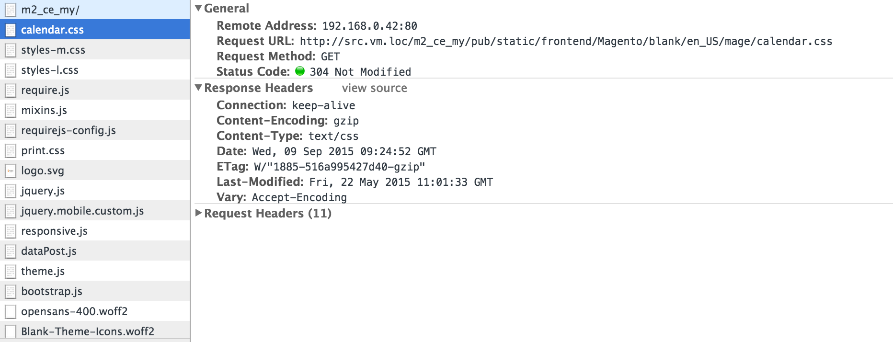

# 設定清漆

[清漆快取]是開放原始碼網頁應用程式加速器（也稱為&#x200B;_HTTP加速器_&#x200B;或&#x200B;_快取HTTP反向Proxy_）。 Varnish會將（或快取）檔案或檔案片段儲存在記憶體中，如此可讓Varnish減少回應時間，以及未來同等要求的網路頻寬消耗。 與Apache和nginx等網頁伺服器不同，Varnish是專為搭配HTTP通訊協定使用而設計。

[系統需求](../../installation/system-requirements.md)列出支援的清漆版本。

>[!WARNING]
>
>我們&#x200B;_強烈建議_&#x200B;您在生產中使用亮漆。 內建的全頁快取（針對檔案系統或[資料庫](https://developer.adobe.com/commerce/php/development/cache/partial/database-caching/)）比Varnish慢很多，而Varnish的設計是要加速HTTP流量。

如需清漆的詳細資訊，請參閱：

- [大型塗漆圖片]
- [清漆啟動選項]
- [塗漆和網站效能]

## 塗漆拓朴圖

下圖顯示Commerce拓朴中清漆的基本檢視。


在上圖中，使用者透過網際網路發出的HTTP請求會導致產生CSS、HTML、JavaScript和影像的大量請求（統稱為&#x200B;_資產_）。 清漆位於網頁伺服器前，並代理這些要求至網頁伺服器。

當網頁伺服器傳回資產時，可快取的資產會儲存在Varnish中。 後續對這些資產的任何請求都會由Varnish履行（這表示這些請求不會到達網頁伺服器）。 清漆會非常快速地傳回快取的內容。 如此一來，將內容傳回使用者的回應時間就會變快，而Commerce必須完成的請求數量也會減少。

透過Varnish快取的Assets會以可設定的間隔過期，或被相同資產的較新版本取代。 您也可以使用Admin或[`magento cache:clean`](../cli/manage-cache.md#clean-and-flush-cache-types)命令手動清除快取。

## 程式概述

本主題說明如何以最少的參陣列初始安裝Varnish，並測試其運作情況。 然後從Commerce管理員匯出清漆設定，並再次測試。

此程式可彙總如下：

1. 請安裝Varnish並存取任何Commerce頁面進行測試，以檢視您是否取得表示Varnish正常運作的HTTP回應標題。
1. 安裝Commerce軟體，並使用「管理員」建立Varnish設定檔。
1. 將您現有的Varnish設定檔取代為管理員產生的設定檔。
1. 再次測試所有內容。

   如果`<magento_root>/var/page_cache`目錄中沒有任何專案，表示您已成功使用Commerce設定Varnish！

>[!NOTE]
>
>- 除非另有說明，否則您必須以具有`root`許可權的使用者身分，輸入本主題中討論的所有命令。
>
>- 本主題是針對CentOS和Apache 2.4上的Varnish所撰寫。如果您是在不同的環境中設定Varnish，有些指令可能會不同。 如需詳細資訊，請參閱Varnish檔案。

## 已知問題

我們知道下列有關Varnish的問題：

- [清漆不支援SSL]

  或者，使用SSL終止或SSL終止Proxy。

- 如果您手動刪除`<magento_root>/var/cache`目錄的內容，則必須重新啟動Varnish。

- 安裝Commerce時可能發生錯誤：

  ```
  Error 503 Service Unavailable
  Service Unavailable
  XID: 303394517
  Varnish cache server
  ```

  如果您發生此錯誤，請編輯`default.vcl`並將逾時新增至`backend`段落，如下所示：

  ```conf
  backend default {
      .host = "127.0.0.1";
      .port = "8080";
      .first_byte_timeout = 600s;
  }
  ```

## 清漆快取概觀

清漆快取可與Commerce搭配使用，使用：

- Magento 2 GitHub存放庫中的[`nginx.conf.sample`](https://github.com/magento/magento2/blob/2.4/nginx.conf.sample)
- Commerce提供的Apache適用的`.htaccess`分散式設定檔
- 使用`default.vcl`管理員[產生的清漆的](../cache/configure-varnish-commerce.md)設定

>[!INFO]
>
>本主題僅涵蓋前述清單中的預設選項。 有許多其他方法可在複雜情況下設定快取（例如使用內容傳遞網路）；這些方法不在本指南的涵蓋範圍內。

在第一次瀏覽器請求時，可快取的資產會從Varnish傳送至使用者端瀏覽器，並在瀏覽器上快取。

此外，Varnish會將實體標籤(ETag)用於靜態資產。 ETag提供了判斷伺服器上靜態檔案何時變更的方法。 因此，當靜態資產在伺服器上變更時（根據瀏覽器的新請求或使用者端重新整理瀏覽器快取時，通常透過按F5或Control+F5），這些資產會傳送給使用者端。

後續章節將提供更多詳細資訊。

## 依瀏覽器要求快取

本節使用瀏覽器檢測器來顯示如何在第一個請求中傳遞資產給瀏覽器，以及之後如何從本機瀏覽器快取中載入。

### 第一個瀏覽器請求

`nginx.conf.sample`和`.htaccess`提供使用者端快取的選項。 第一次從瀏覽器請求可快取物件時，Varnish會將其提供給使用者端。

下圖顯示使用瀏覽器檢測器的範例：


前面的範例顯示對店面首頁面(`m2_ce_my`)的請求。 使用者端瀏覽器會快取CSS和JavaScript資產。

>[!NOTE]
>
>大部分靜態資產都有HTTP 200 （確定）狀態代碼，表示資產是從伺服器擷取。

### 第二個瀏覽器請求

如果相同的瀏覽器再次要求相同的頁面，這些資產會從本機瀏覽器快取中傳送，如下圖所示。


請注意第一個和第二個請求之間的回應時間差異。 同樣地，靜態資產也有200 （確定）回應代碼，因為它們是首次從本機快取中傳遞。

## Commerce如何使用Etag

以下範例顯示特定靜態資產的回應標頭。



`calendar.css`有ETag回應標頭，這表示使用者端瀏覽器上的CSS檔案可以與伺服器上的檔案比較。

此外，靜態資產會傳回304 （未修改） HTTP狀態代碼，如下圖所示。


304狀態代碼是因為使用者使其本機快取失效，且伺服器上的內容未變更。 因為304狀態碼，不會傳輸靜態資產&#x200B;_內容_；只會將HTTP標頭下載到瀏覽器。

如果伺服器上的內容變更，使用者端會下載包含HTTP 200 （確定）狀態碼和新ETag的靜態資產。

<!-- Link Definitions -->

[大亮油漆圖片]: https://www.varnish-cache.org/docs/trunk/users-guide/intro.html
[清漆快取]: https://varnish-cache.org
[清漆啟動選項]: https://www.varnish-cache.org/docs/trunk/reference/varnishd.html#ref-varnishd-options
[塗漆與網站效能]: https://www.varnish-cache.org/docs/trunk/users-guide/performance.html#users-performance
[清漆不支援SSL]: https://www.varnish-cache.org/docs/3.0/phk/ssl.html
