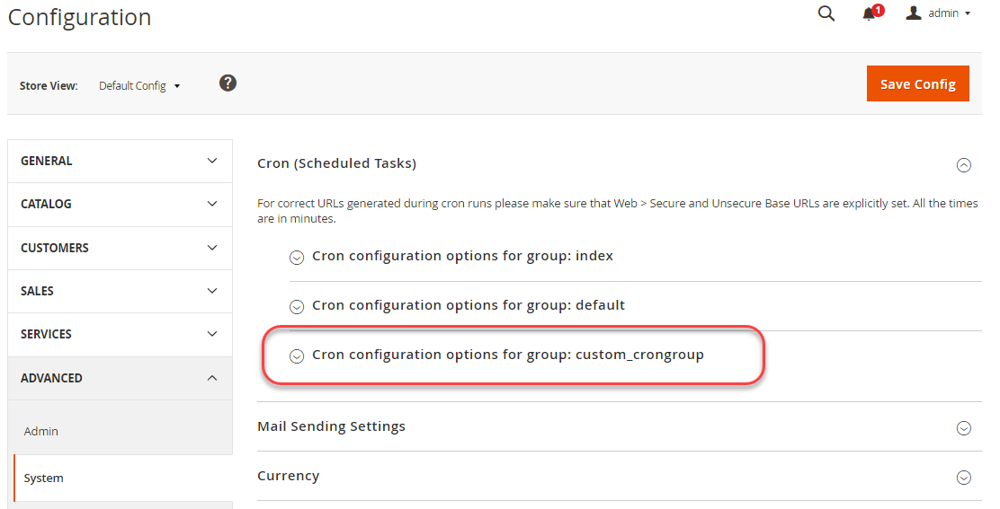

# 設定自訂cron作業

此逐步教學課程說明如何在範例模組中建立自訂cron工作以及選用的cron群組。 您可以使用您已擁有的模組，或使用我們[`magento2-samples`存放庫][samples]的範例模組。

執行cron工作會導致將資料列新增到`cron_schedule`表格中，且名稱為cron工作`custom_cron`。

我們也會說明如何選擇性地建立cron群組，以便您使用Commerce應用程式預設值以外的設定來執行自訂cron作業。

在本教學課程中，我們假設以下幾點：

- 已在`/var/www/html/magento2`中安裝Commerce應用程式
- 您的Commerce資料庫使用者名稱與密碼皆為`magento`
- 您以[檔案系統擁有者](../../installation/prerequisites/file-system/overview.md)身分執行所有動作

## 步驟1：取得範例模組

若要設定自訂cron作業，您需要範例模組。 我們建議`magento-module-minimal`模組。

如果您已經有範例模組，可以使用它；請略過此步驟和下一步，並繼續步驟3：建立類別以執行cron。

**若要取得範例模組**：

1. 以或切換到[檔案系統擁有者](../../installation/prerequisites/file-system/overview.md)的身份登入您的Commerce伺服器。
1. 變更至不在Commerce應用程式根目錄中的目錄（例如您的主目錄）。
1. 複製[`magento2-samples`存放庫][samples]。

   ```bash
   git clone git@github.com:magento/magento2-samples.git
   ```

   如果命令因錯誤`Permission denied (publickey).`而失敗，您必須[將您的SSH公開金鑰新增至GitHub.com][git-ssh]。

1. 建立要將範常式式碼複製到其中的目錄：

   ```bash
   mkdir -p /var/www/html/magento2/app/code/Magento/SampleMinimal
   ```

1. 複製範例模組程式碼：

   ```bash
   cp -r ~/magento2-samples/sample-module-minimal/* /var/www/html/magento2/app/code/Magento/SampleMinimal
   ```

1. 驗證已正確複製檔案：

   ```bash
   ls -al /var/www/html/magento2/app/code/Magento/SampleMinimal
   ```

   您應該會看到下列結果：

   ```
   drwxrwsr-x.   4 magento_user apache  4096 Oct 30 13:19 .
   drwxrwsr-x. 121 magento_user apache  4096 Oct 30 13:19 ..
   -rw-rw-r--.   1 magento_user apache   372 Oct 30 13:19 composer.json
   drwxrwsr-x.   2 magento_user apache  4096 Oct 30 13:19 etc
   -rw-rw-r--.   1 magento_user apache 10376 Oct 30 13:19 LICENSE_AFL.txt
   -rw-rw-r--.   1 magento_user apache 10364 Oct 30 13:19 LICENSE.txt
   -rw-rw-r--.   1 magento_user apache  1157 Oct 30 13:19 README.md
   -rw-rw-r--.   1 magento_user apache   270 Oct 30 13:19 registration.php
   drwxrwsr-x.   3 magento_user apache  4096 Oct 30 13:19 Test
   ```

1. 更新Commerce資料庫和結構：

   ```bash
   bin/magento setup:upgrade
   ```

1. 清除快取：

   ```bash
   bin/magento cache:clean
   ```

## 步驟2：驗證範例模組

繼續之前，請確認範例模組已註冊並啟用。

1. 執行以下命令：

   ```bash
   bin/magento module:status Magento_SampleMinimal
   ```

1. 確認模組已啟用。

   ```
   Module is enabled
   ```

>[!TIP]
>
>如果輸出指示`Module does not exist`，請仔細檢閱[步驟1](#step-1-get-a-sample-module)。 確定您的程式碼位於正確的目錄中。 拼字與大小寫非常重要；如果兩者不同，模組將不會載入。 另外，別忘了執行`magento setup:upgrade`。

## 步驟3：建立類別以執行cron

此步驟顯示建立cron作業的簡單類別。 類別只會將資料列寫入`cron_schedule`資料表，以確認已成功設定該類別。

若要建立類別，請執行下列動作：

1. 為類別建立目錄，並變更至該目錄：

   ```bash
   mkdir /var/www/html/magento2/app/code/Magento/SampleMinimal/Cron && cd /var/www/html/magento2/app/code/Magento/SampleMinimal/Cron
   ```

1. 已在該目錄中建立名為`Test.php`的檔案，其內容如下：

   ```php
   <?php
   namespace Magento\SampleMinimal\Cron;
   
   use Psr\Log\LoggerInterface;
   
   class Test {
       protected $logger;
   
       public function __construct(LoggerInterface $logger) {
           $this->logger = $logger;
       }
   
      /**
       * Write to system.log
       *
       * @return void
       */
       public function execute() {
           $this->logger->info('Cron Works');
       }
   }
   ```

## 步驟4：建立`crontab.xml`

`crontab.xml`檔案會設定執行自訂cron程式碼的排程。

在`crontab.xml`目錄中建立`/var/www/html/magento2/app/code/Magento/SampleMinimal/etc`，如下所示：

```xml
<?xml version="1.0"?>
<config xmlns:xsi="http://www.w3.org/2001/XMLSchema-instance" xsi:noNamespaceSchemaLocation="urn:magento:module:Magento_Cron:etc/crontab.xsd">
    <group id="default">
        <job name="custom_cronjob" instance="Magento\SampleMinimal\Cron\Test" method="execute">
            <schedule>* * * * *</schedule>
        </job>
    </group>
</config>
```

前面`crontab.xml`每分鐘執行一次`Magento/SampleMinimal/Cron/Test.php`類別，結果會將資料列新增至`cron_schedule`資料表。

若要讓Admin設定cron排程，請使用系統設定欄位的設定路徑。

```xml
<?xml version="1.0"?>
<config xmlns:xsi="http://www.w3.org/2001/XMLSchema-instance" xsi:noNamespaceSchemaLocation="urn:magento:module:Magento_Cron:etc/crontab.xsd">
    <group id="default">
        <job name="custom_cronjob" instance="Magento\SampleMinimal\Cron\Test" method="execute">
            <config_path>system/config/path</config_path>
        </job>
    </group>
</config>
```

其中，`system/config/path`是在模組的`etc/adminhtml/system.xml`中定義的系統組態路徑。

## 步驟5：編譯和快取清除

使用下列命令編譯程式碼：

```bash
bin/magento setup:di:compile
```

並使用以下命令清除快取：

```bash
bin/magento cache:clean
```

## 步驟6：驗證cron作業

此步驟顯示如何在`cron_schedule`資料庫資料表上使用SQL查詢來成功驗證自訂cron工作。

驗證cron：

1. 執行Commerce cron工作：

   ```bash
   bin/magento cron:run
   ```

1. 輸入`magento cron:run`命令兩或三次。

   第一次輸入命令時，它會排入工作佇列；接著，就會執行cron工作。 您必須輸入命令&#x200B;_至少_&#x200B;兩次。

1. 執行SQL查詢`SELECT * from cron_schedule WHERE job_code like '%custom%'`，如下所示：

   1. 輸入`mysql -u magento -p`
   1. 在`mysql>`提示下，輸入`use magento;`
   1. 輸入`SELECT * from cron_schedule WHERE job_code like '%custom%';`

      結果應類似下列：

      ```
      +-------------+----------------+---------+----------+---------------------+---------------------+---------------------+---------------------+
      | schedule_id | job_code       | status  | messages | created_at        | scheduled_at        | executed_at         | finished_at     |
      +-------------+----------------+---------+----------+---------------------+---------------------+---------------------+---------------------+
      |        3670 | custom_cronjob | success | NULL     | 2016-11-02 09:38:03 | 2016-11-02 09:38:00 | 2016-11-02 09:39:03 | 2016-11-02 09:39:03 |
      |        3715 | custom_cronjob | success | NULL     | 2016-11-02 09:53:03 | 2016-11-02 09:53:00 | 2016-11-02 09:54:04 | 2016-11-02 09:54:04 |
      |        3758 | custom_cronjob | success | NULL     | 2016-11-02 10:09:03 | 2016-11-02 10:09:00 | 2016-11-02 10:10:03 | 2016-11-02 10:10:03 |
      |        3797 | custom_cronjob | success | NULL     | 2016-11-02 10:24:03 | 2016-11-02 10:24:00 | 2016-11-02 10:25:03 | 2016-11-02 10:25:03 |
      +-------------+----------------+---------+----------+---------------------+---------------------+---------------------+---------------------+
      ```

1. （可選）確認訊息已寫入Commerce的系統記錄檔：

   ```bash
   cat /var/www/html/magento2/var/log/system.log
   ```

   您應該會看到一或多個類似以下的專案：

   ```
   [2016-11-02 22:17:03] main.INFO: Cron Works [] []
   ```

   這些訊息來自`execute`中的`Test.php`方法：

   ```php
   public function execute() {
        $this->logger->info('Cron Works');
   ```

如果SQL命令和系統記錄檔不包含任何專案，請再執行幾次`magento cron:run`命令並等待。 更新資料庫可能需要一些時間。

## 步驟7 （選用）：設定自訂cron群組

此步驟說明如何選擇性設定自訂cron群組。 如果您希望自訂cron工作以與其他cron工作不同的排程執行（通常每分鐘執行一次），或如果您希望數個自訂cron工作以不同的設定執行，則應設定自訂cron群組。

若要設定自訂cron群組：

1. 在文字編輯器中開啟`crontab.xml`。
1. 將`<group id="default">`變更為`<group id="custom_crongroup">`
1. 退出文字編輯器。
1. 建立包含下列內容的`/var/www/html/magento2/app/code/Magento/SampleMinimal/etc/cron_groups.xml`：

   ```xml
   <?xml version="1.0"?>
   <config xmlns:xsi="http://www.w3.org/2001/XMLSchema-instance" xsi:noNamespaceSchemaLocation="urn:magento:module:Magento_Cron:etc/cron_groups.xsd">
       <group id="custom_crongroup">
           <schedule_generate_every>1</schedule_generate_every>
           <schedule_ahead_for>4</schedule_ahead_for>
           <schedule_lifetime>2</schedule_lifetime>
           <history_cleanup_every>10</history_cleanup_every>
           <history_success_lifetime>60</history_success_lifetime>
           <history_failure_lifetime>600</history_failure_lifetime>
           <use_separate_process>1</use_separate_process>
       </group>
   </config>
   ```

如需這些選項含義的說明，請參閱[自訂crons參考](custom-cron-reference.md)。

## 步驟8：驗證您的自訂cron群組

此&#x200B;_選用_&#x200B;步驟顯示如何使用管理員驗證您的自訂cron群組。

若要驗證您的自訂cron群組：

1. 執行自訂群組的Commerce cron工作：

   ```bash
   php /var/www/html/magento2/bin/magento cron:run --group="custom_crongroup"
   ```

   至少執行命令兩次。

1. 清除快取：

   ```bash
   php /var/www/html/magento2/bin/magento cache:clean
   ```

1. 以管理員身分登入管理員。
1. 按一下&#x200B;**商店** > **設定** > **組態** > **進階** > **系統**。
1. 在右窗格中，展開&#x200B;**Cron**。

   您的cron群組顯示如下：

   

<!-- link definitions -->

[git-ssh]: https://docs.github.com/en/authentication/connecting-to-github-with-ssh/adding-a-new-ssh-key-to-your-github-account
[samples]: https://github.com/magento/magento2-samples
