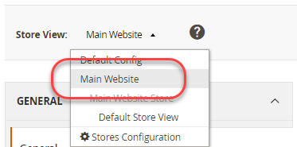
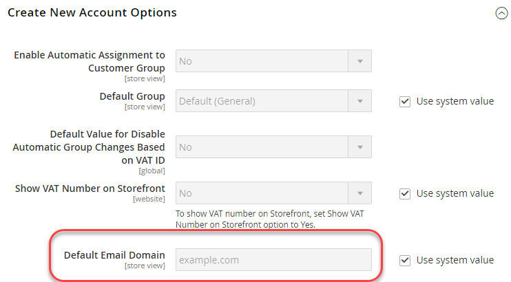

# 使用CLI命令的範例

此範例說明如何在開發系統中設定共用、系統專屬和敏感的值，然後將這些值部署至生產系統。
這是透過使用共用組態、`config.php`檔案和Commerce CLI命令的組合來完成的。

此範例使用下列組態設定：

- 共用組態設定的&#x200B;**Vat號碼**&#x200B;和&#x200B;**存放區名稱**。

  您可以在&#x200B;**商店** >設定> **設定** >一般> **一般**&#x200B;下找到這些專案。

- **傳送電子郵件給**&#x200B;以取得機密的設定值。

  您可以在&#x200B;**商店** >設定> **組態** >一般> **連絡人**&#x200B;中找到此專案。

- 系統特定組態值的&#x200B;**預設電子郵件網域**。

  您可以在&#x200B;**商店** >設定> **設定** >客戶> **客戶設定** > **建立新帳戶選項**&#x200B;中找到此專案。

您可以使用本範例中所示的相同程式，來設定下列參照中的任何設定：

- [敏感和系統特定設定路徑參考](../reference/config-reference-sens.md)
- [付款設定路徑參考](../reference/config-reference-payment.md)
- [其他設定路徑參考](../reference/config-reference-general.md)
- [Commerce Enterprise B2B擴充功能設定路徑參考](../reference/config-reference-b2b.md)

## 開始之前

開始之前，請設定檔案系統許可權和擁有權，如[開發、建置和生產系統的先決條件](../deployment/prerequisites.md)中所述。

## 假設

本主題提供修改生產系統組態的範例。 您可以視需要選擇不同的組態選項。

在本範例中，我們假設如下：

- 您使用Git原始檔控制
- 開發系統可在名為`mconfig`的Git遠端存放庫中取得
- 您的Git工作分支名為`m2.2_deploy`

## 步驟1：在開發系統中設定設定

若要在開發系統中設定預設語言環境及加權單位：

1. 登入管理員。
1. 按一下&#x200B;**商店** >設定> **組態** >一般> **一般**。
1. 如果您有多個可用網站，請使用左上角的&#x200B;**商店檢視**&#x200B;清單，切換至不同的網站，如下圖所示。

   

1. 在右窗格中，展開&#x200B;**存放區資訊**。
1. 如有必要，請清除&#x200B;**VAT編號**&#x200B;與&#x200B;**商店名稱**&#x200B;欄位旁的&#x200B;**使用預設值**&#x200B;核取方塊。
1. 在欄位中輸入數字（例如，`12345`）。
1. 在&#x200B;**存放區名稱**&#x200B;欄位中，輸入值（如`My Store`）。
1. 按一下&#x200B;**儲存設定**。
1. 在左側導覽列的[一般]底下，按一下[連絡人]。****
1. 在右窗格中，展開&#x200B;**電子郵件選項**。
1. 如有必要，請清除&#x200B;**傳送電子郵件給**&#x200B;欄位旁的&#x200B;**使用預設值**&#x200B;核取方塊。
1. 在欄位中輸入電子郵件地址。
1. 按一下&#x200B;**儲存設定**。
1. 使用&#x200B;**存放區檢視**&#x200B;清單來選取&#x200B;**預設設定**，如下圖所示。

   

1. 在左窗格中，按一下「客戶> **客戶組態**」。
1. 在右窗格中，展開&#x200B;**建立新帳戶選項**。
1. 如有必要，請清除&#x200B;**預設電子郵件網域**&#x200B;欄位旁的&#x200B;**使用系統值**&#x200B;核取方塊。
1. 在欄位中輸入網域名稱。
1. 按一下&#x200B;**儲存設定**。
1. 如果出現提示，請排清快取。

## 步驟2：更新設定

現在您已變更管理員中的設定，請使用下列步驟將共用設定寫入檔案：

{{$include /help/_includes/config-save-config.md}}

即使`app/etc/env.php` （系統特定組態）已更新，請勿將其簽入原始檔控制。
稍後在本程式中，您將在生產系統上建立相同的組態設定。

## 步驟3：更新您的建置系統並產生檔案

現在您已確認將共用組態的變更提交至原始檔控制，您可以將這些變更提取至您的建置系統、編譯程式碼並產生靜態檔案。

{{$include /help/_includes/config-update-build-system.md}}

## 步驟4：更新生產系統

該流程的最後一步是更新您的生產系統。 您必須分成兩個部分來執行：

- 更新敏感和系統專屬設定
- 更新共用設定

### 更新敏感和系統專屬設定

若要使用環境變數設定敏感和系統專屬設定，您必須知道以下事項：

- 每個設定的範圍

  如果您依照步驟1的指示進行，**傳送電子郵件給**&#x200B;的範圍為網站，**預設電子郵件網域**&#x200B;的範圍為全域（亦即，預設設定範圍）。

  您需要網站程式碼以設定&#x200B;**傳送電子郵件給**&#x200B;設定值。

  如需尋找此值的詳細資訊，請參閱： [使用環境變數覆寫組態設定](../reference/override-config-settings.md#environment-variables)。

- 此範例中使用的設定的設定路徑：

  | 設定名稱 | 設定路徑 |
  | -------------------- | -------------------------------------- |
  | 傳送電子郵件至 | `contact/email/recipient_email` |
  | 預設電子郵件網域 | `customer/create_account/email_domain` |

  如需所有敏感及系統特定組態路徑，請參閱： [敏感及系統特定組態路徑參考](../reference/config-reference-sens.md)。

### 使用CLI命令設定變數

使用下列CLI指令來設定系統特定和敏感的組態設定：

- 系統特定設定的`magento config:set`
- `magento config:sensitive:set`為敏感設定

若要設定預設範圍中的系統特定設定&#x200B;**預設電子郵件網域**，請使用下列命令：

```bash
bin/magento config:set customer/create_account/email_domain <email domain>
```

您不需要在命令中使用範圍，因為它是預設範圍。

但是，若要設定&#x200B;**傳送電子郵件至**&#x200B;的值，您必須知道範圍型別(`website`)和範圍代碼，每個網站上的範圍代碼可能都不相同。

範例：

```unix
bin/magento config:sensitive:set contact/email/recipient_email --scope=website --scope-code=<website code> <email address>
```

### 更新共用設定

本節探討如何將您在開發及建置系統上所做的所有變更提取至生產環境，這會更新共用組態設定（商店名稱及VAT編號）。

{{$include /help/_includes/config-update-prod-system.md}}

### 驗證Admin中的組態設定

若要驗證組態設定：

1. 登入生產系統的管理員。
1. 按一下&#x200B;**商店** >設定> **組態** >一般> **一般**。
1. 使用左上角的&#x200B;**商店檢視**&#x200B;清單，切換到不同的網站。

   您在開發系統中設定的共用組態選項顯示如下。

   

   >[!INFO]
   >
   >**存放區名稱**&#x200B;欄位可在網站範圍中編輯，但如果您切換至預設設定範圍，則無法編輯。 這是您在開發系統中設定選項的結果。 **VAT編號**&#x200B;的值在網站範圍中不可編輯。

1. 如果您尚未這樣做，請切換到預設設定範圍。
1. 在左側導覽列的[一般]底下，按一下[連絡人]。****

   無法編輯&#x200B;**傳送電子郵件給**&#x200B;欄位，如下圖所示。 此為敏感設定。

   

1. 在左窗格中，按一下「客戶> **客戶組態**」。
1. 在右窗格中，展開&#x200B;**建立新帳戶選項**。

   **預設電子郵件網域**&#x200B;欄位的值顯示如下。 此為系統專屬設定。

   
