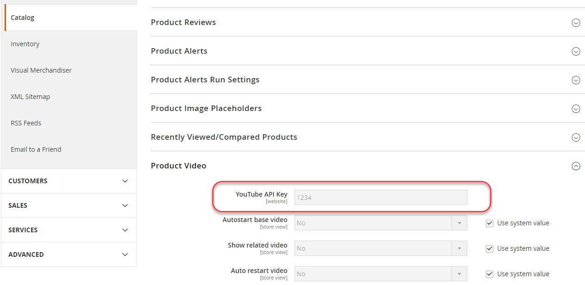

# 生產系統設定

您可以有一個生產系統。 下列所有專案都必須為true：

- 所有Commerce程式碼都位於與開發和建置系統相同的存放庫原始檔控制中
- 請確定下列所有專案皆為 _已包含_ 在原始檔控制中：

   - `app/etc/config.php`
   - `generated` 目錄（和子目錄）
   - `pub/media` 目錄
   - `pub/media/wysiwyg` 目錄（和子目錄）
   - `pub/static` 目錄（和子目錄）

- 必須安裝並設定Commerce 2.2或更新版本 [生產模式](../bootstrap/application-modes.md#production-mode)
- 它有檔案系統所有權和許可權設定，如中所述 [您的開發、建置和生產系統的先決條件](../deployment/prerequisites.md).

## 設定生產機器

若要設定生產機器：

1. 安裝Commerce或從原始檔控制提取之後，以檔案系統擁有者的身分登入生產伺服器，或切換至該身分。
1. 建立 `~/.ssh/.composer/auth.json` 如果您尚未這麼做。

   建立目錄：

   ```bash
   mkdir -p ~/.ssh/.composer
   ```

   建立 `auth.json` 在該目錄中。

   `auth.json` 必須包含您的 [驗證金鑰](../../installation/prerequisites/authentication-keys.md).

   範例如下：

   ```json
   {
      "http-basic": {
         "repo.magento.com": {
            "username": "<your public key>",
            "password": "<your private key>"
         }
      }
   }
   ```

1. 將變更儲存至 `auth.json`.
1. 複製 `<Commerce root dir>/app/etc/env.php` 從開發系統到生產系統。
1. 開啟 `env.php` 並變更任何必要的值（例如資料庫連線資訊）。
1. 執行 [`magento config:set`](../cli/set-configuration-values.md) 或 [`magento config:set-sensitive`](../cli/set-configuration-values.md) 指令，分別設定任何系統特定或敏感組態值。

   下節顯示一個範例。

## 在您的生產系統上設定設定設定值

本節探討如何使用在您的生產系統上設定敏感值。 `magento config:sensitive:set` 命令。

若要設定敏感值：

1. 使用尋找要設定的值 [敏感值參考](../reference/config-reference-sens.md).
1. 記下設定的設定路徑。
1. 以檔案系統擁有者的身分登入生產系統，或切換到檔案系統擁有者。
1. 變更至Commerce安裝目錄。
1. 輸入下列命令：

   ```bash
   bin/magento config:sensitive:set {configuration path} {value}
   ```

   例如，若要將YouTube API金鑰的值設為 `1234`，輸入

   ```bash
   bin/magento config:sensitive:set catalog/product_video/youtube_api_key 1234
   ```

   您也可以以互動方式設定一或多個值，如下所示：

   ```bash
   bin/magento config:sensitive:set -i
   ```

   出現提示時，輸入每個敏感設定的值，或按Enter略過值並移至下一個值。

1. 若要確認值已設定，請登入「管理員」。
1. 在「管理員」中找出設定。

   例如，YouTube API金鑰設定位於 **商店** >設定> **設定** > **目錄** > **目錄** > **產品影片**.

   設定會顯示在Admin中，且無法編輯。 下圖顯示一個範例。

   
