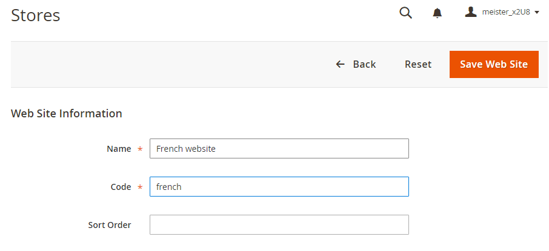
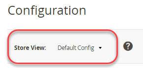

# 在管理員中設定多個檢視

此工作需要您為每個商店建立根類別(以及其他類別（如有需要）)。 本主題中討論的任務提供設定多個存放區的方法。 如需詳細資訊，請參閱Commerce使用手冊中的下列資源：

- [類別](https://docs.magento.com/user-guide/catalog/categories.html)
- [新增網站](https://docs.magento.com/user-guide/stores/stores-all-create-website.html)
- [儲存URL](https://docs.magento.com/user-guide/stores/store-urls.html)
- [內容](https://docs.magento.com/user-guide/cms/content-menu.html)

>[!INFO]
>
>僅供範例用途，我們使用法文網站搭配網站程式碼 `french` 在本主題中。 如需逐步教學課程，請參閱 [教學課程：使用Apache設定多個網站](ms-apache.md) 和 [教學課程：使用nginx設定多個網站](ms-nginx.md)

## 步驟1：建立根類別

建立根目錄類別為選用，但我們會在教學課程中說明如何在您希望每個網站都有唯一根目錄類別時執行此操作。 您可以選擇建立其他類別。

若要建立根類別，請執行下列動作：

1. 以獲授權建立類別的使用者身分登入管理員。
1. 按一下 **目錄** > **類別**.
1. 按一下 **新增根類別**.
1. 在 **類別名稱** 欄位，輸入唯一名稱以識別此類別。
1. 請確定「啟用類別」設為 **是**.

   如需此頁面上其他選項的相關資訊，請參閱 [根類別](https://docs.magento.com/user-guide/catalog/category-root.html).

   下圖顯示一個範例。

   

1. 按一下 **儲存**.
1. 視需要重複這些工作多次，以建立存放區的根類別。

## 步驟2：建立網站

若要建立網站：

1. 以獲授權建立網站、商店和商店檢視的使用者身分登入「管理員」。
1. 按一下 **商店** > **設定** > **所有商店**.
1. 於 _商店_ 頁面，按一下 **建立網站**.

   - **名稱** — 輸入名稱以識別網站。
   - **程式碼** — 輸入唯一代碼；例如，如果您有法式商店，您可以輸入 `french`
   - **排序順序** — 輸入選用的數字排序順序。

   下圖顯示一個範例。

   

1. 按一下 **儲存網站**.
1. 視需要多次重複這些工作，以建立您的網站。

## 步驟3：建立存放區

若要建立存放區：

1. 在 _管理員_ 面板，按一下 **商店** > **設定** > **所有商店**.
1. 於 _商店_ 頁面，按一下 **建立存放區**.

   - **網站** — 按一下要與此商店關聯的網站名稱。
   - **名稱** — 輸入名稱以識別存放區。
   - **程式碼** — 輸入唯一代碼以識別商店。
   - **根類別** — 按一下此存放區的根類別名稱。

   下圖顯示一個範例。

   

1. 按一下 **儲存存放區**.
1. 視需要多次重複這些工作，以建立您的存放區。

## 步驟4：建立商店檢視

若要建立商店檢視：

1. 在 _管理員_ 面板，按一下 **商店** > **設定** > **所有商店**.
1. 在「商店」頁面上，按一下 **建立存放區檢視**.

   - **儲存** — 按一下要與此存放區檢視產生關聯的存放區名稱。
   - **名稱** — 輸入名稱以識別此存放區檢視。
   - **程式碼** — 輸入唯一名稱以識別此存放區檢視。
   - **狀態** — 選取 **已啟用**.

   下圖顯示一個範例。

   

1. 按一下 **儲存存放區檢視**.
1. 視需要重複這些工作多次，以建立您的商店檢視。

## 步驟5：變更網站基底URL

若要使用類似以下的唯一URL存取網站 `http://french.magento.mg`，您必須變更Admin中每個網站的基本URL。

若要變更網站基底URL：

1. 在 _管理員_ 面板，按一下 **商店** > **設定** > **設定** > **一般** > **Web**.
1. 從 **存放區檢視** 清單中，按一下其中一個網站的名稱，如下圖所示。

   

1. 在右窗格中，展開 **基本URL**.
1. 在 _基本URL_ 部分，清除 **使用系統值**.
1. 輸入 `http://french.magento.mg` 中的URL **基本URL** 和 **基本連結URL** 欄位。

1. 在中重複上一步驟 _基本URL （安全）_ 區段。

   >[!INFO]
   >
   >如果您正在設定雲端基礎結構上部署Adobe Commerce的基礎URL，則必須將第一個句號取代為三個破折號。 例如，如果您的基本URL為 `french.branch-sbg7pPa-f3dueAiM03tpy.us.magentosite.cloud`，輸入 `http://french---branch-sbg7pPa-f3dueAiM03tpy.us.magentosite.cloud`. 如果您設定基本URL以進行本機測試，請使用句點。

1. 按一下 **儲存設定**.

1. 對其他網站重複這些工作。

## 步驟6：將商店程式碼新增至基底URL

Commerce可讓您選擇將商店程式碼新增至網站基底URL，簡化設定多個商店的程式。 使用此選項，您不需要在Commerce檔案系統上建立目錄來儲存 `index.php` 和 `.htaccess`.

這可防止 `index.php` 和 `.htaccess` 避免在未來的升級中與Commerce程式碼基底不同步。

請參閱 [Commerce使用手冊](https://docs.magento.com/user-guide/stores/store-urls.html).

若要將商店程式碼新增至基底URL：

1. 在 _管理員_ 面板，按一下 **商店** > **設定** > **設定** > **一般** > **Web**.
1. 從 **存放區檢視** 清單中，按一下 **預設設定** 如下圖所示。

   

1. 在右窗格中，展開 **Url選項**.
1. 清除 **使用系統值** 旁邊的核取方塊 _將存放區代碼新增至Url_.
1. 從 _將存放區代碼新增至Url_ 清單，按一下 **是**.

   

1. 按一下 **儲存設定**.
1. 如果出現提示，請排清快取。 (**系統** > **快取管理**)。

## 步驟7：變更預設商店檢視基底URL

您必須在最後執行此步驟，因為您將失去管理員的存取權；您的存取權會在您設定虛擬主機後傳回，如網頁伺服器特定主題中所述。

若要變更預設商店檢視基底URL：

1. 在 _管理員_ 面板，按一下 **商店** > **設定** > **設定** > **一般** > **Web**.

1. 從 _存放區檢視_ 清單中，按一下 **預設設定**.

   

1. 在右窗格中，展開 **基本URL**.
1. 在 _基本URL_ 部分，清除 **使用系統值**.
1. 輸入 `http://magento.mg` 中的URL **基本URL** 和 **基本連結URL** 欄位。

1. 在中重複上一步驟 **基本URL （安全）** 區段。

   >[!INFO]
   >
   >如果您在雲端基礎結構上設定Adobe Commerce的基礎URL，則必須將第一個句號取代為三個破折號。 例如，如果您的基本URL為 `french.branch-sbg7pPa-f3dueAiM03tpy.us.magentosite.cloud`，輸入 `http://french---branch-sbg7pPa-f3dueAiM03tpy.us.magentosite.cloud`

1. 按一下 **儲存設定**.
