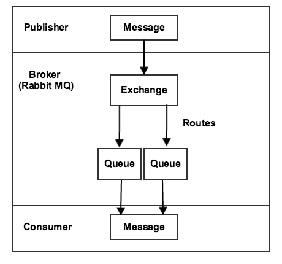

# 訊息佇列總覽

Message Queue Framework (MQF)系統允許模組將訊息發佈至佇列。 它也會定義將非同步接收訊息的[消費者](consumers.md)。 MQF使用[[!DNL RabbitMQ]](https://www.rabbitmq.com)作為傳訊代理人，提供可擴充的平台來傳送及接收訊息。 它也包括儲存未傳遞訊息的機制。 [!DNL RabbitMQ]是以進階訊息佇列通訊協定(AMQP) 0.9.1規格為基礎。

下圖說明訊息佇列架構：

- 發佈者是將訊息傳送至交換的元件。 它知道要發佈到哪個交換以及它傳送的訊息格式。

- 交換會接收來自發佈者的訊息，並將訊息傳送至佇列。 雖然[!DNL RabbitMQ]支援多種型別的交換，但Commerce僅使用主題交換。 主題包含路由金鑰，其中包含以點分隔的文字字串。 主題名稱的格式是`string1.string2`：例如`customer.created`或`customer.sent.email`。

  代理程式可讓您在設定轉送訊息的規則時使用萬用字元。 您可以使用星號(`*`)取代&#x200B;_one_&#x200B;字串，或使用井字型大小(`#`)取代0或多個字串。 例如，`customer.*`會篩選`customer.create`和`customer.delete`，但不會篩選`customer.sent.email`。 但`customer.#`會篩選`customer.create`、`customer.delete`和`customer.sent.email`。

- 佇列是儲存訊息的緩衝區。

- 消費者會接收訊息。 它知道要使用哪個佇列。 它可以將訊息的處理器對應到特定佇列。

也可以不使用[!DNL RabbitMQ]設定基本訊息佇列系統。 在此系統中，MySQL配接器會將訊息儲存在資料庫中。 三個資料庫表格（`queue`、`queue_message`和`queue_message_status`）管理訊息佇列工作負載。 Cron工作可確保消費者能夠接收訊息。 此解決方案的可擴充性不是很強。 應儘可能使用[!DNL RabbitMQ]。
