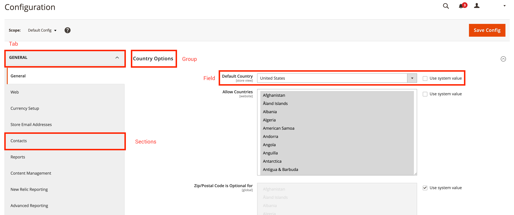

# system.xml參考

此 `system.xml` 檔案可讓您管理Commerce系統設定。 使用此主題作為 `system.xml` 檔案。 此 `system.xml` 檔案位於 `etc/adminhtml/system.xml` 在指定的Commerce 2擴充功能中。

下列程式碼片段顯示檔案的裸骨架：

```xml
<?xml version="1.0" ?>
<config xmlns:xsi="http://www.w3.org/2001/XMLSchema-instance" xsi:noNamespaceSchemaLocation="urn:magento:module:Magento_Config:etc/system_file.xsd">
    <system>
        <!-- PLACE YOUR MODULE SPECIFIC CONFIGURATION HERE -->
    </system>
</config>
```

>[!TIP]
>
>如果您想要在IDE中立即進行*XSD驗證，可以執行 `bin/magento dev:urn-catalog:generate [--ide IDE] [--] <path>`.

## 索引標籤//區段//群組//欄位

在 `system.xml` 檔案中，可以定義四個彼此相關的不同型別的圖元。 下節說明標籤、區段、群組和欄位之間的關係。 以下熒幕擷圖顯示管理後端中的Commerce 2系統設定。
紅色正方形會標籤在 `system.xml` 檔案：



標籤可用來以語義方式分割不同的組態區域。 每個標籤可以包含一或多個區段，這些區段也可以作為子選單參照。 區段包含一或多個群組。
每個群組會列出一或多個欄位。 您也可以使用群組來新增下列欄位的一般說明。 如前所述，每個群組可以有一或多個欄位。 欄位是系統配置內容中的最小實體。

## 索引標籤

A `<tab>` — 標籤系統配置中現有或新標籤的參照。

### 索引標籤屬性參考

A `<tab>`-Tag可以有下列屬性：

| 屬性 | 說明 | 型別 | 必填 |
|-------------|------------------------------------------------------------------------------------------------------------------------------------------|----------|----------|
| `id` | 定義參考區段所使用的識別碼。 | `typeId` | 必填 |
| `translate` | 定義應可翻譯的欄位。 提供 `label` 讓標籤可翻譯。 | `string` | 可選 |
| `type` | 定義演算HTML元素的輸入型別 — 預設為 `text`. | `string` | 可選 |
| `sortOrder` | 定義區段的排序順序。 高數字會將區段推送至頁面底部；低數字會將區段推送至頁面頂部。 | `float` | 可選 |
| `class` | 將定義的CSS類別新增至演算後的TabHTML元素。 | `string` | 可選 |

### 索引標籤節點參考

A `<tab>`-Tag可以有下列子系：

| 節點 | 說明 | 型別 |
|---------|------------------------------------------------------|----------|
| `label` | 定義顯示在前端中的標籤。 | `string` |

### 範例：建立標籤

下列程式碼片段示範如何使用範例資料建立新標籤。

```xml
<?xml version="1.0" ?>
<config xmlns:xsi="http://www.w3.org/2001/XMLSchema-instance" xsi:noNamespaceSchemaLocation="urn:magento:module:Magento_Config:etc/system_file.xsd">
    <system>
        <tab id="A_UNIQUE_ID" translate="label" class="a-custom-css-class-to-style-this-tab" sortOrder="10">
            <label>A meaningful label</label>
        </tab>
    </system>
</config>
```

上述程式碼片段會建立具有識別碼的新標籤 `A_UNIQUE_ID`. 作為 `translate`-attribute已定義，並參照標籤、 `label`-node是可翻譯的。 在轉譯過程中，CSS類別 `a-custom-css-class-to-style-this-tab` 將套用至為此標籤建立的HTML元素。
此 `sortOrder`-attribute的值為 `10` 會定義轉譯時標籤在所有標籤清單中的位置。

## 部分

A `<section>` — 標籤系統組態中現有或新區段的參照。

### 區段屬性參考

A `<section>`-Tag可以有下列屬性：

| 屬性 | 說明 | 型別 | 必填 |
|:----------------|:---------------------------------------------------------------------------------------------------------------------------------------------------|:---------|:---------|
| `id` | 定義參考區段所使用的識別碼。 | `typeId` | 必填 |
| `translate` | 定義應可翻譯的欄位。 提供 `label` 讓標籤可翻譯。 | `string` | 可選 |
| `type` | 定義轉譯HTML元素的輸入型別。 預設為 `text`. | `string` | 可選 |
| `sortOrder` | 定義區段的排序順序。 高數字會將區段推送至頁面底部；低數字會將區段推送至頁面頂部。 | `float` | 可選 |
| `showInDefault` | 定義區段是否顯示在預設設定範圍中。 指定 `1` 顯示區段和 `0` 以隱藏區段。 | `int` | 可選 |
| `showInStore` | 定義區段是否顯示在存放區層級。 指定 `1` 顯示區段和 `0` 以隱藏區段。 | `int` | 可選 |
| `showInWebsite` | 定義區段是否會顯示在網站層級。 指定 `1` 顯示區段和 `0` 以隱藏區段。 | `int` | 可選 |
| `canRestore` | 定義區段是否可還原成預設值。 | `int` | 可選 |
| `advanced` | 自100.0.2起已棄用。 | `bool` | 可選 |
| `extends` | 透過提供另一個區段的識別碼，此節點的內容將擴充您參考的區段。 | `string` | 可選 |

### 區段節點參考

A `<section>`-Tag可以有下列子系：

| 節點 | 說明 | 型別 |
|------------------|-----------------------------------------------------------------------------------------------------------------------|---------------------|
| `label` | 定義顯示在前端中的標籤。 | `string` |
| `class` | 將定義的CSS類別新增至演算後的區段HTML元素。 | `string` |
| `tab` | 參考關聯的索引標籤。 必須是索引標籤的ID。 | `typeTabId` |
| `header_css` | 撰寫本文時既未使用也未評估。 | `string` |
| `resource` | 參考ACL資源以提供此區段的許可權設定。 | `typeAclResourceId` |
| `group` | 定義一或多個子群組。 | `typeGroup` |
| `frontend_model` | 指定不同的前端模型來變更彩現並修改輸出。 | `typeModel` |
| `include` | 用於包含其他 `system_include.xsd` 相容的檔案。 通常用於建構大型 `system.xml` 檔案。 | `includeType` |

### 範例：建立區段並將其指派給標籤

下列程式碼片段示範建立新區段的基本用法。

```xml
<?xml version="1.0" ?>
<config xmlns:xsi="http://www.w3.org/2001/XMLSchema-instance" xsi:noNamespaceSchemaLocation="urn:magento:module:Magento_Config:etc/system_file.xsd">
    <system>
        <tab id="A_UNIQUE_ID" translate="label" class="a-custom-css-class-to-style-this-tab" sortOrder="10">
            <label>A meaningful label</label>
        </tab>

        <section id="A_UNIQUE_SECTION_ID" showInDefault="1" showInWebsite="0" showInStore="1" sortOrder="10" translate="label">
            <label>A meaningful section label</label>
            <tab>A_UNIQUE_ID</tab>
            <resource>VENDOR_MODULE::path_to_the_acl_resource</resource>
        </section>
    </system>
</config>
```

上述章節會定義ID `A_UNIQUE_SECTION_ID`，會顯示在預設設定檢視和商店內容中。 此 `label`-node是可翻譯的。 區段與具有ID的標籤相關聯 `A_UNIQUE_ID`. 只有在ACL中定義許可權的使用者才能存取區段 `VENDOR_MODULE::path_to_the_acl_resource`.

## 群組

此 `<group>`-Tag用於將欄位分組。

### 群組屬性參考

A `<group>`-Tag可以有下列屬性：

| 屬性 | 說明 | 型別 | 必填 |
|:----------------|:---------------------------------------------------------------------------------------------------------------------------------------------------|:---------|:---------|
| `id` | 定義用於參考群組的識別碼。 | `typeId` | 必填 |
| `translate` | 定義應可翻譯的欄位。 提供 `label` 讓標籤可翻譯。 多個欄位應以空格分隔。 | `string` | 可選 |
| `type` | 定義轉譯HTML元素的輸入型別。 預設為 `text`. | `string` | 可選 |
| `sortOrder` | 定義區段的排序順序。 高數字會將區段推送至頁面底部；低數字會將區段推送至頁面頂部。 | `float` | 可選 |
| `showInDefault` | 定義群組是否顯示在預設設定範圍中。 指定 `1` 顯示群組和 `0` 以隱藏群組。 | `int` | 可選 |
| `showInStore` | 定義群組是否顯示在存放區層級。 指定 `1` 顯示群組和 `0` 以隱藏群組。 | `int` | 可選 |
| `showInWebsite` | 定義群組是否顯示在網站層級。 指定 `1` 顯示群組和 `0` 以隱藏群組。 | `int` | 可選 |
| `canRestore` | 定義群組是否可還原成預設值。 | `int` | 可選 |
| `advanced` | 自100.0.2起已棄用。 | `bool` | 可選 |
| `extends` | 藉由提供另一個群組的識別碼，此節點的內容將會擴充您參考的區段。 | `string` | 可選 |

### 群組節點參考

A `<group>`-Tag可以有下列子系：

| 節點 | 說明 | 型別 |
|-----------------------------|-------------------------------------------------------------------------------------------------------------------------------------------------------------------------------------------|---------------|
| `label` | 定義顯示在前端中的標籤。 | `string` |
| `fieldset_css` | 將一或多個CSS類別新增至群組欄位集。 | `string` |
| `frontend_model` | 指定不同的前端模型來變更彩現並修改輸出。 | `typeModel` |
| `clone_model` | 指定指定模型以複製欄位。 | `typeModel` |
| `clone_fields` | 啟用或停用欄位複製。 | `int` |
| `help_url` | 無法擴充。 請參閱下文。 | `typeUrl` |
| `more_url` | 無法擴充。 請參閱下文。 | `typeUrl` |
| `demo_link` | 無法擴充。 請參閱下文。 | `typeUrl` |
| `comment` | 在群組標籤下方新增註解。 透過使用 `<![CDATA[//]]>` HTML。 | `string` |
| `hide_in_single_store_mode` | 群組是否應該在單一存放區模式中可見。 `1` 隱藏群組； `0` 顯示群組。 | `int` |
| `field` | 定義此群組下應可使用的一或多個欄位。 | `field` |
| `group` | 定義一或多個子群組。 | `unbounded` |
| `depends` | 可用於宣告對其他欄位的相依性。 僅當特定欄位的值為時才用於顯示特定欄位/群組 `1`. 此節點預期一個 `section/group/field`-string。 | `depends` |
| `attribute` | 前端模型可使用自訂屬性。 通常用於讓指定的前端模型更動態。 | `attribute` |
| `include` | 用於包含其他 `system_include.xsd` 相容的檔案。 通常用於建構大型 `system.xml` 檔案。 | `includeType` |

>[!WARNING]
>
>節點 `more_url`， `demo_url` 和 `help_url` 由只使用一次的PayPal前端模型定義。 這些節點無法重複使用。

### 範例：為指定區段建立群組

下列程式碼片段示範建立新群組的基本用法。

```xml
<config xmlns:xsi="http://www.w3.org/2001/XMLSchema-instance" xsi:noNamespaceSchemaLocation="urn:magento:module:Magento_Config:etc/system_file.xsd">
    <system>
        <tab id="A_UNIQUE_ID" translate="label" class="a-custom-css-class-to-style-this-tab" sortOrder="10">
            <label>A meaningful label</label>
        </tab>

        <section id="A_UNIQUE_SECTION_ID" showInDefault="1" showInWebsite="0" showInStore="1" sortOrder="10" translate="label">
            <label>A meaningful section label</label>
            <tab>A_UNIQUE_ID</tab>
            <resource>VENDOR_MODULE::path_to_the_acl_resource</resource>

            <group id="A_UNIQUE_GROUP_ID" translate="label comment" sortOrder="10" showInDefault="1" showInWebsite="0" showInStore="1">
                <label>A meaningful group label</label>
                <comment>An additional comment helping users to understand the effect when configuring the fields defined in this group.</comment>
                <!-- Add your fields here. -->
            </group>
        </section>
    </system>
</config>
```

上述群組會定義ID `A_UNIQUE_GROUP_ID`，會顯示在預設設定檢視和商店內容中。 兩者， `label` 和 `comment` 標示為可翻譯。

## 欄位

此 `<field>` — 標籤使用在內部 `<group>` — 標籤以定義特定的設定值。

### 欄位屬性參考

A `<field>`-Tag可以有下列屬性：

| 屬性 | 說明 | 型別 | 必填 |
|:----------------|:---------------------------------------------------------------------------------------------------------------------------------------------------|:---------|:---------|
| `id` | 定義用於參考欄位的識別碼。 | `typeId` | 必填 |
| `translate` | 定義應可翻譯的欄位。 提供 `label` 讓標籤可翻譯。 多個欄位應以空格分隔。 | `string` | 可選 |
| `type` | 定義轉譯HTML元素的輸入型別。 預設為 `text`. | `string` | 可選 |
| `sortOrder` | 定義區段的排序順序。 高數字會將區段推送至頁面底部；低數字會將區段推送至頁面頂部。 | `float` | 可選 |
| `showInDefault` | 定義欄位是否顯示在預設設定範圍中。 指定 `1` 以顯示欄位和 `0` 以隱藏欄位。 | `int` | 可選 |
| `showInStore` | 定義欄位是否顯示在存放區層級。 指定 `1` 以顯示欄位和 `0` 以隱藏欄位。 | `int` | 可選 |
| `showInWebsite` | 定義欄位是否顯示在網站層級。 指定 `1` 以顯示欄位和 `0` 以隱藏欄位。 | `int` | 可選 |
| `canRestore` | 定義欄位是否可還原成預設值。 | `int` | 可選 |
| `advanced` | 自100.0.2起已棄用。 | `bool` | 可選 |
| `extends` | 藉由提供其他欄位的識別碼，此節點的內容將擴充您參考的區段。 | `string` | 可選 |

### 欄位型別參考

A `<field>`-Tag可以有下列值 `type=""` 屬性：

| 型別 | 說明 |
|-----------------|-------------------------------------------------------------------------------------------------------------------------------------------------------------------------------------------------------------------------------|
| `text` | 標準、單列文字欄位 |
| `textarea` | 文字區塊 |
| `select` | 一般下拉式清單，可能需要自訂 `source_model`. 也用於 `Yes/No` 選取範圍。 另請參閱 `Magento\Search\Model\Adminhtml\System\Config\Source\Engine` 例如， |
| `multiselect` | 按讚 `select` 但多個選項有效。 |
| `button` | 觸發立即事件的按鈕。 需要自訂前端模型來定義按鈕文字和動作。 另請參閱 `Magento\ScheduledImportExport\Block\Adminhtml\System\Config\Clean` 例如， |
| `obscure` | 文字欄位，其值已加密並顯示為 `****`. 在瀏覽器中使用「Inspect元素」變更型別不會顯示值。 |
| `password` | 按讚 `obscure` 但隱藏值不會加密，且在瀏覽器中使用「Inspect元素」強制變更型別時不會顯示值。 |
| `file` | 允許上傳檔案以供處理。 |
| `label` | 顯示標籤而非可編輯的欄位。 當欄位只能在特定範圍上編輯時（例如，只能在「存放區檢視」層級），請使用此型別。 |
| `time` | 控制項使用三個下拉式選單來設定時間：小時、分鐘和秒。 |
| `allowspecific` | 特定國家/地區的複選清單。 需要 `source_model` 例如 `Magento\Shipping\Model\Config\Source\Allspecificcountries` |
| `image` | 允許上傳影像。 |
| `note` | 允許將資訊備註新增至頁面。 此型別需要 `frontend_model` 以呈現附註。 |

您也可以建立自訂欄位型別。 這通常在需要特殊按鈕及動作時完成。 若要這麼做，需要兩個主要元素：

- 在中建立區塊 `adminhtml` 區域
- 設定 `type=""` 至此區塊的路徑

區塊本身至少需要 `__construct` 方法與 `getElementHtml()` 方法。 此 [Magento_OfflineShipping](https://github.com/magento/magento2/blob/2.4/app/code/Magento/OfflineShipping) 是自訂型別的簡單範例。

例如，在OfflineShipping模組中，「匯出」按鈕定義於 `Magento\OfflineShipping\Block\Adminhtml\Form\Field\Export` 欄位定義如下：

```xml
<field id="export" translate="label" type="Magento\OfflineShipping\Block\Adminhtml\Form\Field\Export" sortOrder="5" showInDefault="0" showInWebsite="1" showInStore="0">
    <label>Export</label>
</field>
```

### 欄位節點參考

A `<field>`-Tag可以有下列子系：

| 節點 | 說明 | 型別 |
|-----------------------------|-------------------------------------------------------------------------------------------------------------------------------------------------------------------------------------------|------------------|
| `label` | 定義顯示在前端中的標籤。 | `string` |
| `comment` | 在欄位標籤下方新增註解。 透過使用 `<![CDATA[//]]>` HTML。 | `string` |
| `tooltip` | 另一個可用來說明此欄位含義的可能前端元素。 在欄位旁邊顯示為小型圖示。 | `string` |
| `hint` | 顯示其他資訊。 僅適用於 `frontend_model`. | `string` |
| `frontend_class` | 將定義的CSS類別新增至演算後的區段HTML元素。 | `string` |
| `frontend_model` | 指定不同的前端模型來變更彩現並修改輸出。 | `typeModel` |
| `backend_model` | 指定不同的後端模型以修改設定的值。 | `typeModel` |
| `source_model` | 指定提供一組特定值的不同來源模型。 | `typeModel` |
| `config_path` | 可用來覆寫欄位的一般設定路徑。 | `typeConfigPath` |
| `validate` | 定義不同的驗證規則（以空格分隔）。 以下列出可用驗證規則的完整參考清單。 | `string` |
| `can_be_empty` | 使用時機 `type` 是 `multiselect` 指定欄位可為空白。 | `int` |
| `if_module_enabled` | 僅用於當指定模組啟用時顯示欄位。 | `typeModule` |
| `base_url` | 搭配使用 `upload_dir` 用於檔案上傳。 | `typeUrl` |
| `upload_dir` | 指定上傳的目標目錄。 此節點具有其他屬性和節點。 使用此項之前請先查詢這些變數。 | `typeUploadDir` |
| `button_url` | 顯示按鈕，如果 `button_url` 和 `button_label` 已指定。 通常與自訂前端模型結合使用。 | `typeUrl` |
| `button_label` | 顯示按鈕，如果 `button_label` 和 `button_url` 已指定。 通常與自訂前端模型結合使用。 | `string` |
| `more_url` | 無法擴充。 請參閱下文。 | `typeUrl` |
| `demo_url` | 無法擴充。 請參閱下文。 | `typeUrl` |
| `hide_in_single_store_mode` | 群組是否應該在單一存放區模式中可見。 `1` 隱藏群組； `0` 顯示群組。 | `int` |
| `source_service` | 用於填入選取選項的服務。 | `complexType` |
| `options` | 未使用。 可能已被取代。 | `complexType` |
| `depends` | 可用於向其他欄位宣告相依性。 當指定欄位的值為，僅用於顯示特定欄位/群組 `1`. 此節點預期一個 `section/group/field`-string。 | `complexType` |
| `attribute` | 前端模型可使用自訂屬性。 通常用於讓指定的前端模型更動態。 | `complexType` |
| `requires` | 無法擴充。 請參閱下文。 | `complexType` |

>[!WARNING]
>
>節點 `more_url`， `demo_url`， `requires` 和 `options` 由不同的核心支付模式定義，且僅使用一次。 這些節點無法重複使用。

### 範例：在指定群組中建立兩個欄位

```xml
<config xmlns:xsi="http://www.w3.org/2001/XMLSchema-instance" xsi:noNamespaceSchemaLocation="urn:magento:module:Magento_Config:etc/system_file.xsd">
    <system>
        <tab id="A_UNIQUE_ID" translate="label" class="a-custom-css-class-to-style-this-tab" sortOrder="10">
            <label>A meaningful label</label>
        </tab>

        <section id="A_UNIQUE_SECTION_ID" showInDefault="1" showInWebsite="0" showInStore="1" sortOrder="10" translate="label">
            <label>A meaningful section label</label>
            <tab>A_UNIQUE_ID</tab>
            <resource>VENDOR_MODULE::path_to_the_acl_resource</resource>

            <group id="A_UNIQUE_GROUP_ID" translate="label" sortOrder="10" showInDefault="1" showInWebsite="0" showInStore="1">
                <label>A meaningful group label</label>
                <comment>An additional comment helping users to understand the effect when configuring the fields defined in this group.</comment>

                <field id="A_UNIQUE_FIELD_ID" translate="label" sortOrder="10" showInDefault="0" showInWebsite="0" showInStore="1" type="select">
                    <label>Feature Flag Example</label>
                    <comment>This field is an example for a basic yes or no select.</comment>
                    <tooltip>Usually these kinds of fields are used to enable or disable a given feature. Other fields might be dependent to this and will only appear if this field is set to yes.</tooltip>
                    <source_model>Magento\Config\Model\Config\Source\Yesno</source_model>
                </field>

                <field id="ANOTHER_UNIQUE_FIELD_ID" translate="label" sortOrder="10" showInDefault="0" showInWebsite="0" showInStore="1" type="text">
                    <label>A meaningful field label</label>
                    <comment>A descriptive text explaining this configuration field.</comment>
                    <tooltip>Another possible frontend element that also can be used to describe the meaning of this field. Will be displayed as a small icon beside the field.</tooltip>
                    <validate>required-entry no-whitespace</validate> <!-- Field is required and must not contain any whitespace. -->
                    <if_module_enabled>VENDOR_MODULE</if_module_enabled>
                    <depends> <!-- This field will only be visible if the field with the id A_UNIQUE_FIELD_ID is set to value 1 -->
                        <field id="A_UNIQUE_FIELD_ID">1</field>
                    </depends>
                </field>
            </group>
        </section>
    </system>
</config>
```

上述範例會建立兩個欄位，兩者在預設和存放區檢視中均為可見/可設定。 這兩個欄位都有註解和工具提示，可向使用者說明其用途。 此 `label`-node是可翻譯的。
具有識別碼的欄位 `ANOTHER_UNIQUE_FIELD_ID` 在中的指定模組時可見 `if_module_enabled` 會在全域啟用。 該欄位也會根據規則驗證其值 `required-entry` 和 `no-whitespace`.
具有識別碼的欄位 `A_UNIQUE_FIELD_ID` 會定義不同的來源模型，以提供該值 `Yes` 和 `No`.

### 通用來源模型

下列來源模型由Commerce 2核心提供。 一般而言，來源模型還有許多；以下清單說明最常見的模型。 請注意，這些來源模型需要欄位屬性 `type` 將設為 `select` 才能正常運作。

| 來源模型 | 說明 |
|-----------------------------------------------------------|------------------------------------------------------------------------------------------------------------|
| `Magento\Config\Model\Config\Source\Yesnocustom` | 提供值 `Yes`， `No` 和 `Specified`. |
| `Magento\Config\Model\Config\Source\Enabledisable` | 提供值 `Enable`， `Disable`. 將值儲存為 `0` 和 `1` 在資料庫中。 |
| `Magento\AdminNotification\Model\Config\Source\Frequency` | 提供值 `1 Hour`，`2 Hours`，`6 Hours`，`12 Hours` 和 `24 Hours`. 值會儲存為整數。 |
| `Magento\Catalog\Model\Config\Source\TimeFormat` | 提供時間格式（12小時/24小時）的值。 |
| `Magento\Cron\Model\Config\Source\Frequency` | 提供值 `Daily`， `Weekly` 和 `Monthly`. 值在資料庫中儲存為 `D`， `W` 和 `M`. |
| `Magento\GoogleAdwords\Model\Config\Source\Language` | 以ISO 639-1格式提供指定語言的2字母程式碼值（例如en）。 |
| `Magento\Config\Model\Config\Source\Locale` | 提供與上述值類似的值，但屬於地區設定代碼（例如en_US）。 |

### 欄位驗證

欄位可以指派一或多個驗證器類別，以確保使用者的輸入符合擴充功能的需求。 可套用驗證規則搭配 `<validate>` — 標籤。
下列範例會驗證欄位並新增數個不同的驗證規則。

```xml
<field id="A_CUSTOM_IDENTIFIER" showInDefault="1" showInWebsite="0" showInStore="1">
    <validate>required-entry validate-clean-url no-whitespace</validate>
</field>
```

可使用下列驗證規則：

| 規則 | 說明 |
|---------------------------------|-------------------------------------------------------------------------------------------------------------------------|
| `alphanumeric` | 只允許字母、數字、空格或底線。 |
| `integer` | 允許正數或負數非十進位數字。 |
| `ipv4` | 允許有效的IP v4位址。 |
| `ipv6` | 允許有效的IP v6位址。 |
| `letters-only` | 僅允許字母。 例如， `abcABC`. |
| `letters-with-basic-punc` | 僅允許字母或標點符號。<br>必須傳遞下列運算式： `/^[a-z\-.,()\u0027\u0022\s]+$/i`. |
| `mobileUK` | 允許（英國）行動電話號碼。 |
| `no-marginal-whitespace` | 不允許在值的開頭或結尾使用空格。 |
| `no-whitespace` | 不允許空格。 |
| `phoneUK` | 允許（英國）電話號碼。 |
| `phoneUS` | 允許（美國）電話號碼。 |
| `required-entry` | 不允許空值(等於驗證 `validate-no-empty`)。<br>驗證失敗訊息：「此為必填欄位。」 |
| `time` | 允許以24小時格式顯示有效時間，介於00:00到23:59之間。 例如 `15`， `15:05` 或 `15:05:48`. |
| `time12h` | 允許以半夜12:00到11之間的12小時格式顯示有效時間:59:下午59點 例如 `3 am`， `11:30 pm`， `02:15:00 pm`. |
| `validate-admin-password` | 允許7個或更多字元，使用數字和字母組合。 |
| `validate-alphanum-with-spaces` | 僅允許使用字母（a-z或A-Z）、數字(0-9)或空格。 |
| `validate-clean-url` | 允許有效的URL。 例如， `https://www.example.com` 或 `www.example.com`. |
| `validate-currency-dollar` | 允許有效的（美元）金額。 例如$100.00。 |
| `validate-data` | 僅允許使用字母（a-z或A-Z）、數字(0-9)或底線(\_)。<br>第一個字元必須是字母。<br>(必須符合運算式： `/^[A-Za-z]+[A-Za-z0-9_]+$/`)<br>驗證失敗訊息：「在此欄位中請只使用字母（a-z或A-Z）、數字(0-9)或底線(\_)，第一個字元應為字母。」 |
| `validate-date-au` | 強制下列日期格式： dd/mm/yyyy。 例如，2006年3月17日的17/03/2006。 |
| `validate-email` | 允許有效的電子郵件地址。 例如， johndoe@domain.com。 |
| `validate-emailSender` | 允許有效的電子郵件地址。 例如， johndoe@domain.com。 |
| `validate-fax` | 允許有效的傳真號碼。 例如：123-456-7890。 |
| `validate-no-empty` | 不允許空值(等於驗證 `requried-entry`)。<br>驗證失敗訊息：「空值。」 |
| `validate-no-html-tags` | 禁止使用HTML標籤。 |
| `validate-password` | 允許6個或更多字元。 將忽略開頭和結尾的空格。 |
| `validate-phoneLax` | 允許有效的電話號碼。 例如，(123) 456-7890或123-456-7890。 |
| `validate-phoneStrict` | 允許有效的電話號碼。 例如，(123) 456-7890或123-456-7890。 |
| `validate-select` | 強制所選的選取選項不具有 `null` 值，字串值 `none` 或字串長度0。 |
| `validate-ssn` | 允許有效的（美國）社會保險號碼。 例如：123-45-6789。 |
| `validate-street` | 僅允許使用字母（a-z或A-Z）、數字(0-9)、空格和「#」。 |
| `validate-url` | 允許有效的URL。 需要通訊協定(http://、https://或ftp://)。 |
| `validate-xml-identifier` | 允許有效的XML識別碼。 例如，something_1、block5、id-4。 |
| `validate-zip-us` | 允許有效的（美國）郵遞區號。 例如，90602或90602-1234。 |
| `vinUS` | 允許(US)車輛識別碼(VIN)值。 |

### 預設值

欄位的預設值可在模組的 `etc/config.xml` 檔案設定，方式為在 `section/group/field_ID` 節點。

#### 範例：設定預設值 `ANOTHER_UNIQUE_FIELD_ID` （預設範圍）

```xml
<config xmlns:xsi="http://www.w3.org/2001/XMLSchema-instance" xsi:noNamespaceSchemaLocation="urn:magento:module:Magento_Store:etc/config.xsd">
    <default>
        <A_UNIQUE_SECTION_ID>
            <A_UNIQUE_GROUP_ID>
                <ANOTHER_UNIQUE_FIELD_ID>This is the default value</ANOTHER_UNIQUE_FIELD_ID>
            </A_UNIQUE_GROUP_ID>
        </A_UNIQUE_SECTION_ID>
    </default>
</config>
```

#### 範例：設定預設值 `ANOTHER_UNIQUE_FIELD_ID` （網站範圍）

使用 `websites` 標籤，指定特定網站的預設值。

```xml
<config xmlns:xsi="http://www.w3.org/2001/XMLSchema-instance" xsi:noNamespaceSchemaLocation="urn:magento:module:Magento_Store:etc/config.xsd">
    <websites>
        <WEBSITE_CODE>
            <A_UNIQUE_SECTION_ID>
                <A_UNIQUE_GROUP_ID>
                    <ANOTHER_UNIQUE_FIELD_ID>This is the default value</ANOTHER_UNIQUE_FIELD_ID>
                </A_UNIQUE_GROUP_ID>
            </A_UNIQUE_SECTION_ID>
        </WEBSITE_CODE>
    </websites>
</config>
```
