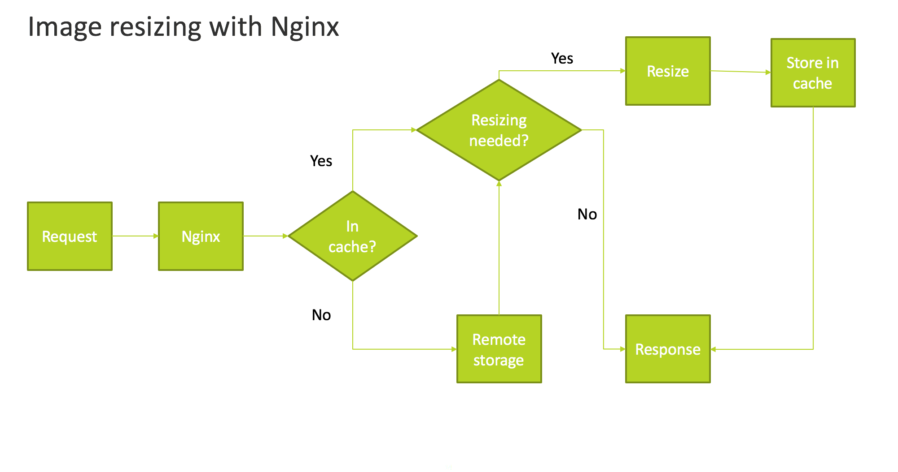

# 設定遠端儲存裝置的影像大小調整

依預設，Adobe Commerce支援在應用程式端調整影像大小。 不過，透過啟用「遠端儲存」模組，您可以使用Nginx將影像大小調整解除安裝到伺服器端，藉此節省磁碟資源並最佳化磁碟使用量。

下圖顯示Nginx如何擷取、調整影像大小以及將其儲存在快取中。 調整大小是由URL中包含的引數（例如高度和寬度）所決定。



>[!TIP]
>
>如需雲端基礎結構專案上的Adobe Commerce，請參閱[在雲端基礎結構上設定Commerce的遠端儲存空間](cloud-support.md)

## 在Adobe Commerce中設定URL格式

若要在伺服器端調整影像大小，您必須設定Adobe Commerce以提供影像的高度、寬度和位置(URL)引數。

**若要設定Commerce以調整伺服器端影像大小**：

1. 在&#x200B;_管理員_&#x200B;面板中，按一下&#x200B;**[!UICONTROL Stores]** > **[!UICONTROL Settings]** > **[!UICONTROL Configuration]** > **[!UICONTROL General]** > **[!UICONTROL Web]**。

1. 在右窗格中，展開&#x200B;**[!UICONTROL Url options]**。

1. 在&#x200B;_目錄媒體URL格式_&#x200B;區段中，清除&#x200B;**[!UICONTROL Use system value]**。

1. 在&#x200B;**_目錄媒體URL格式_**&#x200B;欄位中選取`Image optimization based on query parameters` URL。

1. 按一下&#x200B;**[!UICONTROL Save Config]**。

1. 繼續進行[Nginx組態](#configure-nginx)。

## 設定Nginx

若要繼續設定伺服器端影像調整大小，您必須準備`nginx.conf`檔案，並為您選擇的介面卡提供`proxy_pass`值。

**若要啟用Nginx以調整影像大小**：

1. 安裝[Nginx影像篩選模組][nginx-module]。

   ```shell
   load_module /etc/nginx/modules/ngx_http_image_filter_module.so;
   ```

1. 根據包含的範本`nginx.conf.sample`檔案建立`nginx.conf`檔案。 例如：

   ```conf
   location ~* \.(jpg|jpeg|png|gif|webp)$ {
       set $width "-";
       set $height "-";
       if ($arg_width != '') {
           set $width $arg_width;
       }
       if ($arg_height != '') {
           set $height $arg_height;
       }
       image_filter resize $width $height;
       image_filter_jpeg_quality 90;
   }
   ```

1. [_選擇性_]&#x200B;設定您特定介面卡的`proxy_pass`值。

   - [Amazon Simple Storage Service (Amazon S3)](remote-storage-aws-s3.md)

<!-- link definitions -->

[nginx-module]: https://nginx.org/en/docs/http/ngx_http_image_filter_module.html
