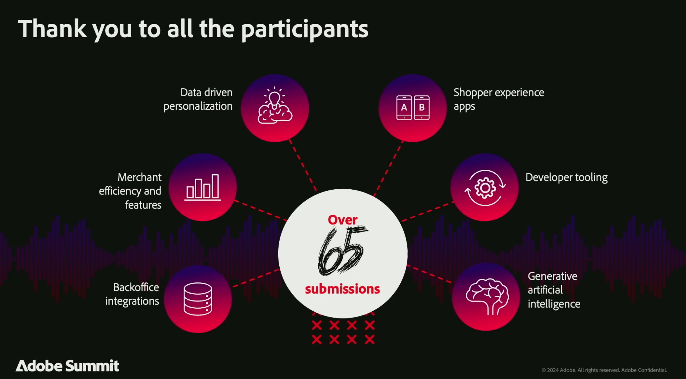

# 2024 Adobe CommerceAdobe Summit摘要

Adobe Summit2024是值得一提的活動，匯聚了Adobe Commerce社群，包括領先業界的客戶、有遠見的合作夥伴，以及我們的Adobe Commerce團隊，以連結、探索和學習。 與Hanesbrands、可口可樂、雀巢、聯合利華、佳能等公司合作的所有內容都包括 [**現已隨選提供**](https://business.adobe.com/summit/2024/sessions.html?Track=Commerce)！

以下是2024年Adobe Summit的部分重點內容。

## Adobe Commerce藍圖研討會

我們以創新的方式開啟了會議 [**Adobe Commerce藍圖課程**](https://business.adobe.com/summit/2024/sessions/adobe-commerce-2024-product-roadmap-review-s432.html) 我們透過體驗導向的平台，展示Adobe Commerce如何賦權企業以更快的速度創新及加快銷售速度。

觀看此會議，瞭解Adobe Commerce如何提供下列功能：

- **[更快速的店面體驗](https://experienceleague.adobe.com/developer/commerce/storefront/)：** 我們全新的高效能店面架構、Edge Delivery Services、提升網站速度、SEO排名及自然流量。 此外，與Adobe Experience Manager Assets的新整合可讓您存取GenAI內容開發和工作流程管理，簡化內容供應鏈。

- **[超個人化的購買歷程](https://experienceleague.adobe.com/en/docs/commerce-admin/customers/customers-menu/personalize-scale)：** 自動收集並分享即時店面點按次數、後端訂單歷史記錄，以及現在與其他Adobe Experience Cloud解決方案的客戶設定檔資料。 使用使用案例教戰手冊自動化全頻道行銷活動設定，並使用Adobe Real-Time CDP受眾個人化commerce行動應用程式和向上銷售/交叉銷售選件。

- **[簡化的可撰寫開發](https://developer.adobe.com/commerce/extensibility/app-development/learning-path/)：** 使用Adobe Developer App Builder以更低的成本加速創新。 透過新的後台整合入門套件，簡化與ERP和其他後端系統的整合。 設定Webhook並透過統一的開發人員體驗自訂Admin UI，包括API協調、事件管理和無伺服器擴充性。

- **[進階B2B Commerce與訂單管理](https://experienceleague.adobe.com/en/docs/commerce-admin/b2b/introduction)：** 使用進階報價工具和父子帳戶設定，支援大型全球帳戶和B2B2X使用案例，大幅提升B2B銷售。 透過我們預先建立的新整合功能，以前所未有的速度連線至IBM Sterling Order Management，透過即時存貨管理、自動訂單履行、退貨管理以及完整的儀表板與工作流程，將營運效率最大化。

## 強大的客戶和合作夥伴研討會

我們由Adobe Commerce客戶和合作夥伴組成的創新社群，也分享了他們的策略、最佳實務和學習經驗。

探索完整的Commerce研討會 [此處](https://business.adobe.com/summit/2024/sessions.html?Track=Commerce) 並檢視以下一些最熱門的工作階段：

- [聯合利華如何將其全球分銷貿易路徑數位化](https://business.adobe.com/summit/2024/sessions/how-unilever-digitized-its-distributive-trade-rout-s430.html) 與聯合利華副總裁兼技術長Prashaant Huria合作； *已選取長條圖為 [年度體驗製作器](https://www.adobeexperienceawards.com/stories2024) 在APAC*

- [E-Comm Masterclass：Hanesbrands打造全球最快的店面](https://business.adobe.com/summit/2024/sessions/ecomm-masterclass-hanesbrands-creates-the-worlds-f-s435.html) 與Hanesbrands全球業務分析和資料分析資深經理Emmylou Jordan合作

- [可口可樂：釋放資料以打造以消費者為中心的Commerce體驗](https://business.adobe.com/summit/2024/sessions/cocacola-unlocking-data-to-create-consumercentric-s434.html) 可口可樂公司Global Adtech/Martech Platforms的DirectorVinay Gopinath

- [Canon如何使用Adobe Commerce提高轉換率和流量](https://business.adobe.com/summit/2024/sessions/how-canon-increased-conversion-rates-and-traffic-u-s438.html) 與美國佳能公司Martech Engagement Ops經理Matthew Mandato合作

- [Nestle Purina：使用Adobe Commerce建立可撰寫的平台，以提升業務靈敏度](https://business.adobe.com/summit/2024/sessions/purina-takes-composable-commerce-approach-to-boost-s437.html) 與雀巢普瑞納D2C技術經理Ben Robie合作

## Adobe Commerce Rockstars的創新展示

每年，我們都能洞悉客戶和合作夥伴開發人員透過Adobe Commerce創造哪些最具創新性的產品。 檢視 **[Adobe Commerce Rockstar展示](https://business.adobe.com/summit/2024/sessions/adobe-commerce-rockstar-showcase-s431.html)** 我們從65項以上的資料中挑選了3大提交專案：

- **透過Edge Delivery Services和Luma Bridge實現店面創新**

  Martin Altmann，首席顧問與Adobe實務負責人，Comwrap回覆

- **App Builder整合，用於精益訂單管理**

  Shikha Raina，建築師，Bounteous

- **主要GPT GenAI建議產品內容建立**

  Yaroslav Rogoza， CTO， Atwix

檢視誰榮獲2024 Adobe Commerce Rockstar冠軍！

重溫所有精彩的會議，透過 **[探索隨選內容](https://business.adobe.com/summit/2024/sessions.html?Track=Commerce)** 隨時掌握Adobe Commerce在上的最新創新內容 [**Experience League**](https://experienceleague.adobe.com/en/docs/commerce-operations/release/latest).
