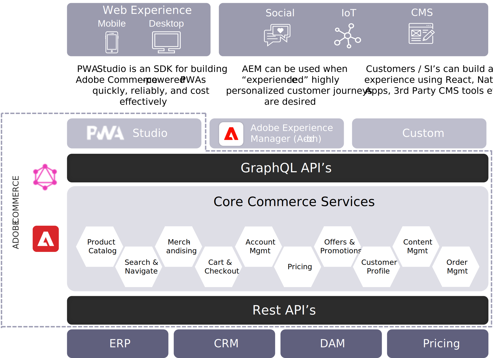

# Headless Adobe Commerce架構

Adobe Commerce架構的優點在於，它不是全有或全無的主張，商家可以為他們的企業找到合適的解決方案組合。 他們可以針對其主要網站體驗建置PWA Studio支援的PWA，或使用Adobe Experience Manager作為複雜客戶歷程中的圖層，同時建置自訂前端以實驗新的接觸點。 Adobe Commerce的Headless架構提供的上市時間優勢和靈活性，是其他任何平台都無法比擬的。

每種方法並非互斥。 客戶可以建立自己的前端（頭部）、將PWA Studio用於網路/行動體驗，和/或將Adobe Experience Manager用於玻璃（在完整或混合部署中）。

Adobe Commerce一律允許使用REST API進行Headless部署。 雖然REST功能強大（尤其是針對大量處理），但就Headless而言，GraphQL API可透過直覺式的開發人員體驗實現更快速的開發，並允許不會影響現有API的變更而提供更大的彈性，以及透過將擷取的資料量減至僅需精確提供所需內容而提供更好的效能。

GraphQL是效能API的產業標準，許多頂級的電子商務平台都使用它。 這是好事，因為這表示這是經驗證的解決方案，而且市場上有專門技術。

雖然Adobe Commerce確實提供搭配店面選項，但商家絕不需要使用Adobe Commerce舊版店面。 商家可以利用Adobe Commerce同級最佳的商務服務來處理後端業務流程，並使用我們的店面API整合他們自己的分離式店面，以產生前端體驗。

現在，讓我們來看看各種Headless選項。

## PWA Studio

第一個是以PWA Studio建置的漸進式網頁應用程式。 部分之所以能夠這麼做，是因為PWA是與商務後端分離的Headless店面。 透過PWA Studio，商戶可以在Adobe Commerce之上建立高效能、可靠且符合成本效益的PWA，在行動裝置和桌上型電腦上提供同級最佳的網頁體驗。 隨著時間推移，這會取代耦合的店面作為預設選項。

大多數商家瞭解產業在PWA方面的發展方向，許多潛在的封鎖程式正在被快速移除。

一週又一週，建立PWA Studio專業知識的合作夥伴數量不斷增長，而客戶推出產品的數量也在不斷加快。 PWA Studio的最新更新包含擴充功能，可協助您在與Adobe Commerce Marketplace擴充功能的相容性方面取得重大進展。

許多商戶可能會覺得他們還沒有準備好進行Headless和PWA，因為他們需要嚴重依賴開發人員。 同時擁有Adobe Commerce開發的商務應用程式和Head的其中一項巨大優點，就是它有助於確保各種商務功能的相容性。

為了讓我們的商戶更容易存取及管理PWA，我們賦予業務使用者管理日常內容變更、建立新登陸頁面等內容的許可權，並使用頁面產生器。 這兩項強大功能結合在一起，加速了所有裝置和體驗的上市速度。

## Adobe Experience Manager

Adobe Experience Manager結合內容與數位資產管理需求，將數位資產管理與機器學習、Adobe Sensei支援的內容和客戶歷程管理的強大功能相結合，協助商戶更快將內容導向的個人化體驗推向市場。

Adobe Commerce plus Adobe Experience Manager的強大優勢在於其商務引擎可讓企業透過Adobe Experience Manager所支援的客戶介面來啟用商務。

## 自訂標頭

這裡討論的最後一個選項是建立自訂前端。 此選項適用於具備現有專業知識的企業以及擅長特定前端棧疊（例如React）的內部開發人員。 如果他們沒有Adobe Commerce傳統前端開發的技能，他們可以認定建立自己的自訂React前端更符合成本效益。

自然，此模式需要強大的客戶或系統整合前端開發技能和資源，並且您無法獲得與Page Builder等內容原生相容性的好處(例如PWA Studio時所獲得的)。 每當商家建立完全自訂的商品時，他們可能會失去上市時間的優勢。

自訂前端也支援創新和實驗。 關於AR/VR或語音商務，有許多討論，而類似Adobe Commerce的架構可讓商家探索這些選項，而不影響他們現有的網路商店。
