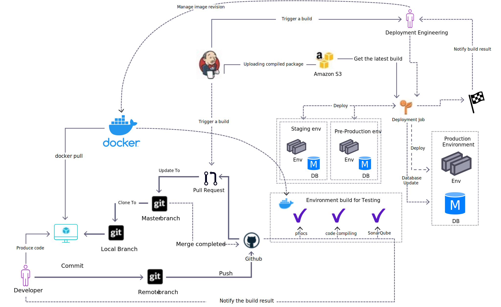

# 項目實施方法

現在，您對相關工具有了更清楚的了解，我們現在將分解我們的交付和測試流程。

## 持續整合(CI)

持續整合作業會自動執行下列動作：

- 建立原始碼以檢查編譯錯誤。
- 建立/更新提取請求時執行測試。 目前，PHP單元測試正在執行。

工作會將其執行狀態發佈至提取請求。 開發人員可以檢視工作執行的詳細資訊，以便修正或改善現有程式碼。

## 連續傳送(CD)

在所有測試成功通過後，「連續傳送」(CD)會立即將原始碼部署到伺服器。 開發人員可以快速檢查其功能，然後將任務指派給QA團隊進行檢閱。

當組建在組建系統上執行時，它不僅能將部署停機時間降至最低，而且能降低伺服器的負載。 因此，伺服器上發生的QA活動受到的影響會較小。

上圖中的CI/CD過程可簡要描述如下：

- 位元貯體會托管Git存放庫。
- 從生產技術堆棧配置中複製Docker映像。
- Docker容器用於所有開發和測試環境。 如有需要，其他環境可能會運用這些設定。
- 開發人員會為每個新任務/票證執行相關代碼分支的結帳。
- 對於所有提交分支，自動：
   - 執行標準代碼掃描。
   - 執行代碼編譯測試。
   - 執行靜態代碼掃描（例如SonarQube）。
- 所有通過的掃描提交都與目標分支合併。
- 新發行的標籤會推送至AWS S3，以取得部署整備套件。
- 部署工程團隊會觸發新部署。
   - 部署作業將新包部署到目標環境。
   - 資料庫結構更新需要暫停以接受客戶的新請求。
- 部署程式以電子郵件/Slack/團隊通知結束，由伺服器自動傳送給部署工程團隊。
