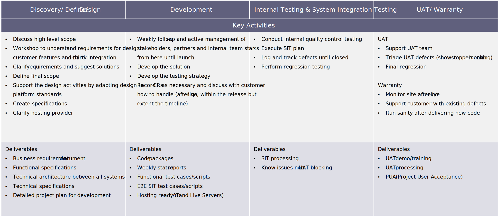

# 典型的實作流程和時間表

許多組織都透過建立提案請求(RFP)來為商業轉型做準備。 這包括詳細需求、目前的記錄系統、業務案例和定義成功的特定目標（例如收入、轉換、平均訂單值）。 然後，該品牌與兩到三個不同的商務系統整合商或數位代理商接洽，以評估、審查估計和提案、選擇公司，並開始致力於預計推出時間表。

這可能是個成功的方法。 然而，降低風險的一項建議（在承諾完全實作之前）是與組織合作進行需求評估或探索流程，以確認組織的準備程度、專案範圍、時間表、預算、業務需求和技術方法。 此程式平均需要四到六週的時間，但會因專案大小而異。

## 典型時間表範例

## 時間表活動範例

