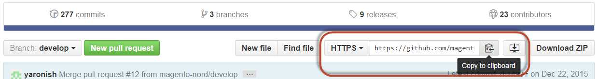

# 複製範例資料Git存放庫

本主題說明如何複製Magento Open Source GitHub存放庫並新增範例資料。 此方法僅適用於參與開發人員(即計畫參與Magento Open Source程式碼基底的開發人員)。

如果您不是貢獻開發人員，請選擇頁面左側目錄中所顯示的其他選項之一。

如果下列情況為真，貢獻開發人員只能使用此方法來安裝範例資料&#x200B;*才能使用*：

* 您使用Magento Open Source
* 您[複製GitHub存放庫](https://developer.adobe.com/commerce/contributor/guides/install/clone-repository/)

>[!WARNING]
>
>您可以將範例資料搭配`develop`分支（較新）或已發行分支(例如`2.4` （較穩定）)使用。 建議您使用已發行的分支，因為其較穩定。 如果您要貢獻程式碼到存放庫，而且需要最新的程式碼，請使用`develop`分支。 無論您選擇哪個分支，都必須[複製](https://developer.adobe.com/commerce/contributor/guides/install/clone-repository/) Magento Open Source GitHub存放庫的對應分支。 例如，`develop`分支的範例資料&#x200B;*只能*&#x200B;搭配Magento Open Source `develop`分支使用。

## 複製範例資料存放庫

本節說明如何藉由複製範例資料存放庫來安裝範例資料。 您可以透過下列任何方式複製範例資料存放庫：

* 使用[SSH通訊協定](#clone-with-ssh)複製
* 使用[HTTPS通訊協定](#clone-with-https)複製

### 使用SSH複製

若要使用SSH通訊協定複製範例資料GitHub存放庫：

1. 在網頁瀏覽器中，移至[範例資料存放庫](https://github.com/magento/magento2-sample-data)。
1. 在分支名稱旁，按一下清單中的&#x200B;**SSH**。
1. 按一下&#x200B;**複製到剪貼簿**

   下圖顯示一個範例。

   

1. 變更至網頁伺服器的docroot目錄。

   通常，對於Ubuntu，這是`/var/www`；對於CentOS，這是`/var/www/html`。

1. 輸入`git clone`並貼上您先前取得的值。

   範例如下：

   ```bash
   git clone git@github.com:magento/magento2-sample-data.git
   ```

1. 等候存放庫在伺服器上複製。

   >[!NOTE]
   >
   >如果顯示下列錯誤，請確定您已[與GitHub共用SSH金鑰](https://docs.github.com/articles/generating-ssh-keys/)：<br>

   ```
   Cloning into 'magento2'...
   Permission denied (publickey).
   fatal: The remote end hung up unexpectedly
   ```

1. 請確定您簽出與您在主要`magento2`存放庫中所使用之分支對應的範例資料存放庫分支。

   例如：

   如果您使用Magento Open Source GitHub存放庫的`2.4-develop`分支，範例資料分支應為`2.4-develop`。

   若要簽出正確的分支，請從範例資料存放庫的根目錄執行下列命令（假設您需要`2.4-develop`分支）：

   ```bash
   git checkout 2.4-develop
   ```

1. 變更為`<app_root>`。
1. 輸入下列命令，在您複製的檔案之間建立符號連結，讓範例資料正常運作：

   ```bash
   php -f <sample-data_clone_dir>/dev/tools/build-sample-data.php -- --ce-source="<path_to_your_magento_instance>"
   ```

1. 等待命令完成。

1. 請參閱[設定檔案系統許可權和擁有權](#set-file-system-ownership-and-permissions)。

1. 執行以下命令：

   ```bash
   bin/magento setup:upgrade
   ```

### 使用HTTPS原地複製

若要使用HTTPS通訊協定複製範例資料GitHub存放庫：

1. 在網頁瀏覽器中，移至[範例資料存放庫](https://github.com/magento/magento2-sample-data)。
1. 在頁面右側的&#x200B;**複製URL**&#x200B;欄位下，按一下&#x200B;**HTTPS**。
1. 按一下&#x200B;**複製到剪貼簿**。

   下圖顯示一個範例。

   

1. 變更至網頁伺服器的docroot目錄。

   通常，對於Ubuntu，這是`/var/www`；對於CentOS，這是`/var/www/html`。

1. 輸入`git clone`並貼上您先前取得的值。

   範例如下：

   ```bash
   git clone https://github.com/magento/magento2-sample-data.git
   ```

1. 等候存放庫在伺服器上複製。
1. 請確定您簽出與您在主要`magento2`存放庫中所使用之分支對應的範例資料存放庫分支。

   例如：

   如果您使用Magento Open Source GitHub存放庫的`2.4-develop`分支，範例資料分支應為`2.4-develop`。

   若要簽出正確的分支，請從範例資料存放庫的根目錄執行下列命令（假設您需要`2.4-develop`分支）：

   ```bash
   git checkout 2.4-develop
   ```

1. 變更為`<magento_root>`。
1. 輸入下列命令，在您複製的檔案之間建立符號連結，讓範例資料正常運作：

   ```bash
   php -f <sample-data_clone_dir>/dev/tools/build-sample-data.php -- --ce-source="<path_to_your_magento_instance>"
   ```

   例如，

   ```bash
   php -f <sample-data_clone_dir>/dev/tools/build-sample-data.php -- --ce-source="/var/www/magento2"
   ```

1. 等待命令完成。
1. 請參閱下一節。

>[!WARNING]
>
>如果您在安裝Adobe Commerce *之後安裝範例資料*，您也必須執行下列命令來更新資料庫和結構描述：
>
>```bash
><magento_root>/bin/magento setup:upgrade
>```

## 設定檔案系統擁有權和許可權

由於`php build-sample-data.php`指令碼會在範例資料存放庫與您的Magento Open Source存放庫之間建立符號連結，因此您必須在範例資料存放庫中設定檔案系統許可權和擁有權。 若未這麼做，會導致存取店面時發生錯誤。

若要設定範例資料存放庫的檔案系統許可權和擁有權：

1. 變更至範例資料複製目錄。
1. 設定擁有權：

   ```bash
   chown -R :<your web server group name> .
   ```

   典型範例：

   * CentOS： `chown -R :apache .`

   * Ubuntu： `chown -R :www-data .`

1. 設定許可權：

   ```bash
   find . -type d -exec chmod g+ws {} +
   ```

1. 清除靜態檔案：

   ```bash
   cd <your Magento Open Source install dir>
   ```

   ```bash
   rm -rf var/cache/* var/page_cache/* generated/*
   ```

## 完成範例資料安裝

{{$include /help/_includes/sample-data-complete.md}}

<!-- Last updated from includes: 2022-09-08 11:33:05 -->
