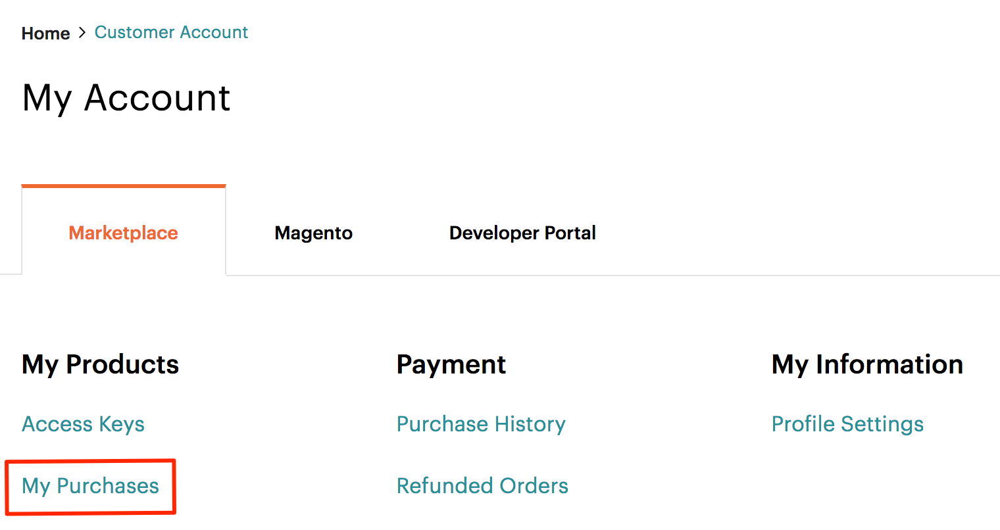

# 安裝擴展

擴展或自定義Adobe Commerce和Magento Open Source行為的代碼稱為擴展。 您可以選擇在 [Commerce Marketplace](https://marketplace.magento.com) 或其他分機分配系統。

擴展包括：

- 模組(擴展Adobe Commerce和Magento Open Source功能)
- 主題（更改店面和管理員的外觀和感覺）
- 語言包（本地化店面和管理員）

>[!TIP]
>
>本主題說明如何使用命令行安裝您從Commerce Marketplace購買的擴展。 可以使用相同的過程進行安裝 _任何_ 擴展；您只需要副檔名的Composer名稱和版本。 要找到它，請開啟分機 `composer.json` 檔案並注意 `"name"` 和 `"version"`。

在安裝之前，您可能希望：

1. 備份資料庫。
1. 啟用維護模式：

   ```bash
   bin/magento maintenance:enable
   ```

要安裝擴展，必須：

1. 從Commerce Marketplace或其他擴展開發器獲取擴展。
1. 如果從Commerce Marketplace安裝擴展，請確保 `repo.magento.com` 儲存庫存在於 `composer.json` 檔案：

   ```bash
   "repositories": [
       {
           "type": "composer",
           "url": "https://repo.magento.com/"
       }
   ]
   ```

1. 獲取副檔名的Composer名稱和版本。
1. 更新 `composer.json` 的名稱和版本。
1. 驗證擴展安裝是否正確。
1. 啟用並配置擴展。

## 獲取擴展Composer名稱和版本

如果您已經知道副檔名的Composer名稱和版本，請跳過此步驟並繼續 [更新 `composer.json` 檔案](#update-your-composer-file)。

要從Commerce Marketplace獲取副檔名的Composer名稱和版本，請執行以下操作：

1. 登錄到 [Commerce Marketplace](https://marketplace.magento.com) 以及您購買副檔名時使用的用戶名和密碼。

1. 在右上角，按一下 **你的名字** > **我的個人資料**。

   

1. 按一下 **我的購買**。

   

1. 查找要安裝的擴展，然後按一下 **技術詳細資訊**。

   

>[!TIP]
>
>或者，您可以找到的Composer名稱和版本 _任何_ 擴展(無論您是在Commerce Marketplace上還是在其他位置購買) `composer.json` 的子菜單。

## 更新您的Composer檔案

將副檔名的名稱和版本添加到 `composer.json` 檔案：

1. 導航到項目目錄並更新 `composer.json` 的子菜單。

   ```bash
   composer require <component-name>:<version>
   ```

   比如說，

   ```bash
   composer require j2t/module-payplug:2.0.2
   ```

1. 輸入 [身份驗證密鑰](../prerequisites/authentication-keys.md)。 您的公鑰是您的用戶名；你的私鑰是你的密碼。

1. 等待Composer完成對項目依賴項的更新，並確保沒有任何錯誤：

   ```terminal
   Updating dependencies (including require-dev)
   Package operations: 1 install, 0 updates, 0 removals
     - Installing j2t/module-payplug (2.0.2): Downloading (100%)
   Writing lock file
   Generating autoload files
   ```

## 驗證擴展

要驗證是否正確安裝了擴展，請運行以下命令：

```bash
bin/magento module:status J2t_Payplug
```

預設情況下，擴展可能被禁用：

```terminal
Module is disabled
```

副檔名的格式為 `<VendorName>_<ComponentName>`;這是與作曲家名稱不同的格式。 使用此格式啟用擴展。 如果不確定副檔名，請運行：

```bash
bin/magento module:status
```

在「已禁用模組清單」下查找擴展。

## 啟用擴展

某些擴展無法正常工作，除非您先清除生成的靜態視圖檔案。 使用 `--clear-static-content` 選項，在啟用副檔名時清除靜態視圖檔案。

1. 啟用擴展並清除靜態視圖檔案：

   ```bash
   bin/magento module:enable J2t_Payplug --clear-static-content
   ```

   您應看到以下輸出：

   ```terminal
   The following modules have been enabled:
   - J2t_Payplug
   
   To make sure that the enabled modules are properly registered, run 'setup:upgrade'.
   Cache cleared successfully.
   Generated classes cleared successfully. Please run the 'setup:di:compile' command to generate classes.
   Generated static view files cleared successfully.
   ```

1. 註冊擴展：

   ```bash
   bin/magento setup:upgrade
   ```

1. 重新編譯項目：在生產模式下，您可能會收到一條消息「請重新運行Magento編譯命令」。 應用程式不會提示您在開發人員模式下運行編譯命令。

   ```bash
   bin/magento setup:di:compile
   ```

1. 驗證是否已啟用擴展：

   ```bash
   bin/magento module:status J2t_Payplug
   ```

   您應看到輸出，驗證擴展是否不再禁用：

   ```terminal
   Module is enabled
   ```

1. 清除快取：

   ```bash
   bin/magento cache:clean
   ```

1. 根據需要在Admin中配置擴展。

>[!TIP]
>
>如果在瀏覽器中載入儲存面時遇到錯誤，請使用以下命令清除快取： `bin/magento cache:flush`。

## 升級擴展

要更新或升級模組或擴展：

1. 從Marketplace或其他擴展開發人員下載更新的檔案。 請注意模組名稱和版本。

1. 將內容導出到應用程式根目錄。

1. 如果模組存在Composer包，請運行以下程式之一。

   每個模組名稱的更新：

   ```bash
   composer update vendor/module-name
   ```

   每個版本的更新：

   ```bash
   composer require vendor/module-name ^x.x.x
   ```

1. 運行以下命令以升級、部署和清除快取。

   ```bash
   bin/magento setup:upgrade --keep-generated
   ```

   ```bash
   bin/magento setup:static-content:deploy
   ```

   ```bash
   bin/magento cache:clean
   ```
