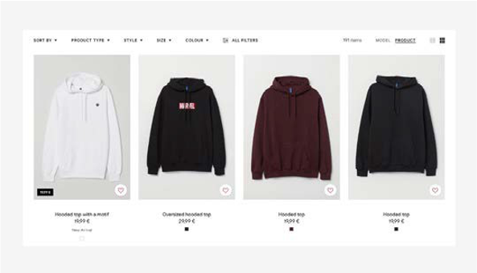

# 產品影像

電子商務完全以線上體驗為基礎。 瀏覽您網站的客戶應該對購買可用的產品感興趣，因為這會提高您的轉換率。 在提高ROI方面，有許多因素可發揮作用。 產品影像即是其中一個因素。 產品影像在吸引和說服客戶購買產品方面扮演著重要角色。 您可以對B2B和B2C使用相同的產品影像。

實際上，客戶可以感受並試用產品，但線上上購買時，他們無法選擇這麼做，因此必須提供有關產品的詳細資訊。 除了細節以外，還必須具備產品的高品質視覺效果，例如影像和影片，以協助客戶在決定購買之前瞭解產品。 產品影像是客戶在您網站上首先看到的內容，甚至在產品說明、名稱或價格之前。

根據業務需求，可使用不同型別的影像。

## 平面上的產品影像

## 含模型的產品影像

## 主要產品影像

## 生活方式影像

## 使用者已上傳影像

## 產品封裝影像

## 未盒裝的影像

## 產品影片

## 最佳實務

- **示範產品** — 如果產品已定義用途，則示範該產品以顯示其功能和特色。

- **提升使用者產生的影像** — 使用者上傳含有產品作為評論的影像，這會激勵其他購物者購買產品。

- **產品全方位檢視** — 上傳產品的360度影片或GIF可為客戶提供詳細檢視，並激勵他們購買產品。

- **命名慣例** — 讓遵循產品影像的命名慣例成為規則，這有助於將上傳產品不正確影像的錯誤降至最低，並幫助團隊輕鬆管理影像。

- **頁面載入** — 請勿上傳會增加頁面載入時間的影像。 如果客戶必須等候影像顯示，他們可能會離開網站。

- **簡單內容** — 不要讓內容過於複雜。 儘可能讓內容簡單吸引人，以產品為中心。 例如，最佳實務是將產品影像放在白色背景上，以增強產品影像。

- **真實產品影像** — 當客戶線上購買產品時，他們會看到產品在網站上的顯示狀態。 請避免套用濾鏡或增強影像以改變產品外觀。 對客戶保持透明非常重要，否則您可能會有很高的回報率。

>[!TIP]
>
>請記住，產品影像的目標是向客戶提供產品是什麼、外觀如何，並激勵他們購買。
