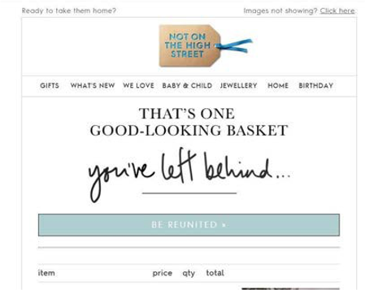

# 電子郵件行銷

電子郵件行銷（簡單來說）是指透過電子郵件傳送行銷訊息給潛在客戶及現有客戶，以促銷、吸引及銷售產品給客戶。 行銷團隊可完全控制如何透過直接電子郵件行銷活動，擷取客戶資訊及傳送客戶個人化內容。 電子郵件可作為工具，有助於建立客戶與品牌之間的關係。

為何應考慮電子郵件行銷：

- 可讓您建立與目前和未來客戶的關係

- 協助促進銷售並提高轉換率

- 協助加速業務成長

- 不需要協力廠商，例如Instagram或Facebook

## 歡迎電子郵件

在電子商務業務中，讓第一印象留到最後至關重要。 如果您傳送給新客戶的第一封電子郵件有效，將會在客戶的記憶體中留下持續的印象。 請儘量保持設計簡單原始。 例如，有些品牌會在客戶註冊時在電子郵件中提供折扣。

## 已組織的電子郵件

精選電子郵件是電子郵件的最佳形式之一，因為它可讓訂閱者進一步瞭解產品。 您也可以根據客戶細分傳送已組織的電子郵件。

## 參與電子郵件

客戶可以輕鬆地忽略電子郵件，但如果電子郵件是以參與電子郵件的形式傳送，則客戶不檢視即將其刪除的可能性較低。 參與電子郵件的形式可以是促銷活動，向使用者提供促銷活動，例如免費送貨。

## 轉介電子郵件

口碑是最好的行銷策略之一。 例如，傳送轉介電子郵件給現有客戶。 例如，「推薦一位朋友並接收$10！」 轉介電子郵件可促使客戶有機地散播訊息，進而協助您贏得更多客戶。

## 折扣電子郵件

透過電子郵件提供折扣是有效的行銷策略。 您應向訂閱者提供折扣，以保持其忠誠度。

## 放棄電子郵件

客戶因各種原因放棄購物車，包括運費高或退貨政策不盡人意。 您可以嘗試將這些客戶轉化為成功的購物者，方式是傳送提醒電子郵件給他們，提醒他們購物車中留下的產品。 此外，您還可以提供完成結帳的獎勵，包括免運費、折扣或下次購買的憑單。 這有助於提高轉換率。

## 訂單確認電子郵件

訂單確認電子郵件不僅有助於提升銷售量，也讓客戶對下訂單有信心，進而提升客戶體驗和忠誠度。

## 調查電子郵件

客戶收到訂單後，您應傳送後續調查電子郵件，詢問他們的經驗及改善建議。 如果客戶完成調查，有些零售商也會提供禮品憑單，因為客戶大多不會完成調查，因為他們沒有動力這麼做。

