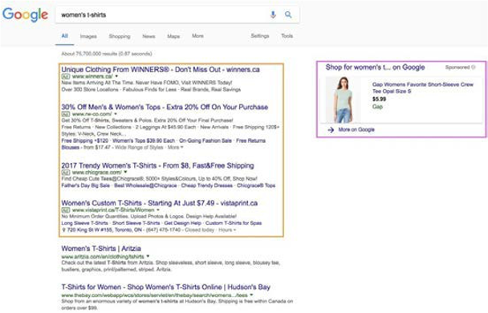

# 搜尋引擎最佳化(SEO)

搜尋引擎最佳化(SEO)工具可協助您根據特定關鍵字最佳化網站，讓網站在Google搜尋結果中排名較高。 Google會根據品牌是否已回答客戶提出的所有搜尋問題來排名網站。 客戶在Google上搜尋某些專案時，會找到不同型別的結果。 以下各節將說明這些結果。

## 未付款

檢視下圖中的結果（以紅色概述）：

## 已付費

檢視下圖中的結果，結果以橘色概述：

>[!NOTE]
>
>紫色中的Google購物概述。

## 策略

SEO策略包括：

- **關鍵字搜尋** — 客戶用來搜尋的關鍵字

- **網站架構** — 對關鍵字進行研究

- **SEO （技術）** — 確保SEO對網站進行編目

- **頁面上的SEO** — 中繼標籤和內容可用來吸引客戶

- **Analytics** — 用來追蹤SEO的工具，例如Google Analytics

B2B SEO促銷活動旨在提升品牌認知度並創造銷售機會，進而提高轉換率。 B2C SEO行銷活動旨在吸引訪客立即購買。 SEO在B2B與B2C企業中有不同的用途和影響。 SEO有助於增加您網站的流量，進而提升銷售額和ROI。 設定簡單的SEO策略以獲得競爭優勢。
