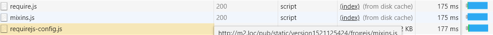

# 進階[!DNL JavaScript]組合

整合[!DNL JavaScript]模組以獲得更優異的效能，就是要減少兩件事：

1. 伺服器要求的數目。
1. 這些伺服器要求的大小。

在模組化應用程式中，伺服器要求的數量可能會高達數百個。 例如，下列熒幕擷取畫面僅顯示載入全新安裝首頁的[!DNL JavaScript]模組清單的開頭。


## 合併與捆綁

[!DNL Commerce]可立即提供兩種方法來減少伺服器要求數目：合併和捆綁。 這些設定預設為關閉。 您可以在&#x200B;**[!UICONTROL Stores]** > **設定** > **[!UICONTROL Configuration]** > **[!UICONTROL Advanced]** > **[!UICONTROL Developer]** > **[!UICONTROL [!DNL JavaScript] Settings]**&#x200B;中的管理員UI中，或從命令列將其開啟。


### 基本組合

若要從命令列啟用內建組合：

```bash
php -f bin/magento config:set dev/js/enable_js_bundling 1
```

這是原生[!DNL Commerce]機制，結合系統中存在的所有資產，並將它們分散到大小相同的組合(bundle_0.js、bundle_1.js ... bundle_x.js)中：

![[!DNL Commerce]組合](../assets/performance/images/magentoBundling.png)

更好，但瀏覽器仍會載入所有[!DNL JavaScript]套裝，而不只是所需的套裝。

[!DNL Commerce]套件組合可減少每頁的連線數量，但對於每頁請求，它會載入所有套件組合，即使請求的頁面可能僅取決於一或兩個套件組合中的檔案。 在瀏覽器快取套件組合後，效能會有所改善。 但是，由於瀏覽器同步載入這些組合，使用者第一次造訪[!DNL Commerce]店面可能需要一點時間才能呈現，並損害使用者體驗。

### 基本合併

若要從命令列啟用內建合併：

```bash
php -f bin/magento config:set dev/js/merge_files 1
```

此命令會將所有同步[!DNL JavaScript]檔案合併到一個檔案中。 啟用合併而不啟用繫結沒有用處，因為[!DNL Commerce]使用RequireJS。 如果未啟用整合，[!DNL Commerce]只會合併RequireJS及其組態。 當您同時啟用組合和合併時，[!DNL Commerce]會建立單一[!DNL JavaScript]檔案：


## 真實世界的演算時間

在開發環境中，之前的套件和合併載入時間看起來很棒。 但在現實世界中，許多因素都會拖慢呈現速度：連線速度緩慢、連線臨界值過大、網路有限。 此外，行動裝置的呈現速度不如桌上型電腦。

若要測試和準備您的店面部署以進行實際作業，建議您使用Chrome的原生節流設定檔「緩慢3G」進行測試。 透過Slow 3G，我們先前提供的輸出時間現在反映了許多使用者的連線實際情況：


在慢速3G連線中，載入全新安裝[!DNL Commerce]之首頁的所有套件組合大約需要44秒。

將組合合併到單一檔案中也是同樣的情形。 使用者仍可等待約42秒才開始載入頁面，如下所示：


使用更進階的[!DNL JavaScript]套件組合方法，我們可以改善這些載入時間。

## 進階套裝

請記住，[!DNL JavaScript]套裝的目標是減少瀏覽器中載入之每個頁面的請求資產數目與大小。 為此，我們想要建立套件組合，讓商店中的每個頁面只需要下載通用的套件組合，以及每個存取頁面的頁面特定套件組合。

其中一個方法是依頁面型別定義您的組合。 您可以將[!DNL Commerce]的頁面分類為數種頁面型別，包括「類別」、「產品」、「CMS」、「客戶」、「購物車」和「結帳」。 分類為其中一種頁面型別的每個頁面都有一組不同的RequireJS模組相依性。 當您依頁面型別捆綁RequireJS模組時，您最後將只有少數捆綁包涵蓋存放區中任何頁面的相依性。

例如，您最終可能會有適用於所有頁面的通用相依性的套件、適用於僅限CMS頁面的套件、適用於僅限目錄頁面的套件、適用於僅限搜尋頁面的另一個套件，以及適用於結帳頁面的套件。

您也可以依用途建立組合：用於一般功能、產品相關功能、送貨功能、結帳功能、稅金及表單驗證。 如何定義您的套件組合取決於您和商店的結構。 您可能會發現某些套件組合策略的效果優於其他策略。

乾淨的[!DNL Commerce]安裝可讓您透過依頁面型別分割套件組合，達到足夠的良好效能，但某些自訂可能需要更深入的分析和其他資產分配。

### 必要工具

下列步驟需要您安裝並熟悉下列工具：

- [nodejs](https://nodejs.org/en/download/)
- [r.js](http://requirejs.org/docs/optimization.html#download)
- [[!DNL PhantomJS]](https://phantomjs.org/) （選擇性）

### 程式碼範例

本文中使用的範常式式碼完整版本可在此處取得：

- [build.js](../assets/performance/code-samples/build.js)
- [deps.js](../assets/performance/code-samples/deps.js)
- [deps-map.sh](../assets/performance/code-samples/deps-map.sh.txt)

### 第1部分：建立套件組合設定

#### 1\. 新增build.js檔案

在`build.js`根目錄中建立[!DNL Commerce]檔案。 此檔案將包含您的套件組合的完整組建組態。

```javascript
({
    optimize: 'none',
    inlineText: true
})
```

稍後，我們將將`optimize:`設定從_ `none`變更為`uglify2`以縮小組合輸出。 但就目前而言，在開發期間，您可以將其設為`none`以確保更快的建置。

#### 2\. 新增RequireJS相依性、填料、路徑和對應

將下列RequireJS組建組態節點`deps`、`shim`、`paths`和`map`新增至您的組建檔案：

```javascript
({
    optimize: 'none',
    inlineText: true,

    deps: [],
    shim: {},
    paths: {},
    map: { "*": {} },
})
```

#### 3\. 彙總requirejs-config.js例項值

在此步驟中，您需要將所有存放區`deps`檔案中的多個`shim`、`paths`、`map`和`requirejs-config.js`設定節點彙總至`build.js`檔案中的對應節點。 若要這麼做，您可以在瀏覽器的「開發人員工具」面板中開啟&#x200B;**[!UICONTROL Network]**&#x200B;標籤，並導覽至商店中的任何頁面，例如首頁。 在「網路」標籤中，您會在頂端附近看到商店的`requirejs-config.js`檔案執行個體，並在這裡反白顯示：



在此檔案中，您會找到每個設定節點(`deps`、`shim`、`paths`、`map`)的多個專案。 您需要將這些多個節點值彙總到您的build.js檔案的單一設定節點中。 例如，如果存放區的`requirejs-config.js`執行個體有15個不同`map`節點的專案，您需要將所有15個節點的專案合併到`map`檔案中的單一`build.js`節點。 `deps`、`shim`和`paths`節點也會有相同情況。 如果沒有指令碼來自動化此程式，則可能需要時間。

您必須將路徑`mage/requirejs/text`變更為`requirejs/text`設定節點中的`paths`，如下所示：

```javascript
({
    //...
    paths: {
        //...
        "text": "requirejs/text"
    },
})
```

#### 4\. 新增模組節點

在`build.js`檔案的結尾處，新增模組[]陣列作為稍後您將為店面定義的套裝的預留位置。

```javascript
({
    optimize: 'none',
    inlineText: true,

    deps: [],
    shim: {},
    paths: {},
    map: { "*": {} },

    modules: [],
})
```

#### 5\. 擷取RequireJS相依性

您可以使用下列方式，從存放區的頁面型別擷取所有[!DNL RequireJS]模組相依性：

1. 命令列[!DNL PhantomJS] （假設您已安裝[!DNL PhantomJS]）。
1. 瀏覽器主控台中的RequireJS命令。

#### 若要使用[!DNL PhantomJS]：

在[!DNL Commerce]根目錄中，建立名為`deps.js`的新檔案，並複製下列程式碼。 此程式碼使用[！DNL [!DNL PhantomJS]]開啟頁面，並等待瀏覽器載入所有頁面資產。 然後輸出指定頁面的所有[!DNL RequireJS]相依性。

```javascript
"use strict";
var page = require('webpage').create(),
    system = require('system'),
    address;

if (system.args.length === 1) {
    console.log('Usage: $phantomjs deps.js url');
    phantom.exit(1);
} else {
    address = system.args[1];
    page.open(address, function (status) {
        if (status !== 'success') {
            console.log('FAIL to load the address');
        } else {
            setTimeout(function () {
                console.log(page.evaluate(function () {
                    return Object.keys(window.require.s.contexts._.defined);
                }));
                phantom.exit();
            }, 5000);
        }
    });
}
```

開啟[!DNL Commerce]根目錄內的終端機，並對存放區中代表特定頁面型別的每個頁面執行指令碼：

<pre>
phantomjs deps.js <i>url-to-specific-page</i> &gt; <i>text-file-reporting-pagetype-dependencies</i>
</pre>

例如，以下是Luma主題範例商店中的四個頁面，代表我們將用來建立四個組合（首頁、類別、產品、購物車）的四個頁面型別：

```
phantomjs deps.js http://m2.loc/ > bundle/homepage.txt
phantomjs deps.js http://m2.loc/women/tops-women/jackets-women.html > bundle/category.txt
phantomjs deps.js http://m2.loc/beaumont-summit-kit.html > bundle/product.txt
phantomjs deps.js http://m2.loc/checkout/cart/?SID=m2tjdt7ipvep9g0h8pmsgie975 > bundle/cart.txt (prepare a shopping cart)
..............
```

#### 若要使用瀏覽器主控台：

如果您不想要使用[!DNL PhantomJS]，您可以在檢視店面的每個頁面型別時，從瀏覽器的主控台執行下列命令：

```shell
Object.keys(window.require.s.contexts._.defined)
```

這個命令（用於[!DNL PhantomJS]指令碼中）會建立相同的[!DNL RequireJS]相依性清單，並在瀏覽器的主控台中顯示它們。 此方法的缺點是，您必須建立自己的組合/頁面型別文字檔。

#### 6\. 格式化並篩選輸出

將[!DNL RequireJS]相依性合併為頁面型別文字檔案後，您可以對每個頁面型別相依性檔案使用以下命令，將檔案中的逗號取代為新行：

```bash
sed -i -e $'s/,/\\\n/g' bundle/category.txt
sed -i -e $'s/,/\\\n/g' bundle/homepage.txt
sed -i -e $'s/,/\\\n/g' bundle/product.txt
....
```

您也應該移除每個檔案的所有mixin，因為mixin重複相依性。 對每個相依性檔案使用以下指令：

```bash
sed -i -e 's/mixins\!.*$//g' bundle/homepage.txt
sed -i -e 's/mixins\!.*$//g' bundle/category.txt
sed -i -e 's/mixins\!.*$//g' bundle/product.txt
...
```

#### 7\. 識別唯一和常見的組合

目標是建立所有頁面所需的[!DNL JavaScript]個檔案的共同組合。 如此一來，瀏覽器只需要載入通用套件組合以及一或多個特定頁面型別。

在[!DNL Commerce]根目錄中開啟終端機，並使用下列命令來確認您是否有相依性可以分割成個別的組合：

```bash
sort bundle/*.txt |uniq -c |sort -n
```

這個命令會合併和排序在`bundle/*.txt`檔案中找到的相依性。  輸出也顯示包含每個相依性的檔案數：

```
1 buildTools,
1 jquery/jquery.parsequery,
1 jsbuild,
2 jquery/jquery.metadata,
2 jquery/validate,
2 mage/bootstrap,
3 jquery
3 jquery/ui
3 knockoutjs/knockout
...
```

此輸出顯示`buildTools`只在bundle/*.txt檔案之一中是相依性。 `jquery/jquery.metadata`相依性位於兩(2)個檔案中，`es6-collections`位於三(3)個檔案中。

我們的輸出僅顯示三種頁面型別（首頁、類別和產品），這會告訴我們：

- 只有一種頁面型別有三種相依性（由數字1顯示）。
- 兩種頁面型別還會發生三種相依性（如數字2所示）。
- 最後三個相依性對於我們的全部三個頁面型別都是共同的（由數字3顯示）。

這告訴我們，一旦我們知道哪些頁面型別需要哪些相依性，就可以將相依性分割為不同的套件，藉此提高存放區的頁面載入速度。

#### 8\. 建立相依性發佈檔案

若要找出哪些頁面型別需要哪些相依性，請在[!DNL Commerce]根目錄中建立一個名為`deps-map.sh`的新檔案，並複製下列程式碼：

```shell
awk 'END {
 for (R in rec) {
   n = split(rec[R], t, "/")
   if (n > 1)
     dup[n] = dup[n] ? dup[n] RS sprintf("\t%-20s -->\t%s", rec[R], R) : \
       sprintf("\t%-20s -->\t%s", rec[R], R)
   }
 for (D in dup) {
   printf "records found in %d files:\n\n", D
   printf "%s\n\n", dup[D]
   }
 }
{
 rec[$0] = rec[$0] ? rec[$0] "/" FILENAME : FILENAME
}' bundle/*.txt
```

您也可以在[https://www.unix.com/shell-programming-and-scripting/140390-get-common-lines-multiple-files.html](https://www.unix.com/shell-programming-and-scripting/140390-get-common-lines-multiple-files.html)找到指令碼

在[!DNL Commerce]根目錄中開啟終端機並執行檔案：

```bash
bash deps-map.sh
```

此指令碼的輸出套用至我們的三個範例頁面型別，看起來應該像這樣（但時間更長）：

```
bundle/product.txt   -->   buildTools,
bundle/category.txt  -->   jquery/jquery.parsequery,
bundle/product.txt   -->   jsbuild,

bundle/category.txt/bundle/homepage.txt -->    jquery/jquery.metadata,
bundle/category.txt/bundle/homepage.txt -->    jquery/validate,
bundle/category.txt/bundle/homepage.txt -->    mage/bootstrap,

bundle/category.txt/bundle/homepage.txt/bundle/product.txt --> jquery,
bundle/category.txt/bundle/homepage.txt/bundle/product.txt --> jquery/ui,
bundle/category.txt/bundle/homepage.txt/bundle/product.txt --> knockoutjs/knockout,
```

這些資訊足以建置套件組合設定。

#### 9\. 在您的build.js檔案中建立套件組合

開啟`build.js`設定檔並將您的組合新增至`modules`節點。 每個束都應該定義以下屬性：

- `name` — 組合的名稱。 例如，`bundles/cart`的名稱會在`cart.js`子目錄中產生`bundles`組合。

- `create` — 建立組合包的布林值標幟（值： `true`或`false`）。

- `include` — 包含作為頁面相依性的一組資產（字串）。 RequireJS會追蹤所有相依性，並將它們包含在套件中（除非排除）。

- `exclude` — 要從套件組合排除的套件組合或資產陣列。

```javascript
{
    name: 'bundles/catalog',
    create: true,
    include: [
        'addToWishlist',
        'priceBundle',
        'priceUtils',
        'priceOptions',
        'sticky',
        'productSummary',
        'slide'
    ],
    exclude: [
        'requirejs/require',
        'bundles/default',
        'mage/bootstrap'
    ],
}
```

此範例會重複使用`mage/bootstrap`和`requirejs/require`資產，對其必須同步載入的最重要元件和元件賦予較高的優先順序。 呈現的套件組合包括：

- `requirejs/require` — 唯一同步載入的組合
- `mage/bootstrap` — 具有UI元件的啟動程式套件
- `bundles/default` — 所有頁面都需要預設套件組合
- `bundles/cart` — 購物車頁面所需的套件組合
- `bundles/shipping` — 購物車與結帳頁面的通用套件組合（假設從未直接開啟結帳，如果先前已開啟購物車頁面且已載入配送套件組合，則結帳頁面載入速度會更快）
- `bundles/checkout` — 所有要簽出的專案
- `bundles/catalog` — 產品和類別頁面的一切

### 第2部分：產生組合

下列步驟說明產生更有效率[!DNL Commerce]套裝的基本程式。 您可以透過任何想要的方式自動化此程式，但您仍需使用`nodejs`和`r.js`才能實際產生您的組合。 如果您的主題具有與[!DNL JavaScript]相關的自訂，且無法重複使用相同的`build.js`檔案，則可能需要為每個主題建立數個`build.js`設定。

#### 1.產生靜態存放區網站

在產生套件組合之前，請執行靜態部署命令：

```bash
php -f bin/magento setup:static-content:deploy -f -a frontend
```

這個命令會為您設定的每個主題和地區設定產生靜態存放區部署。 例如，如果您使用Luma主題和自訂主題搭配英文和法文語言環境，則會產生四個靜態部署：

- ...luma/en_US
- ...luma/fr_FR
- ...custom/en_US
- ...custom/fr_FR

若要產生所有商店主題與地區設定的組合，請對每個商店主題與地區設定重複下列步驟。

#### 2.將靜態存放區內容移至暫存目錄

首先，您必須將靜態內容從目標目錄移至某個暫存目錄，因為RequireJS會取代目標目錄中的所有內容。

```bash
mv pub/static/frontend/Magento/{theme}/{locale} pub/static/frontend/Magento/{theme}/{locale}_tmp
```

例如：

```bash
mv pub/static/frontend/Magento/luma/en_US pub/static/frontend/Magento/luma/en_US_tmp
```

#### 3.執行r.js最佳化程式

然後從`build.js`的根目錄對[!DNL Commerce]檔案執行r.js最佳化程式。 所有目錄和檔案的路徑都相對於工作目錄。

```bash
r.js -o build.js baseUrl=pub/static/frontend/Magento/luma/en_US_tmp dir=pub/static/frontend/Magento/luma/en_US
```

此命令在目標目錄的`bundles`子目錄中產生組合，在此情況下會產生`pub/static/frontend/Magento/luma/en_US/bundles`。

列出新組合目錄的內容可能如下所示：

```bash
ll pub/static/frontend/Magento/luma/en_US/bundles
```

```
total 1900
drwxr-xr-x  2 root root    4096 Mar 28 11:24 ./
drwxr-xr-x 70 root root    4096 Mar 28 11:24 ../
-rw-r--r--  1 root root  116417 Mar 28 11:24 cart.js
-rw-r--r--  1 root root  187090 Mar 28 11:24 catalog.js
-rw-r--r--  1 root root  307619 Mar 28 11:24 checkout.js
-rw-r--r--  1 root root 1240608 Mar 28 11:24 default.js
-rw-r--r--  1 root root   74233 Mar 28 11:24 shipping.js
```

#### 4.設定RequireJS使用套件組合

若要讓RequireJS使用您的組合，請在`onModuleBundleComplete`檔案中的`modules`節點之後新增`build.js`回呼：

```javascript
[
    {
       //...
       exclude: [
           'requirejs/require',
           'bundles/default',
           'bundles/checkout',
           'bundles/cart',
           'bundles/shipping',
           'mage/bootstrap'
       ],
   },
],
bundlesConfigOutFile: `${config.dir}/requirejs-config.js`,
onModuleBundleComplete: function(data) {
    if (this.bundleConfigAppended) {
        return;
    }
    this.bundleConfigAppended = true;

    // bundlesConfigOutFile requires a simple require.config call in order to modify the configuration
    const bundleConfigPlaceholder = `
(function (require) {
require.config({});
})(require);
    `;

    fs.appendFileSync(this.bundlesConfigOutFile, bundleConfigPlaceholder);
}
```

#### 5.重新執行部署命令

執行以下命令以部署：

```bash
r.js -o app/design/frontend/Magento/luma/build.js baseUrl=pub/static/frontend/Magento/luma/en_US_tmp dir=pub/static/frontend/Magento/luma/en_US
```

開啟`requirejs-config.js`目錄中的`pub/static/frontend/Magento/luma/en_US`，以驗證RequireJS是否已將檔案附加至套件組合組態呼叫：

```javascript
require.config({
    bundles: {
        "bundles/default": ["mage/template", "mage/apply/scripts", "mage/apply/main", "mage/mage", "mage/translate", "mage/loader"],
        "bundles/cart": ["Magento_Ui/js/lib/validation/utils", "Magento_Ui/js/lib/validation/rules", "Magento_Ui/js/lib/validation/validation"]
    }
}
```

>[!NOTE]
>
>設定套件組合時，請務必依照您要執行的順序放置`requirejs.config()`呼叫，因為這些呼叫的執行順序與其出現的順序相同。

#### 6.測試結果

頁面載入後，請注意瀏覽器載入不同的相依性和套件組合。 例如，以下是「慢3G」設定檔的結果：


空白首頁的頁面載入時間現在比使用原生[!DNL Commerce]套裝快兩倍。 但是我們可以做得更好。

#### 7.最佳化組合

即使gzipped，[!DNL JavaScript]檔案仍然很大。 使用RequireJS來縮制這些值，這使用精簡字元來縮制[!DNL JavaScript]以取得良好的結果。

若要在您的`build.js`檔案中啟用最佳化工具，請在`uglify2`檔案頂端新增`build.js`作為最佳化屬性的值：

```javascript
({
    optimize: 'uglify2',
    inlineText: true
})
```

結果可能會相當可觀：


載入時間現在比使用原生[!DNL Commerce]套件組合快三倍。
