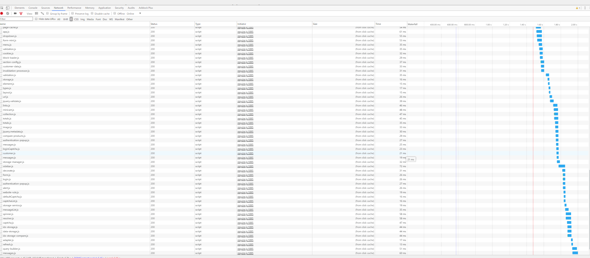

# 高級 [!DNL JavaScript] 捆綁

捆綁 [!DNL JavaScript] 模組用於提高效能，主要是減少兩方面：

1. 伺服器請求數。
1. 這些伺服器請求的大小。

在模組化應用程式中，伺服器請求數可達數百個。 例如，以下螢幕抓圖僅顯示清單的開頭 [!DNL JavaScript] 已載入到全新安裝的首頁上的模組。



## 合併和捆綁

出局了， [!DNL Commerce] 提供了兩種減少伺服器請求數的方法：合併和捆綁。 預設情況下，這些設定將關閉。 您可以在管理員UI中開啟 **[!UICONTROL Stores]** > **設定** > **[!UICONTROL Configuration]** > **[!UICONTROL Advanced]** > **[!UICONTROL Developer]** > **[!UICONTROL [!DNL JavaScript] Settings]**&#x200B;或命令行。


### 基本捆綁

要從命令行啟用內置綁定：

```bash
php -f bin/magento config:set dev/js/enable_js_bundling 1
```

這是本地 [!DNL Commerce] 將系統中存在的所有資產合併並將它們分佈在相同大小的捆綁包(bundle_0.js、bundle_1.js)中的機制……bundle_x.js:

![[!DNL Commerce] 捆綁](../assets/performance/images/magentoBundling.png)

更好，但瀏覽器仍然載入 [!DNL JavaScript] 捆紮，不只是需要的。

[!DNL Commerce] 捆綁可減少每頁的連接數，但對於每頁請求，它會載入所有捆綁，即使請求的頁可能只依賴於其中一個或兩個捆綁中的檔案。 瀏覽器快取捆綁包後，效能會提高。 但是，由於瀏覽器同步載入這些包，因此用戶首次訪問 [!DNL Commerce] storefront可能需要一段時間來渲染並破壞用戶體驗。

### 基本合併

要從命令行啟用內置合併：

```bash
php -f bin/magento config:set dev/js/merge_files 1
```

此命令合併所有同步 [!DNL JavaScript] 檔案到一個檔案中。 在不啟用綁定的情況下啟用合併並不有用，因為 [!DNL Commerce] 使用RequireJS。 如果不啟用捆綁， [!DNL Commerce] 僅合併RequireJS及其配置。 啟用捆綁和合併時， [!DNL Commerce] 建立單個 [!DNL JavaScript] 檔案：


## 真實世界渲染時間

在開發環境中，以前捆綁和合併的負載時間看起來非常好。 但在現實世界中，許多事情都會減緩渲染速度：連接速度慢，連接閾值大，網路有限。 此外，移動設備的呈現速度不如台式機。

為了test和準備面向真實世界的店面部署，我們建議您使用Chrome的本機限制配置檔案「慢速3G」進行test。 使用慢速3G，我們以前的捆綁輸出時間現在反映了許多用戶的連接現實：


在慢速3G連接時，為乾淨的首頁載入所有捆綁包需要大約44秒 [!DNL Commerce] 安裝。

將束合併到單個檔案時也是如此。 用戶仍可以等待大約42秒來載入初始頁面，如下所示：


採用更先進的方法 [!DNL JavaScript] 捆紮，可以提高這些負載時間。

## 高級捆綁

記住，我的目標 [!DNL JavaScript] 捆綁是為瀏覽器中載入的每頁減少請求資產的數量和大小。 為此，我們希望構建我們的捆綁包，以便我們商店中的每個頁面只需為訪問的每個頁面下載一個公用捆綁包和一個特定於頁面的捆綁包。

實現這一點的一種方法是按頁面類型定義捆綁包。 您可以對 [!DNL Commerce]將頁面分為幾種頁面類型，包括類別、產品、CMS、客戶、購物車和結帳。 分類到這些頁面類型之一的每個頁面都有一組不同的RequireJS模組依賴項。 按頁面類型捆綁RequireJS模組時，最終只會有少量捆綁，這些捆綁覆蓋了您商店中任何頁面的依賴關係。

例如，您最終可能會使用適用於所有頁面的通用依賴關係的捆綁包、適用於CMS頁面的捆綁包、適用於僅目錄頁面的捆綁包、適用於僅搜索頁面的另一個捆綁包，以及適用於簽出頁面的捆綁包。

您還可以按用途建立包：有關常用功能、產品相關功能、發運功能、結帳功能、稅和表單驗證。 如何定義捆綁包取決於您和商店的結構。 您可能會發現，一些捆綁策略會比其他策略更有效。

清潔 [!DNL Commerce] 通過按頁面類型拆分捆綁包，安裝可以獲得足夠的良好效能，但某些定制可能需要更深入的分析和其他資產分配。

### 所需工具

以下步驟要求您安裝並熟悉以下工具：

- [諾德](https://nodejs.org/en/download/)
- [r.js](http://requirejs.org/docs/optimization.html#download)
- [[!DNL PhantomJS]](http://phantomjs.org/) （可選）

### 示例代碼

本文中使用的示例代碼的完整版本可從以下站點獲得：

- [build.js](../assets/performance/code-samples/build.js)
- [deps.js](../assets/performance/code-samples/deps.js)
- [deps-map.sh](../assets/performance/code-samples/deps-map.sh.txt)

### 第1部分：建立捆綁配置

#### 1\ 添加build.js檔案

建立 `build.js` 檔案 [!DNL Commerce] 根目錄。 此檔案將包含捆綁包的整個生成配置。

```javascript
({
    optimize: 'none',
    inlineText: true
})
```

稍後，我們將更改 `optimize:` 設定自_ `none` 至 `uglify2` 以縮小束輸出。 但就目前而言，在開發過程中，你可以讓它 `none` 確保更快的生成。

#### 2\。 添加RequireJS依賴項、shims、路徑和映射

添加以下RequireJS生成配置節點， `deps`。 `shim`。 `paths`, `map`，到生成檔案：

```javascript
({
    optimize: 'none',
    inlineText: true,

    deps: [],
    shim: {},
    paths: {},
    map: { "*": {} },
})
```

#### 3\。 聚合requirejs-config.js實例值

在此步驟中，您需要聚合所有 `deps`。 `shim`。 `paths`, `map` 儲存中的配置節點 `requirejs-config.js` 檔案到您的 `build.js` 的子菜單。 為此，您可以開啟 **[!UICONTROL Network]** 頁籤，然後導航至您商店中的任何頁面，如首頁。 在「網路」頁籤中，您將看到您商店的 `requirejs-config.js` 檔案靠近頂部，此處突出顯示：


在此檔案中，您將為每個配置節點找到多個條目(`deps`。 `shim`。 `paths`。 `map`)。 您需要將這些多個節點值聚合到build.js檔案的單個配置節點中。 例如，如果你的店 `requirejs-config.js` 實例包含15個單獨的條目 `map` 節點，需要將所有15個節點的條目合併到單個節點中 `map` 節點 `build.js` 的子菜單。 對於 `deps`。 `shim`, `paths` 節點。 如果沒有指令碼來自動化此過程，可能需要時間。

您需要更改路徑 `mage/requirejs/text` 至 `requirejs/text` 在 `paths` 配置節點，如下所示：

```javascript
({
    //...
    paths: {
        //...
        "text": "requirejs/text"
    },
})
```

#### 4\。 添加模組節點

在 `build.js` 檔案，添加模組[] array（陣列），作為稍後為storefront定義的捆綁包的佔位符。

```javascript
({
    optimize: 'none',
    inlineText: true,

    deps: [],
    shim: {},
    paths: {},
    map: { "*": {} },

    modules: [],
})
```

#### 5\。 檢索RequireJS依賴項

可以檢索 [!DNL RequireJS] 通過以下方式從儲存的頁面類型中獲取模組依賴關係：

1. [!DNL PhantomJS] 從命令行(假定 [!DNL PhantomJS] 安裝)。
1. 瀏覽器控制台中的RequireJS命令。

#### 要使用 [!DNL PhantomJS]:

在 [!DNL Commerce] 根目錄，建立名為 `deps.js` 並複製下面的代碼。 此代碼使用[!DNL [!DNL PhantomJS]]開啟頁面並等待瀏覽器載入所有頁面資產。 然後輸出所有 [!DNL RequireJS] 給定頁的依賴關係。

```javascript
"use strict";
var page = require('webpage').create(),
    system = require('system'),
    address;

if (system.args.length === 1) {
    console.log('Usage: $phantomjs deps.js url');
    phantom.exit(1);
} else {
    address = system.args[1];
    page.open(address, function (status) {
        if (status !== 'success') {
            console.log('FAIL to load the address');
        } else {
            setTimeout(function () {
                console.log(page.evaluate(function () {
                    return Object.keys(window.require.s.contexts._.defined);
                }));
                phantom.exit();
            }, 5000);
        }
    });
}
```

在 [!DNL Commerce] 根目錄，並針對儲存中表示特定頁面類型的每個頁面運行指令碼：

<pre>
凡通斯 <i>特定頁</i> &gt; <i>文本檔案 — 表示頁面類型依賴項</i>
</pre>

例如，下面是Luma主題樣品商店的四頁，這些頁面代表我們將用來建立四個捆綁包（首頁、類別、產品、購物車）的四種頁面類型：

```terminal
phantomjs deps.js http://m2.loc/ > bundle/homepage.txt
phantomjs deps.js http://m2.loc/women/tops-women/jackets-women.html > bundle/category.txt
phantomjs deps.js http://m2.loc/beaumont-summit-kit.html > bundle/product.txt
phantomjs deps.js http://m2.loc/checkout/cart/?SID=m2tjdt7ipvep9g0h8pmsgie975 > bundle/cart.txt (prepare a shopping cart)
..............
```

#### 要使用瀏覽器控制台：

如果你不想 [!DNL PhantomJS]，在瀏覽庫面中查看每種頁面類型時，可以從瀏覽器控制台運行以下命令：

```shell
Object.keys(window.require.s.contexts._.defined)
```

此命令(在 [!DNL PhantomJS] 指令碼)建立相同的清單 [!DNL RequireJS] 從屬關係，並在瀏覽器控制台中顯示它們。 此方法的缺點是您必須建立自己的捆綁/頁面類型文本檔案。

#### 6\。 格式化和篩選輸出

合併後 [!DNL RequireJS] 從屬關係到頁面類型文本檔案中，可以在每個頁面類型從屬關係檔案上使用以下命令，將檔案中的逗號替換為新行：

```terminal
sed -i -e $'s/,/\\\n/g' bundle/category.txt
sed -i -e $'s/,/\\\n/g' bundle/homepage.txt
sed -i -e $'s/,/\\\n/g' bundle/product.txt
....
```

還應刪除每個檔案的所有混合，因為混合會重複依賴關係。 對每個依賴關係檔案使用以下命令：

```terminal
sed -i -e 's/mixins\!.*$//g' bundle/homepage.txt
sed -i -e 's/mixins\!.*$//g' bundle/category.txt
sed -i -e 's/mixins\!.*$//g' bundle/product.txt
...
```

#### 7\。 識別唯一和通用的捆綁包

目標是建立 [!DNL JavaScript] 所有頁面所需的檔案。 這樣，瀏覽器只需載入公用包以及一個或多個特定頁面類型。

在 [!DNL Commerce] 根目錄，並使用以下命令驗證是否具有可拆分為單獨束的依賴關係：

```bash
sort bundle/*.txt |uniq -c |sort -n
```

此命令合併和排序在 `bundle/*.txt` 的子菜單。  輸出還顯示包含每個依賴關係的檔案數：

```terminal
1 buildTools,
1 jquery/jquery.parsequery,
1 jsbuild,
2 jquery/jquery.metadata,
2 jquery/validate,
2 mage/bootstrap,
3 jquery
3 jquery/ui
3 knockoutjs/knockout
...
```

此輸出顯示 `buildTools` 只有一個bundle/*.txt檔案中存在依賴關係。 的 `jquery/jquery.metadata` 依賴項位於兩(2)個檔案中 `es6-collections` 在三(3)個檔案中。

我們的輸出僅顯示三種頁面類型（首頁、類別和產品），它告訴我們：

- 三個依賴項僅對一種頁面類型唯一（由數字1顯示）。
- 另外還有三種依賴關係發生在兩種頁面類型上（如數字2所示）。
- 最後三個相關性是我們所有三種頁面類型（如數字3所示）的共性。

這告訴我們，一旦我們知道哪些頁面類型需要哪些依賴項，就可以將依賴項拆分為不同的捆綁包，從而可以提高我們商店的頁面載入速度。

#### 8\。 建立依賴項分佈檔案

要瞭解哪些頁類型需要哪些依賴項，請在 [!DNL Commerce] 根目錄 `deps-map.sh` 並複製以下代碼：

```shell
awk 'END {
 for (R in rec) {
   n = split(rec[R], t, "/")
   if (n > 1)
     dup[n] = dup[n] ? dup[n] RS sprintf("\t%-20s -->\t%s", rec[R], R) : \
       sprintf("\t%-20s -->\t%s", rec[R], R)
   }
 for (D in dup) {
   printf "records found in %d files:\n\n", D
   printf "%s\n\n", dup[D]
   }
 }
{
 rec[$0] = rec[$0] ? rec[$0] "/" FILENAME : FILENAME
}' bundle/*.txt
```

您也可以在以下位置找到指令碼： [https://www.unix.com/shell-programming-and-scripting/140390-get-common-lines-multiple-files.html](https://www.unix.com/shell-programming-and-scripting/140390-get-common-lines-multiple-files.html)

在 [!DNL Commerce] 根目錄並運行檔案：

```bash
bash deps-map.sh
```

此指令碼的輸出應用於我們的三個示例頁面類型，應該類似於以下內容（但要長得多）:

```terminal
bundle/product.txt   -->   buildTools,
bundle/category.txt  -->   jquery/jquery.parsequery,
bundle/product.txt   -->   jsbuild,

bundle/category.txt/bundle/homepage.txt -->    jquery/jquery.metadata,
bundle/category.txt/bundle/homepage.txt -->    jquery/validate,
bundle/category.txt/bundle/homepage.txt -->    mage/bootstrap,

bundle/category.txt/bundle/homepage.txt/bundle/product.txt --> jquery,
bundle/category.txt/bundle/homepage.txt/bundle/product.txt --> jquery/ui,
bundle/category.txt/bundle/homepage.txt/bundle/product.txt --> knockoutjs/knockout,
```

這些資訊足以構建捆綁包配置。

#### 9\。 在build.js檔案中建立捆綁包

開啟 `build.js` 配置檔案，並將包添加到 `modules` 的下界。 每個束應定義以下屬性：

- `name` — 包的名稱。 例如， `bundles/cart` 生成 `cart.js` 捆綁在 `bundles` 子目錄。

- `create` — 用於建立捆綁包的布爾標誌(值： `true` 或 `false`)。

- `include` — 包含作為頁面依賴項的資產（字串）陣列。 RequireJS跟蹤所有依賴關係，並將它們包括在捆綁包中，除非排除。

- `exclude` — 要從捆綁包中排除的捆綁包或資產的陣列。

```javascript
{
    name: 'bundles/catalog',
    create: true,
    include: [
        'addToWishlist',
        'priceBundle',
        'priceUtils',
        'priceOptions',
        'sticky',
        'productSummary',
        'slide'
    ],
    exclude: [
        'requirejs/require',
        'bundles/default',
        'mage/bootstrap'
    ],
}
```

此示例重用 `mage/bootstrap` 和 `requirejs/require` 對必須同步載入的最重要元件和元件給予更高優先順序。 存在的捆綁包包括：

- `requirejs/require` — 僅同步載入的束
- `mage/bootstrap` — 帶有UI元件的引導包
- `bundles/default` — 所有頁面所需的預設捆綁
- `bundles/cart` — 購物車頁所需的捆綁包
- `bundles/shipping` — 購物車和結帳頁的公用捆綁包（假定從未直接開啟結帳，如果以前開啟購物車頁且已裝運捆綁包，則結帳頁的載入速度會更快）
- `bundles/checkout` — 用於結帳的一切
- `bundles/catalog` — 產品和類別頁的所有內容

### 第二部分：生成捆綁包

以下步驟介紹了生成更高效的基本流程 [!DNL Commerce] 捆綁。 您可以以任何方式自動執行此過程，但仍需要使用 `nodejs` 和 `r.js` 來生成你的捆綁包。 如果你的主題 [!DNL JavaScript] — 相關的自定義項，無法重複使用 `build.js` 檔案，您可能需要建立 `build.js` 每個主題的配置。

#### 1。生成靜態儲存站點

在生成捆綁包之前，請運行靜態部署命令：

```bash
php -f bin/magento setup:static-content:deploy -f -a frontend
```

此命令為已設定的每個主題和區域設定生成靜態儲存部署。 例如，如果使用Luma主題和以英語和法語為語言環境的自定義主題，則將生成四個靜態部署：

- ...luma/en_US
- ...luma/fr_FR
- ...自定義/en_US
- ...custom/fr_FR

要為所有儲存主題和區域設定生成捆綁包，請為每個儲存主題和區域設定重複以下步驟。

#### 2.將靜態儲存內容移動到臨時目錄

首先，您需要將靜態內容從目標目錄移動到某個臨時目錄，因為RequireJS會替換目標目錄內的所有內容。

```bash
mv pub/static/frontend/Magento/{theme}/{locale} pub/static/frontend/Magento/{theme}/{locale}_tmp
```

例如：

```bash
mv pub/static/frontend/Magento/luma/en_US pub/static/frontend/Magento/luma/en_US_tmp
```

#### 3.運行r.js優化程式

然後在 `build.js` 檔案 [!DNL Commerce]的根目錄。 指向所有目錄和檔案的路徑都相對於工作目錄。

```bash
r.js -o build.js baseUrl=pub/static/frontend/Magento/luma/en_US_tmp dir=pub/static/frontend/Magento/luma/en_US
```

此命令在 `bundles` 目錄的子目錄，在本例中，將 `pub/static/frontend/Magento/luma/en_US/bundles`。

列出新捆綁目錄的內容可能如下所示：

```bash
ll pub/static/frontend/Magento/luma/en_US/bundles
```

```terminal
total 1900
drwxr-xr-x  2 root root    4096 Mar 28 11:24 ./
drwxr-xr-x 70 root root    4096 Mar 28 11:24 ../
-rw-r--r--  1 root root  116417 Mar 28 11:24 cart.js
-rw-r--r--  1 root root  187090 Mar 28 11:24 catalog.js
-rw-r--r--  1 root root  307619 Mar 28 11:24 checkout.js
-rw-r--r--  1 root root 1240608 Mar 28 11:24 default.js
-rw-r--r--  1 root root   74233 Mar 28 11:24 shipping.js
```

#### 4.配置RequireJS以使用捆綁包

要使RequireJS使用捆綁包，請添加 `onModuleBundleComplete` 回調後 `modules` 中的 `build.js` 檔案：

```javascript
[
    {
       //...
       exclude: [
           'requirejs/require',
           'bundles/default',
           'bundles/checkout',
           'bundles/cart',
           'bundles/shipping',
           'mage/bootstrap'
       ],
   },
],
bundlesConfigOutFile: `${config.dir}/requirejs-config.js`,
onModuleBundleComplete: function(data) {
    if (this.bundleConfigAppended) {
        return;
    }
    this.bundleConfigAppended = true;

    // bundlesConfigOutFile requires a simple require.config call in order to modify the configuration
    const bundleConfigPlaceholder = `
(function (require) {
require.config({});
})(require);
    `;

    fs.appendFileSync(this.bundlesConfigOutFile, bundleConfigPlaceholder);
}
```

#### 5.重新運行部署命令

運行以下命令以部署：

```bash
r.js -o app/design/frontend/Magento/luma/build.js baseUrl=pub/static/frontend/Magento/luma/en_US_tmp dir=pub/static/frontend/Magento/luma/en_US
```

開啟 `requirejs-config.js` 的 `pub/static/frontend/Magento/luma/en_US` 用於驗證RequireJS是否通過綁定配置調用附加了檔案的目錄：

```javascript
require.config({
    bundles: {
        "bundles/default": ["mage/template", "mage/apply/scripts", "mage/apply/main", "mage/mage", "mage/translate", "mage/loader"],
        "bundles/cart": ["Magento_Ui/js/lib/validation/utils", "Magento_Ui/js/lib/validation/rules", "Magento_Ui/js/lib/validation/validation"]
    }
}
```

>[!NOTE]
>
>配置捆綁包時，請確保 `requirejs.config()` 按您希望執行呼叫的順序執行呼叫，因為呼叫按照其顯示順序執行。

#### 6。Test結果

載入頁面後，請注意瀏覽器載入不同的依賴項和束。 例如，以下是「慢速3G」配置檔案的結果：


現在，空首頁的頁面載入時間是使用本機首頁的兩倍 [!DNL Commerce] 捆綁。 但我們可以做得更好。

#### 7。優化捆綁包

即使是拉鍊， [!DNL JavaScript] 檔案仍然很大。 使用RequireJS對它們進行微小化，該函式使用模糊符進行微小化 [!DNL JavaScript] 好結果。

在中啟用優化程式 `build.js` 檔案，添加 `uglify2` 作為位於 `build.js` 檔案：

```javascript
({
    optimize: 'uglify2',
    inlineText: true
})
```

結果可能非常顯著：


現在載入時間比本機載入快三倍 [!DNL Commerce] 捆綁。
