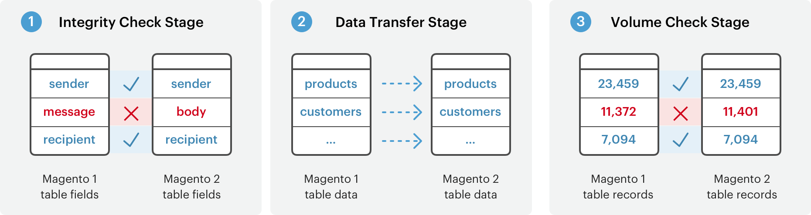

# 資料遷移的工作原理

本主題從較高的層次概述了如何使用Magento1將資料從Magento2遷移到 [!DNL Data Migration Tool]。

的 [!DNL Data Migration Tool] 是命令行介面(CLI)工具，用於將資料從Magento1傳輸到Magento2。 該工具驗證Magento1和2資料庫結構（表和欄位）之間的一致性，跟蹤資料傳輸進度，建立日誌，並運行資料驗證test。

## 術語

* **模式**  — 一組有序操作，用於將資料從Magento1.x遷移到Magento2.x。
* **步驟**  — 以定義要遷移的資料類型的模式執行的任務。
* **階段**  — 驗證、傳輸和驗證資料的步驟中的任務。
* **映射檔案** - XML檔案，用於定義Magento1.x和Magento2.x資料結構之間的規則和連接，以完成這些階段。

## 模式

的 [!DNL Data Migration Tool] 將遷移過程分為三個階段或 *模式* 以便將資料從Magento1.x傳輸到Magento2.x。此處列出了三種模式，必須按以下順序運行：

1. **設定模式**:遷移系統配置和網站相關設定。
1. **資料模式**:批量遷移資料庫資產。
1. **增量模式**:遷移增量更改（自上次運行以來的更改），如新客戶和訂單。

## 步驟

的 [!DNL Data Migration Tool] 使用 *步驟* 遷移特定類型的資料。 例如，在「設定」模式下，用於遷移所有設定資料的步驟有兩個：儲存步驟和設定步驟。 有關在這些步驟中（以及在其它模式中）遷移的特定資料的詳細資訊，請參見 [[!DNL Data Migration Tool] 技術規格](technical-specification.md)。

## 階段

每個步驟中有三個 *階段* 始終執行，以確保資料正確遷移：

1. **完整性檢查**:比較表欄位名稱、類型和其他資訊，以驗證Magento1和2資料結構之間的相容性。
1. **資料傳輸**:從Magento1和2按表傳送資料表。
1. **卷檢查**:比較表之間的記錄數以驗證傳輸是否成功。

## 映射檔案

在遷移過程的最低級別是XML *映射檔案*。 的 [!DNL Data Migration Tool] 在步驟的階段內使用映射檔案，在Magento1.x和2.x表之間轉換不同的資料結構。

例如，將資料從1.8.0.0Magento Open Source資料庫轉換為2.x.xMagento Open Source時，映射檔案將考慮表被更名的事實，並在目標資料庫中相應地更名表。 如果資料結構或資料格式沒有差異， [!DNL Data Migration Tool] 將其原樣（包括由擴展建立的表中的資料）傳輸到Magento2資料庫。

當差異未在映射檔案中聲明時， [!DNL Data Migration Tool] 顯示錯誤且未啟動。

[中將更詳細地討論映射檔案[!DNL Data Migration Tool] 技術指標]。

## 遷移流圖

<!-- Link definitions -->
[[!DNL Data Migration Tool] 技術指標]:技術規格.md

[Migration Modes]: ../../assets/data-migration/MigrationModes2.png

[Migration Overview]: ../../assets/data-migration/MigrationOverview2.png

[Migration Steps]: ../../assets/data-migration/MigrationSteps2.png

我們很高興你們正考慮從#11.x號Magento的世界商業平台轉移到未來的平台，第2號Magento。 我們很高興能分享有關此過程的詳細資訊，我們稱之為遷移。

## 遷移元件

Magento2遷移包括四個元件：資料、擴展和自定義代碼、主題和自定義。

### 資料

我們開發了 **Magento2[!DNL Data Migration Tool]** 幫助您高效地將所有產品、客戶和訂單資料、儲存配置、促銷等移動到Magento2。 本指南提供有關使用該工具遷移資料的工具和最佳做法的資訊。

### 擴展和自定義代碼

我們一直在與發展界一道努力，幫助您使用第2號Magento中的第1號擴展Magento。 現在，我們為 [Commerce Marketplace](https://marketplace.magento.com/)，您可以在其中下載或購買最新版本的收藏夾擴展。

有關為Magento2制定擴展版的更多資訊，請參見 [《PHP開發人員指南》](https://developer.adobe.com/commerce/php/development/)。

### 主題和自定義

Magento2採用新方法和新技術，使商戶擁有創造創新購物體驗和擴展到新水準的無與倫比的能力。 要利用這些進展，開發人員必須更改其主題和自定義。 文檔可聯機建立Magento2 [主題](https://developer.adobe.com/commerce/frontend-core/guide/themes/)。 [佈局](https://developer.adobe.com/commerce/frontend-core/guide/layouts/), [自定義](https://developer.adobe.com/commerce/frontend-core/guide/layouts/xml-manage/)。

## 移徙工作

就像在1.x版本之間（例如從v1.12到v1.14）進行升級一樣，從Magento1到Magento2的遷移工作級別取決於您如何構建站點及其自定義級別。
但是，我們在不斷改進 [!DNL Data Migration Tool] (請參閱 [更改日誌](https://github.com/magento/data-migration-tool/blob/2.3/CHANGELOG.md) 詳情);所以移民工作在不斷的減少。
