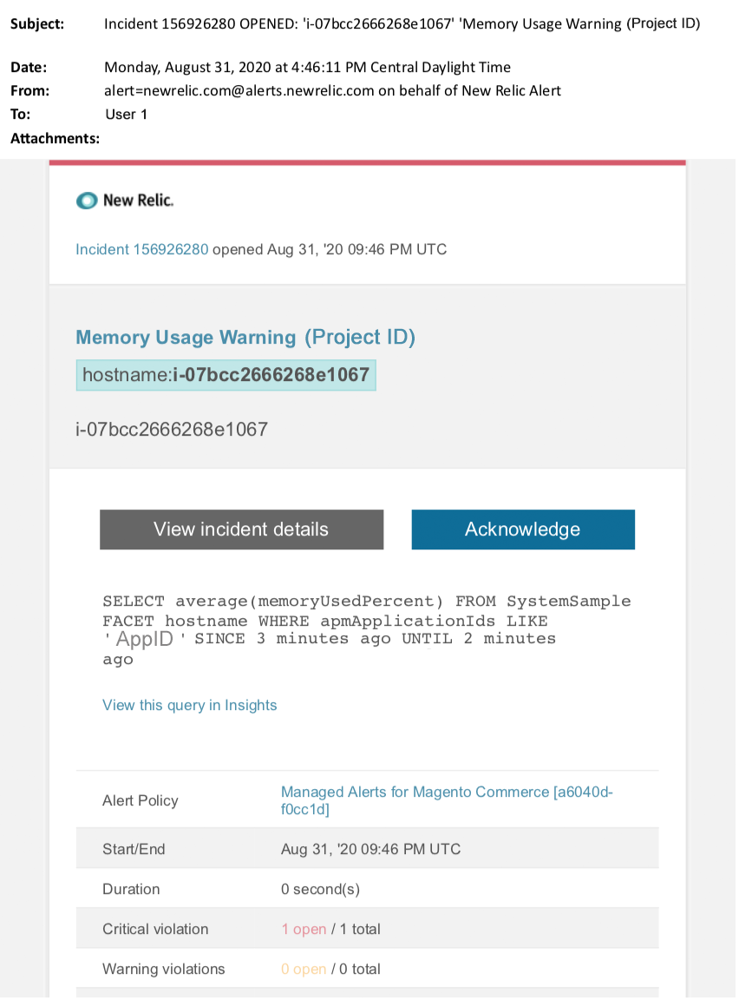

# Adobe Commerce的管理警報：記憶體警告警報

本文提供當您在[!DNL New Relic]中收到Adobe Commerce的記憶體警告警示時的疑難排解步驟。 需要立即採取行動來解決問題。 根據您選取的警報通知通道，警報看起來類似以下內容。

{width="500"}

## 受影響的產品和版本

雲端基礎結構上的Adobe Commerce Pro計畫架構

## 問題

如果您已為Adobe Commerce[!DNL New Relic]註冊了[個受管理的警示，且超過一或多個警示臨界值，則您將在](managed-alerts-for-magento-commerce.md)中收到警示。 這些警報由Adobe Commerce開發，可讓客戶運用支援和工程部門的見解獲得標準集合。

<u>**做！**</u>：

* 建議您中止任何排定的部署，直到清除此警示為止。
* 如果您的網站沒有回應或完全沒有回應，請立即將網站置於維護模式。 如需相關步驟，請參閱Commerce安裝指南中的[啟用或停用維護模式](https://experienceleague.adobe.com/en/docs/commerce-operations/installation-guide/tutorials/maintenance-mode)。 請務必將您的IP新增至劐免IP位址清單，以確保您仍可存取您的網站以進行疑難排解。 如需相關步驟，請參閱《Commerce安裝指南》中的[維護IP位址劐免清單](https://experienceleague.adobe.com/en/docs/commerce-operations/installation-guide/tutorials/maintenance-mode#maintain-the-list-of-exempt-ip-addresses)。

<u>**不要！**</u>：

* 啟動其他行銷活動，為您的網站帶來其他頁面檢視。
* 執行索引器或其他cron，這可能會在CPU或磁碟上造成額外的壓力。
* 執行任何主要管理任務（即管理員、資料匯入/匯出）。
* 清除您的快取。

## 解決方案

請依照下列步驟，找出原因並加以疑難排解。

1. 使用[[!DNL New Relic] APM的「基礎架構」頁面](https://docs.newrelic.com/docs/infrastructure/infrastructure-ui-pages/infra-hosts-ui-page/)來識別最耗用記憶體的處理序。 如需相關步驟，請參閱[[!DNL New Relic] [基礎結構監視主機頁面： [!UICONTROL Processes]標籤]](https://docs.newrelic.com/docs/infrastructure/infrastructure-ui-pages/infra-hosts-ui-page/#processes)。 如果像[!DNL Redis]或MySQL這樣的服務是記憶體耗用的主要來源，請嘗試下列步驟：

   * 檢查您是否使用最新版本。 較新版本有時可修正記憶體流失。 如果您不是最新版本，請考慮升級。 如需相關步驟，請參閱雲端上的Commerce指南中的[變更服務](https://experienceleague.adobe.com/en/docs/commerce-on-cloud/user-guide/configure/service/services-yaml)。
   * 如果您仍無法識別記憶體耗用量增加的來源，請檢查MySQL問題，例如長時間執行的查詢、未定義主索引鍵以及重複的索引。 如需相關步驟，請參閱Adobe Commerce實施行動手冊中的[雲端基礎結構上Commerce最常見的資料庫問題](https://experienceleague.adobe.com/docs/commerce-operations/implementation-playbook/best-practices/maintenance/resolve-database-performance-issues.html)。
   * 如果沒有MySQL問題，請檢查PHP問題。 在CLI/終端機中執行`ps aufx`以檢閱執行中的處理序。 在終端機輸出中，您會看到目前執行的cron作業和程式。 檢查處理序執行時間的輸出。 如果有一個執行時間較長的cron，則cron可能會掛起。 如需疑難排解步驟，請參閱Commerce支援知識庫中的[效能緩慢、運作緩慢且長時間的Cron](https://experienceleague.adobe.com/en/docs/commerce-knowledge-base/kb/troubleshooting/miscellaneous/slow-performance-slow-and-long-running-crons)和[Cron工作卡在「執行中」狀態](https://experienceleague.adobe.com/en/docs/commerce-knowledge-base/kb/troubleshooting/miscellaneous/cron-job-is-stuck-in-running-status)。

1. 如果您仍在努力找出問題的來源，請使用[[!DNL New Relic] APM的「交易」頁面](https://docs.newrelic.com/docs/apm/applications-menu/monitoring/transactions-page-find-specific-performance-problems)來識別具有效能問題的交易：

   * 依遞增[!DNL Apdex]分數排序交易。 [[!DNL Apdex]](https://docs.newrelic.com/docs/apm/new-relic-apm/apdex/apdex-measure-user-satisfaction)表示使用者對您的Web應用程式與服務的回應時間感到滿意。 [低 [!DNL Apdex] 分數](managed-alerts-for-magento-commerce-apdex-warning-alert.md)可能表示瓶頸（回應時間較長的交易）。 通常是資料庫、[!DNL Redis]或PHP。 如需相關步驟，請參閱New Relic [檢視不滿意程度最高的交易 [!DNL Apdex] 2}。](https://docs.newrelic.com/docs/apm/new-relic-apm/apdex/view-your-apdex-score#apdex-dissat)
   * 依最高輸送量、最慢的平均回應時間、最耗時的值和其他臨界值來排序交易。 如需相關步驟，請參閱[[!DNL New Relic] 尋找特定效能問題](https://docs.newrelic.com/docs/apm/applications-menu/monitoring/transactions-page-find-specific-performance-problems)。 如果您仍在努力找出問題，請使用[[!DNL New Relic] APM的基礎結構頁面](https://docs.newrelic.com/docs/infrastructure/infrastructure-ui-pages/infra-hosts-ui-page/)。

1. 如果您無法找出記憶體耗用量增加的原因，請檢閱最近的趨勢，以找出最近的程式碼部署或設定變更（例如，新客戶群組和目錄的大型變更）所造成的問題。 建議您檢閱過去七天的活動，以瞭解程式碼部署或變更中的任何關聯。

1. 如果上述方法無法協助您在合理的時間內找到原因和/或解決方案，請要求升級，或是將網站置於維護模式（如果尚未進行）。 如需相關步驟，請參閱Commerce支援知識庫中的[如何要求暫時調整大小](https://experienceleague.adobe.com/en/docs/commerce-knowledge-base/kb/how-to/how-to-request-temporary-magento-upsize)，以及Commerce安裝指南中的[啟用或停用維護模式](https://experienceleague.adobe.com/en/docs/commerce-operations/installation-guide/tutorials/maintenance-mode)。

1. 如果升級將網站恢復為正常運作，請考慮請求永久升級(聯絡您的Adobe客戶團隊)，或嘗試透過執行負載測試和最佳化查詢，或降低服務壓力的程式碼，在您的專用測試中重現問題。 請參閱Commerce on Cloud指南中的[負載和壓力測試](https://experienceleague.adobe.com/en/docs/commerce-cloud-service/user-guide/develop/test/staging-and-production#load-and-stress-testing)。
