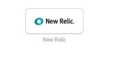
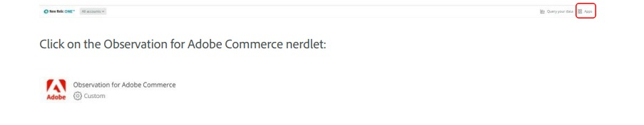

# 訪問 [!DNL Observation for Adobe Commerce] 內萊

使用 [!DNL New Relic Observation for Adobe Commerce] nerlet，確保您 [!DNL New Relic]。

1. 轉到 [!UICONTROL Okta] 首頁(僅適用於內部Adobe用戶)。
1. 選擇 [!UICONTROL New Relic applet] (僅限內部Adobe用戶)。

   

1. 通過驗證 [!UICONTROL Okta] (僅限內部Adobe用戶)。
1. 從 [!DNL New Relic] 的子菜單。

   
