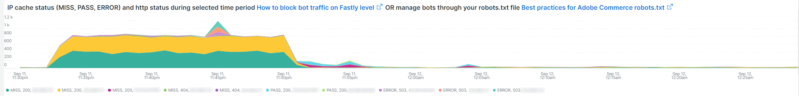

# [!UICONTROL bots]索引標籤

此索引標籤包含說明如何識別[!DNL bots]是否和什麼導致網站問題的資訊。

## [!DNL bots]的高階概觀：

* [!DNL bot]是執行重複式自動化工作的軟體。 隨著人工智慧和機器學習的演化，[!DNL bots]的任務、方法和互動正在改變。 有&#x200B;*個良好* [!DNL bots]可透過編目並將網站新增至網際網路搜尋引擎來使網站受益。 這會引導網際網路使用者透過搜尋引擎結果前往網站。 *良好* [!DNL bot]通常會遵守`robots.txt`檔案或搜尋引擎主控台設定置於[!DNL bot]上的界限。 邊界可以限制對場地或部分場地的存取。
* 惡意的[!DNL bots]會忽略`robots.txt`檔案，或透過HTTP要求資料的要求使用者代理程式欄位，偽裝好的[!DNL bot]。 惡意[!DNL bots]所做的某些動作：
   * 將負載新增至網站，以拒絕合法使用者存取該網站。
   * 未經許可刮取及重複使用內容。
   * 註冊假帳號以泛濫電子郵件服務或地址，或重新導向至其他網站([!DNL SPAM bots])。
   * 建立假的檢視([!DNL Viewbots])。
   * 購買產品或票證([!DNL Focused bots])。
* 管理[!DNL bots]
   * [!DNL Observation for Adobe Commerce]擁有[!DNL bot]流量的檢視：
      * 它會顯示未快取的[!DNL bot]活動總數，此活動會顯示[!DNL bot]正在新增至網站的負載以及該負載何時發生。
      * 它會顯示正在產生錯誤的[!DNL bots]。 通常，如果[!DNL bot]正在新增導致網站問題的負載，該[!DNL bot]或IP位址的錯誤頻率最高。
      * 它顯示[!DNL bot]名稱（要求使用者代理程式欄位值）和要透過管理的IP位址：
         * [!DNL Fastly] （速率限制或[!DNL VCLs]，會封鎖IP位址、範圍或依名稱值的[!DNL bots]）。
         * 正在將良好的[!DNL bot]資訊新增至`robots.txt field`，以限制或限制網站存取速率。
         * 透過搜尋引擎主控台管理[!DNL Bing]或[!DNL Google bots]。

## [!UICONTROL Experimental Potential Malicious Bots frame]

**[!UICONTROL Experimental Potential Malicious Bots frame]**&#x200B;框架會執行12個不同的複雜查詢。 它會偵測惡意IP要求籤章，然後彙總結果，並以遞減順序加總及排序結果。 查詢包含CVE利用漏洞攻擊和其他惡意要求的許多資料簽章。 即使安全性修正/修補程式封鎖了利用漏洞，且對網站沒有威脅，該請求仍必須由網站處理。 要求數量可能會在短時間內變得相當大。 此框架不會顯示來自IP位址的總請求數，而是顯示有訊號指出請求具有可疑意圖的要求。

請確定該流量為可疑流量，且並非源自可能傳送有效請求的[!DNL Content Distributed Network] (CDN)位址。 如果判斷要求來自CDN IP位址，請連絡該服務供應商，協助封鎖透過其網路的可疑流量。 如果您需要封鎖位址或要求URL，請參閱Adobe Commerce支援知識庫中的[在 [!DNL Fastly] 層級](https://experienceleague.adobe.com/docs/commerce-knowledge-base/kb/how-to/block-malicious-traffic-for-magento-commerce-on-fastly-level.html)封鎖Adobe Commerce的惡意流量。

## [!UICONTROL Rate of HTTP request per second (top 25) during requested time period]

**[!UICONTROL Rate of HTTP request per second (top 25) during requested time period]**&#x200B;框架顯示所選時間範圍內每秒最高IP位址要求數。 如果這些位址也在上表中，請確定它們不是CDN位址且是惡意的，並透過[!DNL Fastly]封鎖它們。

## [!UICONTROL Total Bot traffic by bot name]：

在選取的時段內，依機器人名稱區分的機器人流量總計

**[!UICONTROL Total Bot traffic by bot name during selected time period]**&#x200B;表格包含非快取要求的彙總計數，其中[!UICONTROL request_user_agent]欄位的值中有[!DNL bots]字串。 這有可能是也可能不是已命名的[!DNL bot]，因為[!UICONTROL request_user_agent]欄位值可以被假冒。 [!UICONTROL Count]欄下的值是最重要的。

## [!UICONTROL Total Bot Traffic by Bot name/IP address]

**[!UICONTROL Total Bot Traffic by Bot name/IP address during selected time period How to block bot traffic on Fastly level OR manage bots through your robots.txt file Best practices for Adobe Commerce robots.txt]**&#x200B;資料表顯示與上一個資料表相同的資料，但新增IP位址以代表具名[!DNL bot]發出要求。 由於是惡意的[!DNL bots]假冒品[!DNL bots]，應該透過識別濫用IP位址的網站，或透過&#x200B;*whois*&#x200B;服務或[!DNL DNS lookups]來驗證IP位址。 例如，[!DNL Google]發佈其[[!DNL googlebot] IP位址](https://developers.google.com/search/apis/ipranges/googlebot.json)，[!DNL Microsoft]具有[[!DNL Bingbots]](https://www.bing.com/webmasters/help/Verify-Bingbot-2195837f)的驗證工具。

## [!UICONTROL Graph - Bots with HTTP status errors]

**[!UICONTROL Graph - Bots with HTTP status errors during selected time period How to block bot traffic on Fastly level OR manage bots through your robots.txt file Best practices for Adobe Commerce robots.txt]**&#x200B;圖表在[!DNL bots]上顯示錯誤，這些錯誤在請求使用者代理程式欄位中宣告。 這並不一定表示錯誤是由於[!DNL bot]或其他流量的磁碟區所造成。 錯誤可能是[!DNL bot]正在要求不存在的資訊，或要求中存在其他問題。

如果網站不穩定或中斷期間的IP位址發生錯誤尖峰，他們可能會懷疑是網站問題。

## [!UICONTROL Table - IPs that do not identify as bots]

**[!UICONTROL Table - IPs that do not identify as bots with HTTP status errors during selected time period How to block bot traffic on Fastly level OR manage bots through your robots.txt file Best practices for Adobe Commerce robots.txt]**&#x200B;表格將顯示具有非200 http狀態代碼的IP要求，這些狀態代碼在要求使用者代理程式欄位中不會自我識別為[!DNL bots]。 這些IP位址可能是惡意IP位址，尤其是如果所選時段內的計數很高。

如果非200 http狀態代碼計數偏低，且IP位址範圍不類似，這些位址可能不會造成網站問題。

## [!UICONTROL Table – Cache Status 'ERROR']

當IP位址發生錯誤頻率很高時，請詢問他們在做什麼？ **[!UICONTROL Table – Cache Status 'ERROR' detail table (what are these IPs doing?) How to block bot traffic on Fastly level OR manage bots through your robots.txt file Best practices for Adobe Commerce robots.txt]**&#x200B;表格將顯示具有快取狀態[!UICONTROL ERROR]值之要求的URL以及HTTP狀態值。 頻率會以URL分面，因此計數可能會偏低。 請記住，該IP位址可能在選取的時段內提出數千個要求。 這是針對時段內最多2000個請求的檢視（記錄顯示限制）。

## [!UICONTROL Show 5XX status distribution]

**[!UICONTROL Show 5XX status distribution across IP addresses (top 200 addresses) How to block bot traffic on Fastly level OR manage bots through your robots.txt file Best practices for Adobe Commerce robots.txt]**&#x200B;框架功能強大。 它顯示在所選時段內具有5XX http狀態代碼的IP位址。 如果IP位址造成大量要求，而網站受到影響，以至於無法處理流量，則要求頻率最高的IP位址通常會有最高的錯誤數量。 5XX http狀態代碼通常表示網站正在努力回應請求。

橫條越寬，在該時段內，IP位址所發生的5xx錯誤總數中的錯誤百分比就越大。 注意：如果IP位址具有多個http狀態代碼（例如502和503 http狀態），圖表中可能會有多個區段。

典型的分佈會指向橫條右側，其中IP位址的寬度相等，或是有少數寬度很低的橫條。

如果您將滑鼠游標停留在長條圖區段上，它會顯示所選時段內所指示的錯誤數。

## [!UICONTROL IP cache status (MISS, PASS, ERROR) and HTTP status]

在選取的時段內

此&#x200B;**[!UICONTROL IP cache status (MISS, PASS, ERROR) and HTTP status during selected time period How to block bot traffic on Fastly level OR manage bots through your robots.txt file Best practices for Adobe Commerce robots.txt]**&#x200B;框架顯示所選時間範圍內的HTTPS狀態代碼計數以及依IP執行的非快取要求。 這表示每個IP位址與總容量的比例負載。 它會顯示具有最多請求的IP位址。

## [!UICONTROL Fastly Cache Summary for selected time period]

如果您按一下下方圖表中的[!UICONTROL Error]圖示，即可將最後兩個圖表互相比較。 這有助於指出載入在何處造成了網站問題。

## [!UICONTROL Graph - IPs that do not identify as bots]

**[!UICONTROL Graph - IPs that do not identify as bots without error during selected time period How to block bot traffic on Fastly level OR manage bots through your robots.txt file Best practices for Adobe Commerce robots.txt]**&#x200B;框架顯示要求使用者代理欄位、IP位址，以及要求之使用者代理欄位未指出[!DNL bot]的要求狀態碼。 此框架可能會顯示來自任何IP位址的高頻率要求，但請注意高頻率要求，尤其是在網站可能有問題的時段。

## [!UICONTROL Graph - Suspicious Non-Bot traffic]

在選取的時段內

**[!UICONTROL Graph - Suspicious Non-Bot traffic during selected time period]**&#x200B;圖表會尋找Go-http-client的請求使用者代理程式值，但會延伸至檢視其他可疑的請求使用者代理程式值。 此要求使用者代理程式值已由網站用來從服務連線，可能有效，但也被惡意[!DNL bots]使用。

## [!UICONTROL Graph - Bot traffic by Bot name]

**[!UICONTROL Graph - Bot traffic by Bot name during selected time period]**&#x200B;框架在標籤頂端的選定時段表格中，以[!DNL Bot]名稱顯示與機器人流量總計相同的資料。 它透過時間表顯示資料，以便您檢視[!DNL bots]的請求進行及其分佈。

## [!UICONTROL Graph - Top 250 Bot Names and IP addresses]

**[!UICONTROL Graph - Top 250 Bot Names and IP addresses during selected time period How to block bot traffic on Fastly level OR manage bots through your robots.txt file Best practices for Adobe Commerce robots.txt]**&#x200B;框架在索引標籤頂端的選定時段表格中，顯示與依機器人名稱/IP位址區分的總[!DNL Bot]流量相同的資料。 它會透過時間軸顯示資料，並依IP位址將其多面向。 這會顯示[!DNL bots]何時提出要求、哪個IP正在提出要求，以及要求的分佈。

## [!UICONTROL Blocked Bot name / IP addresses (in Fastly)]

在選取的時段內的機器人流量和IP

**[!UICONTROL Blocked Bot name / IP addresses (in Fastly) during selected time period. This graph displays bot traffic and IPs that were returned a 403 Forbidden HTTP Status code]**&#x200B;框架顯示封鎖的機器人名稱和IP位址。 您可以在此圖表檢視未來[!DNL Fastly]中封鎖所有要求的情形。

## [!UICONTROL Blocked non-Bot name / IP addresses (in Fastly)]

在選取的時段內的非機器人流量和IP

**[!UICONTROL Blocked non-Bot name / IP addresses (in Fastly) during selected time period graph displays non-bot traffic and IPs that were returned a 403 Forbidden HTTP Status code]**&#x200B;框架顯示未識別為[!DNL bot]且已透過[!DNL Fastly]封鎖的IP位址。

## [!UICONTROL This table shows the number of user agents per IP address, number of successful, unsuccessful and blocked requests:]

惡意[!DNL bots]經常透過[!UICONTROL Request User Agent]欄位的值欺騙其他[!DNL bots]。 此表格顯示IP位址在該欄位中有多少個唯一值。 [!UICONTROL Request User Agent]欄位中的值越高，IP位址就越可疑。

## [!UICONTROL IP with non-200 status errors]

**[!UICONTROL IP with non-200 status errors – without 403 status]**&#x200B;影格顯示具有200以外HTTP狀態代碼的IP位址在所選時間範圍內的分佈。 當您在單一IP或一組IP位址上看到較高的值時，需要進一步調查。

## [!UICONTROL IP with 403 status codes:]

具有403狀態碼的

**[!UICONTROL IP with 403 status codes]**&#x200B;框架顯示沒有[!UICONTROL cache_status=ERROR]的非快取要求，其HTTP狀態為403。 這可能表示原始伺服器是403 （未獲授權）的來源，而不是來自[!DNL Fastly]的區塊。

## [!UICONTROL Top 5 with non-200 status codes]

**[!UICONTROL Top 5 with non-200 status codes showing cache_status]**&#x200B;表格在IP/狀態層級顯示每個具有[!UICONTROL cache_status]值的計數。

## [!UICONTROL Pageview Latency will show as spikes]

**[!UICONTROL Pageview Latency will show as spikes on this graph:]**&#x200B;框架顯示可能與[!DNL bot]流量一致的頁面載入/API回應延遲。
