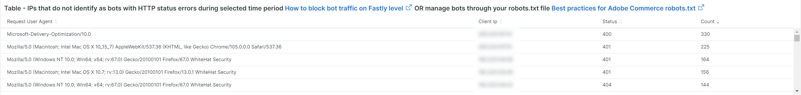
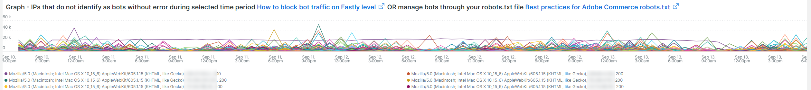
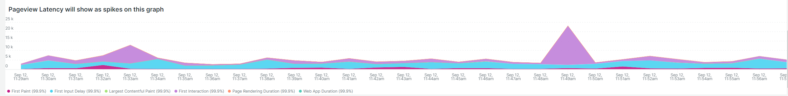

# 此 [!UICONTROL bots] 標籤

此頁簽提供的資訊說明如何識別 [!DNL bots] 會造成網站問題。

## 概觀 [!DNL bots]:

* A [!DNL bot] 是執行重複性自動化任務的軟體。 在人工智慧和機器學習進化的基礎上， [!DNL bots] 正在改變。 有 *好* [!DNL bots] 這些網站可以通過搜索和添加到網際網路搜索引擎而受益。 這會導致網際網路使用者透過搜尋引擎結果被引導至網站。 A *好* [!DNL bot] 通常會遵循放置在 [!DNL bot] a `robots.txt` 檔案或設定。 邊界可以限制對站點或站點部分的訪問。
* 惡意 [!DNL bots] 忽略 `robots.txt` 或者他們可能欺騙好人 [!DNL bot] 透過HTTP要求資料的要求使用者代理欄位。 有些惡意的 [!DNL bots] 執行：
   * 將載入新增至網站，以拒絕合法使用者存取網站。
   * 未經許可而消除和重複使用內容。
   * 註冊假帳戶以洪泛地發送電子郵件服務或地址，或重定向到其他站點([!DNL SPAM bots])。
   * 建立假視圖([!DNL Viewbots])。
   * 購買產品或票證([!DNL Focused bots])。
* 管理 [!DNL bots]
   * [!DNL Observation for Adobe Commerce] 有 [!DNL bot] 流量：
      * 它會顯示非快取總計 [!DNL bot] 活動，顯示 [!DNL bot] 會新增至網站，以及負載發生時。
      * 它會顯示 [!DNL bots] 產生錯誤。 通常若 [!DNL bot] 會增加造成網站問題的負載 [!DNL bot] 或IP位址有最高錯誤頻率。
      * 它顯示 [!DNL bot] 要管理的名稱（請求用戶代理欄位值）和IP地址：
         * [!DNL Fastly] (限速或 [!DNL VCLs] 會封鎖IP位址、範圍或 [!DNL bots] 依名稱值)。
         * 添加好 [!DNL bot] 資訊 `robots.txt field` 限制或限制網站存取率。
         * 管理 [!DNL Bing] 或 [!DNL Google bots] 透過搜尋引擎主控台。

## [!UICONTROL Total Bot traffic by bot name during selected time period]:

* 此 **[!UICONTROL Total Bot traffic by bot name during selected time period]:** 表格包含非快取請求的匯總計數，其中 [!UICONTROL request_user_agent] 欄位包含 [!DNL bots] 的值。 這可能是或不是 [!DNL bot] 作為 [!UICONTROL request_user_agent] 欄位值可以偽造。 底下的值 [!UICONTROL Count] 欄是最重要的。

## [!UICONTROL Total Bot Traffic by Bot name/IP address during selected time period How to block bot traffic on Fastly level OR manage bots through your robots.txt file Best practices for Adobe Commerce robots.txt]

* 此 **[!UICONTROL Total Bot Traffic by Bot name/IP address during selected time period How to block bot traffic on Fastly level OR manage bots through your robots.txt file Best practices for Adobe Commerce robots.txt]** 表格顯示的資料與上表相同，但會新增代表已命名 [!DNL bot]. 惡意 [!DNL bots] 好 [!DNL bots],IP位址應透過識別濫用IP位址的網站或 *who* 服務或 [!DNL DNS lookups]. 例如， [!DNL Google] 發佈 [[!DNL googlebot] IP位址](https://developers.google.com/search/apis/ipranges/googlebot.json) 和 [!DNL Microsoft] 有驗證工具，用於 [[!DNL Bingbots]](https://www.bing.com/webmasters/help/Verify-Bingbot-2195837f).

## [!UICONTROL Graph - Bots with HTTP status errors during selected time period How to block bot traffic on Fastly level OR manage bots through your robots.txt file Best practices for Adobe Commerce robots.txt]

* 此 **[!UICONTROL Graph - Bots with HTTP status errors during selected time period How to block bot traffic on Fastly level OR manage bots through your robots.txt file Best practices for Adobe Commerce robots.txt]** 圖表顯示 [!DNL bots] 在「請求用戶代理」欄位中聲明自己。 這不一定表示錯誤是由 [!DNL bot] 或其他流量。 錯誤可能是 [!DNL bot] 請求不存在的資訊，或請求中有其他問題。
* 如果在站點不穩定或停機期間IP地址上出現錯誤高峰，則可能是站點問題中的嫌疑。

## [!UICONTROL Table - IPs that do not identify as bots with HTTP status errors during selected time period How to block bot traffic on Fastly level OR manage bots through your robots.txt file Best practices for Adobe Commerce robots.txt]

* 此 **[!UICONTROL Table - IPs that do not identify as [!DNL bots] with HTTP status errors during selected time period How to block bot traffic on Fastly level OR manage bots through your robots.txt file Best practices for Adobe Commerce robots.txt]** 表格會顯示非200個http狀態代碼，且「不」自我識別為的IP請求 [!DNL bots] 在「請求使用者代理」欄位中。 這些IP地址可能是惡意IP地址，尤其是在所選時段的計數較高時。
* 如果非200 http狀態代碼計數較低，且IP位址範圍不類似，則位址可能不會造成網站問題。

## [!UICONTROL Table – Cache Status 'ERROR' detail table (what are these IPs doing?) How to block bot traffic on Fastly level OR manage bots through your robots.txt file Best practices for Adobe Commerce robots.txt]

* 當IP位址產生高頻錯誤時，請詢問它們執行什麼動作？ 此 [!UICONTROL Table – Cache Status 'ERROR' detail table (what are these IPs doing?) How to block bot traffic on Fastly level OR manage bots through your robots.txt file Best practices for Adobe Commerce robots.txt] 表格會顯示請求的URL，以及具有快取狀態的請求的HTTP狀態值 [!UICONTROL ERROR] 值。 頻率會由URL分面，因此計數可能會很低。 請記住，在所選時段內，IP位址可能會提出數千個請求。 此檢視針對時間範圍內最多2000個請求（記錄顯示限制）。

## [!UICONTROL Show 5XX status distribution across IP addresses (top 200 addresses) How to block bot traffic on Fastly level OR manage bots through your robots.txt file Best practices for Adobe Commerce robots.txt]

* 此 **[!UICONTROL Show 5XX status distribution across IP addresses (top 200 addresses) How to block bot traffic on Fastly level OR manage bots through your robots.txt file Best practices for Adobe Commerce robots.txt]** 框架功能強大。 它會顯示在所選時段內具有5XX http狀態代碼的IP位址。 如果IP位址提出大量請求，而網站受到影響，以致無法處理流量，則發出最高請求頻率的IP位址通常會有最高錯誤數量。 5XX http狀態代碼通常表示某個站點難以響應請求。
* 長條越寬，IP位址在該時段內錯誤總數為5xx的百分比就越大。 注意：如果IP位址有多個http狀態代碼（範例502和503 http狀態），該圖表中可能會有多個區段。
* 在IP位址寬度相等的長條的右側會顯示典型分佈，或者會有數量極少的寬長條。
* 如果您將滑鼠指標暫留在長條區段上，它會顯示選取時段內指出的錯誤數。

## [!UICONTROL IP cache status (MISS, PASS, ERROR) and HTTP status during selected time period How to block bot traffic on Fastly level OR manage bots through your robots.txt file Best practices for Adobe Commerce robots.txt]

* 此 **[!UICONTROL IP cache status (MISS, PASS, ERROR) and HTTP status during selected time period How to block bot traffic on Fastly level OR manage bots through your robots.txt file Best practices for Adobe Commerce robots.txt]** frame會顯示所選時間範圍內IP的HTTPS狀態程式碼計數和非快取請求。 這表示每個IP地址和總卷的成比例負載。 它會顯示請求最多的IP位址。

## [!UICONTROL Fastly Cache Summary for selected time period]

* 如果您按一下 [!UICONTROL Error] 圖示，您可以比較最後兩個圖表。 這有助於指出負載造成網站問題的原因。

## [!UICONTROL Graph - IPs that do not identify as bots without error during selected time period How to block bot traffic on Fastly level OR manage bots through your robots.txt file Best practices for Adobe Commerce robots.txt]

* 此 **[!UICONTROL Graph - IPs that do not identify as bots without error during selected time period How to block bot traffic on Fastly level OR manage bots through your robots.txt file Best practices for Adobe Commerce robots.txt]** frame會顯示請求使用者代理欄位未指出 [!DNL bot]. 此幀可能顯示來自任何IP地址的高頻請求，但應注意高頻請求，特別是在站點可能有問題的時段內。

## [!UICONTROL Graph - Suspicious Non-Bot traffic during selected time period]

* 此 **[!UICONTROL Graph - Suspicious Non-Bot traffic during selected time period]** graph會尋找Go-http-client的請求使用者代理值，但會延伸，以查看其他可疑的請求使用者代理值。 此請求用戶代理值被站點用於從服務連接，可能有效，但也被惡意用戶使用 [!DNL bots].

## [!UICONTROL Graph - Bot traffic by Bot name during selected time period]

* 此 **[!UICONTROL Graph - Bot traffic by Bot name during selected time period]** frame顯示的資料與「機器人總流量」相同，依 [!DNL Bot] 名稱。 它會透過時間軸顯示資料，讓您查看 [!DNL bots] 正在進行分發。

## [!UICONTROL Graph - Top 250 Bot Names and IP addresses during selected time period How to block bot traffic on Fastly level OR manage bots through your robots.txt file Best practices for Adobe Commerce robots.txt]

* 此 **[!UICONTROL Graph - Top 250 Bot Names and IP addresses during selected time period How to block bot traffic on Fastly level OR manage bots through your robots.txt file Best practices for Adobe Commerce robots.txt]** frame顯示的資料與「總計」相同 [!DNL Bot] 在索引標籤頂端的選取時段表格期間，依機器人名稱/IP位址的流量。 會透過時間軸顯示資料，並依IP位址面對。 這會顯示 [!DNL bots] 會提出、提出請求的IP以及請求的分配。

## [!UICONTROL Blocked Bot name / IP addresses (in Fastly) during selected time period. This graph displays bot traffic and IPs that were returned a 403 Forbidden HTTP Status code]

* 此 **[!UICONTROL IP address in the Graph - Top 250 Bot Names and IP addresses during selected time period]** 圖表被阻止。 您可以在此圖表中查看 [!DNL Fastly] 往前走。

## [!UICONTROL Blocked non-Bot name / IP addresses (in Fastly) during selected time period. This graph displays non-bot traffic and IPs that were returned a 403 Forbidden HTTP Status code]

* 此 **[!UICONTROL Blocked non-Bot name / IP addresses (in Fastly) during selected time period graph displays non-bot traffic and IPs that were returned a 403 Forbidden HTTP Status code]** 框顯示未標識為 [!DNL bot] 被封鎖 [!DNL Fastly].

## [!UICONTROL This table shows the number of user agents per IP address, number of successful, unsuccessful and blocked requests:]

* 惡意 [!DNL bots] 常常嘲笑別人 [!DNL bots] 透過 [!UICONTROL Request User Agent] 欄位。 此表顯示IP位址在該欄位中有多少個唯一值。 值在 [!UICONTROL Request User Agent] 欄位中，IP地址越可疑。

## [!UICONTROL IP with non-200 status errors – without 403 status]

* 此 **[!UICONTROL IP with non-200 status errors – without 403 status]** frame會顯示HTTP狀態碼為200以外之IP位址，在選取的時間範圍內的分佈。 若您在單一IP或一組IP位址上看到較高的值，則需要進一步調查。

## [!UICONTROL IP with 403 status codes:]

* 此 **[!UICONTROL IP with 403 status codes]** frame會顯示非快取請求，而不 [!UICONTROL cache_status=ERROR] 其HTTP狀態為403。 這可能表明源伺服器是403（未授權）的源，而不是來自 [!DNL Fastly].

## [!UICONTROL Top 5 with non-200 status codes showing cache_status:]

* 此 **[!UICONTROL Top 5 with non-200 status codes showing cache_status:]** 表格會以IP/狀態層級顯示每個 [!UICONTROL cache_status] 值。

## [!UICONTROL Pageview Latency will show as spikes on this graph:]

* 此 **[!UICONTROL Pageview Latency will show as spikes on this graph:]** 影格顯示頁面載入/ API回應延遲，可能與 [!DNL bot] 流量。
