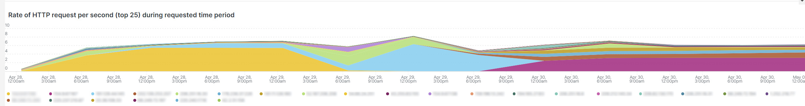

# 此 [!UICONTROL bots] 標籤

此標籤包含說明如何識別是否和什麼的資訊 [!DNL bots] 造成網站問題。

## 概觀的高層級 [!DNL bots]：

* A [!DNL bot] 是執行重複自動化工作的軟體。 隨著人工智慧和機器學習的進化，工作、方法和互動 [!DNL bots] 正在變更。 有 *好* [!DNL bots] 這項功能可讓網站透過編目並新增至網際網路搜尋引擎而受益。 這會引導網際網路使用者透過搜尋引擎結果前往網站。 A *好* [!DNL bot] 通常會遵守位於 [!DNL bot] 按 `robots.txt` 搜尋引擎主控台中的檔案或設定。 邊界可以限制對場地或部分場地的存取。
* 惡意 [!DNL bots] 忽略 `robots.txt` 檔案，否則他們可能會假冒商品 [!DNL bot] 透過HTTP請求資料的請求使用者代理欄位。 某些惡意專案 [!DNL bots] 執行：
   * 將負載新增至網站，以拒絕合法使用者存取該網站。
   * 未經許可刮取及重複使用內容。
   * 註冊假帳戶以泛濫電子郵件服務或地址，或重新導向至其他網站([!DNL SPAM bots])。
   * 建立假的檢視([!DNL Viewbots])。
   * 購買產品或票證([!DNL Focused bots])。
* 管理 [!DNL bots]
   * [!DNL Observation for Adobe Commerce] 有檢視 [!DNL bot] 流量：
      * 它會顯示未快取的總數 [!DNL bot] 顯示下列專案之負載的活動： [!DNL bot] 會新增至網站，以及何時發生該載入。
      * 它顯示 [!DNL bots] 正在產生錯誤。 通常如果 [!DNL bot] 正在新增導致網站問題的負載， [!DNL bot] 或IP位址的錯誤頻率最高。
      * 它顯示 [!DNL bot] 名稱（要求使用者代理欄位值）和IP位址，以透過以下方式管理：
         * [!DNL Fastly] (速率限制或 [!DNL VCLs] 會封鎖IP位址、範圍或 [!DNL bots] 依名稱值)。
         * 正在新增良好專案 [!DNL bot] 資訊 `robots.txt field` 以限制或限制網站存取的速率。
         * 管理 [!DNL Bing] 或 [!DNL Google bots] 搜尋引擎主控台。

## [!UICONTROL Experimental Potential Malicious Bots frame]

此 **[!UICONTROL Experimental Potential Malicious Bots frame]** 框架會執行12個不同的複雜查詢。 它會偵測惡意IP要求籤章，然後彙總結果，並以遞減順序加總及排序結果。 查詢包含CVE利用漏洞攻擊和其他惡意要求的許多資料簽章。 即使安全性修正/修補程式封鎖了利用漏洞，且對網站沒有威脅，該請求仍必須由網站處理。 要求數量可能會在短時間內變得相當大。 此框架不會顯示來自IP位址的總請求數，而是顯示有訊號指出請求具有可疑意圖的要求。

請確定該流量可疑，且並非源自於 [!DNL Content Distributed Network] (CDN)位址，也可能傳送有效的請求。 如果判斷要求來自CDN IP位址，請連絡該服務供應商，協助封鎖透過其網路的可疑流量。 如果您需要封鎖位址或請求URL，請參閱 [封鎖上的Adobe Commerce惡意流量 [!DNL Fastly] level](https://experienceleague.adobe.com/docs/commerce-knowledge-base/kb/how-to/block-malicious-traffic-for-magento-commerce-on-fastly-level.html) Adobe Commerce支援知識庫中的。

## [!UICONTROL Rate of HTTP request per second (top 25) during requested time period]

此 **[!UICONTROL Rate of HTTP request per second (top 25) during requested time period]** 影格會顯示所選時間範圍內每秒鐘的最高IP位址要求數。 如果這些位址也包含在上表中，請確保它們不是CDN位址和惡意位址，並透過將其封鎖 [!DNL Fastly].

## [!UICONTROL Total Bot traffic by bot name]:

此 **[!UICONTROL Total Bot traffic by bot name during selected time period]** 表格含有非快取要求的彙總計數，其中 [!UICONTROL request_user_agent] 欄位有字串 [!DNL bots] 在值中。 這有可能是也可能不是指定的 [!DNL bot] 作為 [!UICONTROL request_user_agent] 欄位值可以偽造。 下的值 [!UICONTROL Count] 欄是最重要的。

## [!UICONTROL Total Bot Traffic by Bot name/IP address]

此 **[!UICONTROL Total Bot Traffic by Bot name/IP address during selected time period How to block bot traffic on Fastly level OR manage bots through your robots.txt file Best practices for Adobe Commerce robots.txt]** 此表格顯示與上個表格相同的資料，但新增IP位址以代表具名者發出請求 [!DNL bot]. 為惡意 [!DNL bots] 假冒商品 [!DNL bots]，IP位址應透過可識別濫用IP位址的網站或透過進行驗證 *哇* 服務或 [!DNL DNS lookups]. 例如， [!DNL Google] 發佈其 [[!DNL googlebot] IP位址](https://developers.google.com/search/apis/ipranges/googlebot.json) 和 [!DNL Microsoft] 擁有驗證工具 [[!DNL Bingbots]](https://www.bing.com/webmasters/help/Verify-Bingbot-2195837f).

## [!UICONTROL Graph - Bots with HTTP status errors]

此 **[!UICONTROL Graph - Bots with HTTP status errors during selected time period How to block bot traffic on Fastly level OR manage bots through your robots.txt file Best practices for Adobe Commerce robots.txt]** 圖表顯示錯誤於 [!DNL bots] 在「要求使用者代理程式」欄位中宣告自己。 這並不一定表示錯誤是由於 [!DNL bot] 或其他流量。 錯誤可能是 [!DNL bot] 正在要求不存在的資訊，或要求中存在其他問題。

如果網站不穩定或中斷期間的IP位址發生錯誤尖峰，他們可能會懷疑是網站問題。

## [!UICONTROL Table - IPs that do not identify as bots]

此 **[!UICONTROL Table - IPs that do not identify as bots with HTTP status errors during selected time period How to block bot traffic on Fastly level OR manage bots through your robots.txt file Best practices for Adobe Commerce robots.txt]** 此表格會顯示具有非200 http狀態代碼，且不會自我識別為的IP請求 [!DNL bots] 在「請求使用者代理程式」欄位中。 這些IP位址可能是惡意IP位址，尤其是如果所選時段內的計數很高。

如果非200 http狀態代碼計數偏低，且IP位址範圍不類似，這些位址可能不會造成網站問題。

## [!UICONTROL Table – Cache Status 'ERROR']

當IP位址發生錯誤頻率很高時，請詢問他們在做什麼？ 此 **[!UICONTROL Table – Cache Status 'ERROR' detail table (what are these IPs doing?) How to block bot traffic on Fastly level OR manage bots through your robots.txt file Best practices for Adobe Commerce robots.txt]** 表格會顯示具有快取狀態之要求的URL以及HTTP狀態值 [!UICONTROL ERROR] 值。 頻率會以URL分面，因此計數可能會偏低。 請記住，該IP位址可能在選取的時段內提出數千個要求。 這是針對時段內最多2000個請求的檢視（記錄顯示限制）。

## [!UICONTROL Show 5XX status distribution]

此 **[!UICONTROL Show 5XX status distribution across IP addresses (top 200 addresses) How to block bot traffic on Fastly level OR manage bots through your robots.txt file Best practices for Adobe Commerce robots.txt]** 框架功能強大。 它顯示在所選時段內具有5XX http狀態代碼的IP位址。 如果IP位址造成大量要求，而網站受到影響，以至於無法處理流量，則要求頻率最高的IP位址通常會有最高的錯誤數量。 5XX http狀態代碼通常表示網站正在努力回應請求。

橫條越寬，在該時段內，IP位址所發生的5xx錯誤總數中的錯誤百分比就越大。 注意：如果IP位址具有多個http狀態代碼（例如502和503 http狀態），圖表中可能會有多個區段。

典型的分佈會指向橫條右側，其中IP位址的寬度相等，或是有少數寬度很低的橫條。

如果您將滑鼠游標停留在長條圖區段上，它會顯示所選時段內所指示的錯誤數。

## [!UICONTROL IP cache status (MISS, PASS, ERROR) and HTTP status]

這個 **[!UICONTROL IP cache status (MISS, PASS, ERROR) and HTTP status during selected time period How to block bot traffic on Fastly level OR manage bots through your robots.txt file Best practices for Adobe Commerce robots.txt]** 框架會依所選時間範圍的IP，顯示HTTPS狀態程式碼計數和非快取要求。 這表示每個IP位址與總容量的比例負載。 它會顯示具有最多請求的IP位址。

## [!UICONTROL Fastly Cache Summary for selected time period]

如果您按一下 [!UICONTROL Error] 圖示中，您可以比較最後兩個圖形。 這有助於指出載入在何處造成了網站問題。

## [!UICONTROL Graph - IPs that do not identify as bots]

此 **[!UICONTROL Graph - IPs that do not identify as bots without error during selected time period How to block bot traffic on Fastly level OR manage bots through your robots.txt file Best practices for Adobe Commerce robots.txt]** frame會顯示請求使用者代理欄位、IP位址，以及請求狀態碼，其中請求使用者代理欄位未指出 [!DNL bot]. 此框架可能會顯示來自任何IP位址的高頻率要求，但請注意高頻率要求，尤其是在網站可能有問題的時段。

## [!UICONTROL Graph - Suspicious Non-Bot traffic]

此 **[!UICONTROL Graph - Suspicious Non-Bot traffic during selected time period]** graph會尋找Go-http-client的請求使用者代理值，但會延伸至檢視其他可疑的請求使用者代理值。 此要求使用者代理程式值由網站用來從服務連線，可能有效，但也被惡意使用 [!DNL bots].

## [!UICONTROL Graph - Bot traffic by Bot name]

此 **[!UICONTROL Graph - Bot traffic by Bot name during selected time period]** 框架顯示的資料與以下專案的「機器人總流量」相同： [!DNL Bot] 標籤頂端的「所選時段期間的名稱」表格。 它會透過時間軸顯示資料，因此您可以看到何時發出請求 [!DNL bots] 正在製作及其分配。

## [!UICONTROL Graph - Top 250 Bot Names and IP addresses]

此 **[!UICONTROL Graph - Top 250 Bot Names and IP addresses during selected time period How to block bot traffic on Fastly level OR manage bots through your robots.txt file Best practices for Adobe Commerce robots.txt]** 框架顯示的資料與「總計」相同 [!DNL Bot] 在索引標籤頂端的選定時段內依機器人名稱/IP位址的流量。 它會透過時間軸顯示資料，並依IP位址將其多面向。 這會顯示何時發出 [!DNL bots] 已發出、哪個IP正在發出要求，以及要求的分佈。

## [!UICONTROL Blocked Bot name / IP addresses (in Fastly)]

此 **[!UICONTROL Blocked Bot name / IP addresses (in Fastly) during selected time period. This graph displays bot traffic and IPs that were returned a 403 Forbidden HTTP Status code]** 框架顯示被封鎖的機器人名稱和IP位址。 您可以在此圖表中檢視所有要求在中遭到封鎖的情況 [!DNL Fastly] 至今以後。

## [!UICONTROL Blocked non-Bot name / IP addresses (in Fastly)]

此 **[!UICONTROL Blocked non-Bot name / IP addresses (in Fastly) during selected time period graph displays non-bot traffic and IPs that were returned a 403 Forbidden HTTP Status code]** 框架顯示未識別為 [!DNL bot] 已透過封鎖 [!DNL Fastly].

## [!UICONTROL This table shows the number of user agents per IP address, number of successful, unsuccessful and blocked requests:]

惡意 [!DNL bots] 經常欺騙他人 [!DNL bots] 透過 [!UICONTROL Request User Agent] 欄位。 此表格顯示IP位址在該欄位中有多少個唯一值。 中的值越高 [!UICONTROL Request User Agent] 欄位中，IP位址越可疑。

## [!UICONTROL IP with non-200 status errors]

此 **[!UICONTROL IP with non-200 status errors – without 403 status]** 影格顯示具有200以外HTTP狀態代碼的IP位址在選定時間範圍內的分佈。 當您在單一IP或一組IP位址上看到較高的值時，需要進一步調查。

## [!UICONTROL IP with 403 status codes:]

此 **[!UICONTROL IP with 403 status codes]** 框架顯示非快取請求，但不包含 [!UICONTROL cache_status=ERROR] HTTP狀態為403的訪客。 這可能表示原始伺服器是403 （未獲授權）的來源，而不是來自的區塊 [!DNL Fastly].

## [!UICONTROL Top 5 with non-200 status codes]

此 **[!UICONTROL Top 5 with non-200 status codes showing cache_status]** 表格會在IP/狀態層級顯示每個具有下列專案的計數： [!UICONTROL cache_status] 值。

## [!UICONTROL Pageview Latency will show as spikes]

此 **[!UICONTROL Pageview Latency will show as spikes on this graph:]** 框架顯示頁面載入/API回應延遲，這可能符合 [!DNL bot] 流量。
