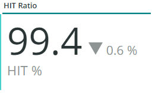

# [!UICONTROL CDN]索引標籤

此索引標籤具有著重於[!DNL content delivery network (CDN)]的資訊。 以Adobe Commerce Cloud為例，這是[!DNL Fastly]服務。

## [!UICONTROL HIT rate]

**[!UICONTROL HIT rate]**&#x200B;框架顯示最後一分鐘產生[!UICONTROL HITS]的可快取要求數目。 這表示快取成功。 向右箭頭會顯示一週前同一時間的上方或下方百分比。

## [!UICONTROL HIT Processing]

此&#x200B;**[!UICONTROL HIT processing]**&#x200B;方塊顯示一週內產生[!UICONTROL HITS]的可快取要求數目。

## [!UICONTROL MISS rate]

此&#x200B;**[!UICONTROL MISS rate]**&#x200B;方塊顯示最後一分鐘可快取要求的遺漏次數。 未命中是指未快取要求，且要求必須傳遞至原始伺服器以提供內容時。 右邊的值是一週前每分鐘增加/減少的分鐘數比較。

## [!UICONTROL MISS time]

## [!UICONTROL HIT Ratio]

## [!UICONTROL Error Percentage]

**[!UICONTROL Error Percentage]**&#x200B;方塊會顯示要求的ERROR百分比值，並顯示一週前同一時間的相對增加/減少。

## [!UICONTROL Total Requests]

## [!UICONTROL ERROR rate]

## [!UICONTROL Fastly Cache Average Response for selected time period in seconds]

所選時段的

此框架顯示可快取要求的持續時間（以秒為單位），這表示如果`cache_response`是[!UICONTROL MISS]，則會顯示所選時間遺失快取回應的平均值。

## [!UICONTROL Fastly Cache Average Response for selected time period in seconds, faceted by POP]

此內容中的&#x200B;*POP*&#x200B;是指設定為做為快取儲存集區的Point of Presence (POP)。 檢視[顯示點](https://developer.fastly.com/learning/concepts/pop/)。

## [!UICONTROL Total Bandwidth (All POPs) during the selected timeframe, compared with 1 week ago (% increase/decrease)]

在選取的時間範圍內有

## [!UICONTROL Requests – Since selected timeframe compared with one week ago]

此框架類似於頂端[!UICONTROL Total Requests]的摘要方塊，但顯示前幾週的請求計數。 這些都是要求，而不僅僅是可快取的要求（其中`is_cacheable`為true）。

## [!UICONTROL Response Count]

## [!UICONTROL Bandwidth by POP]

## [!UICONTROL Top 5 URLs (5xx or 3xx status codes)]

**[!UICONTROL Top 5 URLs]**&#x200B;檢視會顯示發生5xx或3xx錯誤回應的前5個URL。 由於空間限制，您需要將滑鼠移至URL上方，才能檢視與該URL相關聯的特定錯誤代碼。 （例如上圖紅色方塊中的）。

## [!UICONTROL Top 25 URLs (200 status)]

**[!UICONTROL Top 25 URLs]**&#x200B;框架會顯示在所選時間範圍內依計數傳回200狀態的URL。

## [!UICONTROL Duration by Response Status]

**[!UICONTROL Duration by Response Status]**&#x200B;圖表會依所選時間範圍內的計數顯示錯誤回應，並以錯誤狀態代碼分面。

## [!UICONTROL Duration by Response Status, top 25 urls]

**[!UICONTROL Duration by Response Status, top 25 URLs]**&#x200B;圖表會依回應持續時間顯示前25個URL （以秒為單位）。 您可能需要將滑鼠移至URL上方，才能檢視整個路徑。 此外，若要移除除一個URL外的所有其他URL，請按一下該URL。 接著，您可以按一下其他URL來重新新增它們。 如果您想要移除個別URL，可以按住索引鍵，然後按一下每個URL，即可從圖形中移除這些URL。

## [!UICONTROL Duration by Response Status, top 25 non-200 status]

**[!UICONTROL Duration by Response Status, top 25 non-200 status]**&#x200B;圖表與最後一個圖表類似，但焦點在非200狀態代碼或錯誤狀態代碼。 它會顯示錯誤代碼，然後顯示URL。 您可能需要將滑鼠移至URL上方，才能檢視整個路徑。 此外，若要移除除一個URL外的所有其他URL，請按一下該URL。 接著，您可以按一下其他URL來重新新增它們。 如果您想要移除個別URL，可以按住索引鍵，然後按一下每個URL，即可從圖形中移除這些URL。

## [!UICONTROL Error Count by POP timeline]

**[!UICONTROL Error Count by POP timeline]**&#x200B;圖表沿著所選時間範圍時間軸顯示錯誤狀態的計數，並以錯誤代碼分面。

## [!UICONTROL Duration by Response status, top 25 client IP, non-200 status]

**[!UICONTROL Duration by Response status, top 25 client IP, non 200 status]**&#x200B;圖表依據所選時間範圍內出現狀態錯誤碼的平均持續時間來顯示IP位址。

## [!UICONTROL IP Frequency]

**[!UICONTROL IP Frequency]**&#x200B;框架會計算[!DNL Fastly]記錄檔中每個IP的（&#39;MISS&#39;和&#39;PASS&#39;）狀態。 具有這些狀態的網頁請求將連線至原始伺服器，並將新增負載至伺服器。 這會顯示頻率排名前20個位址。 此框架可用來偵測網站上的IP攻擊或負載過重的來源。 此圖表也會顯示在摘要標籤上，並放置在此處，以方便與標籤上顯示的[!DNL Fastly]記錄資訊進行比較的詳細資訊。
