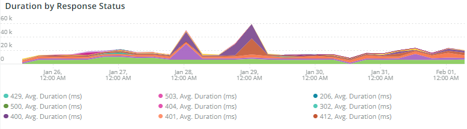
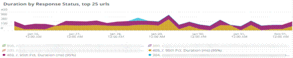

# 的 [!UICONTROL CDN] 頁籤

此頁籤包含的資訊 [!DNL content delivery network (CDN)]。 就Adobe Commerce Cloud而言， [!DNL Fastly] 服務。

## [!UICONTROL HIT rate]

的 **[!UICONTROL HIT rate]** frame顯示導致的可快取請求數 [!UICONTROL HITS] 最後一刻。 這表示快取成功。 右邊的箭頭將顯示一週前同一時間的上下百分比。

## [!UICONTROL HIT Processing]

此 **[!UICONTROL HIT processing]** 框顯示導致的可快取請求數 [!UICONTROL HITS] 這週。

## [!UICONTROL MISS rate]

此 **[!UICONTROL MISS rate]** 框顯示在最後一分鐘可快取請求的未命中數。 錯誤是當請求未快取，並且必須將請求傳遞到源伺服器以服務內容時。 右邊的值是增加/減少與前一週每分鐘的分鐘數的比較。

## [!UICONTROL MISS time]

## [!UICONTROL HIT Ratio]

## [!UICONTROL Error Percentage]

的 **[!UICONTROL Error Percentage]** 框顯示請求的ERROR百分比值，並顯示與前一週的同一時間相比的相對增加/減少。

## [!UICONTROL Total Requests]

## [!UICONTROL ERROR rate]

## [!UICONTROL Fastly Cache Average Response for selected time period in seconds]

此幀顯示可快取請求的持續時間（以秒為單位），表示如果 `cache_response` 是MISS，它顯示所選時間的丟失快取響應的平均值。

## [!UICONTROL Fastly Cache Average Response for selected time period in seconds, faceted by POP]

## [!UICONTROL Total Bandwidth (All POPs) during the selected timeframe, compared with 1 week ago (% increase/decrease)]

## [!UICONTROL Requests – Since selected timeframe compared with one week ago]

此框架與頂部「總請求」的摘要框類似，但顯示以前的周請求計數。 這些都是請求，而不只是可快取的請求(其中 `is_cacheable` 為真)。

## [!UICONTROL Response Count]

## [!UICONTROL Bandwidth by POP]

## [!UICONTROL Top 5 URLs (5xx or 3xx status codes)]

的 **[!UICONTROL Top 5 URLs]** 視圖顯示出現5xx或3xx錯誤響應的前5個URL。 由於空間限制，您需要將滑鼠移到URL上以查看與該URL關聯的特定錯誤代碼。 （如上圖的紅色框中）。

## [!UICONTROL Top 25 URLs (200 status)]

的 **[!UICONTROL Top 25 URLs]** frame顯示在選定時間範圍內按計數返回200個狀態的URL。

## [!UICONTROL Duration by Response Status]

的 **[!UICONTROL Duration by Response Status]** 圖形按選定時間段內的計數顯示錯誤響應，按錯誤狀態代碼分面顯示。

## [!UICONTROL Duration by Response Status, top 25 urls]

的 **[!UICONTROL Duration by Response Status, top 25 URLs]** 圖形按響應持續時間（秒）顯示前25個URL。 您可能需要將滑鼠懸停在URL上才能查看整個路徑。 此外，要刪除除一個URL之外的所有URL，請按一下該URL。 然後，可以通過按一下其他URL來將其添加回來。 如果要刪除單個URL，可以按住該鍵並按一下每個URL，以從圖形中刪除它們。

## [!UICONTROL Duration by Response Status, top 25 non-200 status]

的 **[!UICONTROL Duration by Response Status, top 25 non-200 status]** 圖與上一個圖類似，只是焦點在非200狀態代碼或錯誤狀態代碼上。 它將顯示錯誤代碼，然後顯示URL。 您可能需要將滑鼠懸停在URL上才能查看整個路徑。 此外，要刪除除一個URL之外的所有URL，請按一下該URL。 然後，可以通過按一下其他URL來將其添加回來。 如果要刪除單個URL，可以按住該鍵並按一下每個URL，以從圖形中刪除它們。

## [!UICONTROL Error Count by POP timeline]

的 **[!UICONTROL Error Count by POP timeline]** 圖形按錯誤代碼顯示沿選定時間軸的錯誤狀態計數。

## [!UICONTROL Duration by Response status, top 25 client IP, non-200 status]

的 **[!UICONTROL Duration by Response status, top 25 client IP, non 200 status]** 圖形按選定時間段記憶體在狀態錯誤代碼的平均持續時間顯示IP地址。

## [!UICONTROL IP Frequency]

的 **[!UICONTROL IP Frequency]** 幀計數來自IP的每個IP的（「MISS」和「PASS」）狀態 [!DNL Fastly] 日誌。 具有這些狀態的Web請求將到達源伺服器，並將向伺服器添加負載。 它以頻率顯示前20個地址。 此框架可用於檢測網站上的IP攻擊或重負載源。 此圖表也顯示在摘要頁籤上，並放在此處，以便與上 [!DNL Fastly] 此頁籤上顯示的日誌資訊。
