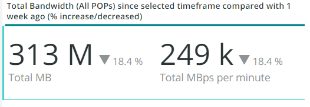

# 此 [!UICONTROL CDN] 標籤

此標籤包含著重在 [!DNL content delivery network (CDN)]. 以Adobe Commerce Cloud為例，此範本為 [!DNL Fastly] 服務。

## [!UICONTROL HIT rate]

此 **[!UICONTROL HIT rate]** frame顯示產生的可快取要求數目 [!UICONTROL HITS] 在最後一分鐘。 這表示快取成功。 右箭頭會顯示一週前同一時間的上方或下方的百分比。

## [!UICONTROL HIT Processing]

此 **[!UICONTROL HIT processing]** 方塊顯示所產生的可快取要求數目 [!UICONTROL HITS] 在一週內。

## [!UICONTROL MISS rate]

此 **[!UICONTROL MISS rate]** 方塊顯示最後一分鐘未命中的可快取要求數目。 未命中是指未快取要求，而且要求必須傳遞至原始伺服器才能提供內容。 右邊的值是一週前每分鐘數增加/減少的比較。

## [!UICONTROL MISS time]

## [!UICONTROL HIT Ratio]

## [!UICONTROL Error Percentage]

此 **[!UICONTROL Error Percentage]** 方塊顯示要求的ERROR百分比值，並顯示一週前同一時間的相對增加/減少。

## [!UICONTROL Total Requests]

## [!UICONTROL ERROR rate]

## [!UICONTROL Fastly Cache Average Response for selected time period in seconds]

此框架顯示可快取要求的持續時間（以秒為單位），這表示如果 `cache_response` 是 [!UICONTROL MISS]，它會顯示所選時間遺漏快取回應的平均值。

## [!UICONTROL Fastly Cache Average Response for selected time period in seconds, faceted by POP]

## [!UICONTROL Total Bandwidth (All POPs) during the selected timeframe, compared with 1 week ago (% increase/decrease)]

## [!UICONTROL Requests – Since selected timeframe compared with one week ago]

此框架類似於的摘要方塊 [!UICONTROL Total Requests] 位於頂端，但顯示前幾週的要求計數。 這些都是請求，而不僅僅是可快取請求(其中 `is_cacheable` 為true)。

## [!UICONTROL Response Count]

## [!UICONTROL Bandwidth by POP]

## [!UICONTROL Top 5 URLs (5xx or 3xx status codes)]

此 **[!UICONTROL Top 5 URLs]** 檢視會顯示發生5xx或3xx錯誤回應的前5個URL。 由於空間限制，您需要將滑鼠移至URL上方，才能檢視與該URL相關聯的特定錯誤代碼。 （以上圖紅色方塊中的範例）。

## [!UICONTROL Top 25 URLs (200 status)]

此 **[!UICONTROL Top 25 URLs]** 框架會顯示在所選時間範圍內依計數傳回200狀態的URL。

## [!UICONTROL Duration by Response Status]

此 **[!UICONTROL Duration by Response Status]** graph會依所選時間範圍內的計數顯示錯誤回應，並以錯誤狀態代碼分面。

## [!UICONTROL Duration by Response Status, top 25 urls]

此 **[!UICONTROL Duration by Response Status, top 25 URLs]** 圖形會依回應持續時間顯示前25個URL （以秒為單位）。 您可能需要將滑鼠游標停留在URL上才能檢視整個路徑。 此外，若要移除除一個URL以外的所有網址，請按一下該URL。 然後，您可以按一下其他URL來重新新增它們。 如果您想要移除個別URL，可以按住索引鍵，然後按一下每個URL以從圖形中移除這些URL。

## [!UICONTROL Duration by Response Status, top 25 non-200 status]

此 **[!UICONTROL Duration by Response Status, top 25 non-200 status]** 圖表與上一個類似，不同之處在於焦點在非200狀態代碼或錯誤狀態代碼。 它會顯示錯誤代碼，然後顯示URL。 您可能需要將滑鼠游標停留在URL上才能檢視整個路徑。 此外，若要移除除一個URL以外的所有網址，請按一下該URL。 然後，您可以按一下其他URL來重新新增它們。 如果您想要移除個別URL，可以按住索引鍵，然後按一下每個URL以從圖形中移除這些URL。

## [!UICONTROL Error Count by POP timeline]

此 **[!UICONTROL Error Count by POP timeline]** 圖表會沿著選取的時間範圍時間軸顯示錯誤狀態的計數，並以錯誤代碼分面。

## [!UICONTROL Duration by Response status, top 25 client IP, non-200 status]

此 **[!UICONTROL Duration by Response status, top 25 client IP, non 200 status]** 圖形會依據所選時間範圍內出現狀態錯誤碼的平均持續時間來顯示IP位址。

## [!UICONTROL IP Frequency]

此 **[!UICONTROL IP Frequency]** frame會計算（&#39;MISS&#39;和&#39;PASS&#39;）中每個IP的狀態， [!DNL Fastly] 記錄。 具有這些狀態的網頁請求將連線至原始伺服器，並將新增負載至伺服器。 它會顯示頻率排名前20的地址。 此框架可用來偵測網站上的IP攻擊或大量負載來源。 此圖表也會顯示在摘要標籤上，並放置於此處以方便比較 [!DNL Fastly] 日誌資訊會顯示在此標籤上。
