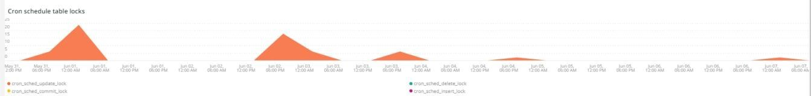

# 此 [!DNL Cron] 標籤

此標籤嘗試快速隔離的問題和原因 [!DNL cron] 問題。

## [!UICONTROL Cron transaction duration in seconds]

此 **[!UICONTROL Cron transaction duration in seconds]** 框架顯示 [!DNL crons] 交易持續時間（秒）。 這會顯示執行時間較長的交易。 深入探討APM將會顯示交易/作業可能執行之查詢的更多詳細資料。

## [!UICONTROL MySQL Non-Sleeping Threads by Node]

此 **[!UICONTROL MySQL Non-Sleeping Threads by Node]** 框架會依節點顯示所選時間範圍內的MySQL非休眠執行緒。

## [!UICONTROL SQL Trace count by path]

此 **[!UICONTROL SQL Trace count by path]** frame會依路徑檢視MySQL追蹤計數，這有助於在選取的時間範圍內追蹤SQL敘述句。

## [!UICONTROL Cron database call]

此 **[!UICONTROL Cron database call]** 影格會檢視 [!DNL crons] 在選取的時間範圍內呼叫資料庫。

## [!UICONTROL Cron schedule table locks]

此 **[!UICONTROL Cron schedule table locks]** 框架檢視 [!DNL cron] 在選取的時間範圍內排程表格鎖定。

## [!UICONTROL Cron schedule clean cron fired]

此 **[!UICONTROL Cron schedule clean cron fired]** 影格會檢視 [!DNL crons] 已在選取的時間範圍內清除。 如果此框架中未顯示任何資料，可能表示有問題 [!DNL crons] 正確執行。 如果 [!DNL cron] 未清除工作排程， [!DNL crons] 無法以最佳方式執行，且可能需要更長的時間才能執行。

## [!UICONTROL Cron schedule clean records details table]

此 **[!UICONTROL Cron schedule clean records details table]** 此表格提供清除記錄作業的詳細資訊。 `cron_schedule` 表格跨越所選的時間範圍。

## [!UICONTROL cron_schedule table updates]

此 **[!UICONTROL cron_schedule table updates]** 影格會檢視 [!DNL cron] 排程表格會在選取的時間範圍內更新。 此表格刪除或更新時活動頻繁可能表示有問題 [!DNL crons]. 此外， [!DNL crons] 在執行和完成時更新此表格，因此，如果此表格上沒有活動，且有 [!DNL crons] 已設定，可能有問題 [!DNL crons].

## [!UICONTROL Datastore Operations Tables]

此 **[!UICONTROL Datastore Operations Tables]** 檢視資料庫表格作業，包括 `SELECT`， `DELETE`、和 `UPDATE` 在選取的時間範圍內。 此框架顯示操作頻率最高的資料庫表格。
