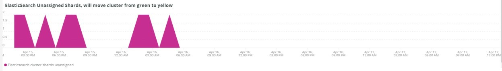

# [!UICONTROL Elasticsearch]索引標籤

## [!UICONTROL Cluster Status Summary]：

在選取的時間範圍內，**[!UICONTROL Cluster Status Summary]**&#x200B;框架會顯示[!DNL Elasticsearch]叢集經歷的色彩狀態。 在此範例中，在選取的時間範圍內，叢集在選取的時間範圍內分別有一個處於綠色和黃色狀態。

## [!UICONTROL Active Primary Shards]

**[!UICONTROL Active Primary Shards]**&#x200B;框架會根據選取帳戶[!DNL Elasticsearch]服務的作用中主要分割數目，顯示不同的數字。

從[!DNL Elasticsearch]：最終指南[2.x]：

「在[可動態更新的索引](https://www.elastic.co/guide/en/elasticsearch/guide/2.x/dynamic-indices.html)中，我們說明分片是Lucene索引，而[!DNL Elasticsearch]索引是分片的集合。 您的應用程式與索引交談，[!DNL Elasticsearch]會將您的要求路由到適當的分片。 分片是比例單位。 您可以擁有的最小索引是具有單一分片的索引。 這或許足以滿足您的需求 — 單一分割可以儲存大量資料 — 但會限制您的擴充能力。」

建立索引時，會使用該索引建立多個分片。 依預設，每個新索引會分配五個主要分片，這表示一個索引可以分佈到五個節點（每個節點一個分片）。 也有復本分片。 這些主要用於容錯移轉。 復本分片可以提供讀取要求。

## [!UICONTROL Active Shards in Cluster]

叢集中的

**[!UICONTROL Active Shards in Cluster]**&#x200B;框架顯示[!DNL Elasticsearch]叢集中主要和復本分割的總數。

## [!UICONTROL Index health - this will show the index name and color status]

此框架顯示索引名稱和索引顏色狀態計數。 向下捲動表格，您會看到相同的索引名稱，其顏色狀態為黃色和紅色。 27索引名稱之後的數字是狀態顏色的計數。 如果為零，則在所選時間範圍內，沒有處於該色彩狀態的索引執行個體。

## [!UICONTROL Elasticsearch Status by node information]

**[!UICONTROL Elasticsearch Status by node information]**&#x200B;框架會依顏色和節點顯示[!DNL Elasticsearch]叢集狀態。 這有助於指出[!DNL Elasticsearch]叢集中的哪個節點在選取的時間範圍內傳回什麼狀態。

## [!UICONTROL Elasticsearch index information]

**[!UICONTROL Elasticsearch index information]**&#x200B;表格顯示索引名稱、所在節點、索引檔案的數目、索引狀況以及在特定時間的索引大小（以MB為單位）。

## [!UICONTROL Elasticsearch process CPU %]

**[!UICONTROL Elasticsearch process CPU %]**&#x200B;框架顯示所選時間範圍內[!DNL Elasticsearch]處理序的處理序CPU百分比。

## [!UICONTROL Elasticsearch Memory garbage collection]

[!DNL Elasticsearch]是Java處理序。 如果配置的記憶體不足，它會啟動記憶體回收，以釋放記憶體。 如果記憶體回收頻繁，表示配置的記憶體可能有太多索引或分片。 可能有機會清除索引和分片，或[!DNL Elasticsearch]可能需要更多記憶體。

## [!UICONTROL Elasticsearch Index information]

建立及更新索引時，索引狀況可能會變更。

## [!UICONTROL Elasticsearch Index Size]

**[!UICONTROL Elasticsearch Index Size]**&#x200B;影格會指出所選時間範圍內的索引名稱和大小。 這可能表示網站索引的方式有問題。

## [!UICONTROL Elasticsearch Errors]

**[!UICONTROL Elasticsearch Errors]**&#x200B;框架顯示[!DNL Elasticsearch]錯誤，例如空間用完、從黃色切換到紅色狀態、所有分片都失敗、搜尋發生引數問題、版本錯誤以及所有節點都無法使用等。

## [!UICONTROL Elasticsearch Unassigned Shards]：

未指派的分割會造成叢集從綠色狀態移至黃色狀態。
