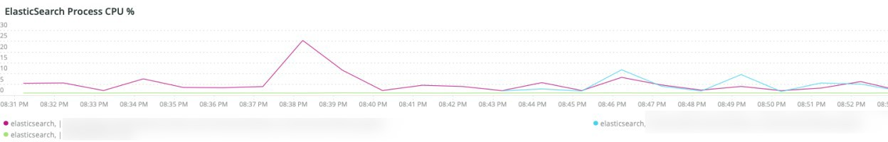
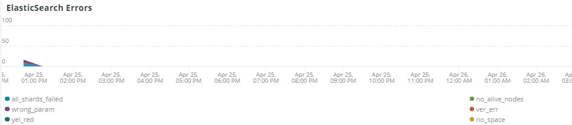

# 此 [!UICONTROL Elasticsearch] 標籤

## [!UICONTROL Cluster Status Summary]:

在選取的時間範圍內， **[!UICONTROL Cluster Status Summary]** frame顯示 [!DNL Elasticsearch] 群集已通過。 在此示例中，在選定的時間範圍內，群集在選定的時間範圍內處於綠色狀態一次，處於黃色狀態一次。

## [!UICONTROL Active Primary Shards]

此 **[!UICONTROL Active Primary Shards]** frame會根據所選帳戶的作用中主要分卡數量，顯示不同的數字 [!DNL Elasticsearch] 服務。

從 [!DNL Elasticsearch]:最終指南 [2.x]:

「In [可動態更新的索引](https://www.elastic.co/guide/en/elasticsearch/guide/2.x/dynamic-indices.html)，我們解釋說，碎片是盧塞納指數，而它 [!DNL Elasticsearch] 索引是碎片的集合。 您的應用程式會與索引對話， [!DNL Elasticsearch] 將您的請求路由至適當的碎片。 碎片是比例單位。 最小的索引是單個碎片的索引。 這可能足以滿足您的需求 — 單個分卡可以容納大量資料 — 但它限制了您擴展的能力。」

建立索引時，會使用該索引建立多個分片。 依預設，會為每個新索引分配五個主要分片，這表示一個索引可以跨五個節點擴散（每個節點一個分片）。 還有副本碎片。 這些主要用於故障轉移。 副本分片可以提供讀取請求。

## [!UICONTROL Active Shards in Cluster]

此 **[!UICONTROL Active Shards in Cluster]** frame顯示主分片和副本分片的總數 [!DNL Elasticsearch] 群集。

## [!UICONTROL Index health - this will show the index name and color status]

此框架顯示索引名稱和索引顏色狀態計數。 向下滾動表格時，您會看到具有黃色和紅色狀態的相同索引名稱。 27個索引名稱后面的數字是狀態顏色的計數。 如果為零，則在所選時間範圍內沒有索引實例處於該顏色狀態。

## [!UICONTROL Elasticsearch Status by node information]

此 **[!UICONTROL Elasticsearch Status by node information]** 框顯示 [!DNL Elasticsearch] 按顏色和按節點的群集狀態。 這有助於指出 [!DNL Elasticsearch] 群集在所選時間範圍內傳回什麼狀態。

## [!UICONTROL Elasticsearch index information]

此 **[!UICONTROL Elasticsearch index information]** 表顯示索引名稱、其所在節點、已索引文檔的數量、索引運行狀況，以及特定時間的索引大小（以MB表示）。

## [!UICONTROL Elasticsearch process CPU %]

此 **[!UICONTROL Elasticsearch process CPU %]** frame顯示進程CPU百分比，按 [!DNL Elasticsearch] 在所選時間範圍內處理。

## [!UICONTROL Elasticsearch Memory garbage collection]

[!DNL Elasticsearch] 是Java程式。 如果它在已分配的記憶體上運行得很低，它將啟動垃圾收集以釋放記憶體。 如果垃圾收集頻繁，則表明可能有太多索引或碎片用於分配的記憶體。 或許有機會清理指數和碎片，或 [!DNL Elasticsearch] 可能需要更多記憶體。

## [!UICONTROL Elasticsearch Index information]

建立和更新索引時，索引運行狀況可能會改變。

## [!UICONTROL Elasticsearch Index Size]

此 **[!UICONTROL Elasticsearch Index Size]** frame表示所選時間範圍內的索引名稱和大小。 它可能表示網站索引方式的問題。

## [!UICONTROL Elasticsearch Errors]

此 **[!UICONTROL Elasticsearch Errors]** 框架顯示錯誤 [!DNL Elasticsearch] 就像空間用盡一樣，從「黃色」切換為「紅色」狀態，當所有分片失敗時，當搜索、版本錯誤和所有節點不可用時都發生參數問題。

## [!UICONTROL Elasticsearch Unassigned Shards]:

未分配的分片將導致群集從綠色狀態移動到黃色狀態。
