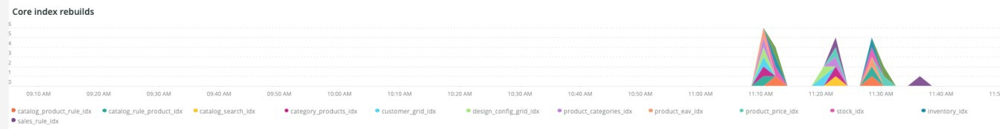
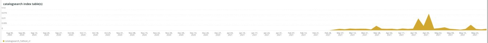

# 的 [!UICONTROL Indexing] 頁籤

的 **[!UICONTROL Indexing]** 頁籤嘗試解釋索引問題並確定潛在原因。

## [!UICONTROL Core index invalidated]

的 **[!UICONTROL Core index invalidated]** 框架查看所選時段內的索引無效。 如果索引與其他資源密集型業務同時進行 [!DNL crons]對現場資源來說呢，會是負擔很大。

* `%Catalog Product Rule indexer has been invalidated%`) `catalog_product_rule_idx_reset`
* `%Catalog Rule Product indexer has been invalidated%`) `catalog_rule_product_idx_reset`
* `%Catalog Search indexer has been invalidated%`) `catalog_search_idx_reset`
* `%Category Products indexer has been invalidated%`) `category_products_idx_reset`
* `%Customer Grid indexer has been invalidated%`) `customer_grid_idx_reset`
* `%Design Config Grid indexer has been invalidated%`) `design_config_grid_idx_`
* `%Product Categories indexer has been invalidated%`) `product_categories_idx_reset`
* `%Product EAV indexer has been invalidated%`) `product_eav_idx_reset`
* `%Product Price indexer has been invalidated%`) `product_price_idx_reset`
* `%Stock indexer has been invalidated%`) `stock_idx_reset`
* `%Inventory indexer has been invalidated%`) `inventory_idx_reset`
* `%Inventory indexer has been invalidated%`) `inventory_idx_reset`
* `%Sales Rule indexer has been invalidated%`) `sales_rule_idx_reset`

## [!UICONTROL Core index rebuilds]

的 **[!UICONTROL Core index rebuilds]** frame查看所選時間範圍內的核心索引重建。 下面是從日誌中分析的字串，以指示索引重建完成。

* `%Catalog Product Rule index has been rebuilt%`) `catalog_product_rule_idx`
* `%Catalog Rule Product index has been rebuilt%`) `catalog_rule_product_idx`
* `%Catalog Search index has been rebuilt%`) `catalog_search_idx`
* `%Category Products index has been rebuilt successfully%`) `category_products_idx`
* `%Customer Grid index has been rebuilt%`) `customer_grid_idx`
* `%Design Config Grid index has been rebuilt%`) `design_config_grid_idx`
* `%Product Categories index has been rebuilt%`) `product_categories_idx`
* `%Product EAV index has been rebuilt%`) `product_eav_idx`
* `%Product Price index has been rebuilt%`) `product_price_idx`
* `%Stock index has been rebuilt%`) `stock_idx`
* `%Inventory index has been rebuilt successfully%`) `inventory_idx`
* `%Product/Target Rule index has been rebuilt successfully%`) `prod_target_rule_idx`
* `%Sales Rule index has been rebuilt successfully%`) `sales_rule_idx`

## [!UICONTROL catalogsearch index table(s)]

的 **[!UICONTROL catalogsearch index table(s)]** frame查看所選時間範圍內的catalogsearch索引表。 此查詢正在查看針對具有 `%catalogsearch%` 的子菜單。

## [!UICONTROL product index table(s)]

的 **[!UICONTROL product index table(s)]** frame會查看所選時段內的產品索引表。 此查詢正在查看針對具有 `%product%` 的子菜單。
