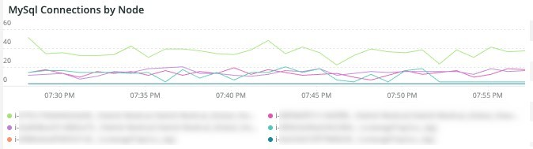
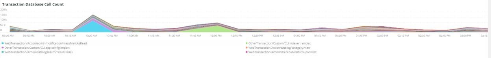

# 的 [!UICONTROL MySQL] 頁籤

## [!UICONTROL MySQL% free storage by node]

許多問題是由分配給MySQL的儲存中的MySQL儲存耗盡(`datadir` MySQL配置設定，預設值為 `/data/mysql`)或 `tmpdir` 空間用完了。 預設 `tmpdir` （MySQL設定）為 `/tmp`。 此框看 `/, /tmp` （如定義為單獨的裝載） `/data/mysql` %的免費儲存。 從MySQL 5.7版（MariaDB 10.2版）開始，未壓縮的臨時表將寫入到 `/data/mysql` 檔案(ibtmp1)中的目錄。 預設情況下，此檔案會自動展開而無限制。 由於它是表空間，因此不會減小大小，並且當MySQL重新啟動時，它將重置為12MB。

## [!UICONTROL MySQL Connections by Node]

的 **[!UICONTROL MySQL Connections by Node]** frame表示資料庫節點停機或連接量大的時段。

## [!UICONTROL MySQL Node Summary]

的 **[!UICONTROL MySQL Node Summary]** 該表顯示了資料庫節點詳細資訊，如軟體版本和實例類型（大小）。

## [!UICONTROL Galera Number of Nodes in cluster]

的 **[!UICONTROL Galera Number of Nodes in cluster]** frame顯示MySQL日誌中的資訊。 當節點加入並離開群集時，將只顯示選定時間段的消息。 如果某個節點在時間幀之前離開群集，則在該時間幀內不會出現任何消息。 如果您懷疑資料庫可能缺少一個節點，請將時間範圍擴展到更長的時間段，以查看您是否可以看到其他資訊。 如果在時間段內有資訊表示少於 [!DNL Galera] 群集中，展開時間範圍，查看您是否可以確定節點何時離開群集。

## [!UICONTROL MySQL shutdowns and starts]

的 **[!UICONTROL MySQL shutdowns and starts]** 幀檢測何時關閉節點。 [!DNL Galera] 節點將被逐出，並將自行逐出 [!DNL Galera] 的下界。 這通常會導致重新啟動MySQL服務。

## [!UICONTROL Galera log]

的 **[!UICONTROL Galera log]** frame顯示MySQL日誌中有關的特定信號計數 [!DNL Galera] 節點、其狀態以及 [!DNL Galera] 群集。

* 「%1047 WSREP尚未準備要應用程式使用的節點%」)作為「node_not_prep_for_use」
* 「%\[ERROR\] WSREP:無法讀取：wsrep_sst_xtrabackup-v2%」)作為「xtrabackup_read_fail」
* 「%\[ERROR\] WSREP:進程已完成，但出現錯誤：wsrep_sst_xtrabackup-v2 %&#39;)作為「xtrabackup_compl_werr」
* 「%\[ERROR\] WSREP:rbr write fail%」)作為「rbr_write_fail」
* 「%self leave%」)作為「susp_node」
* 「%members = 3/3（已加入/合計）%」)作為「3of3」
* 「%members = 2/3（已加入/合計）%」)作為「2of3」
* 「%members = 2/2%」)作為「2of2」
* 「%members = 1/2%」)作為「1of2」
* 「%members = 1/3%」)作為「1of3」
* 「%members = 1/1%」)作為「1of1」
* 「%\[注釋\] /usr/sbin/mysqld(mysqld 10)。%&#39;)作為&#39;sql_restart&#39;
* 「%仲裁：沒有狀態完整的節點：%&#39;)作為「no_node_count」
* 「%WSREP:成員0%」)作為「mem_0」
* 「%WSREP:成員1.0%」)作為「mem_1」
* 「%WSREP:成員2%&#39;)作為「mem2」
* 「%WSREP:已與組同步，已準備好連接%&#39;)為「就緒」
* 「%/usr/sbin/mysqld，版本：%」)，作為「mysql_restart_mysql.slow」
* 「%\[注釋\] WSREP:新建群集視圖：全局狀態：%&#39;)為&quot;galera_cluster_view_chng&quot;

## [!UICONTROL Galera Log by Host]

的 **[!UICONTROL Galera Log by Host]** 框與 **[!UICONTROL Galera log]** 框，但是它是按節點劃分的，以幫助進行故障排除。

## [!UICONTROL Database performance]

的 **[!UICONTROL Database performance]** frame顯示特定請求期間的資料庫效能。 通過在圖形下的彩色表徵圖中按一下每個度量，可以查看每個度量。 許多指標 [使用New Relic監視MySQL資料庫效能](https://newrelic.com/blog/how-to-relic/how-to-monitor-mysql) 框中。

* average(query.queriesPerSecond)
* average(query.slowQueriesPerSecond)
* average(db.createdTmpDiskTablesPerSecond)
* average(db.createdTmpFilesPerSecond)
* average(db.tablesLocksWaitedPerSecond)
* 平均(db.innodb.rowLockTimeAvg)
* 平均(db.innodb.rowLockWaitsPerSecond)

## [!UICONTROL Transaction Database Call Count]

的 **[!UICONTROL Transaction Database Call Count]** frame顯示每個事務方面進行的資料庫調用數。 這似乎是以行為中心，而不是陳述。

## [!UICONTROL Cron_schedule table updates]

的 **[!UICONTROL Cron_schedule table updates]** frame顯示所選時段的cron_schedule表的資料庫更新的最大持續時間。

## [!UICONTROL Slow Query Traces]

的 **[!UICONTROL Slow Query Traces]** frame顯示存在慢速查詢跟蹤的表和請求類型。 為超過5秒的查詢事務建立慢速查詢跟蹤。 此框架的重要之處在於更新查詢。 如果表正由 `UPDATE`。 `DELETE`, `INSERT` 語句，它們可以鎖定表一段時間。

甚至 `SELECT` 語句可以鎖定行（如果與FOR UPDATE一起使用）。

## [!UICONTROL Datastore Operations tables]

## [!UICONTROL Cron table change]

的 **[!UICONTROL Cron table change]** frame正在查找「無法獲取cron作業的鎖定：」錯誤消息，以及涉及特定PHP記憶體錯誤和鎖 `cron_schedule` 的子菜單。 如果 `cron_schedule` 表被鎖定(例如， `DELETE` 查詢)，它將阻止其他cron運行。

## [!UICONTROL Deadlocks]

的 **[!UICONTROL Deadlocks]** frame正在查看從MySQL日誌分析的以下字串。

* 「%PHP錯誤：允許的記憶體大小為%&#39;)，為php_mem_error
* 「%get lock（獲取鎖）」嘗試重新啟動事務，查詢為：DELETEFROM \&#39;cron_schedule%&#39;)為cron_sched_lock_del
* 「%」鎖定cron作業：indexer_reindex_all_invalid%&#39;)作為「lock_indexer_reindex_all_invalid%」
* 「%」鎖定cron作業：cron_schedule%」)作為「lock_cron_schedule」
* 「%lock for cron job:%」)作為「total_cron_lock」
* 「%一般錯誤：1205鎖等待超時超過%」)作為「sql_1205_lock」
* 「%ERROR 1213(40001):在嘗試獲取lock%」時發現死鎖)，作為&quot;sql_1213_lock&quot;
* 「%SQLSTATE」[40001]:序列化失敗：1213 Deadlock found%」)，作為「sql_1213_lock2」
* 「%」鎖定cron作業：indexer_update_all_views%&#39;)作為「lock_indexer_update_all_views」
* 「%」鎖定cron作業：sales_grid_order_invoice_async_insert%&quot;)，作為&quot;lock_sales_grid_order_invoice_async_insert&quot;,
* 「%」鎖定cron作業：staging_remove_updates%&#39;)作為「lock_staging_remove_updates」
* 「%」鎖定cron作業：sales_grid_order_shipment_async_insert%&#39;)作為「lock_sales_grid_order_shipment_async_insert」
* 「%」鎖定cron作業：amazon_payments_process_queued_resufts%」)作為「lock_amazon_payments_process_queued_resufts」
* 「%」鎖定cron作業：sales_send_order_shimpting_emails%&#39;)作為「lock_sales_send_order_shimpting_emails」
* 「%」鎖定cron作業：臨時_synchronize_entities_period%」，作為「lock_staging_synchronize_entities_period」
* 「%」鎖定cron作業：indexer_clean_all_changelogs%&#39;)作為「lock_indexer_clean_all_changelogs」
* 「%」鎖定cron作業：magento_targetrule_index_reindex%」)，作為「lock_magento_targetrule_index_reindex」
* 「%」鎖定cron作業：selter_send_all%」)作為「lock_send_all」
* 「%」鎖定cron作業：selter_send_all%」)作為「lock_send_all」
* 「%」鎖定cron作業：sales_send_order_emails%&#39;)作為「lock_sales_send_order_emails」
* 「%」鎖定cron作業：sales_send_order_creditmemo_emails%&#39;)作為「lock_sales_send_order_creditmemo_emails」
* 「%」鎖定cron作業：sales_grid_order_creditmemo_async_insert%&#39;)作為「lock_sales_grid_order_creditmemo_async_insert」
* 「%」鎖定cron作業：bulk_cleanup%」)作為「lock_bulk_cleanup」
* 「%」鎖定cron作業：flush_preview_quotas%&#39;)作為「lock_flush_preview_quotas」
* 「%」鎖定cron作業：sales_send_order_invoice_emails%&#39;)作為「lock_sales_send_order_invoice_emails」
* 「%」鎖定cron作業：sales_send_order_invoice_emails%&#39;)作為「lock_sales_send_order_invoice_emails」
* 「%」鎖定cron作業：capcha_delete_expired_images%&#39;)作為「lock_captcha_delete_expired_images」
* 「%」鎖定cron作業：magento_newrelicreporting_cron%」)作為「lock_magento_newrelicreporting_cron」
* 「%」鎖定cron作業：actification_failures_cleanup%&#39;)作為「lock_obted_authentication_failures_cleanup」
* 「%」鎖定cron作業：send_notification%」)作為「lock_send_notification」
* 「%」鎖定cron作業：magento_giftcardaccount_generage_codes_pool%」)作為「lock_magento_giftcardaccount_generage_codes_pool」
* 「%」鎖定cron作業：catalog_product_frontend_actions_flush%」)，作為「lock_catalog_product_frontend_actions_flush」
* 「%」鎖定cron作業：mysqlmq_clean_messages%&#39;)作為「mysqlmq_clean_messages」
* 「%」鎖定cron作業：catalog_product_attribute_value_synchronize%&#39;)作為「lock_catalog_product_attribute_value_synchronize」
* 「%」鎖定cron作業：ddg_automation_importer%」)作為「lock_ddg_automation_importer」
* 「%」鎖定cron作業：ddg_automation_reviews_and_wishlist%」)，作為「lock_ddg_automation_reviews_and_wishlist」
* 「%」鎖定cron作業：captcha_delete_old_attemps%&#39;)作為「lock_captcha_delete_old_attmets」
* 「%」鎖定cron作業：catalog_product_oblide_price_values_cleanup%&#39;)作為「lock_catalog_product_oblide_price_values_cleanup」
* 「%」鎖定cron作業：consumers_runner%」)作為「lock_consumers_runner」
* 「%」鎖定cron作業：ddg_automation_customer_subscriber_guest_sync%&#39;)，作為「lock_ddg_automation_customer_subscriber_guest_sync」
* 「%」鎖定cron作業：get_amazon_capture_updates%&#39;)作為「lock_get_amazon_capture_updates」
* 「%」鎖定cron作業：get_amazon_authorization_updates%&#39;)作為「lock_send_get_amazon_authorization_updates」
* 「%」鎖定cron作業：temando_process_platform_events%&#39;)作為「lock_temando_process_platform_events」
* 「%」鎖定cron作業：ddg_automation_status%」)作為「lock_ddg_automation_status」
* 「%」鎖定cron作業：ddg_automation_status%」)作為「lock_ddg_automation_status」
* 「%」鎖定cron作業：sales_clean_orders%&#39;)作為「lock_sales_clean_orders」
* 「%」鎖定cron作業：catalog_index_refresh_price%」)作為「lock_catalog_index_refresh_price」
* 「%」鎖定cron作業：magento_reward_balance_warning_notification%」)，作為「lock_magento_reward_balance_warning_notification」
* 「%」鎖定cron作業：analytics_update%」)作為「lock_analytics_update」
* 「%」鎖定cron作業：messageue_clean_hobded_locks%&#39;)為「lock_messagequeue_clean_obted_locks」
* 「%」鎖定cron作業：messageue_clean_hobded_locks%&#39;)為「lock_messagequeue_clean_obted_locks」
* 「%」鎖定cron作業：臨時_apply_version%」，作為「lock_staging_apply_version」
* 「%」鎖定cron作業：magento_reward_expire_points%」)，作為「lock_magento_reward_expire_points」
* 「%」鎖定cron作業：yotpo_yotpo_orders_sync%&#39;)作為「lock_yotpo_yotpo_orders_sync」
* 「%」鎖定cron作業：catalog_event_status_checker%」)作為「lock_catalog_event_status_checker」
* 「%」鎖定cron作業：ddg_automation_camping%」)作為「lock_ddg_automation_camping」
* 「%」鎖定cron作業：visitor_clean%」)作為「lock_visitor_clean」
* 「%」鎖定cron作業：scconnector_verify_website%」)作為「lock_scconnector_verify_weiste」
* 「%」鎖定cron作業：ddg_automation_email_templates%&#39;)作為「lock_ddg_automation_email_templates」
* 「%」鎖定cron作業：aggregate_sales_report_order_data%」)作為「lock_aggregate_sales_report_order_data」
* 「%」鎖定cron作業：ddg_automation_catalog_sync%&#39;)作為「lock_ddg_automation」

## [!UICONTROL DB Statistics]

的 **[!UICONTROL DB Statistics]** frame顯示每秒的刪除、寫入、讀取、更新和慢速查詢。

## [!UICONTROL Request frequency]

## [!UICONTROL Database Errors]

的 **[!UICONTROL Database Errors]** 框架顯示了各種資料庫 [警告和錯誤](https://mariadb.com/kb/en/mariadb-error-codes/)。

* 「%為臨時表分配的記憶體大小超過innodb_buffer_pool_size%」的20%，為「temp_tbl_buff_pool」
* 「%\[ERROR\] WSREP:rbr write fail%」)作為「rbr_write_fail」
* 「%mysqld」：磁碟已滿%」)，作為「disk_full」
* 「%錯誤號28%」)為「err_28」
* 「%rollback%」)作為「rollback」
* 「%表%」的外鍵約束失敗)作為「foreign_key_constraint」
* 「%錯誤代碼：1114%」)作為「sql_1114_full」%CRITICAL:SQLSTATE[HY000] [2006] MySQL Server已離開%」)，作為「sql_gone」
* 「%SQLSTATE」[HY000] [1040] 連接%」)作為「sql_1040」
* 「%關鍵：SQLSTATE[HY000] [2002]%&#39;)作為&#39;sql_2002&#39;
* 「%SQLSTATE」[08S01]:%&#39;)作為&#39;sql_1047&#39;
* 「%」[警告] 已中止連接%&#39;)，作為「aborted_conn」
* 「%SQLSTATE」[23000]:完整性約束衝突：%&#39;)作為&#39;sql_23000&#39;
* 「%1205鎖等待超時%」)作為「sql_1205」
* 「%SQLSTATE」[HY000] [1049] 未知資料庫%&#39;)為&#39;sql_1049&#39;
* 「%SQLSTATE」[42S02]:找不到基表或視圖：%&#39;)作為「sql_42S02」
* 「%一般錯誤：1114%」)作為「sql_1114」
* 「%SQLSTATE」[40001]%&#39;)作為&#39;sql_1213&#39;
* 「%SQLSTATE」[42S22]:找不到列：1054未知列%」)作為「sq1_1054」
* 「%SQLSTATE」[42000]:語法錯誤或訪問衝突：%&#39;)作為&#39;sql_42000&#39;
* 「%SQLSTATE」[21000]:基數衝突：%&#39;)作為「sql_1241」
* 「%SQLSTATE」[22003]:%&#39;)作為&#39;sql_22003&#39;
* 「%SQLSTATE」[HY000] [9000] IP地址%&#39;的客戶端)作為&#39;sql_9000&#39;
* 「%SQLSTATE」[HY000]:常規錯誤：2014%」)作為「sql_2014」
* 「%1927連接已死亡%」)，作為「sql_1927」
* 「%1062 \[ERROR\] InnoDB:%&#39;)作為「sql_1062_e」
* 「%」[注釋] WSREP:正在刷新記憶體映射到磁碟……%&#39;)作為「mem_map_flush」
* 「%內部MariaDB錯誤代碼：1146%」)作為「sql_1146」
* 「%內部MariaDB錯誤代碼：1062%」)作為「sql_1062」·「%1062 [警告] InnoDB:%&#39;)作為「sql_1062_w」
* 「%內部MariaDB錯誤代碼：1064%」)作為「sql_1064」
* 「%InnoDB:檔案%&quot;中的斷言失敗)作為「assertion_err」
* 「%mysqld_safe當前運行的進程數：0%」)作為「mysql_oom」
* 「%\[ERROR\] mysqld獲得信號%」)作為「mysql_sigterm」
* 「%1452無法添加%」)作為「sql_1452」
* 「%ERROR 1698%」)作為「sql_1698」
* 「%SQLSTATE」[HY000]:常規錯誤：3%」)作為「cnt_wrt_tmp」
* 「%一般錯誤：1 %&#39;)作為&#39;sql_syntax&#39;
* 「%42S22%」)作為「sql_42S22」
* 「%InnoDB:錯誤（重複鍵）%&#39;)為「innodb_dup_key」 FROM日誌TIMESERIES

## [!UICONTROL DB Error Table]

的 **[!UICONTROL DB Error Table]** 框顯示與 **[!UICONTROL Database Errors]** 框架，但可以按節點和表格格式查看。 請參閱 [MariaDB錯誤代碼](https://mariadb.com/kb/en/mariadb-error-codes/) 的子菜單。

## [!UICONTROL Database Traces]

的 **[!UICONTROL Database Traces]** frame按選定時間線的類型顯示資料庫跟蹤。

## [!UICONTROL Database processes]

的 **[!UICONTROL Database processes]** frame顯示資料庫進程、環境和節點標識符。

## [!UICONTROL MySQL Non-Sleeping Threads by Node]

的 **[!UICONTROL MySQL Non-Sleeping Threads by Node]** frame顯示到資料庫的連接線程。 此幀顯示活動線程。

## [!UICONTROL MySQL Running and Sleeping Threads by environment]

的 **[!UICONTROL MySQL Running and Sleeping Threads by environment]** frame顯示與資料庫的活動連接和休眠連接。 如果與緩慢查詢已進入休眠狀態的資料庫有連接，則會有休眠連接。 休眠連接可以是被鎖定的行或表阻止的資料庫查詢。 這些休眠連接還保持PHP工作程式連接。

## [!UICONTROL MySQL mem used by node]

的 **[!UICONTROL MySQL mem used by node]** frame顯示MySQL對記憶體的節點使用情況。 在較大的站點上，此幀可能是連續條形，使用的記憶體值為GB。

## [!UICONTROL Database mysql-slow.log]

的 **[!UICONTROL Database mysql-slow.log]** frame顯示在 `mysql-slow.log` 檔案。

