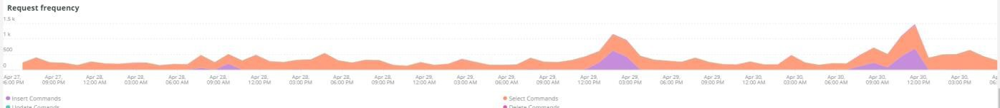

# 此 [!UICONTROL MySQL] 標籤

## [!UICONTROL MySQL% free storage by node]

許多問題是由指派給MySQL的儲存體中的MySQL用盡所造成(`datadir` MySQL組態設定，預設為 `/data/mysql`)或 `tmpdir` 空間不足。 預設 `tmpdir` （MySQL設定）為 `/tmp`. 此 **[!UICONTROL MySQL% free storage by node]** 框架會檢視 `/, /tmp` （若定義為個別掛載）和 `/data/mysql` 可用儲存空間百分比。 從MySQL 5.7版（MariaDB 10.2版）開始，未壓縮 `tmp` 表格會寫入 `tmp` 表格空間在 `/data/mysql` 目錄(ibtmp1)。 依預設，此檔案會無限制自動展開。 因為它是表格空間，所以不會縮減大小，並在MySQL重新啟動時重設為12MB。

## [!UICONTROL MySQL Connections by Node]

此 **[!UICONTROL MySQL Connections by Node]** frame表示資料庫節點中斷或大量連線的期間。

## [!UICONTROL MySQL Node Summary]

此 **[!UICONTROL MySQL Node Summary]** 此表格顯示資料庫節點詳細資訊，例如軟體版本和執行處理型別（大小）。

## [!UICONTROL Galera Number of Nodes in cluster]

此 **[!UICONTROL Galera Number of Nodes in cluster]** 框架會顯示MySQL記錄檔中的資訊。 當節點加入並離開叢集時，只會顯示所選時間範圍的訊息。 如果節點在時間範圍之前離開叢集，則該時間範圍內將不存在任何訊息。 如果您懷疑資料庫可能缺少節點，請將時間範圍擴展至較大的期間，以檢視是否可以看到其他資訊。 如果時段內有資訊指出小於中的所有節點 [!DNL Galera] 叢集時，請展開時間範圍，檢視您是否能判斷節點何時離開叢集。

## [!UICONTROL MySQL shutdowns and starts]

此 **[!UICONTROL MySQL shutdowns and starts]** frame會偵測節點何時關閉。 此 [!DNL Galera] 節點將被逐出，並從 [!DNL Galera] 節點。 這通常會導致MySQL服務重新啟動。

## [!UICONTROL Galera log]

此 **[!UICONTROL Galera log]** frame顯示來自MySQL記錄檔的特定訊號計數，涉及 [!DNL Galera] 節點、節點狀態和的狀態變更 [!DNL Galera] 叢集。

* &#39;%1047 WSREP尚未準備應用程式use%&#39;的節點)為&#39;node_not_prep_for_use&#39;
* &#39;%\[ERROR\] WSREP：無法從wsrep_sst_xtrabackup-v2%&#39;讀取為&#39;xtrabackup_read_fail&#39;
* &#39;%\[ERROR\] WSREP：處理程式已完成，但發生錯誤： wsrep_sst_xtrabackup-v2 %&#39;)為&#39;xtrabackup_compl_w_err&#39;
* &#39;%\[ERROR\] WSREP： rbr write fail%&#39;)作為&#39;rbr_write_fail&#39;
* &#39;%self-leave%&#39;)作為&#39;susp_node&#39;
* &#39;%members = 3/3 （已加入/總計）%&#39;)作為&#39;3of3&#39;
* &#39;%members = 2/3 （已加入/總計）%&#39;)作為&#39;2of3&#39;
* &#39;%members = 2/2%&#39;)作為&#39;2of2&#39;
* &#39;%members = 1/2%&#39;)作為&#39;1of2&#39;
* &#39;%members = 1/3%&#39;)作為&#39;1of3&#39;
* &#39;%members = 1/1%&#39;)作為&#39;1of1&#39;
* &#39;%\[注意\] /usr/sbin/mysqld (mysqld 10.%&#39;) as&#39;sql_restart&#39;
* &#39;%Quorum：沒有具有完整狀態的節點：%&#39;)為&#39;no_node_count&#39;
* &#39;%WSREP： Member 0%&#39;)作為&#39;mem_0&#39;
* &#39;%WSREP： Member 1.0%&#39;)作為&#39;mem_1&#39;
* &#39;%WSREP：成員2%&#39;)為&#39;mem2&#39;
* &#39;%WSREP：與群組同步，已準備好連線%&#39;)為&#39;ready&#39;
* &#39;%/usr/sbin/mysqld，版本：%&#39;)為&#39;mysql_restart_mysql.slow&#39;
* &#39;%\[Note\] WSREP：新叢集檢視：全域狀態：%&#39;)為&#39;galera_cluster_view_chng&#39;

## [!UICONTROL Galera Log by Host]

此 **[!UICONTROL Galera Log by Host]** 框架與 **[!UICONTROL Galera log]** 框架，但會依節點劃分，以協助疑難排解。

## [!UICONTROL Database performance]

此 **[!UICONTROL Database performance]** 框架顯示特定要求期間的資料庫效能。 您可以按一下圖表下方的彩色圖示，檢視每個量度。 中呼叫的許多量度 [使用New Relic監視MySQL資料庫效能](https://newrelic.com/blog/how-to-relic/how-to-monitor-mysql) 在此框架中找到。

* average(query.queriesPerSecond)
* average(query.slowQueriesPerSecond)
* average(db.createdTmpDiskTablesPerSecond)
* average(db.createdTmpFilesPerSecond)
* average(db.tablesLocksWaitedPerSecond)
* average(db.innodb.rowLockTimeAvg)
* average(db.innodb.rowLockWaitsPerSecond)

## [!UICONTROL Transaction Database Call Count]

此 **[!UICONTROL Transaction Database Call Count]** frame會顯示每個交易facet進行的資料庫呼叫數目。 這似乎是以列為中心，而不是陳述式。

## [!UICONTROL Cron_schedule table updates]

此 **[!UICONTROL Cron_schedule table updates]** frame會顯示所選時段內cron_schedule資料表的資料庫更新時間長度上限。

## [!UICONTROL Slow Query Traces]

此 **[!UICONTROL Slow Query Traces]** frame會顯示存在緩慢查詢追蹤的表格和請求型別。 系統會為需要超過五秒的查詢交易建立緩慢的查詢追蹤。 更新查詢對於此框架而言是重要的。 如果表格更新者： `UPDATE`， `DELETE`、和 `INSERT` 陳述式，它們可能會鎖定表格一段時間。

平均 `SELECT` 如果與FOR UPDATE一起使用，陳述式可能會鎖定列。

## [!UICONTROL Datastore Operations tables]

## [!UICONTROL Cron table change]

此 **[!UICONTROL Cron table change]** frame會尋找「無法取得cron作業的鎖定：」錯誤訊息，以及特定的PHP記憶體錯誤和涉及 `cron_schedule` 表格。 如果 `cron_schedule` 表格已鎖定(例如，被 `DELETE` 查詢正在對其執行)，它將封鎖其他cron的執行。

## [!UICONTROL Deadlocks]

此 **[!UICONTROL Deadlocks]** frame會檢視從MySQL記錄檔剖析的下列字串：

* &#39;%PHP嚴重錯誤：允許的記憶體大小為%&#39;)為php_mem_error
* &#39;%get lock；嘗試重新啟動交易，查詢為：DELETE自\&#39;cron_schedule%&#39;)為cron_sched_lock_del
* &#39;% lock for cron job： indexer_reindex_all_invalid%&#39;)作為&#39;lock_indexer_reindex_all_invalid%&#39;
* &#39;%鎖定cron工作： cron_schedule%&#39;)作為&#39;lock_cron_schedule&#39;
* &#39;% lock for cron job：%&#39;)作為&#39;total_cron_lock&#39;
* &#39;%General error： 1205 Lock wait timeout exceeded%&#39;)為&#39;sql_1205_lock&#39;
* &#39;%ERROR 1213 (40001)：嘗試取得lock%&#39;)時發現死結，為&#39;sql_1213_lock&#39;
* &#39;%SQLSTATE[40001]：序列化失敗： 1213 Deadlock found%&#39;)為&#39;sql_1213_lock2&#39;
* &#39;% lock for cron job： indexer_update_all_views%&#39;)作為&#39;lock_indexer_update_all_views&#39;
* &#39;% lock for cron job： sales_grid_order_invoice_async_insert%&#39;)作為&#39;lock_sales_grid_order_invoice_async_insert&#39;，
* &#39;%鎖定cron工作： staging_remove_updates%&#39;)為&#39;lock_staging_remove_updates&#39;
* &#39;% lock for cron job： sales_grid_order_shipment_async_insert%&#39;)作為&#39;lock_sales_grid_order_shipment_async_insert&#39;
* &#39;%鎖定cron工作： amazon_payments_process_queued_refunds%&#39;)為&#39;lock_amazon_payments_process_queued_refunds&#39;
* &#39;% lock for cron job： sales_send_order_shipment_emails%&#39;)作為&#39;lock_sales_send_order_shipment_emails&#39;
* &#39;%鎖定cron工作： staging_synchronize_entities_period%&#39;)作為&#39;lock_staging_synchronize_entities_period&#39;
* &#39;% lock for cron job： indexer_clean_all_changelogs%&#39;)設為&#39;lock_indexer_clean_all_changelogs&#39;
* &#39;%鎖定cron工作： magento_targetrule_index_reindex%&#39;)，作為&#39;lock_magento_targetrule_index_reindex&#39;
* &#39;% lock for cron job： newsletter_send_all%&#39;)為&#39;lock_newsletter_send_all&#39;
* &#39;% lock for cron job： newsletter_send_all%&#39;)為&#39;lock_newsletter_send_all&#39;
* &#39;%鎖定cron工作： sales_send_order_emails%&#39;)作為&#39;lock_sales_send_order_emails&#39;
* &#39;%鎖定cron工作： sales_send_order_creditmemo_emails%&#39;)作為&#39;lock_sales_send_order_creditmemo_emails&#39;
* &#39;% lock for cron job： sales_grid_order_creditmemo_async_insert%&#39;)作為&#39;lock_sales_grid_order_creditmemo_async_insert&#39;
* &#39;% lock for cron job： bulk_cleanup%&#39;)作為&#39;lock_bulk_cleanup&#39;
* &#39;% lock for cron job： flush_preview_quotas%&#39;)作為&#39;lock_flush_preview_quotas&#39;
* &#39;%鎖定cron工單： sales_send_order_invoice_emails%&#39;)作為&#39;lock_sales_send_order_invoice_emails&#39;
* &#39;%鎖定cron工單： sales_send_order_invoice_emails%&#39;)作為&#39;lock_sales_send_order_invoice_emails&#39;
* &#39;% lock for cron job： captcha_delete_expired_images%&#39;)作為&#39;lock_captcha_delete_expired_images&#39;
* &#39;% lock for cron job： magento_newrelicreporting_cron%&#39;)設為&#39;lock_magento_newrelicreporting_cron&#39;
* &#39;% lock for cron job： outded_authentication_failures_cleanup%&#39;)作為&#39;lock_outded_authentication_failures_cleanup&#39;
* &#39;%鎖定cron工作： send_notification%&#39;)作為&#39;lock_send_notification&#39;
* &#39;%鎖定cron工作： magento_giftcardaccount_generation_codes_pool%&#39;)為&#39;lock_magento_giftcardaccount_generation_codes_pool&#39;
* &#39;%鎖定cron工單： catalog_product_frontend_actions_flush%&#39;)作為&#39;lock_catalog_product_frontend_actions_flush&#39;
* &#39;%鎖定cron工作： mysqlmq_clean_messages%&#39;)為&#39;mysqlmq_clean_messages&#39;
* &#39;%鎖定cron工作： catalog_product_attribute_value_synchronize%&#39;)作為&#39;lock_catalog_product_attribute_value_synchronize&#39;
* &#39;%鎖定cron工作： ddg_automation_importer%&#39;)，作為&#39;lock_ddg_automation_importer&#39;
* &#39;% lock for cron job： ddg_automation_reviews_and_wishlist%&#39;)作為&#39;lock_ddg_automation_reviews_and_wishlist&#39;
* &#39;%鎖定cron工作： captcha_delete_old_attempts%&#39;)為&#39;lock_captcha_delete_old_attempts&#39;
* &#39;%鎖定cron工作： catalog_product_outdoated_price_values_cleanup%&#39;)為&#39;lock_catalog_product_outdoated_price_values_cleanup&#39;
* &#39;%鎖定cron工作： consumers_runner%&#39;)，作為&#39;lock_consumers_runner&#39;
* &#39;%鎖定cron工作： ddg_automation_customer_subscriber_guest_sync%&#39;)，作為&#39;lock_ddg_automation_customer_subscriber_guest_sync&#39;
* &#39;% lock for cron job： get_amazon_capture_updates%&#39;)作為&#39;lock_get_amazon_capture_updates&#39;
* &#39;% lock for cron job： get_amazon_authorization_updates%&#39;)作為&#39;lock_send_get_amazon_authorization_updates&#39;
* &#39;% lock for cron job： temando_process_platform_events%&#39;)作為&#39;lock_temando_process_platform_events&#39;
* &#39;% lock for cron job： ddg_automation_status%&#39;)作為&#39;lock_ddg_automation_status&#39;
* &#39;% lock for cron job： ddg_automation_status%&#39;)作為&#39;lock_ddg_automation_status&#39;
* &#39;% lock for cron job： sales_clean_orders%&#39;)作為&#39;lock_sales_clean_orders&#39;
* &#39;% lock for cron job： catalog_index_refresh_price%&#39;)作為&#39;lock_catalog_index_refresh_price&#39;
* &#39;%鎖定cron工作： magento_reward_balance_warning_notification%&#39;)為&#39;lock_magento_reward_balance_warning_notification&#39;
* &#39;%鎖定cron工作： analytics_update%&#39;)作為&#39;lock_analytics_update&#39;
* &#39;% lock for cron job： messagequeue_clean_outdated_locks%&#39;)為&#39;lock_messagequeue_clean_outdated_locks&#39;
* &#39;% lock for cron job： messagequeue_clean_outdated_locks%&#39;)為&#39;lock_messagequeue_clean_outdated_locks&#39;
* &#39;% lock for cron job： staging_apply_version%&#39;)作為&#39;lock_staging_apply_version&#39;
* &#39;% lock for cron job： magento_reward_expire_points%&#39;)設為&#39;lock_magento_reward_expire_points&#39;
* cron工作的&#39;%鎖定：yotpo_yotpo_orders_sync%&#39;)為&#39;lock_yotpo_yotpo_orders_sync&#39;
* &#39;%鎖定cron工作： catalog_event_status_checker%&#39;)，作為&#39;lock_catalog_event_status_checker&#39;
* &#39;%鎖定cron工作： ddg_automation_campaign%&#39;)，作為&#39;lock_ddg_automation_campaign&#39;
* &#39;%鎖定cron工作： visitor_clean%&#39;)作為&#39;lock_visitor_clean&#39;
* &#39;%鎖定cron工作： scconnector_verify_website%&#39;)作為&#39;lock_scconnector_verify_website&#39;
* &#39;% lock for cron job： ddg_automation_email_templates%&#39;)作為&#39;lock_ddg_automation_email_templates&#39;
* &#39;% lock for cron job： aggregate_sales_report_order_data%&#39;)作為&#39;lock_aggregate_sales_report_order_data&#39;
* &#39;% lock for cron job： ddg_automation_catalog_sync%&#39;)作為&#39;lock_ddg_automation

## [!UICONTROL DB Statistics]

此 **[!UICONTROL DB Statistics]** frame會顯示每秒的刪除、寫入、讀取列、更新及緩慢查詢。

## [!UICONTROL Request frequency]

## [!UICONTROL Database Errors]

此 **[!UICONTROL Database Errors]** 框架顯示各種資料庫 [警告和錯誤](https://mariadb.com/kb/en/mariadb-error-codes/)：

* &#39;%配置給暫存資料表的記憶體大小超過innodb_buffer_pool_size%&#39;的20%，因為&#39;temp_tbl_buff_pool&#39;
* &#39;%\[ERROR\] WSREP： rbr write fail%&#39;)作為&#39;rbr_write_fail&#39;
* &#39;%mysqld：磁碟已滿%&#39;)做為&#39;disk_full&#39;
* &#39;%Error number 28%&#39;)作為&#39;err_28&#39;
* &#39;%rollback%&#39;)作為&#39;rollback&#39;
* &#39;%Foreign key constraint對資料表%&#39;失敗)，因為&#39;foreign_key_constraint&#39;
* &#39;%Error_code： 1114%&#39;)作為&#39;sql_1114_full&quot;%CRITICAL： SQLSTATE[HY000] [2006] MySQL伺服器已經離開%&#39;)為&#39;sql_gone&#39;
* &#39;%SQLSTATE[HY000] [1040] 「%sql_1040」有太多連線)
* &#39;%CRITICAL： SQLSTATE[HY000] [2002]%&#39;)，作為&#39;sql_2002&#39;
* &#39;%SQLSTATE[08S01]：%&#39;)，作為&#39;sql_1047&#39;
* &#39;%[警告] 已中止連線%&#39;)為&#39;aborted_conn&#39;
* &#39;%SQLSTATE[23000]：完整性條件約束違規：%&#39;)為&#39;sql_23000&#39;
* &#39;%1205 Lock等待逾時%&#39;)為&#39;sql_1205&#39;
* &#39;%SQLSTATE[HY000] [1049] 未知的資料庫%&#39;)做為&#39;sql_1049&#39;
* &#39;%SQLSTATE[42S02]：找不到基底資料表或檢視：%&#39;)為&#39;sql_42S02&#39;
* &#39;%General error： 1114%&#39;)作為&#39;sql_1114&#39;
* &#39;%SQLSTATE[40001]%&#39;)，作為&#39;sql_1213&#39;
* &#39;%SQLSTATE[42S22]：找不到欄： 1054 Unknown column%&#39;)為&#39;sq1_1054&#39;
* &#39;%SQLSTATE[42000]：語法錯誤或存取違規：%&#39;)為&#39;sql_42000&#39;
* &#39;%SQLSTATE[21000]：基數違規：%&#39;)為&#39;sql_1241&#39;
* &#39;%SQLSTATE[22003]：%&#39;)，作為&#39;sql_22003&#39;
* &#39;%SQLSTATE[HY000] [9000] IP位址為%的使用者端)做為&#39;sql_9000&#39;
* &#39;%SQLSTATE[HY000]：一般錯誤： 2014%&#39;)為「sql_2014」
* &#39;%1927連線已終止%&#39;)為&#39;sql_1927&#39;
* &#39;%1062 \[ERROR\] InnoDB：%&#39;)做為&#39;sql_1062_e&#39;
* 「%[注意] WSREP：正在將記憶體對應排清至磁碟……%&#39;)做為&#39;mem_map_flush&#39;
* &#39;%Internal MariaDB錯誤碼： 1146%&#39;)為&#39;sql_1146&#39;
* &#39;%Internal MariaDB錯誤碼： 1062%&#39;)為&#39;sql_1062&#39; * &#39;%1062 [警告] InnoDB：%&#39;)，作為&#39;sql_1062_w&#39;
* &#39;%Internal MariaDB錯誤碼： 1064%&#39;)為&#39;sql_1064&#39;
* &#39;%InnoDB：檔案中的宣告失敗%&#39;)為&#39;assertion_err&#39;
* &#39;%mysqld_safe目前執行的處理序數目： 0%&#39;)為&#39;mysql_oom&#39;
* &#39;%\[ERROR\] mysqld取得signal%&#39;)為&#39;mysql_sigterm&#39;
* &#39;%1452 Cannot add%&#39;)為&#39;sql_1452&#39;
* &#39;%ERROR 1698%&#39;)作為&#39;sql_1698&#39;
* &#39;%SQLSTATE[HY000]：一般錯誤： 3%&#39;)作為&#39;cnt_wrt_tmp&#39;
* &#39;%General error： 1 %&#39;)作為&#39;sql_syntax&#39;
* &#39;%42S22%&#39;)做為&#39;sql_42S22&#39;
* &#39;%InnoDB： Error （索引鍵重複）%&#39;)為&#39;innodb_dup_key&#39; FROM Log TIMESERIES

## [!UICONTROL DB Error Table]

此 **[!UICONTROL DB Error Table]** 影格顯示的資訊與 **[!UICONTROL Database Errors]** 框架，但您可以按節點和表格格式檢視它。 另請參閱 [MariaDB錯誤代碼](https://mariadb.com/kb/en/mariadb-error-codes/) 以取得詳細資訊。

## [!UICONTROL Database Traces]

此 **[!UICONTROL Database Traces]** frame會依型別顯示所選時間軸上的資料庫追蹤。

## [!UICONTROL Database processes]

此 **[!UICONTROL Database processes]** frame會顯示資料庫程式、環境和節點識別碼。

## [!UICONTROL MySQL Non-Sleeping Threads by Node]

此 **[!UICONTROL MySQL Non-Sleeping Threads by Node]** frame顯示到資料庫的連線執行緒。 此框架顯示作用中的執行緒。

## [!UICONTROL MySQL Running and Sleeping Threads by environment]

此 **[!UICONTROL MySQL Running and Sleeping Threads by environment]** frame會顯示使用中及休眠的資料庫連線。 如果有連線到緩慢查詢進入休眠狀態的資料庫，就會有休眠連線。 休眠連線可以是被鎖定的資料列或資料表封鎖的資料庫查詢。 這些休眠連線也會保留PHP工作者連線。

## [!UICONTROL MySQL mem used by node]

此 **[!UICONTROL MySQL mem used by node]** frame顯示MySQL的記憶體節點使用狀況。 在較大的網站上，此框架可能是連續長條，其中使用的記憶體大小為GB。

## [!UICONTROL Database mysql-slow.log]

此 **[!UICONTROL Database mysql-slow.log]** frame顯示位於以下位置的查詢陳述式型別： `mysql-slow.log` 檔案跨越所選的時間範圍。
