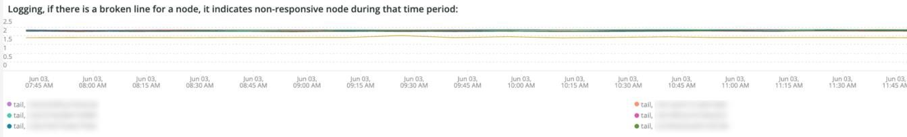

# 此 [!DNL Infra] 標籤

此 **[!DNL Infra]** 索引標籤可隔離基礎架構問題的問題和原因。 進一步說明您可以在標籤上看到的框架。

## [!UICONTROL Service Alerts – Infrastructure Alerts by Application name]

此 **[!UICONTROL Service Alerts – Infrastructure Alerts by Application name]** 圖表顯示服務收集的服務警示。 [!DNL New Relic] 基礎結構代理程式。 這會顯示服務重新啟動，其中許多與部署有關。

## [!UICONTROL Inode usage by mount]

此 **[!UICONTROL Inode usage by mount]** 影格顯示 [!DNL inode] 在選取的時間範圍內以掛載方式使用。 即使節點用完後可能有足夠的儲存空間 [!DNL inodes]，就會顯示缺少可用的儲存空間。 移除檔案（尤其是小型檔案）會釋放空間，讓 [!DNL inodes] 可用。

## [!UICONTROL vCPU tier view over timeline GREATER 2 weeks]

此 **[!UICONTROL vCPU tier view over timeline GREATER 2 weeks]** 影格會顯示超過兩週的選定時間範圍內的vCPU層檢視。 此框架會檢視指派給的vCPU數量 [!DNL New Relic] 顯示應用程式名稱。

## [!UICONTROL vCPU tier view over timeline]

此 **[!UICONTROL vCPU tier view over timeline]** 影格會顯示所選超過24小時時間範圍內的vCPU層檢視。 此框架會檢視指派給的vCPU數量 [!DNL New Relic] 顯示應用程式名稱。 它會顯示叢集向上和向下移動。

## [!UICONTROL vCPU tier view over timeline BY NODE]

此 **[!UICONTROL vCPU tier view over timeline BY NODE]** 框架會依節點顯示所選時間範圍內的vCPU層檢視。 此框架有助於偵測節點遺失，或節點已放大或縮小時。 依節點依時間表的vCPU層檢視，應檢視少於24小時的時間表。

## [!UICONTROL Instance details]

此 **[!UICONTROL Instance details]** 表格顯示每個的執行處理詳細資訊 [!DNL New Relic] 應用程式。

## [!UICONTROL Logging, if there is a broken line for a node, it indicates non-responsive node during that time period]

此 **[!UICONTROL Logging, if there is a broken line for a node, it indicates non-responsive node during that time period]** 框架顯示一段時間內無回應的節點。
