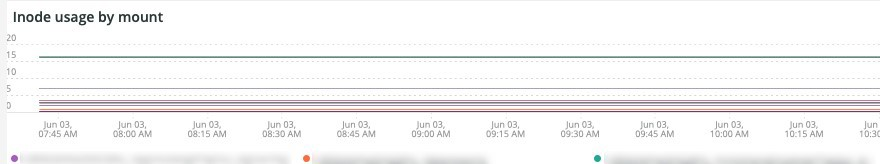

# 的 [!DNL Infra] 頁籤

的 **[!DNL Infra]** 頁籤可隔離問題和導致基礎架構問題的原因。 進一步介紹了您在頁籤上看到的幀。

## [!UICONTROL Service Alerts – Infrastructure Alerts by Application name]

的 **[!UICONTROL Service Alerts – Infrastructure Alerts by Application name]** 圖形顯示由 [!DNL New Relic] 基礎架構代理。 這將顯示服務重新啟動，許多與部署相關聯。

## [!UICONTROL Inode usage by mount]

的 **[!UICONTROL Inode usage by mount]** 幀顯示 [!DNL inode] 在選定時間段內按裝載使用。 即使儲存空間可能很大，但如果節點耗盡 [!DNL inodes]將顯示缺少可用儲存。 刪除檔案（尤其是小檔案）將釋放空間並建立 [!DNL inodes] 的下界。

## [!UICONTROL vCPU tier view over timeline GREATER 2 weeks]

的 **[!UICONTROL vCPU tier view over timeline GREATER 2 weeks]** frame顯示在選定時間跨兩週以上的時間段內vCPU層視圖。 此幀查看分配給的vCPU數 [!DNL New Relic] 顯示應用程式名稱。

## [!UICONTROL vCPU tier view over timeline]

的 **[!UICONTROL vCPU tier view over timeline]** frame顯示了超過24小時的選定時間段內的vCPU層視圖。 此幀查看分配給的vCPU數 [!DNL New Relic] 顯示應用程式名稱。 它將顯示群集的升級和降級。

## [!UICONTROL vCPU tier view over timeline BY NODE]

的 **[!UICONTROL vCPU tier view over timeline BY NODE]** frame按節點顯示所選時段的vCPU層視圖。 此幀有助於檢測節點丟失或節點大小過大或過小時。 vCPU層視圖（按節點）按時間線顯示，應查看時間線（少於24小時）。

## [!UICONTROL Instance details]

的 **[!UICONTROL Instance details]** 表顯示了每個實例的詳細資訊 [!DNL New Relic] 的子菜單。

## [!UICONTROL Logging, if there is a broken line for a node, it indicates non-responsive node during that time period]

的 **[!UICONTROL Logging, if there is a broken line for a node, it indicates non-responsive node during that time period]** 幀顯示一個時間段內的無響應節點。
