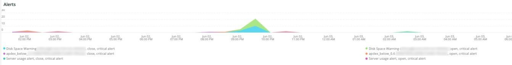

# 此 [!DNL QuickView] 標籤

此 **[!UICONTROL QuickView]** 索引標籤說明您可能會看到的不同警報型別，包括磁碟空間不足和伺服器使用量不足的警報型別。 進一步說明標籤的框架。

## [!UICONTROL Alerts]

此 **[!UICONTROL Alerts]** frame會顯示不同的警報，包括所選時間範圍內的磁碟空間警告和伺服器使用量警報。 此框架會檢視資料庫表格作業，包括 `SELECT`， `DELETE`、和 `UPDATE` 在選取的時間範圍內。

## [!UICONTROL Upsize / Downsize by node]

此 **[!UICONTROL Upsize / Downsize by node]** 影格會依所選時間範圍內的節點顯示向上和向下調整。 這是用來評估在選取的時段內，叢集大小是否有變更。

## [!UICONTROL CPU Utilization]

此 **[!UICONTROL CPU Utilization]** 影格顯示所選時間範圍內節點的CPU使用率。
