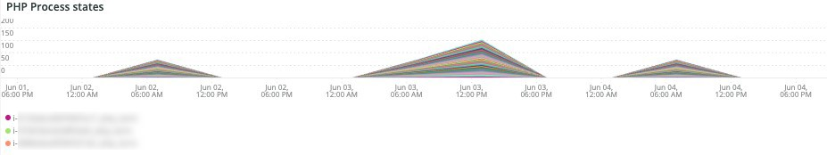

# 的 [!UICONTROL PHP] 頁籤

的 **菲律賓比索** 頁籤顯示PHP進程問題，以便對PHP問題進行更深入的分析。

## [!UICONTROL PHP active process details]

的 **[!UICONTROL PHP active process details]** frame顯示選定時間範圍內的PHP進程，包括php-fpm。

## [!UICONTROL PHP process load (# of PHP processes and % of CPU load)]

的 **[!UICONTROL PHP process load (# of PHP processes and % of CPU load)]** frame顯示選定時間範圍內PHP-FPM進程的CPU負載。

## [!UICONTROL PHP Memory detail]

的 **[!UICONTROL PHP Memory detail]** frame顯示選定時間範圍內PHP進程的記憶體使用情況。

## [!UICONTROL PHP CPU Utilization]

的 **[!UICONTROL PHP CPU Utilization]** frame顯示選定時間範圍內PHP進程的CPU百分比利用率。

## [!UICONTROL PHP Process states]

的 **[!UICONTROL PHP Process states]** frame顯示選定時間範圍內的PHP進程狀態。 PHP進程終止並重新啟動時顯示。 注意不顯示重新啟動的已終止PHP進程。

* 「%NOTICE:正在終止……%&#39;)作為「php_term」
* 「%通知：退出，拜拜！%&#39;)作為「php_exit」
* 「%通知：fpm正在運行，pid%&#39;)作為&#39;fpm_start
* 「%NOTICE:準備處理連接%」)作為「php_ready」

## [!UICONTROL PHP Errors]

的 **[!UICONTROL PHP Errors]** frame顯示選定時間範圍內PHP工作人員錯誤的數量。 分析並顯示的錯誤消息包括：

* 「%worker_connections不足%」)作為「worker」
* 「%PHP錯誤：允許的記憶體大小！%&#39;)作為「mem_size」
* 「%退出信號11(SIGSEGV)%」)，為「sig_11」
* 「%exed on signal 7(SIGBUS)%」)作為「sig_7」
* 「%increase pm.start_servers%」)為「pmstart_serv」
* 「%max_children%」)作為「max_children_cnt」
* 「%PHP錯誤：允許的記憶體大小為%&#39;)，作為「mem_exhst_coun」
* 「%無法為池%」分配記憶體)作為「opc_mem_count」
* 「%Warning Interned字串緩衝區溢出%」)作為「opc_str_buf」
* 「%非法字串offsetl%」)作為「opc_sv_comments」
* 「%PHP錯誤：未捕獲的RedisException:讀取連接%&#39;上的錯誤)為「php_exc」

## [!UICONTROL PHP processes count]

的 **[!UICONTROL PHP processes count]** frame顯示選定時間範圍內的PHP進程計數。

## [!UICONTROL Database Errors]

的 **[!UICONTROL Database Errors]** frame顯示所選時段內的資料庫錯誤。 分析的錯誤包括：

* 「%為臨時表分配的記憶體大小超過innodb_buffer_pool_size%」的20%)作為「temp_tbl_buff_pool」
* 「%\[ERROR\] WSREP:rbr write fail%」)作為「rbr_write_fail」
* 「%mysqld」：磁碟已滿%」)，作為「disk_full」
* 「%錯誤號28%」)為「err_28」
* 「%rollback%」)作為「rollback」
* 「%表%」的外鍵約束失敗)作為「foreign_key_constraint」
* 「%錯誤代碼：1114%」)作為「sql_1114_full」
* 「%關鍵：SQLSTATE[HY000] [2006] MySQL Server已離開%」)，作為「sql_gone」
* 「%SQLSTATE」[HY000] [1040] 連接%」)作為「sql_1040」
* 「%關鍵：SQLSTATE[HY000] [2002]%&#39;)作為&#39;sql_2002&#39;
* 「%SQLSTATE」[08S01]:%&#39;)作為&#39;sql_1047&#39;
* 「%」[警告] 已中止連接%&#39;)，作為「aborted_conn」
* 「%SQLSTATE」[23000]:完整性約束衝突：%&#39;)作為&#39;sql_23000&#39;
* 「%1205鎖等待超時%」)作為「sql_1205」
* 「%SQLSTATE」[HY000] [1049] 未知資料庫%&#39;)為&#39;sql_1049&#39;
* 「%SQLSTATE」[42S02]:找不到基表或視圖：%&#39;)作為「sql_42S02」
* 「%一般錯誤：1114%」)作為「sql_1114」
* 「%SQLSTATE」[40001]%&#39;)作為&#39;sql_1213&#39;
* 「%SQLSTATE」[42S22]:找不到列：1054未知列%」)作為「sq1_1054」
* 「%SQLSTATE」[42000]:語法錯誤或訪問衝突：%&#39;)，作為&#39;sql_42000&#39;
* 「%SQLSTATE」[21000]:基數衝突：%&#39;)作為「sql_1241」
* 「%SQLSTATE」[22003]:%&#39;)作為&#39;sql_22003&#39;
* 「%SQLSTATE」[HY000] [9000] IP地址%&#39;的客戶端)作為&#39;sql_9000&#39;
* 「%SQLSTATE」[HY000]:常規錯誤：2014%」)作為「sql_2014」
* 「%1927連接已死亡%」)，作為「sql_1927」
* 「%1062 \[ERROR\] InnoDB:%&#39;)作為「sql_1062_e」
* 「%」[注釋] WSREP:正在刷新記憶體映射到磁碟……%&#39;)作為「mem_map_flush」
* 「%內部MariaDB錯誤代碼：1146%」)作為「sql_1146」
* 「%內部MariaDB錯誤代碼：1062%」)作為「sql_1062」 *「%1062 [警告] InnoDB:%&#39;)作為「sql_1062_w」
* 「%內部MariaDB錯誤代碼：1064%」)作為「sql_1064」
* 「%InnoDB:檔案%&quot;中的斷言失敗)作為「assertion_err」
* 「%mysqld_safe當前運行的進程數：0%」)作為「mysql_oom」
* 「%\[ERROR\] mysqld獲得信號%」)作為「mysql_sigterm」
* 「%1452無法添加%」)作為「sql_1452」
* 「%ERROR 1698%」)作為「sql_1698」
* 「%SQLSTATE」[HY000]:常規錯誤：3%」)作為「cnt_wrt_tmp」
* 「%一般錯誤：1 %&#39;)作為&#39;sql_syntax&#39;
* 「%42S22%」)作為「sql_42S22」
* 「%InnoDB:錯誤（重複鍵）%&#39;)為「innodb_dup_key」

## [!UICONTROL Database traces]

的 **[!UICONTROL Database traces]** frame顯示資料庫跟蹤資訊。 此幀與所選時間線的APM事務摘要視圖對齊。

## [!UICONTROL Database mysql-slow.log]

的 **[!UICONTROL Database mysql-slow.log]** frame顯示在 `mysql-slow.log` 檔案。
