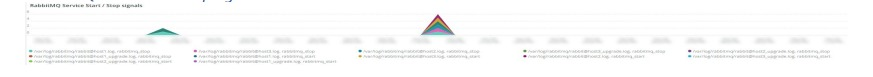
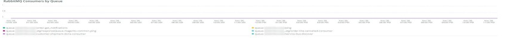

# 的 [!UICONTROL RabbitMQ] 頁籤

的 **[!UICONTROL RabbitMQ]** 頁籤中的資訊 [!DNL RabbitMQ] 信號。

## [!UICONTROL RabbitMQ Infrastructure events]

的 **[!UICONTROL RabbitMQ Infrastructure events]** 框架顯示涉及 [!DNL RabbitMQ] 所選時間範圍內發生的錯誤：

* %響應 [錯誤] 用於節點 [rabbit@host1]:意外的http響應（來自%&#39;）作為「unexped_resp_node1」
* 「%響應」 [錯誤] 用於節點 [rabbit@host2]:意外的http響應（來自%&#39;）作為「unexped_resp_node2」
* 「%響應」 [錯誤] 用於節點 [rabbit@host3]:意外的http響應（來自%&#39;）作為「unexped_resp_node3」
* 「%響應」 [錯誤] 用於節點 [rabbit@host3]:獲取「http://localhost:15672/api/healthchecks/node/rabbit@host3」：context deadline exceed%&#39;)作為「node3_timeout_exceeded」
* 「%響應」 [錯誤] 用於節點 [rabbit@host1]:獲取「http://localhost:15672/api/healthchecks/node/rabbit@host1」：context deadline exceed%)，作為「node1_timeout_exceeded」
* 「%響應」 [錯誤] 用於節點 [rabbit@host2]:獲取「http://localhost:15672/api/healthchecks/node/rabbit@host2」：context deadline exceed%&#39;)，作為&quot;node2_timeout_exceeded&quot;
* 「%401未授權%」)作為「401_unauth」
* 「%401未授權%」)作為「401_unauth」
* %服務已重新啟動：rbitmq-server%&#39;)作為「rmq_service_restart」
* 「%響應」 [失敗] 用於節點 [rabbit@host1]:nodedown%」)作為「rmq_node1_down」
* 「%響應」 [失敗] 用於節點 [rabbit@host2]:nodedown%」)作為「rmq_node2_down」
* 「%響應」 [失敗] 用於節點 [rabbit@host2]:nodedown%」)作為「rmq_node2_down」
* 「%實體已修改：exchange/bindings.destination%&#39;)作為「rmq_entity_modified」
* 「%實體已修改：exchange/bindings.destination%&#39;)作為「rmq_entity_modified」
* 「%實體已修改：queue/exclusive%」)作為「rmq_entity_created_q_exclusive」%已修改實體：queue/auto_delete%&#39;)作為「rmq_entity_q_delete」
* 「%實體已修改：queue/durable%」)作為「rmq_entity_modified_q_durable」
* 「%實體已修改：版本/管理%」)，作為「rmq_entity_modified_ver_mgt」
* 「%實體已修改：版本/管理%」)，作為「rmq_entity_modified_ver_mgt」

## [!UICONTROL RabbitMQ service start/stop signals]

此框顯示 [!DNL RabbitMQ] 在所選時間段內發生的服務啟動/停止信號：

* 「%RabbitMQ」被要求停止……%&#39;)作為「rabbitmq_stop」
* 「%正在啟動RabbitMQ%」)，作為「rabbitmq_start」

## [!UICONTROL RabbitMQ errors]

此框顯示 [!DNL RabbitMQ] 在選定時間段內發生的錯誤：

* 「%exit，原因為{case_clause,timeout}和stacktrace {rabbit_mgmt_wm_healthchecks%&#39;}」為「exit_timeout」
* 「%client意外關閉TCP連接%」)作為「client_closed_tcp_conn」
* 「%at undefed exit（在上下文shutdown_error%中由於原因關閉）」)為「undf_exit
* 「%從不允許的節點%」嘗試連接)作為「disalled_node」
* 「%closing AMQP connection%」)作為「rmq_err_amqp_conn」

## [!UICONTROL RabbitMQ node status]

* 「節點rabbit@host1上的%rabbitdown%」)作為「rmq_node1_down」
* 「節點rabbit@host2上的%rabbitdown%」)作為「rmq_node2_down」
* 「節點rabbit@host3上的%rabbitdown%」)作為「rmq_node3_down」
* 「節點rabbit@host1上的%rabbit up%」)作為「rmq_node1_up」
* 「節點rabbit@host2上的%rabbit up%」)作為「rmq_node2_up」
* 「節點rabbit@host3上的%rabbit up%」)作為「rmq_node3_up」

## [!UICONTROL RabbitMQ Message High-Level Summary status by Queue]

的 **[!UICONTROL RabbitMQ Message High-Level Summary status by Queue]** 圖形顯示 [!DNL RabbitMQ] 為所選時間段排隊。

## [!UICONTROL RabbitMQ Message Detail Summary]

* 「%report.ERROR:Cron Job consulers_runner有錯誤：NOT_FOUND - no queue%&#39;)作為「queue_err」
* 「%report.ERROR:Cron Job consulers_runner有錯誤：NOT_FOUND - no queue%&#39;)作為「queue_err」
* 「%auth」)作為「auth」
* 「%closing AMQP connection%」)為「close_conn」

## [!UICONTROL RabbitMQ Queue Consumption MB]

的 **[!UICONTROL RabbitMQ Queue Consumption MB]** 圖形顯示每個佔用的位元組數 [!DNL RabbitMQ] 在所選時間段內排隊。

## [!UICONTROL RabbitMQ Published Messages by Queue]

的 **[!UICONTROL RabbitMQ Published Messages by Queue]** 圖形顯示每個佔用的位元組數 [!DNL RabbitMQ] 在所選時間段內排隊。

## [!UICONTROL RabbitMQ Published Message Throughput by Queue]

的 **[!UICONTROL RabbitMQ Published Message Throughput by Queue]** 圖形顯示每秒發佈的平均消息數 [!DNL RabbitMQ] 在所選時間段內排隊。

## [!UICONTROL RabbitMQ Total Message Throughput by Queue]

的 **[!UICONTROL RabbitMQ Total Message Throughput by Queue]** 圖形顯示每秒的平均消息總數 [!DNL RabbitMQ] 在所選時間段內排隊。

## [!UICONTROL RabbitMQ Consumers by Queue]

的 **[!UICONTROL RabbitMQ Consumers by Queue]** 圖表顯示每個用戶的平均總數 [!DNL RabbitMQ] 在所選時間段內排隊。
