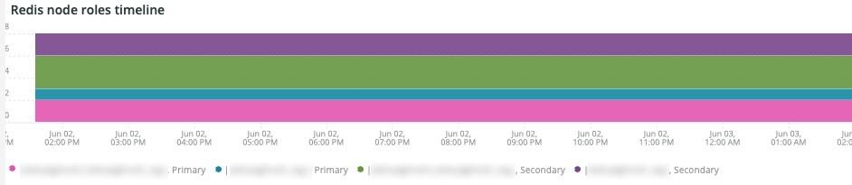
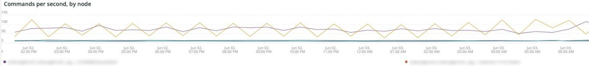

# 的 [!DNL Redis] 頁籤

## [!UICONTROL Redis Node summary]

的 **[!UICONTROL Redis Node summary]** 包含環境中的所有節點。 上例包括共用暫存的節點。 生產上有一個主節點和兩個輔助節點，也有一個主節點和兩個輔助節點處於分段狀態。

## [!UICONTROL Redis node detail]

的 **[!UICONTROL Redis node detail]** 幀表示環境， [!DNL Redis] 角色、軟體版本和節點大小。

## [!UICONTROL Redis node roles timeline]

的 **[!UICONTROL Redis node roles timeline]** 幀指示丟失 [!DNL Redis] 服務。 如果行下降，則表示行所代表的特定角色已丟失節點。

## [!UICONTROL Connection to Redis]

的 **[!UICONTROL Connection to Redis]** frame顯示來自 [!DNL New Relic Redis] 示例資料。 它顯示連接計數 [!DNL New Relic] 應用程式（環境）和節點。

## [!UICONTROL Commands per second by node]

的 **[!UICONTROL Commands per second by node]** 框顯示 [!DNL Redis] 按節點在所選時間範圍內每秒的命令。

## [!UICONTROL Redis % of memory used]

的 **[!UICONTROL Redis % of memory used]** frame顯示使用的最大記憶體百分比 [!DNL Redis] 伺服器。

## [!UICONTROL Redis used memory]

的 **[!UICONTROL Redis used memory]** 幀顯示節點記憶體的使用率(GB/MB)。

## [!UICONTROL Redis changes since last db save]

[!DNL Redis] 是記憶體駐留並將資訊保存到儲存中。 的 **[!UICONTROL Redis changes since last db save]** frame指示自上次資料庫保存到儲存後對記憶體所做的更改數。 請參閱 [Redis持久性](https://redis.io/docs/manual/persistence/) 來解釋 [!DNL Redis's] 持久性。

## [!UICONTROL Redis synchronization from Log]

的 **[!UICONTROL Redis synchronization from Log]** 框架重點介紹在 [!DNL Redis] 同步或由於同步問題而發生的錯誤。 有關 [!DNL Redis]，請參閱 [[!DNL Redis] 文檔](https://redis.io/docs/)。
