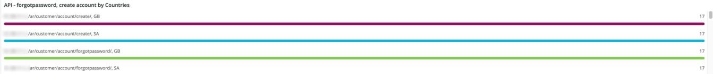

# 此 [!UICONTROL Security] 標籤

此 **[!UICONTROL Security]** 標籤說明安全性問題並隔離其可能原因。 此外，還說明標籤的框架。

## [!UICONTROL API calls by IP, details by URL]

此 **[!UICONTROL API calls by IP, details by URL]** 影格會顯示所選時間範圍內依IP排列的API呼叫數。 此框架會顯示IP位址和該IP位址所存取的API URL。

## [!UICONTROL Forgot Password]

此 **[!UICONTROL Forgot Password]** 存取範圍顯示所選時間範圍內忘記密碼的嘗試次數。 針對IP位址的高活動可能是網站上的攻擊。

## [!UICONTROL Create Account access]

此 **[!UICONTROL Create Account access]** 框架顯示所選時間範圍內新帳戶活動的數量。 來自單一IP位址的高活動可能表示有攻擊。

## [!UICONTROL POST activities]

此 **[!UICONTROL POST activities]** 框架顯示 `POST` 網站活動，面向 `client_ip` 從 [!DNL Fastly] 記錄。 它也會顯示IP位址存取的URL。

## [!UICONTROL POST activities summary table]

此 **[!UICONTROL POST activities summary table]** 框架顯示摘要 `POST` 網站活動，面向 `client_ip` 從 [!DNL Fastly] 記錄。 它也會顯示IP位址所存取URL的計數。 該計數適用於所選的時間範圍。

## [!UICONTROL POST activities details table]

此 **[!UICONTROL POST activities details table]** 框架顯示 `POST` 網站的活動 [!DNL Fastly] 記錄。 它也會顯示以下連結中的所有詳細資料： [!DNL Fastly] 記錄這些請求。 僅限於最後2000個請求。

## [!UICONTROL Guest Carts activities]

此 **[!UICONTROL Guest Carts activities]** frame會以存取的IP位址和URL為分面，顯示所選時間範圍內的訪客購物車活動數。 客用購物車可能用於梳理攻擊。 此框架顯示存取客體購物車URL的請求總數。

## [!UICONTROL API – forgot password, create account by Countries]

此 **[!UICONTROL API – forgot password, create account by Countries]** frame顯示所選時間範圍內已建立的帳戶數以及重設忘記密碼的請求。 它會以多面向顯示請求的原產國。 此框架著重於請求的來源國家/地區。

## [!UICONTROL API - forgot password, create account by Countries and IP address]

此 **[!UICONTROL API - forgot password, create account by Countries and IP address]** frame顯示所選時間範圍內已建立的帳戶數以及重設忘記密碼的請求。 它會以面向顯示IP位址、存取的URL，以及請求的來源國家/地區。 此框架著重於IP計數。

## [!UICONTROL Guest cart activities by IP]

此 **[!UICONTROL Guest cart activities by IP]** 框架會依選定時間範圍內的IP顯示訪客購物車活動。

## [!UICONTROL Guest cart activities by Countries]

此 **[!UICONTROL Guest cart activities by Countries]** 影格會依國家/地區顯示選定時間範圍內的訪客購物車活動。

