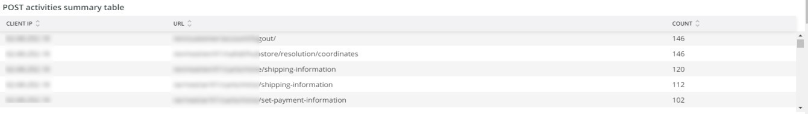

# [!UICONTROL Security]索引標籤

**[!UICONTROL Security]**&#x200B;標籤說明安全性問題並隔離其可能原因。 此外，標籤框架也予以說明。

## [!UICONTROL API calls by IP, details by URL]

**[!UICONTROL API calls by IP, details by URL]**&#x200B;框架顯示所選時間範圍內依IP進行的API呼叫數目。 此框架會顯示IP位址和該IP位址所存取的API URL。

依IP進行

## [!UICONTROL Forgot Password]

**[!UICONTROL Forgot Password]**&#x200B;存取範圍顯示所選時間範圍內嘗試忘記密碼的次數。 針對IP位址的高活動可能是網站上的攻擊。

## [!UICONTROL Create Account access]

**[!UICONTROL Create Account access]**&#x200B;框架顯示所選時間範圍內的新帳戶活動數。 來自單一IP位址的高活動可能表示有攻擊。

## [!UICONTROL POST activities]

**[!UICONTROL POST activities]**&#x200B;框架顯示網站的`POST`活動，從`client_ip`記錄檔植入[!DNL Fastly]。 它也會顯示IP位址所存取的URL。

## [!UICONTROL POST activities summary table]

**[!UICONTROL POST activities summary table]**&#x200B;框架顯示網站的摘要`POST`活動，從`client_ip`記錄檔植入[!DNL Fastly]。 它也會顯示IP位址所存取URL的計數。 此計數適用於所選的時間範圍。

## [!UICONTROL POST activities details table]

**[!UICONTROL POST activities details table]**&#x200B;框架顯示`POST`記錄檔中網站的[!DNL Fastly]活動。 它也會顯示這些要求的[!DNL Fastly]記錄檔中的所有詳細資料。 僅限於最後2000個請求。

## [!UICONTROL Guest Carts activities]

**[!UICONTROL Guest Carts activities]**&#x200B;框架顯示所選時間範圍內的訪客購物車活動數，並以IP位址和存取的URL為分面。 客用購物車可能用於梳理攻擊。 此框架顯示訪客購物車URL的存取要求總數。

## [!UICONTROL API – forgot password, create account by Countries]

**[!UICONTROL API – forgot password, create account by Countries]**&#x200B;框架顯示所選時間範圍內已建立的帳戶數以及重設忘記密碼的請求。 它會以多面向顯示請求的原始國家/地區。 此框架著重於請求的原始國家/地區。

## [!UICONTROL API - forgot password, create account by Countries and IP address]

**[!UICONTROL API - forgot password, create account by Countries and IP address]**&#x200B;框架顯示所選時間範圍內已建立的帳戶數以及重設忘記密碼的請求。 它會以多面形式顯示IP位址、已存取的URL以及要求的原始國家/地區。 此框架著重於IP計數。

## [!UICONTROL Guest cart activities by IP]

**[!UICONTROL Guest cart activities by IP]**&#x200B;框架會依所選時間範圍內的IP顯示訪客購物車活動。

## [!UICONTROL Guest cart activities by Countries]

**[!UICONTROL Guest cart activities by Countries]**&#x200B;框架會依所選時間範圍內的國家/地區顯示訪客購物車活動。

