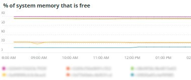

# 此 [!UICONTROL Summary] 標籤

此 [!UICONTROL Summary] 標籤 [!DNL Observation for Adobe Commerce] 旨在快速查看網站所遇到的一些問題，以協助您自動解決或找出網站問題的潛在根源。 附加頁簽提供有關元件服務、資料庫、基礎架構和進程狀態的更深層資訊。

## [!UICONTROL Transaction Overview]

### [什麼是交易？](https://docs.newrelic.com/docs/apm/transactions/intro-transactions/transactions-new-relic-apm/#:%7E:text=transactions%20are%20reported.-,What%20is%20a%20transaction%3F,work%20in%20a%20software%20application。&amp;text=對於%20APM%2C%20it%20將%20經常，當%20時%20響應%20is%20已發送)

「At [!DNL New Relic]，事務被定義為軟體應用程式中的一個工作邏輯單元。 具體來說，它指組成該工作單位的函式呼叫和方法呼叫。 它通常指的是網路交易，這代表從應用程式收到Web請求到回應傳送的活動。」

### 交易類型：

**Web:** Web事務是使用HTTP請求啟動的。 對於大多陣列織來說，這些事件代表以客戶為中心的互動，因此是要監控的最重要的交易。

**非Web:** 非Web事務不會隨Web請求啟動。 它們可以包括非Web工作進程、後台進程、指令碼、消息隊列活動和其他任務。

如果您查看 **[!UICONTROL Transaction Overview]** 在上方框架中，有近53,000筆交易，平均APDEX分數為。76，其中95%的交易是在2.313秒內發生的。 如果短時間內有APDEX點擊，則較緊的時間範圍可能顯示與目前平均值的偏差。

## [!UICONTROL 404 page errors frame]

此 **[!UICONTROL 404 page errors]** frame列出 [URI](https://en.wikipedia.org/wiki/Uniform_Resource_Identifier) 以及所選時間範圍內404個頁面錯誤的計數。

## [!UICONTROL % of Storage Free frame]

此 **[!UICONTROL % of Storage Free]** frame顯示群集中所有節點中儲存裝載的平均空閒百分比。 例如，如果您有三個節點叢集，該框架會顯示\&lt;mount point=&quot;&quot;>, \&lt;environment name=&quot;&quot;>. 如果三個節點之間存在差異，則此幀可能具有欺騙性。 變異的範例是， `/data/mysql` 裝載點空閒是三個節點群集中的不同值。 在 [!UICONTROL MySQL] 按節點名稱刻划掛載點的頁簽，以更精確地查看 `/data/mysql` 每個節點上都可免費儲存。

## [!UICONTROL % of system memory that is free frame]

此 **空閒的系統記憶體百分比** 幀按節點顯示每個節點上空閒的系統記憶體量。

## [!UICONTROL Swap memory free in bytes]

此 **[!UICONTROL Swap memory free in bytes]** 幀按節點顯示節點上空閒的SWAP記憶體量。

## [!UICONTROL CPU % by host]

所有環境和節點的匯總顯示在 **[!UICONTROL CPU % by host]** 框。 您應取消選取非生產環境。 另請注意，生產環境的所有節點都不存在的任何例項。 有關CPU利用率高的更多提示，請參閱 [疑難排解在Adobe Commerce上使用New Relic的效能](https://experienceleague.adobe.com/docs/commerce-knowledge-base/kb/troubleshooting/miscellaneous/troubleshoot-performance-using-new-relic-on-magento-commerce.html).

## [!UICONTROL Alerts during timeframe]

此 **[!UICONTROL Alerts during timeframe]** 顯示所有警報，包括 [!UICONTROL Managed Alerts] 由Adobe Commerce支援新增。

## [!UICONTROL CPU Usage]

若 **[!UICONTROL CPU Usage]** 框架空白，表示基礎架構應用程式 [!DNL New Relic] 未啟用。 如果您的網站位於入門網站，您將看不到此資訊。 如果您的網站位於Pro，請開啟 [支援票證](https://experienceleague.adobe.com/docs/commerce-knowledge-base/kb/help-center-guide/magento-help-center-user-guide.html) 有 [!DNL New Relic Infrastructure] 已為您的網站啟用。

## [!UICONTROL Average Response Time]

此 **[!UICONTROL Average Response Time]** 圖表顯示交易（網頁等）的平均回應時間。

## [!UICONTROL Long duration cron_schedule updates]

此 **[!UICONTROL cron_schedule]** 表在cron作業的開始和結束時寫入。 持續時間較長的cron作業可能表示更新此表格時的延遲，這可能表示cron堆疊或計畫cron的方式問題。

## [!UICONTROL Response Code]

此 **[!UICONTROL Response Code]** frame是web流量和請求回應代碼的良好指示。 是 [!DNL New Relic's] 事務資料，且它由多面 `httpResponseCode` 傳回。

## [!UICONTROL Web Traffic volume compared with one week ago Magento Managed Alerts Information]

此框架顯示過去一週與當周的比較Web流量。

## [!UICONTROL Deployment Log Entries]

此 **[!UICONTROL Deployment Log Entries]** frame會顯示部署和雲日誌條目的計數，並根據部署日誌名稱設定計數。

## [!UICONTROL Deployment State]

此 **[!UICONTROL Deployment State]** 從部署日誌中構建facet的特定部署階段。 以下是記錄和Facet名稱中計算的一些階段範例：

**部署日誌階段：**

* 「%正在啟動生成命令%」)作為「start_gen」
* 「%git apply /app/vendor/magento/ece-tools/patches%」)作為「apply_patches」
* 「%Set標誌：.static_content_deploy%&#39;)作為&#39;SCD&#39;
* 「%NOTICE:生成命令已完成%」)，作為「gen_compl」
* 「%NOTICE:部署完成%」)作為「deploy_compl」
* 「%NOTICE:開始部署後。%&#39;)作為&#39;start_pdeploy&#39;
* 「%NOTICE:後部署完成%」)作為「pdeploy」
* &#39;%deploy-complete%&#39;)作為&#39;cl_deploy_compl&#39;

## [!UICONTROL IP Frequency]

此 **[!UICONTROL IP Frequency]** frame會從 [!DNL Fastly] 記錄檔。 具有這些狀態的Web請求會到達來源伺服器，並增加伺服器的負載。 它以頻率顯示前20個地址。 此框架可用於檢測網站上的IP攻擊或重載源。

## [!UICONTROL IP Response – top 20 URLs in duration]

此 **[!UICONTROL IP Response – top 20 URLs in duration]** frame會顯示回應中持續時間最長的URL。 它可能表示大型影像檔案或頁面、API或回應持續時間最長的頁面。

## [!UICONTROL API Calls by IP]

此 **[!UICONTROL API Calls by IP]** frame有助於識別來自API URL之請求的API和IP位址的大量流量。

## [!UICONTROL API Calls by IP, details by URL]

此 **[!UICONTROL API Calls by IP, details by URL]** frame提供針對API的大量流量的詳細資訊，以及提出請求的URL的詳細資訊。

## [!UICONTROL IP Frequency Rate per minute]

有時很難判斷哪個IP位址在其他幀中有最多的請求。 此 **[!UICONTROL IP Frequency Rate per minute]** frame會顯示每分鐘每個IP位址的速率。

## [!UICONTROL Potential Bots]

此 **[!UICONTROL Potential Bots]** frame會以「NULL」或「%bot%」之類的名稱查看請求。 通常，「%bot%」request_user_agent遵循 `robots.txt` 檔案。

## [!UICONTROL Transaction Errors]

此 **[!UICONTROL Transaction Errors]** frame顯示交易錯誤的計數 [!DNL New Relic].

## [!UICONTROL Nginx access by node]

此 **[!UICONTROL Nginx access by node]** 框架從 `access.log` 按節點。 查看負載是否均勻分佈是很有幫助的。 它通常會顯示節點何時掉落。 該框架還顯示整個站點的負載。

## [!UICONTROL Galera Log]

[[!DNL Galera]](https://galeracluster.com/library/galera-documentation.pdf) 用於資料庫群集。 此幀聚焦於來自 [!UICONTROL Galera] 群集。 這些信號集中在進入和退出群集的節點上，這是維護資料庫資料完整性的正常行為。 節點會保持同步，因為 [!UICONTROL Galera] 群集狀態更改。

**清單 [!UICONTROL Galera] 狀態變更：**

* 「%1047 WSREP尚未準備用於應用程式的節點%」)作為「node_not_prep_for_use」
* 「%\[ERROR\] WSREP:無法讀取：wsrep_sst_xtrabackup-v2%&#39;)作為&#39;xtrabackup_read_fail&#39;
* 「%\[ERROR\] WSREP:已完成進程，但出現錯誤：wsrep_sst_xtrabackup-v2 %&#39;)作為&#39;xtrabackup_compl_w_err&#39;
* 「%\[ERROR\] WSREP:rbr write fail%&#39;)作為&#39;rbr_write_fail&#39;
* 「%selfleave%」)作為「susp_node」
* 「%members = 3/3（已加入/總計）%」)作為「3of3」
* 「%members = 2/3（已加入/總計）%」)作為「2of3」
* 「%members = 2/2%」)作為「2of2」*「%members = 1/2%」)作為「1of2」*「%members = 1/3%」)作為「1of3」
* 「%members = 1/1%」)作為「1of1」
* 「%\[注意\] /usr/sbin/mysqld(mysqld 10)。%&#39;)作為&#39;sql_restart&#39;
* 「%仲裁：沒有狀態為「%」的節點)作為「no_node_count」
* 「%WSREP:成員0%」)作為「mem_0」
* 「%WSREP:成員1.0%」)作為「mem_1」
* 「%WSREP:成員2%」)作為「mem2」
* 「%WSREP:與組同步，已準備好連接%&#39;)，為「就緒」
* 「%/usr/sbin/mysqld，版本：%」)作為「mysql_restart_mysql.slow」
* 「%\[注意\] WSREP:新群集視圖：全局狀態：%&#39;)作為&#39;galera_cluster_view_chng&#39;

如果狀態經常變更，這些訊號可能表示儲存、記憶體或查詢問題。

## [!UICONTROL Database errors]

**檢測到的資料庫錯誤或消息清單：**

* 「%為臨時表分配的記憶體大小超過innodb_buffer_pool_size%」的20%)，作為「temp_tbl_buff_pool」
* 「%\[ERROR\] WSREP:rbr write fail%&#39;)作為&#39;rbr_write_fail&#39;
* &#39;%mysqld:磁碟已滿%」)作為「disk_full」
* 「%錯誤號28%」)作為「err_28」
* &#39;%rollback%&#39;)作為&#39;rollback&#39;
* &#39;%外鍵約束對表%&#39;失敗)為&#39;foreign_key_constraint&#39;
* 「%錯誤代碼：1114%」)作為「sql_1114_full」
* 「%關鍵：SQLSTATE\[HY000\] \[2006\] MySQL Server已消失%&#39;)作為「sql_gone」
* 「%SQLSTATE\[HY000\] \[1040\]連接太多%」)作為「sql_1040」
* 「%關鍵：SQLSTATE\[HY000\] \[2002\]%&#39;)作為&#39;sql_2002&#39;
* 「%SQLSTATE\[08S01\]:%」)作為「sql_1047」
* 「%\[警告\]中止連接%」)作為「aborted_conn」
* 「%SQLSTATE\[23000\]:完整性約束衝突：%&#39;)作為&#39;sql_23000&#39;
* 「%1205鎖定等待超時%」)作為「sql_1205」
* 「%SQLSTATE\[HY000\] \[1049\]未知資料庫%」)作為「sql_1049」
* 「%SQLSTATE\[42S02\]:找不到基表或視圖：%&#39;)作為「sql_42S02」
* 「%常規錯誤：1114%」)作為「sql_1114」
* 「%SQLSTATE\[40001\]%」)作為「sql_1213」
* 「%SQLSTATE\[42S22\]:未找到列：1054未知欄%」)作為「sq1_1054」
* 「%SQLSTATE\[42000\]:語法錯誤或訪問違規：%&#39;)作為&#39;sql_42000&#39;
* 「%SQLSTATE\[21000\]:基數違規：%&#39;)作為&#39;sql_1241&#39;
* 「%SQLSTATE\[22003\]:%」)作為「sql_22003」
* 「%SQLSTATE\[HY000\] \[9000\]具有IP地址%的客戶端」)作為「sql_9000」
* 「%SQLSTATE\[HY000\]:一般錯誤：2014%」)作為「sql_2014」
* 「%1927連接已終止%」)，為「sql_1927」
* 「%1062 \[\ERROR\] InnoDB:%」)作為「sql_1062_e」
* 「%\[注意\] WSREP:正在刷新記憶體映射到磁碟……%&#39;)作為&#39;mem_map_flush&#39;
* 「%內部MariaDB錯誤代碼：1146%」)作為「sql_1146」
* 「%內部MariaDB錯誤代碼：1062%」)作為「sql_1062」*「%1062 \[警告\] InnoDB:%」)作為「sql_1062_w」
* 「%內部MariaDB錯誤代碼：1064%」)作為「sql_1064」
* 「%InnoDB:檔案%中的斷言失敗」)作為「assertion_err」
* 「%mysqld_safe當前正在運行的進程數：0%&#39;)作為&#39;mysql_oom&#39;
* 「%\[錯誤\] mysqld got signal%」)作為「mysql_sigterm」
* 「%1452無法添加%」)為「sql_1452」
* 「%ERROR 1698%」)作為「sql_1698」
* 「%SQLSTATE\[HY000\]:一般錯誤：3%&#39;)作為&#39;cnt_wrt_tmp
* 「%常規錯誤：1 %&#39;)作為&#39;sql_syntax
* 「%42S22%」)作為「sql_42S22」
* 「%InnoDB:錯誤（重複密鑰）%&#39;)為&#39;innodb_dup_key&#39;

## [!UICONTROL Database traces]

此 **[!UICONTROL Database traces]** frame會查看來自 [sql追蹤](https://docs.newrelic.com/docs/apm/transactions/transaction-traces/transaction-traces-database-queries-page/) 實體 [!DNL New Relic] 並返回跟蹤的路徑。

## [!UICONTROL Database mysql-slow.log]

此 **[!UICONTROL Database mysql-slow.log]** frame會執行 [mysql-slow-log](https://dev.mysql.com/doc/refman/5.7/en/slow-query-log.html) 按查詢請求類型。 它會以視覺化方式隔離mysql-slow.log（慢速查詢日誌）中可能感興趣的時間範圍。 沒有索引或查詢更新大型表的表的查詢可能會阻止其他查詢。

## [!UICONTROL Redis synchronization from Log]

[[!DNL Redis]](https://redis.io/docs/about/) 是作為資料庫、快取和消息代理的開放源碼（BSD許可）記憶體內資料結構儲存。 如果已配置，它可以執行資料庫和會話快取。 此 **[!UICONTROL Redis synchronization from Log]** 框架聚焦 [[!DNL Redis] 同步](https://redis.io/docs/manual/replication/). 越大 [!DNL Redis] 資料集，同步時更可能發生問題（需要同步的資料越多）。

**[!DNL Redis]錯誤和訊息：**

* 「%SLAVE同步：設備%上沒有空格)作為「空格」
* 「%伺服器已啟動，Redis版本%」)為「serv_start」
* 「%伺服器現在已準備好接受連接%」)為「就緒」
* 「%連接主機丟失。%&#39;)作為&#39;mstr_lost&#39;
* 「%+sdown sentinel%」)作為「+sentinal」
* 「%-sontinal」
* 「%sdown slave%」)作為「 — slave」，「%+sdown slave%」)作為「+slave」
* 「%-failover-abort-not-leced master%」)作為「 — failover
* 「%+failover-abort-not-leced master mymaster%」)作為「+failover」
* 「%部分重新同步不可能（無快取主資料）%」)作為「part_sync_err」
* 「%MASTER已中止複製，但出現錯誤：ERR Can%」)作為「mstr_sync_err」
* 「%Master不支援PSYNC或處於錯誤狀態%」)，作為「mstr_psync_err」
* 「%SLAVE同步：已完成，成為「slv_sync_suc」
* 「%MASTER已中止複製，但出現錯誤：ERR Can%」)作為「mstr_sync_err,coun」
* 「%OOM命令在使用記憶體%」時不允許)作為「max_mem_err」
* &#39;%CredisException(代碼：0):讀取連接%&#39;上的錯誤)為&#39;credis_read_error&#39;
* 「%未捕獲的RedisException:%」)作為「redis_excp_err」
* 「%psync已排程為盡快關閉，以克服輸出緩衝區%」)，作為「output_buf_err」

## [!UICONTROL PHP process states]

PHP進程的行為方式取決於 [配置](https://www.php.net/manual/en/install.fpm.configuration.php). 設定很複雜，有許多變數和選項。 此 **[!UICONTROL PHP process states]** frame可幫助您了解PHP進程何時終止和重新啟動。

### [!UICONTROL PHP errors]

此 **[!UICONTROL PHP errors]** frame顯示在所選時間範圍內具有工作的PHP錯誤數。 如需詳細資訊，請參閱 [Adobe Commerce PHP設定](../../installation/prerequisites/php-settings.md).

**PHP錯誤和消息：**

* 「%worker_connections不足%」)作為「worker」
* 「%PHP致命錯誤：允許的記憶體大小！%&#39;)作為&#39;mem_size&#39;
* 「%退出信號11(SIGSEGV)%」)為「sig_11」
* 「%退出信號7(SIGBUS)%」)為「sig_7」
* 「%increase pm.start_servers%」)作為「pmstart_serv」
* 「%max_children%」)作為「max_children_cnt」
* 「%PHP致命錯誤：允許的記憶體大小為%」)，作為「mem_exhst_coun」
* 「%無法為池%」分配記憶體)作為「opc_mem_count」
* 「%警告中間字串緩衝區溢出%」)作為「opc_str_buf」
* 「%非法字串offsetl%」)作為「opc_sv_comments」
* 「%PHP致命錯誤：未捕獲的RedisException:讀取連接%&#39;上的錯誤)作為「php_exc」

## [!UICONTROL PHP processes]

[PHP-FPM](https://php-fpm.org/) 是 [!UICONTROL FastCGI Process Manager] 使用者 [!DNL Nginx]. 若要了解系統需求，請參閱 [映射到Adobe Commerce版本的PHP版本要求](../../installation/system-requirements.md). 此 **[!UICONTROL PHP processes]** frame顯示所選時間軸中特定時間運行的PHP進程數。

## [!UICONTROL Secondary processes]

次要程式可能會影響網站回應。 此 **[!UICONTROL Secondary processes]** frame表示可能向站點添加負載的進程或進程。 資料庫主要運行的輔助進程最多。

## [!UICONTROL Traffic vs Week Ago]

此 **[!UICONTROL Traffic vs Week Ago]** frame會查看來自 [!DNL Fastly] 具有(「MISS」、「PASS」)快取狀態的日誌。 這些要求會將負載新增至來源伺服器。 此框架顯示同一時間範圍內，當周與過去一週的比較Web請求數量。

## [!UICONTROL Fastly Cache]

此 **[!UICONTROL Fastly Cache]** frame會顯示來自 [!DNL Fastly] 記錄檔。 如果您選取「錯誤」，則會顯示請求中的錯誤百分比。 當來源伺服器對頁面要求的回應速度不足時，這通常會增加。

## [!UICONTROL Page Rendering]

此 **[!UICONTROL Page Rendering]** frame會從的頁面檢視來源顯示目前周的平均頁面呈現期間 [!DNL New Relic] 與同一時段的前一週比較。

## [!UICONTROL Page loading detail]

此 **[!UICONTROL Page loading detail]** frame說明頁面載入事件。 它詳細說明了這些方面的含義。 以下是針對此框架運行的查詢：

`SELECT percentile(timeToResponseStart, 50) AS 'first byte', percentile(firstPaint, 50) as 'First paint', percentile(firstContentfulPaint, 50) as 'First contentful paint', percentile(timeToDomContentLoadedEventEnd, 50) AS 'DOM content loaded', percentile(duration, 50) AS 'Window load + AJAX' FROM BrowserInteraction TIMESERIES`

## [!UICONTROL Transactions – Avg, Max, Min]

交易持續時間（秒）。 根據事務，如果它長時間運行，可能會影響其他事務。 名稱下列出的事務處理和持續時間適用於特定時段。 如果問題時間範圍簡明，請調整 [!DNL Observation for Adobe Commerce] 日期/時間選取器。

## [!UICONTROL Admin Activities]

此 **[!UICONTROL Admin Activities]** frame可識別與管理員使用者的交易。

## [!UICONTROL Order transactions (default?)]

此 **[!UICONTROL Order transactions (default?)]** 框架查找交易 `request.headers.host` 來自交易，其中名稱= `WebTransaction/Action/checkout/onepage/success`. 如果順序成功URL不同，此框架將沒有資料。

## [!UICONTROL Elasticsearch Index information]

**[Elasticsearch狀態：](https://www.elastic.co/guide/en/elasticsearch/reference/current/cluster-health.html)**

* 綠色：所有碎片都被分配。
* 黃色：所有主分片都被分配，但一個或多個副本分片被未分配。 如果群集中的節點出現故障，某些資料在修復該節點之前可能不可用。
* 紅色：一個或多個主分片未分配，因此某些資料不可用。 在指定主分片時，群集啟動期間可能會發生此情況。

## [!UICONTROL Elasticsearch Errors]

**[!DNL Elasticsearch]錯誤：**

* 「%all shards failed%」作為「all_shards_failed」
* 「%NoNodesAvailableException%」作為「no_alive_nodes」
* 「%PHP致命錯誤：未捕獲錯誤：將「Elasticsearch%」作為「wrong_param」的參數錯誤
* 「%您可以將Magento雲基礎架構上的Elasticsearch服務升級為版本%」，作為「ver_err」，以解決此問題
* 「%群集運行狀況狀態已從\[黃色\]更改為\[紅色\](原因：%&#39;已變為&#39;yel_red&#39;
* 「%設備%」上沒有空格，為「no_space」
* 「%無法將[SearchRequest{searchType=%&#39;執行為&#39;failed_query&#39;

## [!UICONTROL Cron view]

此 **[!UICONTROL Cron view]** frame會查看cron記錄，以在開始的cron數與結束的cron數之間取得平衡。

## [!UICONTROL Cron error]

**cron.log中的Cron錯誤：**

* 「%_stg%」作為「stg_crons」
* 「%無法獲取cron作業%」的鎖作為「cron_lock」
* 「%常規錯誤：2006 MySQL Server已丟失%」，為「mysql_has_gone_away」
* 「%error%」為「error」
* 「%常規錯誤：1205鎖等待超時超出%&#39;，如sql_1205_cron

## [!UICONTROL cron_schedule table updates]

此 **[!UICONTROL cron_schedule table updates]** frame會查看資料存放區作業更新涉及cron_schedule表格的最長持續時間（秒）。 它在SQL請求類型上是多面的。

## [!UICONTROL Datastore Operations Tables]

此 **[!UICONTROL Datastore Operations Tables]** frame按持續時間、表名和SQL請求類型顯示前25個操作。 將滑鼠指標暫留在尖峰上，以查看要存取之表格的詳細資訊，以及依哪個請求類型。

## [!UICONTROL Cache Flush]

**檢測到快取刷新：**

* 「%config%」作為「config_cache_flushed」
* 「%layout%」作為「layout_cache_flush」
* 「%block_html%」作為「block_html_cache_flush」
* 「%collections%」作為「collections_cache_flush」
* 「%reflection%」作為「reflection_cache_flush」
* 「%db_ddl%」作為「db_ddl_cache_flush」
* 「%compiled_config%」作為「compiled_config_cache_flush」
* 「%eav%」作為「eav_cache_flush」
* 「%customer_notification%」作為「cust_notif_cache_flush」
* 「%config_integration%」作為「config_integ_cache_flush」
* 「%config_integration_api%」作為「config_integ_api_cache_flush」
* 「%full_page%」作為「full_page_cache_flush」
* 「%config_webservice%」作為「config_webserv_cache_flush」
* 「%translate%」為「translate_cache_flush」
