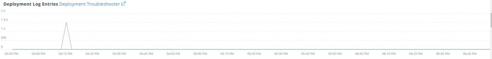

# [!UICONTROL Summary]索引標籤

[!DNL Observation for Adobe Commerce]的[!UICONTROL Summary]標籤旨在快速檢視網站所遇到的一些問題，以幫助您自動解決或找出網站問題的潛在根本原因。 其他標籤提供有關元件服務、資料庫、基礎架構和流程狀態的更深入層級資訊。

## [!UICONTROL Transaction Overview]

### [什麼是交易？](https://docs.newrelic.com/docs/apm/transactions/intro-transactions/transactions-new-relic-apm/#:%7E:text=transactions%20are%20reported.-，什麼%20is%20a%20transaction%3F，工作%20in%20a%20software%20application。&amp;text=For%20APM%2C%20it%20will%20overly，當%20the%20response%20is%20sent)

「在[!DNL New Relic]，交易被定義為軟體應用程式中的一個邏輯工作單位。 具體來說，這指的是組成該工作單位的函式呼叫和方法呼叫。 這通常指的是Web交易，代表應用程式在收到網路要求至傳送回應時所發生的活動。」

### 交易型別：

**網頁：**&#x200B;網頁交易已透過HTTP要求起始。 對於大多陣列織而言，這些代表以客戶為中心的互動，因此是需監控的最重要交易。

**非Web：**&#x200B;非Web交易不是以Web要求起始。 它們可包括非Web工作者處理序、背景處理序、指令碼、訊息佇列活動及其他工作。

如果您檢視上方的&#x200B;**[!UICONTROL Transaction Overview]**&#x200B;框架，平均在APDEX分數為。76的將近53,000個交易，而這些交易的95%發生在2.313秒以內。 如果短時間範圍內有APDEX點選，則較緊的時間範圍可能會顯示與目前平均值的偏離。

## [!UICONTROL 404 page errors frame]

**[!UICONTROL 404 page errors]**&#x200B;框架列出所選時間範圍內的[URI](https://en.wikipedia.org/wiki/Uniform_Resource_Identifier)和404頁錯誤的計數。

## [!UICONTROL % of Storage Free frame]

儲存可用框架的

**[!UICONTROL % of Storage Free]**&#x200B;框架會顯示叢集所有節點之儲存裝載的平均可用百分比。 例如，如果您有三節點叢集，框架會顯示\&lt;掛載點\>、\&lt;環境名稱\>。 如果三個節點之間有變數，此框架可能會具有欺騙性。 變數的範例是，如果`/data/mysql`可用掛載點在三個節點叢集中是不同的值。 [!UICONTROL MySQL]標籤下有一個框架，可依節點名稱多面向掛接點，以更準確地檢視每個節點上的`/data/mysql`儲存空間實際是多少。

## [!UICONTROL % of system memory that is free frame]

可用框架系統記憶體的

可用的&#x200B;**%系統記憶體**&#x200B;框架會依節點顯示每個節點可用的系統記憶體數量。

## [!UICONTROL Swap memory free in bytes]

**[!UICONTROL Swap memory free in bytes]**&#x200B;框架會依節點顯示節點上可用的SWAP記憶體數量。

## [!UICONTROL CPU % by host]

主機的CPU百分比

所有環境和節點的彙總會顯示在&#x200B;**[!UICONTROL CPU % by host]**&#x200B;框架中。 您應該取消選取非生產環境。 也請注意生產環境的所有節點都未出現的任何執行個體。 如需有關高CPU使用率的更多秘訣，請參閱[在Adobe Commerce上使用New Relic進行效能疑難排解](https://experienceleague.adobe.com/docs/commerce-knowledge-base/kb/troubleshooting/miscellaneous/troubleshoot-performance-using-new-relic-on-magento-commerce.html?lang=zh-Hant)。

## [!UICONTROL Alerts during timeframe]

時間範圍內

**[!UICONTROL Alerts during timeframe]**&#x200B;顯示所有警示，包括Adobe Commerce支援新增的[!UICONTROL Managed Alerts]。

## [!UICONTROL CPU Usage]

如果&#x200B;**[!UICONTROL CPU Usage]**&#x200B;框架空白，表示未啟用[!DNL New Relic]的基礎結構應用程式。 如果您的網站位於入門版，則不會看到此資訊。 如果您的網站使用Pro，請開啟[支援票證](https://experienceleague.adobe.com/docs/commerce-knowledge-base/kb/help-center-guide/magento-help-center-user-guide.html?lang=zh-Hant)為您的網站啟用[!DNL New Relic Infrastructure]。

## [!UICONTROL Average Response Time]

**[!UICONTROL Average Response Time]**&#x200B;圖表顯示交易的平均回應時間（網頁及其他）。

## [!UICONTROL Long duration cron_schedule updates]

**[!UICONTROL cron_schedule]**&#x200B;表格會在cron工作的開始和完成時寫入。 長時間的cron作業可能表示更新此表時的延遲，這可能表示cron棧疊或cron排程方式的問題。

## [!UICONTROL Response Code]

**[!UICONTROL Response Code]**&#x200B;框架是網頁流量和要求的回應碼的良好指標。 它是[!DNL New Relic's]個交易資料，而且由傳回的`httpResponseCode`分面。

## [!UICONTROL Web Traffic volume compared with one week ago Magento Managed Alerts Information]

此框架顯示過去一週與本週的比較網頁流量。

## [!UICONTROL Deployment Log Entries]

**[!UICONTROL Deployment Log Entries]**&#x200B;框架顯示部署和雲端記錄專案的計數，並根據部署記錄名稱多面向計數。

## [!UICONTROL Deployment State]

**[!UICONTROL Deployment State]**&#x200B;框架會從部署記錄檔中多面向特定部署階段。 以下是記錄檔和Facet名稱中計算的一些階段範例：

**部署記錄階段：**

* &#39;%Start產生命令%&#39;)為&#39;start_gen&#39;
* &#39;%git apply /app/vendor/magento/ece-tools/patches%&#39;)為&#39;apply_patches&#39;
* &#39;%Set flag： .static_content_deploy%&#39;)設為&#39;SCD&#39;
* &#39;%NOTICE：產生命令已完成%&#39;)為&#39;gen_compl&#39;
* &#39;%NOTICE：部署已完成%&#39;)為&#39;deploy_compl&#39;
* &#39;%NOTICE：正在開始後續部署。%&#39;)作為&#39;start_pdeploy&#39;
* &#39;%NOTICE： Post-deploy is complete%&#39;)為&#39;pdeploy&#39;
* &#39;%deploy-complete%&#39;)做為&#39;cl_deploy_compl&#39;

## [!UICONTROL IP Frequency]

**[!UICONTROL IP Frequency]**&#x200B;框架會計算[!DNL Fastly]記錄檔中每個IP的（&#39;MISS&#39;和&#39;PASS&#39;）狀態。 具有這些狀態的網頁請求會連線至原始伺服器，並將新增負載至伺服器。 這會顯示頻率排名前20個位址。 此框架可用來偵測網站上的IP攻擊或負載過重的來源。

## [!UICONTROL IP Response – top 20 URLs in duration]

**[!UICONTROL IP Response – top 20 URLs in duration]**&#x200B;框架會顯示回應持續時間最長的URL。 這可能表示大型影像檔案或頁面、API或具有最長回應持續時間的頁面。

## [!UICONTROL API Calls by IP]

由ip進行的api呼叫

**[!UICONTROL API Calls by IP]**&#x200B;框架可協助識別針對API和IP位址的大量流量，這些位址會從API URL發出請求。

## [!UICONTROL API Calls by IP, details by URL]

依IP依url的

**[!UICONTROL API Calls by IP, details by URL]**&#x200B;框架提供針對API的大量流量的詳細資訊，以及發出請求的URL的詳細資訊。

## [!UICONTROL IP Frequency Rate per minute]

每分鐘

有時很難分辨哪個IP位址在其他框架上的請求最多。 **[!UICONTROL IP Frequency Rate per minute]**&#x200B;框架顯示每個IP位址每分鐘的速率。

## [!UICONTROL Potential Bots]

**[!UICONTROL Potential Bots]**&#x200B;框架會檢視具有request_user_agent名稱（例如NULL或&#39;%bot%&#39;）的請求。 一般而言，&#39;%bot%&#39; request_user_agent會遵循`robots.txt`檔案中的原則設定。

## [!UICONTROL Transaction Errors]

**[!UICONTROL Transaction Errors]**&#x200B;框架顯示來自[!DNL New Relic]的交易錯誤計數。

## [!UICONTROL Nginx access by node]

**[!UICONTROL Nginx access by node]**&#x200B;框架會依節點檢視來自`access.log`的計數。 檢視負載是否均勻分佈會很有幫助。 它通常會在節點掉落時顯示。 框架也會顯示整個網站的負載。

## [!UICONTROL Galera Log]

[[!DNL Galera]](https://galeracluster.com/library/galera-documentation.pdf)已用於資料庫叢集。 此框架著重於來自[!UICONTROL Galera]叢集的特定訊號。 這些訊號著重於進入和退出叢集的節點，這是維持資料庫資料完整性的正常行為。 節點會隨著[!UICONTROL Galera]叢集狀態變更而保持同步。

**[!UICONTROL Galera]狀態變更清單：**

* &#39;%1047 WSREP尚未準備好節點以供應用程式使用%&#39;)做為&#39;node_not_prep_for_use&#39;
* &#39;%\[ERROR\] WSREP：無法從wsrep_sst_xtrabackup-v2%&#39;讀取為&#39;xtrabackup_read_fail&#39;
* &#39;%\[ERROR\] WSREP：處理程式已完成，但發生錯誤： wsrep_sst_xtrabackup-v2 %&#39;)為&#39;xtrabackup_compl_w_err&#39;
* &#39;%\[ERROR\] WSREP： rbr write fail%&#39;)為&#39;rbr_write_fail&#39;
* &#39;%self-leave%&#39;)作為&#39;susp_node&#39;
* &#39;%members = 3/3 （已加入/總計）%&#39;)做為&#39;3of3&#39;
* &#39;%members = 2/3 （已加入/總計）%&#39;)做為&#39;2of3&#39;
* &#39;%members = 2/2%&#39;) as &#39;2of2&#39; * &#39;%members = 1/2%&#39;) as &#39;1of2&#39; * &#39;%members = 1/3%&#39;) as &#39;1of3&#39;
* &#39;%members = 1/1%&#39;)做為&#39;1of1&#39;
* &#39;%\[注意\] /usr/sbin/mysqld (mysqld 10。%&#39;)作為&#39;sql_restart&#39;
* &#39;%Quorum：沒有具有完整狀態的節點：%&#39;)為&#39;no_node_count&#39;
* &#39;%WSREP：成員0%&#39;)為&#39;mem_0&#39;
* &#39;%WSREP：成員1.0%&#39;)為&#39;mem_1&#39;
* &#39;%WSREP：成員2%&#39;)為&#39;mem2&#39;
* &#39;%WSREP：與群組同步，準備連線%&#39;)為&#39;ready&#39;
* &#39;%/usr/sbin/mysqld，版本：%&#39;)為&#39;mysql_restart_mysql.slow&#39;
* &#39;%\[Note\] WSREP：新叢集檢視：全域狀態：%&#39;)做為&#39;galera_cluster_view_chng&#39;

如果狀態頻繁變更，這些訊號可能表示儲存、記憶體或查詢問題。

## [!UICONTROL Database errors]

**偵測到資料庫錯誤或訊息清單：**

* &#39;%配置給暫存資料表的記憶體大小超過innodb_buffer_pool_size%&#39;的20%)為&#39;temp_tbl_buff_pool&#39;
* &#39;%\[ERROR\] WSREP： rbr write fail%&#39;)為&#39;rbr_write_fail&#39;
* &#39;%mysqld：磁碟已滿%&#39;)做為&#39;disk_full&#39;
* &#39;%Error number 28%&#39;)作為&#39;err_28&#39;
* &#39;%rollback%&#39;)為&#39;rollback&#39;
* &#39;%資料表%&#39;的外部索引鍵條件約束失敗)為&#39;foreign_key_constraint&#39;
* &#39;%Error_code： 1114%&#39;)做為&#39;sql_1114_full&#39;
* &#39;%CRITICAL： SQLSTATE\[HY000\] \[2006\] MySQL伺服器已經消失%&#39;)為&#39;sql_gone&#39;
* &#39;%SQLSTATE\[HY000\] \[1040\]連線數%&#39;)為&#39;sql_1040&#39;
* &#39;%CRITICAL： SQLSTATE\[HY000\] \[2002\]%&#39;)為&#39;sql_2002&#39;
* &#39;%SQLSTATE\[08S01\]：%&#39;)作為&#39;sql_1047&#39;
* &#39;%\[Warning\]已中止連線%&#39;)為&#39;aborted_conn&#39;
* &#39;%SQLSTATE\[23000\]：完整性條件約束違規：%&#39;)為&#39;sql_23000&#39;
* &#39;%1205鎖定等待逾時%&#39;)為&#39;sql_1205&#39;
* &#39;%SQLSTATE\[HY000\] \[1049\]未知的資料庫%&#39;)為&#39;sql_1049&#39;
* &#39;%SQLSTATE\[42S02\]：找不到基底資料表或檢視：%&#39;)為&#39;sql_42S02&#39;
* &#39;%General error： 1114%&#39;)作為&#39;sql_1114&#39;
* &#39;%SQLSTATE\[40001\]%&#39;)為&#39;sql_1213&#39;
* &#39;%SQLSTATE\[42S22\]：找不到資料行： 1054 Unknown column%&#39;)為&#39;sq1_1054&#39;
* &#39;%SQLSTATE\[42000\]：語法錯誤或存取違規：%&#39;)為&#39;sql_42000&#39;
* &#39;%SQLSTATE\[21000\]：基數違規：%&#39;)為&#39;sql_1241&#39;
* &#39;%SQLSTATE\[22003\]：%&#39;)為&#39;sql_22003&#39;
* &#39;%SQLSTATE\[HY000\] \[9000\]具有IP位址%&#39;的使用者端)為&#39;sql_9000&#39;
* &#39;%SQLSTATE\[HY000\]：一般錯誤： 2014%&#39;)為&#39;sql_2014&#39;
* &#39;%1927連線已終止%&#39;)為&#39;sql_1927&#39;
* &#39;%1062 \[\ERROR\] InnoDB：%&#39;)做為&#39;sql_1062_e&#39;
* &#39;%\[Note\] WSREP：正在將記憶體對應排清到磁碟……%&#39;)做為&#39;mem_map_flush&#39;
* &#39;%Internal MariaDB錯誤碼： 1146%&#39;)為&#39;sql_1146&#39;
* &#39;%Internal MariaDB錯誤碼： 1062%&#39;)為&#39;sql_1062&#39; * &#39;%1062 \[Warning\] InnoDB：%&#39;)為&#39;sql_1062_w&#39;
* &#39;%Internal MariaDB錯誤碼： 1064%&#39;)為&#39;sql_1064&#39;
* &#39;%InnoDB：檔案中的宣告失敗%&#39;)為&#39;assertion_err&#39;
* &#39;%mysqld_safe目前執行的處理序數目： 0%&#39;)為&#39;mysql_oom&#39;
* &#39;%\[ERROR\] mysqld取得signal%&#39;)為&#39;mysql_sigterm&#39;
* &#39;%1452 Cannot add%&#39;)為&#39;sql_1452&#39;
* &#39;%ERROR 1698%&#39;)做為&#39;sql_1698&#39;
* &#39;%SQLSTATE\[HY000\]：一般錯誤： 3%&#39;)為&#39;cnt_wrt_tmp&#39;
* &#39;%General error： 1 %&#39;)作為&#39;sql_syntax&#39;
* &#39;%42S22%&#39;)做為&#39;sql_42S22&#39;
* &#39;%InnoDB：錯誤（索引鍵重複）%&#39;)，因為&#39;innodb_dup_key&#39;

## [!UICONTROL Database traces]

**[!UICONTROL Database traces]**&#x200B;框架會檢視[!DNL New Relic]之[sql追蹤](https://docs.newrelic.com/docs/apm/transactions/transaction-traces/transaction-traces-database-queries-page/)實體的資料，並傳回追蹤的路徑。

## [!UICONTROL Database mysql-slow.log]

**[!UICONTROL Database mysql-slow.log]**&#x200B;框架會依查詢要求型別計算[mysql-slow.log](https://dev.mysql.com/doc/refman/5.7/en/slow-query-log.html)中的專案數。 這樣會以視覺化方式隔離您可能會對mysql-slow.log （緩慢查詢記錄）感興趣的時間範圍。 沒有索引的資料表查詢或更新大型資料表的查詢可能會封鎖其他查詢。

## [!UICONTROL Redis synchronization from Log]

[[!DNL Redis]](https://redis.io/docs/about/)是開放原始碼（BSD已授權）記憶體中的資料結構存放區，用於資料庫、快取和訊息代理人。 如果已設定，它可以執行資料庫和工作階段快取。 **[!UICONTROL Redis synchronization from Log]**&#x200B;框架主要針對[[!DNL Redis] 同步處理](https://redis.io/docs/latest/operate/oss_and_stack/management/replication/)。 [!DNL Redis]資料集愈大，同步化發生問題的可能性就愈大（需要保持同步的資料愈多）。

**[!DNL Redis]個錯誤和訊息：**

* &#39;%SLAVE同步處理：裝置%&#39;上沒有剩餘的空間)做為&#39;space&#39;
* &#39;%Server started， Redis version%&#39;)作為&#39;serv_start&#39;
* &#39;%伺服器現在已準備好接受連線%&#39;)為&#39;ready&#39;
* &#39;%Master連線已中斷。%&#39;)，作為&#39;mstr_lost&#39;
* &#39;%+sdown sentinel%&#39;)做為&#39;+sentinal&#39;
* &#39;%-sdown sentinel%&#39;)做為&#39;-sentinal&#39;
* &#39;%-sdown slave%&#39;)作為&#39;-slave&#39;，&#39;%+sdown slave%&#39;)作為&#39;+slave&#39;
* &#39;%-failover-abort-not-selected master%&#39;)作為&#39;-failover&#39;
* &#39;%+failover-abort-not-selected master%&#39;)作為&#39;+failover&#39;
* &#39;%Part無法重新同步化（沒有快取的主版）%&#39;)為&#39;part_sync_err&#39;
* &#39;%MASTER已中止復寫，錯誤為： ERR Can%&#39;)為&#39;mstr_sync_err&#39;
* &#39;%Master不支援PSYNC或處於錯誤狀態%&#39;)作為&#39;mstr_psync_err&#39;
* &#39;%SLAVE sync：已完成，成功%&#39;)為&#39; slv_sync_suc&#39;
* &#39;%MASTER已中止復寫，錯誤為： ERR Can%&#39;)為&#39;mstr_sync_err，coun&#39;
* &#39;%OOM命令在使用記憶體%&#39;)時不被允許為&#39; max_mem_err&#39;
* &#39;%CredisException（代碼： 0）：連線%&#39;發生讀取錯誤)為&#39;credis_read_error&#39;
* &#39;%Uncaught RedisException：%&#39;)作為&#39;redis_excp_err&#39;
* &#39;%psync已排定在ASAP關閉，以克服輸出緩衝區%&#39;)作為&#39;output_buf_err&#39;

## [!UICONTROL PHP process states]

PHP處理程式的行為方式取決於[組態](https://www.php.net/manual/en/install.fpm.configuration.php)。 設定很複雜，有許多變數和選項。 **[!UICONTROL PHP process states]**&#x200B;框架可協助您瞭解PHP處理序何時終止及重新啟動。

### [!UICONTROL PHP errors]

**[!UICONTROL PHP errors]**&#x200B;框架顯示所選時間範圍內背景工作程式的PHP錯誤數目。 如需詳細資訊，請參閱[Adobe Commerce PHP設定](../../installation/prerequisites/php-settings.md)。

**PHP錯誤和訊息：**

* &#39;%worker_connections不足%&#39;)做為&#39;worker&#39;
* &#39;%PHP嚴重錯誤：允許的記憶體大小！%&#39;)，作為&#39;mem_size&#39;
* &#39;%exited on signal 11 (SIGSEGV)%&#39;)為&#39;sig_11&#39;
* &#39;%exited on signal 7 (SIGBUS)%&#39;)為&#39;sig_7&#39;
* &#39;%increase pm.start_servers%&#39;)作為&#39;pmstart_serv&#39;
* &#39;%max_children%&#39;)做為&#39;max_children_cnt&#39;
* &#39;%PHP嚴重錯誤：允許的記憶體大小為%&#39;)為&#39;mem_exhst_coun&#39;
* &#39;%無法為集區%配置記憶體&#39;)做為&#39;opc_mem_count&#39;
* &#39;%Warning Interned string buffer overflow%&#39;)作為&#39;opc_str_buf&#39;
* &#39;%Illegal string offsetl%&#39;)做為&#39;opc_sv_comments&#39;
* &#39;%PHP嚴重錯誤：未攔截到的RedisException：連線%&#39;上的讀取錯誤)為&#39;php_exc&#39;

## [!UICONTROL PHP processes]

[PHP-FPM](https://php-fpm.org/)是[!DNL Nginx]使用的[!UICONTROL FastCGI Process Manager]。 若要瞭解系統需求，請參閱對應至Adobe Commerce版本[&#128279;](../../installation/system-requirements.md)的PHP版本需求。 **[!UICONTROL PHP processes]**&#x200B;框架顯示所選時間表中特定時間執行的PHP處理序數目。

## [!UICONTROL Secondary processes]

次要程式可能會影響網站回應。 **[!UICONTROL Secondary processes]**&#x200B;框架表示可能正在將負載增加到網站的一或多個處理程式。 資料庫的主要次要處理序執行次數最多。

## [!UICONTROL Traffic vs Week Ago]

**[!UICONTROL Traffic vs Week Ago]**&#x200B;框架會檢視來自[!DNL Fastly]記錄檔的網站流量（要求），其快取狀態為(&#39;MISS&#39;， &#39;PASS&#39;)。 這些要求會將負載新增至原始伺服器。 此影格顯示本週與上週前在相同時間範圍內的比較Web請求量。

## [!UICONTROL Fastly Cache]

**[!UICONTROL Fastly Cache]**&#x200B;框架顯示[!DNL Fastly]記錄檔中要求之快取狀態的彙總檢視。 如果您選取ERROR，它會顯示要求中的錯誤百分比。 當原始伺服器對頁面要求的回應速度不夠快時，這項數值通常會增加。

## [!UICONTROL Page Rendering]

**[!UICONTROL Page Rendering]**&#x200B;框架顯示來自頁面檢視來源[!DNL New Relic]的當週平均頁面轉譯持續時間，與相同時段的前一週比較。

## [!UICONTROL Page loading detail]

**[!UICONTROL Page loading detail]**&#x200B;框架說明頁面載入事件。 它詳述這些Facet的意義。 以下是為此框架執行的查詢：

`SELECT percentile(timeToResponseStart, 50) AS 'first byte', percentile(firstPaint, 50) as 'First paint', percentile(firstContentfulPaint, 50) as 'First contentful paint', percentile(timeToDomContentLoadedEventEnd, 50) AS 'DOM content loaded', percentile(duration, 50) AS 'Window load + AJAX' FROM BrowserInteraction TIMESERIES`

## [!UICONTROL Transactions – Avg, Max, Min]

交易持續時間以秒為單位。 視交易而定，如果交易長時間執行，可能會影響其他交易。 列在名稱和持續時間下的交易是針對特定時段。 如果有簡潔的問題時間範圍，請將[!DNL Observation for Adobe Commerce]日期/時間選擇器的大小調整為該較窄的時間範圍。

## [!UICONTROL Admin Activities]

**[!UICONTROL Admin Activities]**&#x200B;框架會識別與管理員使用者的交易。

## [!UICONTROL Order transactions (default?)]

**[!UICONTROL Order transactions (default?)]**&#x200B;框架會從名稱= `WebTransaction/Action/checkout/onepage/success`的交易中尋找交易`request.headers.host`。 如果訂購成功URL不同，此框架將沒有資料。

## [!UICONTROL Elasticsearch Index information]

**[Elasticsearch狀態：](https://www.elastic.co/guide/en/elasticsearch/reference/current/cluster-health.html)**

* 綠色：指派所有分片。
* 黃色：會指派所有主要分割，但會取消指派一或多個復本分割。 如果叢集中的節點失敗，則某些資料可能直到修復該節點之後才能使用。
* 紅色：有一或多個主要分片未指派，因此某些資料無法使用。 在叢集啟動期間，當指派主要分片時，可能會短暫發生這種情況。

## [!UICONTROL Elasticsearch Errors]

**[!DNL Elasticsearch]個錯誤：**

* &#39;%all shards failed%&#39;為&#39;all_shards_failed&#39;
* &#39;%NoNodesAvailableException%&#39;做為&#39;no_alive_nodes&#39;
* &#39;%PHP嚴重錯誤：未攔截到的錯誤：Elasticsearch%&#39;的引數錯誤，為&#39;wrong_param&#39;
* &#39;%您可以修正此問題，方法是將Magento雲端基礎結構上的Elasticsearch服務升級為&#39;ver_err&#39;版本%&#39;
* &#39;%cluster健全狀態已從\[YELLOW\]變更為\[RED\] (原因：%&#39;為&#39;yel_red&#39;
* &#39;%裝置%&#39;上沒有剩餘的空間，因為&#39;no_space&#39;
* &#39;%無法執行&lbrack;SearchRequest&lbrace;searchType=%&#39;，因為&#39;failed_query&#39;

## [!UICONTROL Cron view]

**[!UICONTROL Cron view]**&#x200B;框架會檢視cron記錄，以取得開始的cron數目與cron完成數目之間的平衡。

## [!UICONTROL Cron error]

來自cron.log的&#x200B;**個Cron錯誤：**

* &#39;%_stg%&#39;做為&#39;stg_crons&#39;
* &#39;%無法取得cron job%的鎖定，因為&#39;cron_lock&#39;
* &#39;%一般錯誤： 2006 MySQL伺服器已經離開%&#39;為&#39;mysql_has_gone_away&#39;
* &#39;%error%&#39;為&#39;error&#39;
* &#39;%一般錯誤： 1205鎖定等待逾時超過%&#39;，因為sql_1205_cron

## [!UICONTROL cron_schedule table updates]

**[!UICONTROL cron_schedule table updates]**&#x200B;框架會檢視資料存放區作業更新涉及cron_schedule表格的最長持續時間（以秒為單位）。 它以SQL要求型別為分面。

## [!UICONTROL Datastore Operations Tables]

此&#x200B;**[!UICONTROL Datastore Operations Tables]**&#x200B;框架會依持續時間時間、表格名稱和SQL要求型別顯示前25個作業。 暫留在尖峰上，可檢視正在存取哪個表格以及按哪個請求型別存取的詳細資訊。

## [!UICONTROL Cache Flush]

已偵測到&#x200B;**快取排清：**

* &#39;%config%&#39;作為&#39;config_cache_flushed&#39;
* &#39;%layout%&#39;做為&#39;layout_cache_flush&#39;
* &#39;%block_html%&#39;做為&#39;block_html_cache_flush&#39;
* &#39;%collections%&#39;做為&#39;collections_cache_flush&#39;
* &#39;%reflection%&#39;做為&#39;reflection_cache_flush&#39;
* &#39;%db_ddl%&#39;做為&#39;db_ddl_cache_flush&#39;
* &#39;%compiled_config%&#39;做為&#39;compiled_config_cache_flush&#39;
* &#39;%eav%&#39;為&#39;eav_cache_flush&#39;
* &#39;%customer_notification%&#39;做為&#39;cust_notif_cache_flush&#39;
* &#39;%config_integration%&#39;做為&#39;config_intege_cache_flush&#39;
* &#39;%config_integration_api%&#39;做為&#39;config_integg_api_cache_flush&#39;
* &#39;%full_page%&#39;做為&#39;full_page_cache_flush&#39;
* &#39;%config_webservice%&#39;做為&#39;config_webserv_cache_flush&#39;
* &#39;%translate%&#39;為&#39;translate_cache_flush&#39;
