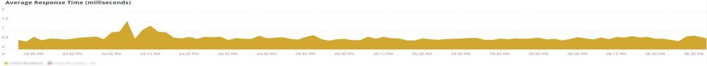

# 的 [!UICONTROL Summary] 頁籤

的 [!UICONTROL Summary] 頁籤 [!DNL Observation for Adobe Commerce] 旨在快速查看站點遇到的一些問題，以幫助您自動解決或確定站點問題的潛在根本原因。 附加頁籤提供了有關元件服務、資料庫、基礎架構和進程狀態的更深入的資訊。

## [!UICONTROL Transaction Overview]

### [什麼是交易？](https://docs.newrelic.com/docs/apm/transactions/intro-transactions/transactions-new-relic-apm/#:%7E:text=transactions%20are%20reported.-，什麼%20是%20a%20事務%3F，工作%20英吋%20a%20軟體%20應用程式。&amp;text=對於%20APM%2C%20it%20將經常%20，當%20時%20響應%20is%20已發送)

&quot;在 [!DNL New Relic]，事務被定義為軟體應用程式中的一個邏輯工作單元。 具體是指構成該工作單元的函式調用和方法調用。 它通常指Web事務，它表示從應用程式收到Web請求到發送響應時發生的活動。」

### 交易記錄類型：

**Web:** Web事務是使用HTTP請求啟動的。 對於大多陣列織來說，這些事務代表以客戶為中心的交互，因此是最重要的要監控的事務。

**非Web:** 非Web事務不是使用Web請求啟動的。 它們可以包括非Web工作進程、後台進程、指令碼、消息隊列活動和其他任務。

如果你看看 **[!UICONTROL Transaction Overview]** 在上面的框架中，有近53,000筆交易，平均APDEX得分為0.76，其中95%的交易是在2.313秒內發生的。 如果在較短的時間段內出現APDEX命中，那麼較短的時間段可能顯示與當前平均值的偏差。

## [!UICONTROL 404 page errors frame]

的 **[!UICONTROL 404 page errors]** 框列出 [URI](https://en.wikipedia.org/wiki/Uniform_Resource_Identifier) 以及404頁錯誤的計數。

## [!UICONTROL % of Storage Free frame]

的 **[!UICONTROL % of Storage Free]** frame顯示群集所有節點上儲存裝載的平均空閒百分比。 例如，如果有三個節點群集，則此幀顯示\&lt;mount point=&quot;&quot;>, \&lt;environment name=&quot;&quot;>。 如果跨三個節點存在差異，則此幀可能具有欺騙性。 超差的示例是： `/data/mysql` 掛載點free是三個節點群集中的另一個值。 下面有個框架 [!UICONTROL MySQL] 按節點名稱切分裝入點以更準確地查看 `/data/mysql` 每個節點上的儲存是免費的。

## [!UICONTROL % of system memory that is free frame]

的 **可用的系統記憶體百分比** 幀按節點顯示每個節點上可用的系統記憶體量。

## [!UICONTROL Swap memory free in bytes]

的 **[!UICONTROL Swap memory free in bytes]** 幀按節點顯示節點上可用的SWAP記憶體量。

## [!UICONTROL CPU % by host]

所有環境和節點的聚合顯示在 **[!UICONTROL CPU % by host]** 框。 您應取消選擇非生產環境。 另請注意生產環境的所有節點均不存在的任何實例。 有關CPU利用率高的詳細提示，請參閱 [使用New Relic在Adobe Commerce進行效能故障排除](https://experienceleague.adobe.com/docs/commerce-knowledge-base/kb/troubleshooting/miscellaneous/troubleshoot-performance-using-new-relic-on-magento-commerce.html)。

## [!UICONTROL Alerts during timeframe]

的 **[!UICONTROL Alerts during timeframe]** 顯示所有警報，包括 [!UICONTROL Managed Alerts] Adobe Commerce支援補充。

## [!UICONTROL CPU Usage]

如果 **[!UICONTROL CPU Usage]** 幀為空，它表示基礎架構應用程式 [!DNL New Relic] 未啟用。 如果您的站點在Starter上，則您看不到此資訊。 如果您的站點在Pro上，請開啟 [支援票證](https://experienceleague.adobe.com/docs/commerce-knowledge-base/kb/help-center-guide/magento-help-center-user-guide.html) 必須 [!DNL New Relic Infrastructure] 為您的站點啟用。

## [!UICONTROL Average Response Time]

的 **[!UICONTROL Average Response Time]** 圖形顯示事務（web和其他）的平均響應時間。

## [!UICONTROL Long duration cron_schedule updates]

的 **[!UICONTROL cron_schedule]** 表在cron作業的開始和結束時寫。 持續時間較長的cron作業可能表示更新此表時的延遲，這可能表示cron堆棧或cron的計畫方式問題。

## [!UICONTROL Response Code]

的 **[!UICONTROL Response Code]** frame是Web流量和請求響應代碼的一個很好的指示。 是 [!DNL New Relic's] 事務資料，並且它由多面 `httpResponseCode` 的子菜單。

## [!UICONTROL Web Traffic volume compared with one week ago Magento Managed Alerts Information]

此框架顯示過去一週和當前周的Web通信量比較。

## [!UICONTROL Deployment Log Entries]

的 **[!UICONTROL Deployment Log Entries]** frame顯示部署和雲日誌條目的計數，並根據部署日誌名稱分別顯示計數。

## [!UICONTROL Deployment State]

的 **[!UICONTROL Deployment State]** 從部署日誌中對facets進行特定部署階段。 以下是日誌和方面名稱中計算的階段的一些示例：

**部署日誌階段：**

* 「%正在啟動生成命令%」)作為「start_gen」
* 「%git apply /app/vendor/magento/ece-tools/patches%」)作為「apply_patches」
* 「%Set標誌：.static_content_deploy%&#39;)作為「SCD」
* 「%NOTICE:生成命令completed%」)作為「gen_compl」
* 「%NOTICE:部署已完成%」)作為「deploy_compl」
* 「%NOTICE:正在啟動部署後。%&#39;)作為「start_pdeploy」
* 「%NOTICE:部署後完成%)作為「pdeploy」
* 「%deploy-complete%」)作為「cl_deploy_compl

## [!UICONTROL IP Frequency]

的 **[!UICONTROL IP Frequency]** 幀計數來自IP的每個IP的（「MISS」和「PASS」）狀態 [!DNL Fastly] 日誌。 具有這些狀態的Web請求會到達源伺服器，並將向伺服器添加負載。 它以頻率顯示前20個地址。 此框架可用於檢測網站上的IP攻擊或重負載源。

## [!UICONTROL IP Response – top 20 URLs in duration]

的 **[!UICONTROL IP Response – top 20 URLs in duration]** frame顯示響應持續時間最長的URL。 它可能指示具有最長響應持續時間的大型影像檔案或頁面、API或頁面。

## [!UICONTROL API Calls by IP]

的 **[!UICONTROL API Calls by IP]** frame可幫助識別針對API和從API URL發出請求的IP地址的重量流量。

## [!UICONTROL API Calls by IP, details by URL]

的 **[!UICONTROL API Calls by IP, details by URL]** frame提供針對API的重量通信的詳細資訊以及發出請求的URL的詳細資訊。

## [!UICONTROL IP Frequency Rate per minute]

有時很難判斷哪個IP地址在其它幀上的請求最多。 的 **[!UICONTROL IP Frequency Rate per minute]** frame顯示每IP地址每分鐘的速率。

## [!UICONTROL Potential Bots]

的 **[!UICONTROL Potential Bots]** frame會查看請求名稱為request_user_agent的請求，如NULL或「%bot%」。 通常，「%bot%」request_user_agent遵循中的策略設定 `robots.txt` 的子菜單。

## [!UICONTROL Transaction Errors]

的 **[!UICONTROL Transaction Errors]** frame顯示來自 [!DNL New Relic]。

## [!UICONTROL Nginx access by node]

的 **[!UICONTROL Nginx access by node]** 框查看來自 `access.log` 按鈕。 瞭解載荷是否均勻分佈是很有幫助的。 它經常顯示節點何時下降。 該框架還顯示整個站點的負載。

## [!UICONTROL Galera Log]

[[!DNL Galera]](https://galeracluster.com/library/galera-documentation.pdf) 用於資料庫群集。 此幀聚焦於來自 [!UICONTROL Galera] 群集。 這些信號集中於進入和退出群集的節點，這是維護資料庫資料完整性的正常行為。 節點保持同步，因為 [!UICONTROL Galera] 群集狀態更改。

**清單 [!UICONTROL Galera] 狀態更改：**

* 「%1047 WSREP尚未準備要應用程式使用的節點%」)作為「node_not_prep_for_use」
* 「%\[ERROR\] WSREP:無法讀取：wsrep_sst_xtrabackup-v2%」)作為「xtrabackup_read_fail」
* 「%\[ERROR\] WSREP:進程已完成，但出現錯誤：wsrep_sst_xtrabackup-v2 %&#39;)作為「xtrabackup_compl_werr」
* 「%\[ERROR\] WSREP:rbr write fail%」)作為「rbr_write_fail」
* 「%self leave%」)作為「susp_node」
* 「%members = 3/3（已加入/合計）%」，作為「3of3」
* 「%members = 2/3（已加入/合計）%」，為「2of3」
* 「%members = 2/2%」)作為「2of2」*「%members = 1/2%」)作為「1of2」*「%members = 1/3%」)作為「1of3」
* 「%members = 1/1%」)作為「1of1」
* 「%\[注釋\] /usr/sbin/mysqld(mysqld 10)。%&#39;)作為「sql_restart」
* 「%仲裁：沒有狀態完整的節點：%&#39;)作為「no_node_count」
* 「%WSREP:成員0%」)作為「mem_0」
* 「%WSREP:成員1.0%」)作為「mem_1」
* 「%WSREP:成員2%」)作為「mem2」
* 「%WSREP:已與組同步，已準備好連接%&#39;)為「就緒」
* 「%/usr/sbin/mysqld，版本：%」)，作為「mysql_restart_mysql.slow」
* 「%\[注釋\] WSREP:新建群集視圖：全局狀態：%&#39;)為&quot;galera_cluster_view_chng&quot;

如果狀態頻繁更改，這些信號可能指示儲存、記憶體或查詢問題。

## [!UICONTROL Database errors]

**檢測到的資料庫錯誤或消息清單：**

* 「%為臨時表分配的記憶體大小超過innodb_buffer_pool_size%」的20%)作為「temp_tbl_buff_pool」
* 「%\[ERROR\] WSREP:rbr write fail%」)作為「rbr_write_fail」
* 「%mysqld」：磁碟已滿%」)，作為「disk_full」
* 「%錯誤號28%」)為「err_28」
* 「%rollback%」)作為「rollback」
* 「%表%」的外鍵約束失敗)作為「foreign_key_constraint」
* 「%錯誤代碼：1114%」)作為「sql_1114_full」
* 「%關鍵：SQLSTATE\[HY000\] \[2006\] MySQL Server已經離開%&#39;)，作為「sql_gone」
* 「%SQLSTATE\[HY000\] \[1040\]連接太多%」)與「sql_1040」相同
* 「%關鍵：SQLSTATE\[HY000\] \[2002\]%&#39;)作為「sql_2002」
* 「%SQLSTATE\[08S01\]:%」)作為「sql_1047」
* 「%\[警告\]中止連接%」)，作為「aborted_conn」
* 「%SQLSTATE\[23000\]:完整性約束衝突：%&#39;)作為&#39;sql_23000&#39;
* 「%1205鎖等待超時%」)作為「sql_1205」
* 「%SQLSTATE\[HY000\] \[1049\]未知資料庫%」)作為「sql_1049」
* 「%SQLSTATE\[42S02\]:找不到基表或視圖：%&#39;)作為「sql_42S02」
* 「%一般錯誤：1114%」)作為「sql_1114」
* 「%SQLSTATE\[40001\]%」)作為「sql_1213」
* 「%SQLSTATE\[42S22\]:找不到列：1054未知列%」)作為「sq1_1054」
* 「%SQLSTATE\[42000\]:語法錯誤或訪問衝突：%&#39;)，作為&#39;sql_42000&#39;
* 「%SQLSTATE\[21000\]:基數衝突：%&#39;)作為「sql_1241」
* 「%SQLSTATE\[22003\]:%」)作為「sql_22003」
* 「%SQLSTATE\[HY000\] \[9000\] IP地址為%的客戶端」)為「sql_9000」
* 「%SQLSTATE\[HY000\]:常規錯誤：2014%」)作為「sql_2014」
* 「%1927連接已死亡%」)，作為「sql_1927」
* 「%1062 \[\ERROR\] InnoDB:%&#39;)作為「sql_1062_e」
* 「%\[注釋\] WSREP:正在刷新記憶體映射到磁碟……%&#39;)作為「mem_map_flush」
* 「%內部MariaDB錯誤代碼：1146%」)作為「sql_1146」
* 「%內部MariaDB錯誤代碼：1062%」)作為「sql_1062」 *「%1062 \[Warning\] InnoDB:%」)作為「sql_1062_w」
* 「%內部MariaDB錯誤代碼：1064%」)作為「sql_1064」
* 「%InnoDB:檔案%&quot;中的斷言失敗)作為「assertion_err」
* 「%mysqld_safe當前運行的進程數：0%」)作為「mysql_oom」
* 「%\[ERROR\] mysqld獲得信號%」)作為「mysql_sigterm」
* 「%1452無法添加%」)作為「sql_1452」
* 「%ERROR 1698%」)作為「sql_1698」
* 「%SQLSTATE\[HY000\]:常規錯誤：3%」)作為「cnt_wrt_tmp」
* 「%一般錯誤：1 %&#39;)作為&#39;sql_syntax&#39;
* 「%42S22%」)作為「sql_42S22」
* 「%InnoDB:錯誤（重複鍵）%&#39;)為「innodb_dup_key」

## [!UICONTROL Database traces]

的 **[!UICONTROL Database traces]** 框架查看來自 [sql跟蹤](https://docs.newrelic.com/docs/apm/transactions/transaction-traces/transaction-traces-database-queries-page/) 實體 [!DNL New Relic] 並返回跟蹤路徑。

## [!UICONTROL Database mysql-slow.log]

的 **[!UICONTROL Database mysql-slow.log]** 框架執行 [mysql_slow.log](https://dev.mysql.com/doc/refman/5.7/en/slow-query-log.html) 按查詢請求類型。 它以可視方式隔離mysql-slow.log（慢速查詢日誌）中可能感興趣的時間幀。 沒有索引的表查詢或更新大型表的查詢可能會阻止其他查詢。

## [!UICONTROL Redis synchronization from Log]

[[!DNL Redis]](https://redis.io/docs/about/) 是用作資料庫、快取和消息代理的開源（BSD許可）記憶體中資料結構儲存。 如果已配置，它可以執行資料庫和會話快取。 的 **[!UICONTROL Redis synchronization from Log]** 幀聚焦 [[!DNL Redis] 同步](https://redis.io/docs/manual/replication/)。 越大 [!DNL Redis] 資料集，同步問題（要保持同步的資料越多）的可能性越大。

**[!DNL Redis]錯誤和消息：**

* 「%SLAVE同步：設備%上沒有剩餘空間))作為「空間」
* 「%Server已啟動，Redis版本%」)，為「serv_start」
* 「%伺服器現在已準備好接受連接%」)為「ready」
* 「%連接主節點丟失。%&#39;)作為「mstr_lost」
* 「%+sdown sentinel%」)作為「+sentinal」
* 「%sdown sentinel%」)作為「 — sential」
* 「%sdown slave%」)作為「 — slave」，「%+sdown slave%」)作為「+slave」
* 「%-failover-abort-notelected master%」)作為「 — failover」
* 「%+failover abort-notelected mymaster%」)作為「+failover」
* 「%部分重新同步不可能（無快取主資料）%」)作為「part_sync_err」
* 「%MASTER中止複製，但出現錯誤：ERR Can%」)作為「mstr_sync_err」
* 「%Master不支援PSYNC或處於錯誤狀態%」)，作為「mstr_psync_err」
* 「%SLAVE同步：已完成，但成功%&#39;)為「slv_sync_suc」
* 「%MASTER中止複製，但出現錯誤：ERR Can%&#39;)作為「mstr_sync_err,coun」
* 「%OOM命令在使用記憶體%」時不允許)為「max_mem_err」
* 「%CredisException(代碼：0):讀取連接%&#39;上的錯誤)，作為「credis_read_error」
* 「%Uncaked RedisException:%」)作為「redis_excp_err」
* 「%psync計畫盡快關閉以克服輸出緩衝區%」)作為「output_buf_err」

## [!UICONTROL PHP process states]

PHP進程的行為方式取決於 [配置](https://www.php.net/manual/en/install.fpm.configuration.php)。 配置複雜，有許多變數和選項。 的 **[!UICONTROL PHP process states]** frame有助於您瞭解何時終止和重新啟動PHP進程。

### [!UICONTROL PHP errors]

的 **[!UICONTROL PHP errors]** frame顯示選定時間範圍內工作程式出現的PHP錯誤數。 有關詳細資訊，請參閱 [Adobe CommercePHP設定](../../installation/prerequisites/php-settings.md)。

**PHP錯誤和消息：**

* 「%worker_connections不足%」)作為「worker」
* 「%PHP錯誤：允許的記憶體大小！%&#39;)作為「mem_size」
* 「%退出信號11(SIGSEGV)%」)，為「sig_11」
* 「%exed on signal 7(SIGBUS)%」)作為「sig_7」
* 「%increase pm.start_servers%」)為「pmstart_serv」
* 「%max_children%」)作為「max_children_cnt」
* 「%PHP錯誤：允許的記憶體大小為%&#39;)，作為「mem_exhst_coun」
* 「%無法為池%」分配記憶體)作為「opc_mem_count」
* 「%Warning Interned字串緩衝區溢出%」)作為「opc_str_buf」
* 「%非法字串offsetl%」)作為「opc_sv_comments」
* 「%PHP錯誤：未捕獲的RedisException:讀取連接%&#39;上的錯誤)為「php_exc」

## [!UICONTROL PHP processes]

[PHP-FPM](https://php-fpm.org/) 是 [!UICONTROL FastCGI Process Manager] 使用 [!DNL Nginx]。 要瞭解系統要求，請參閱 [映射到Adobe Commerce版本的PHP版本要求](../../installation/system-requirements.md)。 的 **[!UICONTROL PHP processes]** 幀顯示選定時間線中特定時間運行的PHP進程數。

## [!UICONTROL Secondary processes]

輔助進程可能會影響站點響應。 的 **[!UICONTROL Secondary processes]** frame指示可能正在向站點添加負載的進程。 資料庫主要運行的輔助進程數最多。

## [!UICONTROL Traffic vs Week Ago]

的 **[!UICONTROL Traffic vs Week Ago]** frame查看來自 [!DNL Fastly] 具有(「MISS」、「PASS」)快取狀態的日誌。 這些請求將載入到源伺服器。 此框架顯示同一時間段內當前周和過去一週的比較Web請求量。

## [!UICONTROL Fastly Cache]

的 **[!UICONTROL Fastly Cache]** frame顯示來自 [!DNL Fastly] 日誌。 如果選擇「錯誤」，它將顯示請求中的錯誤百分比。 當源伺服器對頁面請求的響應速度不夠快時，這一比例通常會增加。

## [!UICONTROL Page Rendering]

的 **[!UICONTROL Page Rendering]** frame顯示當前周的頁面呈現持續時間(從頁面視圖源到 [!DNL New Relic] 與前一週的時間段相比。

## [!UICONTROL Page loading detail]

的 **[!UICONTROL Page loading detail]** frame描述了頁面載入事件。 詳細說明了這些方面的含義。 以下是為此框架運行的查詢：

`SELECT percentile(timeToResponseStart, 50) AS 'first byte', percentile(firstPaint, 50) as 'First paint', percentile(firstContentfulPaint, 50) as 'First contentful paint', percentile(timeToDomContentLoadedEventEnd, 50) AS 'DOM content loaded', percentile(duration, 50) AS 'Window load + AJAX' FROM BrowserInteraction TIMESERIES`

## [!UICONTROL Transactions – Avg, Max, Min]

事務持續時間（秒）。 根據事務，如果其運行時間較長，則可能會影響其他事務。 名稱下列出的事務處理和持續時間為特定時間段。 如果問題時間表簡潔，請調整 [!DNL Observation for Adobe Commerce] 日期/時間選擇器。

## [!UICONTROL Admin Activities]

的 **[!UICONTROL Admin Activities]** frame標識與admin用戶的事務。

## [!UICONTROL Order transactions (default?)]

的 **[!UICONTROL Order transactions (default?)]** 框架查找交易記錄 `request.headers.host` 來自事務，其中名稱= `WebTransaction/Action/checkout/onepage/success`。 如果訂單成功URL不同，則此框架將沒有資料。

## [!UICONTROL Elasticsearch Index information]

**[Elasticsearch狀態：](https://www.elastic.co/guide/en/elasticsearch/reference/current/cluster-health.html)**

* 綠色：已分配所有碎片。
* 黃色：已分配所有主分片，但一個或多個副本分片未分配。 如果群集中的某個節點出現故障，則在修復該節點之前，某些資料可能不可用。
* 紅色：一個或多個主分片未分配，因此某些資料不可用。 在分配主分片時，在群集啟動期間可能會短暫出現這種情況。

## [!UICONTROL Elasticsearch Errors]

**[!DNL Elasticsearch]錯誤：**

* 「%all shards failed%」，作為「all_shards_failed」
* 「%NoNodesAvailableException%」作為「no_alive_nodes」
* 「%PHP錯誤：未捕獲錯誤：將Elasticsearch%&#39;作為「wrong_param」的參數錯誤
* 「%通過將Elasticsearch雲基礎架構上的Magento服務升級為版本%」作為「ver_err」，可以解決此問題
* 「%cluster運行狀況狀態從\[黃色\]更改為\[RED\](原因： %&#39;已更改為&#39;yel_red&#39;
* 「%設備%上沒有剩餘空間」作為「no_space」
* 「%無法將[SearchRequest{searchType=%&#39;執行為&#39;failed_query&#39;

## [!UICONTROL Cron view]

的 **[!UICONTROL Cron view]** frame查看cron日誌，以在啟動的cron數與完成的cron數之間取得平衡。

## [!UICONTROL Cron error]

**cron.log中的Cron錯誤：**

* 「%_stg%」作為「stg_crons」
* 「%無法獲取cron作業%的鎖定」作為「cron_lock」
* 「%一般錯誤：2006 MySQL Server已放棄%」，作為「mysql_has_gone_away」
* 「%error%」為「error」
* 「%一般錯誤：1205鎖等待超時超過%&#39;，作為sql_1205_cron

## [!UICONTROL cron_schedule table updates]

的 **[!UICONTROL cron_schedule table updates]** frame查看資料儲存操作更新涉及cron_schedule表的最大持續時間（秒）。 它在SQL請求類型上是多面的。

## [!UICONTROL Datastore Operations Tables]

此 **[!UICONTROL Datastore Operations Tables]** frame按持續時間、表名和SQL請求類型顯示前25個操作。 將滑鼠懸停在尖峰上，查看正在訪問的表以及按什麼請求類型訪問的表的詳細資訊。

## [!UICONTROL Cache Flush]

**檢測到快取刷新：**

* 「%config%」作為「config_cache_flushed」
* 「%layout%」作為「layout_cache_flush」
* 「%block_html%」作為「block_html_cache_flush」
* 「%collections%」作為「collections_cache_flush」
* 「%reflection%」作為「reflection_cache_flush」
* 「%db_ddl%」作為「db_ddl_cache_flush」
* 「%compiled_config%」作為「compiled_config_cache_flush」
* 「%eav%」作為「eav_cache_flush」
* 「%customer_notification%」作為「cust_notif_cache_flush」
* 「%config_integration%」作為「config_integ_cache_flush」
* 「%config_integration_api%」作為「config_integ_api_cache_flush」
* 「%full_page%」作為「full_page_cache_flush」
* 「%config_webservice%」作為「config_webserv_cache_flush」
* 「%translate%」作為「translate_cache_flush」
