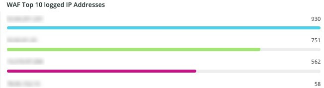

# 此 [!DNL WAF] 標籤

此 **[!DNL WAF]** 索引標籤顯示由以下專案傳遞和封鎖的流量： [!DNL firewall].

## [!DNL WAF traffic summary]

此 **[!DNL WAF traffic summary]** frame顯示由「 」透過、記錄、封鎖及失敗的流量計數。 [!DNL firewall].

## [!DNL WAF Top 10 blocked IP Addresses]

此 **[!DNL WAF Top 10 blocked IP Addresses]** frame顯示前10個最遭封鎖的IP位址 [!DNL firewall].

## [!DNL WAF Top 10 countries for blocked requests]

此 **[!DNL WAF Top 10 countries for blocked requests]** frame顯示前10個國家/地區的已封鎖請求計數，這些已封鎖請求由 [!DNL firewall].

## [!DNL WAF Top 10 logged IP Addresses]

此 **[!DNL WAF Top 10 logged IP Addresses]** frame顯示前10個記錄的IP位址中的IP位址 [!DNL firewall].

## [!DNL Top 10 WAF Rules Executed and Logged by IP address]

此 **[!DNL Top 10 WAF Rules Executed and Logged by IP address]** 框架顯示前10個最符合的IP位址 [!DNL firewall] 規則。

## [!DNL WAF Logged Details]

此 **[!DNL WAF Logged Details]** 框架顯示由以下專案記錄的請求： [!DNL firewall]，包括時間戳記、城市、地區和資料中心等詳細資訊。

## [!DNL WAF Blocked Details]

此 **[!DNL WAF Blocked Details]** 框架顯示被封鎖的請求 [!DNL firewall]，包括時間戳記、城市、地區和資料中心等詳細資訊。
