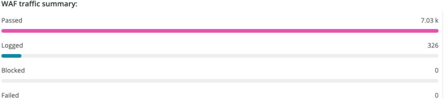

# 的 [!DNL WAF] 頁籤

的 **[!DNL WAF]** 頁籤顯示通過和阻止的通信 [!DNL firewall]。

## [!DNL WAF traffic summary]

的 **[!DNL WAF traffic summary]** frame顯示通過、記錄、阻止和失敗的通信量計數 [!DNL firewall]。

## [!DNL WAF Top 10 blocked IP Addresses]

的 **[!DNL WAF Top 10 blocked IP Addresses]** frame顯示前10個最阻塞的IP地址 [!DNL firewall]。

## [!DNL WAF Top 10 countries for blocked requests]

的 **[!DNL WAF Top 10 countries for blocked requests]** 框架顯示前10個國家/地區的被阻止請求的計數 [!DNL firewall]。

## [!DNL WAF Top 10 logged IP Addresses]

的 **[!DNL WAF Top 10 logged IP Addresses]** frame顯示前10個記錄的IP地址中的IP地址 [!DNL firewall]。

## [!DNL Top 10 WAF Rules Executed and Logged by IP address]

的 **[!DNL Top 10 WAF Rules Executed and Logged by IP address]** frame顯示前10個最常匹配的IP地址 [!DNL firewall] 規則。

## [!DNL WAF Logged Details]

的 **[!DNL WAF Logged Details]** frame顯示由 [!DNL firewall]包括時間戳、城市、地區和資料中心等詳細資訊。

## [!DNL WAF Blocked Details]

的 **[!DNL WAF Blocked Details]** 框顯示被阻止的請求 [!DNL firewall]包括時間戳、城市、地區和資料中心等詳細資訊。
