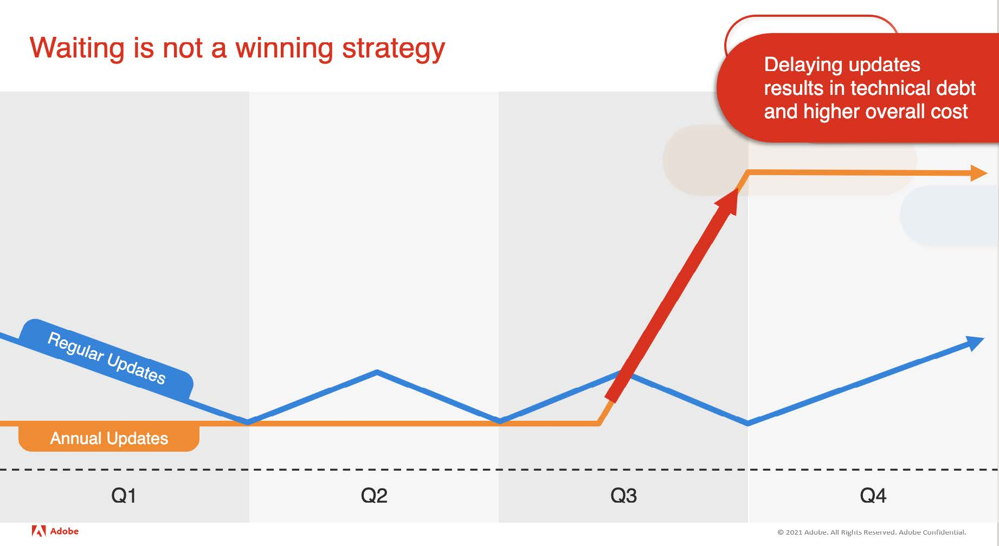
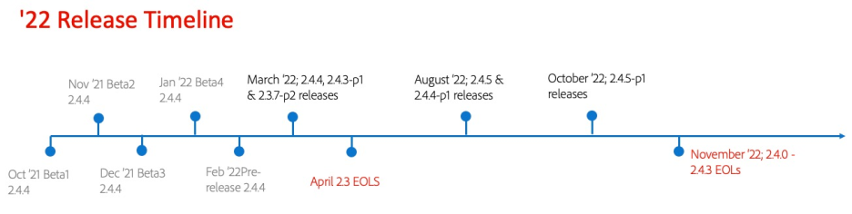

# 升級程式概觀

升級您的Adobe Commerce或Magento Open Source項目對於確保您的儲存保持安全、符合PCI要求並以最高效率運行至關重要。 我們已開發本指南，引導您了解準備升級時的主要考量事項。

本指南概述典型的Adobe Commerce/Magento Open Source升級歷程，以及遵循該歷程的最佳實務。 它還通過及時的示例和逐步說明說明了升級過程的技術細節，以升級到Adobe Commerce/Magento Open Source2.4.4版。2.4.4補丁程式版本將於2022年3月8日正式發佈，因此，請務必提前準備此升級，因為 [終止服務(EOL)](https://devdocs.magento.com/release/lifecycle-policy.html) 2022年2.3版和2.4.0版和2.4.3版的日期都已接近。 最後，我們提供規劃資源和升級工具，讓您的升級過程更加高效。

## 本指南是給誰的？

本指南的目標受眾包括：

### 電子商務經理和技術總監

本指南可協助這些角色的客戶了解升級歷程、定期升級的重要性，以及如何最佳規劃和準備升級。

### 運營和開發團隊

本指南可協助這些團隊了解升級至2.4.4(或任何版本的Adobe Commerce/Magento Open Source)所需的技術步驟，以及可用來讓程式更輕鬆、更快速且更經濟實惠的工具。

## 升級過程說明

您選擇Adobe Commerce/Magento Open Source的其中一個可能原因包括：

- 廣泛現成功能集
- SaaS功能與核心代碼分開提供
- 強大的Marketplace擴充功能產品
- 提供無限彈性的獨特功能，讓您可以自訂您的網站，以最符合您企業和客戶的需求。

但是，作為高度可擴展和可自定義的產品，其優勢在於，當自定義內容未編碼到最佳實踐時，可能會引發潛在的升級問題，從而導致高於預期的升級成本。

_那麼……為什麼要升級？_

升級使您的企業能夠在步調快速、瞬息萬變的電子商務行業保持靈活，並使您的平台始終與有助於最大化銷售和轉換的最新功能相容。 在常規維護計畫中包括升級對確保您的儲存保持安全、符合PCI要求並以最高效率運行也至關重要。

### 安全性

安全性是升級的主要原因之一，因為83%的安全事件發生在過時的軟體上。 根據 [IBM](https://www.ibm.com/security/data-breach))，資料洩露的平均成本為386萬美元 — 遠高於通過升級來降低此風險的成本。 Adobe提供兩種方式，可讓您的商店全年保持安全：

- **修補程式發行** — 包括安全性、效能、品質和高優先順序錯誤修正。
- **安全修補程式發行** — 納入修正和增強功能，以確保網站安全且更易於實作。

### 效能

效能是升級的另一個主要原因。 根據 [HubSpot](https://blog.hubspot.com/marketing/page-load-time-conversion-rates)，前五秒的載入時間會對轉換率產生顯著影響，之後每秒的延遲都會產生–4.4%的影響。 再加上頁面速度是領先SEO排名因素，說明為什麼網站效能是您網站的關鍵要素，可以維持並定期改善。 每個修補程式版本都包括效能改進，因此利用新版本可支援您的增長計畫，並保持您的業務競爭力。

### 延遲成本

推遲或推遲平台升級的理由往往取決於即時成本。 但是，運行過時版本的任何軟體的實際成本要大得多，而且對業務可能產生持久影響。

這看起來可能有違直覺，但執行定期平台更新所需的總體努力比執行因延遲而累積的技術債務而導致的不頻繁更新所需要的少。 我們最近與某位零售商合作，該商家過去常常進行不經常且不一致的升級（每年或更久）。 通過改變升級方式，並在12個月內遵循Adobe建議的定期升級途徑，合作夥伴能夠為客戶節省4週的累積開發時間、努力和相關成本，所有這些都被重新導向推動業務增長的計畫。

定期執行更新時，變更會遞增，而對應的升級工作會反映這一點。 當平台更新被延長一段時間時，它們可能會成為一個參與度更高的過程。 此外，您使用的擴充功能 [Marketplace](https://marketplace.magento.com/) 和任何其他協力廠商整合也可能受到影響。 最後，調查、計畫和執行延遲升級所花的時間都得到延長，這增加了本可避免的工作量和成本。

數字商務領域的持續增長給企業帶來了越來越大的壓力，要求它們以更快、更頻繁、更不可預知的方式發展。 未能跟上和預測客戶的購買行為，就連最大、最老牌的品牌也為公司營造了公平的競爭環境。 您必須能夠在所有接觸點提供強大且個人化的體驗，且效能和正常運作時間不會中斷。 你必須能夠更快、無限制地創新，以保持全球競爭者的領先地位。 通過升級，您將能夠為您的業務做好準備，並為您做好準備以更好地滿足動態客戶的需求。

## 2022年發行計畫

Adobe發佈 [發行排程](https://devdocs.magento.com/release/) 每年一次，以便利商家的規劃流程，並建議升級每個補丁程式發行週期。 要保持PCI相容，商家必須使用最新的補丁或安全補丁。 以下時間軸顯示2022年的主要發行和EOL事件。

需注意的重要事件包括：

- 2.3.x支援於』22年4月後結束
- 2.4.0到2.4.3（基於PHP 7.4）在』22年11月PHP 7.4達到EOL時即終止質量支援
- 根據上述兩個事件，請務必在』22年11月前升級至2.4.4版或更新版本
- 符合Adobe Commerce [生命週期策略](https://devdocs.magento.com/release/lifecycle-policy.html), 2.4.4和2.4.5版支援至』24年11月
