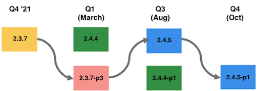

# 2022年建議升級路徑

電子商務實作是一項演變，從未真正完成。 您的企業必須引進最新的功能，讓客戶持續參與，才能保持領先趨勢一步。 隨著時間推移，這些額外功能會增加實作的空間和整體複雜度。

影響升級專案所需工作量的一些一般因素包括，但不限於：

| 技術複雜性 | 規劃與策略 |
|-----------------------------------------------------------|--------------------------------------------------------------|
| 自定義範圍 | 要求的明確性、決策的搖擺性和範圍的變化 |
| 擴充功能數量 | 您的升級頻率 |
| 與協力廠商(OMS、ERP)的整合數量 | 您的測試策略 |
| 根據最佳實務編碼 |  |

以下是Adobe Commerce建議的路徑，可在2022年全年確保網站安全且效能。

## 從2.3.0-2.3.6版升級（選項1）

您可以從任何2.3.x行升級為2.4.3行。但是，不升級的時間越長，隨著代碼庫的更改越多，直接升級為2.4.3就會越費勁。

例如，如果您是在2020年1月發行的2.3.4版，則您的版本已接近兩年，因此2.4.3的程式碼基底比2.3.4的基底要大得多。 這就是為什麼Adobe建議您經常升級，因為如果您將升級延遲很長時間，工作量會更高。

一旦使用2.4.3版，在第1季度，您就可以採用2.4.3-p2版，以繼續保持安全狀態，這是一項低成本的工作，因為它是輕度的安全版本。 在第3季度，您可以使用完整的修補程式2.4.5和一個以上的輕型安全修補程式，以在第4季度保持安全。 此路徑需要在2022年底前進行兩次大力升級。

## 從2.3.0-2.3.6版升級（選項2）

或者，您也可以在2022年3月從2.3.x直接升級至2.4.4。 從2.4.4開始，您可以在第3季度獲取輕型安全補丁，然後升級到第4季度的2.4.5-p1版，其中包括2.4.5版本中的所有更新和其他安全補丁。

決定這兩個選項時的主要考量：

| 選項1:升級至2.4.3-p1或 — p2 | 選項2:升級至2.4.4或2.4.4-p1 |
|--------------------------------------------------------------------------------------------------------------------|--------------------------------------------------------------------------------------------------------------------------------------------------|
| 需要在2022年底前進行2次重大升級，以保持安全、符合PCI要求，並獲得質量支援 | 在2022年底前需要1次重大升級和1次中等工作量升級，以保持安全、符合PCI要求，並獲得質量支援 |
| 使您能夠更快地獲得支援的PCI相容版本 | 在您獲得支援的符合PCI的版本之前，可能會面臨更長的窗口，因為2.3線在2022年4月達到EOL |
| 時間考量：可能會將移動到新的PHP版本延遲到今年晚些時候（8月） | 時間考量：可以在年初（3月）開始移至新的PHP版本 |

## 從2.3.7升級（選項1）

由於您是最新2.3.7版，因此您只能取得安全性版本。 在』22年第1季度，Adobe將發佈2.3（即2.3.7-p3）的最後一個版本，以及安全版(2.4.3-p2)和完整版(2.4.4)。

您的第一個選項是取用2.3.7-p3，並取得最新的安全性修正。 然後，在8月，你可以接受2.4.5版。 最後，在第4季度，您可以根據完整版2.4.5來發行輕型安全性。 在此情況下，在使用2.4.5之前，您將在EOL版本上待幾個月。但是，2.3.x目前不提供質量支援，並且您會修補最新的安全漏洞。

## 從2.3.7升級（選項2）

您的第二個選項是使用2.3.7-p3版本快速獲得最新的安全性修正，因為您目前線路的安全性修補程式實作工作量很小，因此您可以開始升級至2.4.4。

在8月，您可以採用2.4.4-p1，此版本將是較輕的安全版本，然後在第4季度採用2.4.5-p1，其中包括2.4.5和最新安全版本中包含的所有更新。

您也可以從2.3.7-p3到2.4.4-p1，但請注意2.4.4-p1是「大幅提升度」，因為您基本上會得到2.4.4中包含的所有更新以及2.4.4-p1中的安全性更新。 您和您的團隊要決定在3月還是8月開始從2.4.4線的提升度更重。

決定這兩個選項時的主要考量：

| 選項1:升級至2.3.7-p3，然後升級至2.4.5 | 選項2:升級至2.3.7-p3，然後升級至2.4.4 |
|--------------------------------------------------------------------------------------------------------------------|-----------------------------------------------------------------------------------------------------------------------------------------------------|
| 首先使用低工作量的安全修補程式接收最新的安全更新 | 首先使用低工作量的安全修補程式接收最新的安全更新 |
| 需要在2022年底前進行1次重大升級，以保持安全、符合PCI要求，並獲得質量支援 | 在2022年底前需要1次重大升級和1次中等工作量升級，以保持安全、符合PCI要求，並獲得質量支援 |
| 在4月2.3行達到EOL狀態時，面對更長的窗口，直到達到支援的PCI相容版本 | 時間考量：可以在年初（3月）開始移至新的PHP版本 |
| 計時考量事項：可將更多工作延遲到8月 | 計時考量事項：可在3月開始更多努力的升級，然後在10月進行中低級升級 |

## 從2.4.0升級至2.4.2

由於您的版本是2.4.0-2.4.2，因此建議您在第1季升級至2.4.4。 這是相對較高的努力，因為2.4.4的突變是由於PHP 8.1的遷移而引起的。但是，今年的其餘升級工作是較低的努力，因此您只需在2022年進行一次較高級別的努力升級。

## 從2.4.3升級

由於您使用的是2.4.3，因此在第1季度使用2.4.3-p2是花費最少的努力。 在8月，你可以接受2.4.5版。 最後，在第4季度，您可以根據完整版2.4.5來發行輕型安全性。 在此情況下，您2022年只會進行一次更高級別的工作升級。
