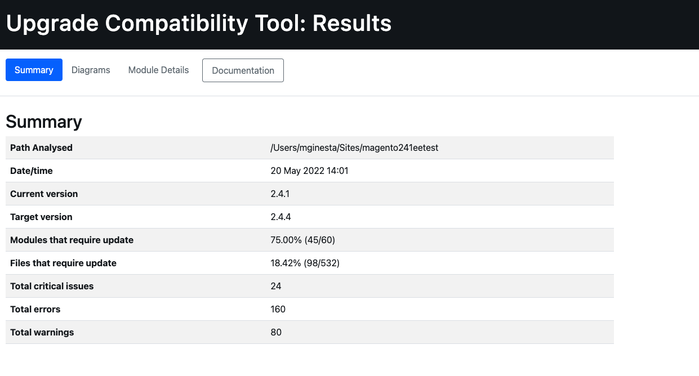

# 運行升級相容性工具

升級相容性工具是命令列工具，可分析安裝在其中的所有模組，以根據特定版本檢查Adobe Commerce自訂例項。 它會傳回重要問題、錯誤和警告的清單，在升級至最新版Adobe Commerce之前必須解決這些問題。

升級相容性工具可識別程式碼中必須修正的潛在問題，才能嘗試升級至更新版的Adobe Commerce。

## 使用 `upgrade:check` 命令

此 `upgrade:check` 命令是執行工具的主命令：

```bash
bin/uct upgrade:check <dir>
```

>[!TIP]
>
>此 `<dir>` value是您的Adobe Commerce執行個體所在的目錄。

此 `upgrade:check` 命令運行升級相容性工具，並通過分析安裝在其中的所有模組，根據特定版本檢查Adobe Commerce自定義實例。 它會傳回重要問題、錯誤和警告的清單，在升級至最新版Adobe Commerce之前，必須解決這些問題。

>[!WARNING]
>
>僅當提供項目根目錄（或主目錄）時執行。

此命令會檢查該特定Adobe Commerce例項的核心程式碼變更，以及其中安裝的所有自訂程式碼變更。

您可以執行 `core:code:changes` 命令，僅分析該特定Adobe Commerce例項的核心程式碼變更。 請參閱 [核心程式碼變更](../upgrade-compatibility-tool/run.md#use-the-core:code:changes-command) 區段。

雖然您可以使用 `graphql:compare` 命令來比較兩個GraphQL架構，以檢查它們之間是否有任何更改。 請參閱 [GraphQL架構相容性驗證](../upgrade-compatibility-tool/run.md#graphql-schema-compatibility-verification) 區段。

### Recommendations使用 `upgrade:check` 命令

- 升級相容性工具至少需要2GB RAM才能運行。 建議使用此設定，以避免因記憶體限制不足而造成的問題。 如果您執行 `upgrade:check` 命令 `memory_limit` 設定。
- 指定 `-m` 對特定模組執行工具的選項：

   ```bash
   bin/uct upgrade:check <dir> -m[=MODULE-PATH]
   ```

其中引數如下：

- `<dir>`:Adobe Commerce安裝目錄。
- `[=MODULE-PATH]`:特定模組路徑目錄。

### 使用 `--help` 選項

要查看升級相容性工具命令常規選項和幫助，請運行：

```bash
bin/uct --help
```

不過，您仍可執行 `--help` 作為運行特定命令時的選項，例如 `bin/uct upgrade:check`. 這會傳回特定 `--help` 該命令的選項：

```bash
bin/uct upgrade:check --help
```

可用 `--help` 選項 `upgrade:check` 命令：

- `-m, --module-path[=MODULE-PATH]`:要分析的模組的路徑
- `-a, --current-version[=CURRENT-VERSION]`:若省略，將會使用目前的Adobe Commerce版本、Adobe Commerce安裝版本。
- `-c, --coming-version[=COMING-VERSION]`:Target Adobe Commerce版本，若省略，則會使用Adobe Commerce安裝的版本。
- `--json-output-path[=JSON-OUTPUT-PATH]`:要以json格式匯出輸出的檔案路徑。
- `--html-output-path[=HTML-OUTPUT-PATH]`:將以HTML格式導出輸出的檔案路徑。
- `--min-issue-level`:要在報表中顯示的最低問題級別。 預設為 [警告].
- `--ignore-current-version-compatibility-issues`:如果您不想在升級相容性工具報告中包含已知的重大問題、錯誤和警告，請使用此選項。
- `--context=CONTEXT`:執行上下文。 此選項僅用於整合，不會影響執行結果。
- `-h, --help`:顯示該特定命令的幫助。 如果未提供命令， `list` 命令是預設結果。
- `-q, --quiet`:執行命令時不輸出任何消息。
- `-v, --version`:顯示應用程式版本。
- `--ansi, --no-ansi`:啟用ANSI輸出。
- `-n, --no-interaction`:執行命令時請勿詢問任何互動式問題。
- `-v, --vv, --vvv, --verbose`:增加輸出通信的詳細程度。 1代表一般輸出，2代表詳細輸出，3代表DEBUG輸出。

### 輸出

執行分析後，「升級相容性工具」將導出一個報告，其中包含每個檔案的問題清單，指定其嚴重性、錯誤代碼和錯誤說明。

請參閱下列範例：

```terminal
File: /app/code/Custom/CatalogExtension/Controller/Index/Index.php
------------------------------------------------------------------
 * [WARNING][1131] Line 23: Extending from class 'Magento\Framework\App\Action\Action' that is @deprecated on version '2.4.2'
 * [ERROR][1429] Line 103: Call method 'Magento\Framework\Api\SearchCriteriaBuilder::addFilters' that is non API on version '2.4.2'
 * [CRITICAL][1110] Line 60: Instantiating class/interface 'Magento\Catalog\Model\ProductRepository' that does not exist on version '2.4.2'
```

檢查 [錯誤訊息參考](error-messages.md) 主題以取得詳細資訊。

報表也包含詳細摘要，顯示：

- *最新版本*:當前安裝的版本。
- *目標版本*:要升級到的版本。
- *執行時間*:建立報表所花費的分析時間(mm:ss)。
- *需要更新的模組*:包含相容性問題且需要更新的模組的百分比。
- *需要更新的檔案*:包含相容性問題且需要更新的檔案的百分比。
- *嚴重錯誤總數*:發現的嚴重錯誤數。
- *總錯誤*:找到的錯誤數。
- *警告總數*:找到的警告數。

請參閱下列範例：

```terminal
 ----------------------------- ------------------
  Current version               2.4.2
  Target version                2.4.3
  Execution time                1m:10s
  Modules that require update   78.33% (47/60)
  Files that require update     21.62% (115/532)
  Total critical issues         35
  Total errors                  201
  Total warnings                103
 ----------------------------- ------------------
```

>[!NOTE]
>
>依預設，「升級相容性工具」會將報表匯出為2種不同格式： `json` 和 `html`.

#### JSON

JSON檔案包含的資訊與輸出上顯示的資訊完全相同：

- 已識別問題的清單。
- 分析摘要。

對於每個遇到的問題，報告都提供詳細資訊，如問題的嚴重性和說明。

>[!NOTE]
>
>輸出資料夾的預設路徑為 `var/output/[TIME]-results.json`.

要將此報告導出到其他輸出資料夾，請運行：

```bash
bin/uct upgrade:check <dir> --json-output-path[=JSON-OUTPUT-PATH]
```

其中引數如下：

- `<dir>`:Adobe Commerce安裝目錄。
- `[=JSON-OUTPUT-PATH]`:要導出的路徑目錄 `.json` 輸出檔案。

>[!NOTE]
>
>輸出資料夾的預設路徑為 `var/output/[TIME]-results.json`.

#### HTML

HTML檔案也包含已識別問題清單和分析摘要。 它還包括四個不同的圖表：

- **按問題嚴重性列出的模組**:按模組顯示嚴重性分佈。
- **按問題嚴重性列出的檔案**:按檔案顯示嚴重性分佈。
- **按問題總數排序的模組**:顯示10個最易損的模組，並考慮警告、錯誤和嚴重錯誤。
- **具有相對大小和問題的模組**:模組包含的檔案越多，其圓圈就越大。 模組的問題越多，其圓圈就越紅。

這些圖表可讓您一目瞭然地識別最易損壞的部件，以及執行升級需要更多工作的部件。




要將此報告導出到其他輸出資料夾，請運行：

```bash
bin/uct upgrade:check <dir> --html-output-path[=HTML-OUTPUT-PATH]
```

其中引數如下：

- `<dir>`:{{site.data.var.ee}}安裝目錄。
- `[=HTML-OUTPUT-PATH]`:要導出的路徑目錄 `.html` 輸出檔案。

>[!NOTE]
>
>輸出資料夾的預設路徑為 `var/output/[TIME]-results.html`.

### 使用 `--ignore-current-version-compatibility-issues` 選項

升級相容性工具可讓您執行 `upgrade:check` 命令 `--ignore-current-version-compatibility-issues` 選項，因此它只顯示新的或未知的嚴重問題、錯誤和警告。 如果您不想在升級相容性工具報告中包含已知的重大問題、錯誤和警告，請使用此選項。

```bash
bin/uct upgrade:check --ignore-current-version-compatibility-issues <dir>
```

>[!NOTE]
>
>這僅適用於PHP API驗證。

### 香草裝置

A _香草_ 安裝是針對特定發行版本而全新安裝指定版本標籤或分支。

此 `bin/uct core:code:changes` 命令會檢查您的系統中是否有vanilla執行個體。 如果這是第一次使用Vanilla安裝，則交互命令行問題會提示您從下載Vanilla項目 [Adobe Commerce存放庫](https://repo.magento.com/).

您可以使用 `--vanilla-dir` 選項，指定Adobe Commerce vanilla安裝目錄。

請參閱 [部署Vanilla實例](https://devdocs.magento.com/contributor-guide/contributing.html#vanilla-pr) 主題以取得詳細資訊。

## 使用 `list` 命令

要返回「升級相容性工具」可用命令的清單，請運行：

```bash
bin/uct list
```

此 `list` 命令返回以下內容：

- `-h, --help`:顯示該特定命令的幫助。 如果未提供命令， `list` 命令是預設結果。
- `-q, --quiet`:執行命令時不輸出任何消息。
- `-v, --version`:顯示應用程式版本。
- `--ansi, --no-ansi`:啟用ANSI輸出。
- `-n, --no-interaction`:執行命令時請勿詢問任何互動式問題。
- `-v, --vv, --vvv, --verbose`:增加輸出通信的詳細程度。 1代表一般輸出，2代表詳細輸出，3代表DEBUG輸出。

## 使用 `core:code:changes` 命令

您可以比較目前的Adobe Commerce安裝與乾淨的Vanilla安裝，以查看核心程式碼是否有任何修改以實施新功能或自訂。 此驗證有助於根據這些變更預估升級所需的工作量。

```bash
bin/uct core:code:changes <dir> <vanilla dir>
```

其中引數如下：

- `<dir>`:Adobe Commerce安裝目錄。
- `<vanilla dir>`:Adobe Commerce香草安裝目錄。

運行此命令時存在一些限制：

- 僅當提供項目根目錄（或主目錄）時執行。
- 僅顯示核心修改的清單。

### 使用 `core:code:changes` 命令 `--help` 選項

可用 `--help` 選項 `core:code:changes` 命令：

- `-h, --help`:顯示該特定命令的幫助。 如果未提供命令， `list` 命令是預設結果。
- `-q, --quiet`:執行命令時不輸出任何消息。
- `-v, --version`:顯示應用程式版本。
- `--ansi, --no-ansi`:啟用ANSI輸出。
- `-n, --no-interaction`:執行命令時請勿詢問任何互動式問題。
- `-v, --vv, --vvv, --verbose`:增加輸出通信的詳細程度。 1代表一般輸出，2代表詳細輸出，3代表DEBUG輸出。

## 版本

您可以比較目前的Adobe Commerce安裝與Adobe Commerce版本 `>=2.3`.

在運行命令時，必須將版本作為參數提供：

```bash
bin/uct upgrade:check <dir> -c 2.4.3
```

其中：

- `-c, --coming-version[=COMING-VERSION]`:Adobe Commerce目標版本。

執行上一個命令時有一些限制：

- 此參數指的是可識別特定版本Adobe Commerce的任何標籤。
- 必須明確提供這一條；僅提供其值無法運作。
- 提供不含任何引號的標籤版本（非單引號或雙引號）: ~~&#39;2.4.1-develop&#39;~~.
- 您不應提供比目前安裝的版本舊，也不應提供比2.3舊，這是目前支援的最舊版本。

## GraphQL架構相容性驗證

升級相容性工具還提供了查看兩個GraphQL端點並比較其架構的選項，以期在它們之間尋找中斷和危險的更改：

```bash
bin/uct graphql:compare <schema1> <schema2>
```

其中引數如下：

- `<schema1>`:現有安裝的端點URL。
- `<schema2>`:安裝Vanilla的端點URL。

您必須執行 `instance before` 和 `instance after` 升級。

### GraphQL比較命令 `--help` 選項

可用 `--help` 選項 `graphql:compare` 命令：

- `-h, --help`:顯示該特定命令的幫助。 如果未提供命令， `list` 命令是預設結果。
- `-q, --quiet`:執行命令時不輸出任何消息。
- `-v, --version`:顯示應用程式版本。
- `--ansi, --no-ansi`:啟用ANSI輸出。
- `-n, --no-interaction`:執行命令時請勿詢問任何互動式問題。
- `-v, --vv, --vvv, --verbose`:增加輸出通信的詳細程度。 1代表一般輸出，2代表詳細輸出，3代表DEBUG輸出。

### GraphQL的嚴重問題、錯誤和警告清單示例

```terminal
 *   [WARNING] FIELD_CHANGED_KIND: ConfigurableProduct.gender changed type from Int to String.
 *   [WARNING] OPTIONAL_INPUT_FIELD_ADDED: An optional field sku on input type ProductAttributeSortInput was added.
```

請參閱 [開發人員資訊](../upgrade-compatibility-tool/developer.md) 以取得更多資訊。

您可以通過PhpStorm插件運行配置來運行升級相容性工具。 請參閱 [升級相容性工具運行配置](https://devdocs.magento.com/guides/v2.3/ext-best-practices/phpstorm/uct-run-configuration.html) 主題以取得詳細資訊。

## 疑難排解

### 空輸出

>[!NOTE]
>
>此 `M2_VERSION` 是您要與Adobe Commerce執行個體比較的target Adobe Commerce版本。

如果運行此命令後：

```bash
bin/uct upgrade:check INSTALLATION_DIR -c M2_VERSION
```

唯一的輸出是 `Upgrade compatibility tool`:

```terminal
bin/uct upgrade:check /var/www/project/magento/ -c 2.4.1
Upgrade compatibility tool
```

可能的原因是PHP記憶體限制。
通過設定 `memory_limit` to `-1`:

```bash
php -d memory_limit=-1 /bin/uct upgrade:check INSTALLATION_DIR -c M2_VERSION
```
